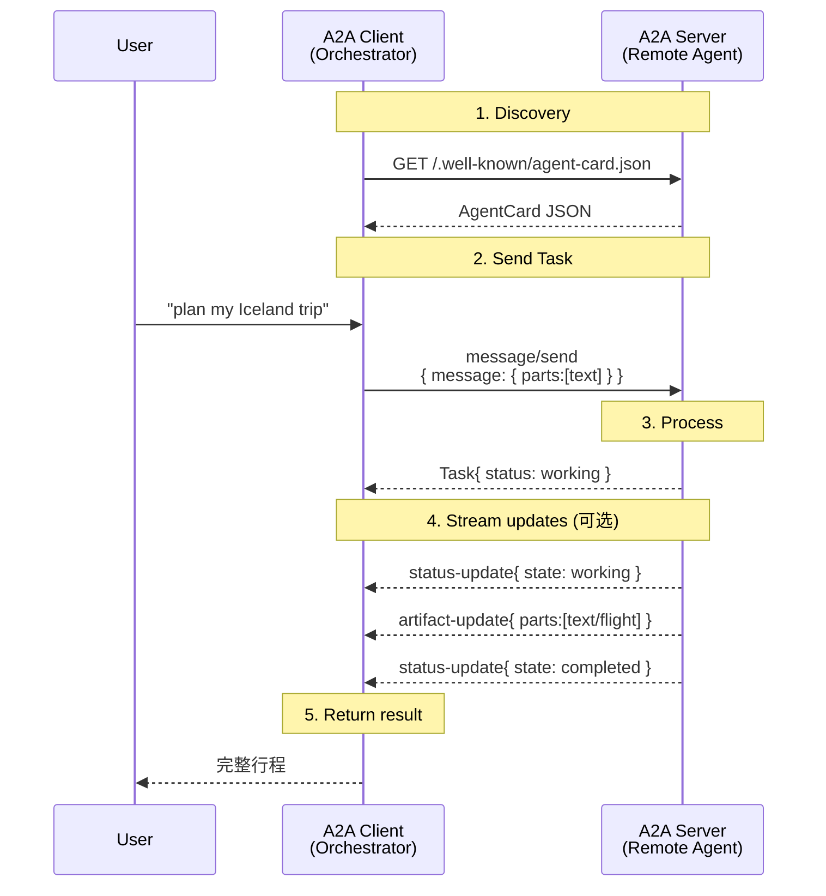

# 01 · A2A 协议入门

> 本节用"点外卖"做类比，从生活场景切入 A2A 的核心思想，再回到一个最小的 JSON 例子。

## 1.1 一个真实场景：旅行规划

设想你和朋友要去冰岛自驾 7 天，理想情况下你会说一句话：

> *"帮我规划一次 7 天的冰岛自驾，6 月出发，预算 3 万人民币。"*

一个**人类助理**会心领神会地拆分成：

1. 查**机票**
2. 订**租车**（含全险）
3. 找**酒店** / 民宿
4. 排**路线**（看极光、泡温泉）
5. 列**装备清单**

每个任务交给不同的**专家**。但如果让一个 LLM Agent 自己做，它要么变成"万能但平庸的瑞士军刀"，要么干脆**做不了**（拿不到机票 API key、不会租车平台登录……）。

**A2A 就是为了让 Agent 之间也能这样分工协作。**

## 1.2 生活类比：点外卖

把 A2A 想象成"美团 / 饿了么"：

| 美团类比 | A2A 类比 |
|--|--|
| 你（饿了） | **User**（最终用户） |
| 美团 App | **A2A Client**（在你这一侧的代理） |
| 商家店铺 | **A2A Server / Remote Agent** |
| 商家菜单 / 评分 | **Agent Card** |
| 下单 | **Task** |
| 菜品 = 文本（"加辣"）或图片（"做这个"） | **Message + Part** |
| 出餐 + 打包 | **Artifact** |
| 骑手实时位置 | **Stream Update (SSE)** |
| "骑手已送达"推送 | **Push Notification** |

关键点是：**你不需要知道这家店是 1 个厨师还是 5 个厨师，是用煤气还是电磁炉**。你只在乎"菜单 + 出餐"。A2A 把这种**透明委托**标准化。

## 1.3 三个 Actor

A2A 把参与者抽象成三种角色：

```
┌────────┐       ┌────────────────────┐       ┌──────────────────┐
│  User  │ ◀───▶ │    A2A Client      │ ────▶ │  A2A Server      │
│(最终人)│       │ (Orchestrator Agent)│       │ (Remote Agent)   │
└────────┘       └────────────────────┘       └──────────────────┘
                                                  │
                                                  ▼
                                            ┌──────────┐
                                            │ "黑盒"   │
                                            │ 业务逻辑 │
                                            └──────────┘
```

- **A2A Client**：通常是另一个 Agent、编排器、或一个 LLM 应用。它负责：
  1. 通过 **Agent Card** 发现可用 Agent。
  2. 决定**要不要调用**、**传什么**。
  3. 跟踪返回的 **Task 状态**。
- **A2A Server (Remote Agent)**：服务端 Agent，对客户端**不透明**。它只暴露：
  - 一个 **HTTP(S) / gRPC / REST 端点**
  - 一张 **Agent Card**（自己会什么、怎么通信、需要什么权限）
  - 一个 **AgentExecutor**（协议处理器，业务逻辑入口）
- **User**：最终用户。可能是人，也可能是另一个系统的 Agent。

> 在旅行规划例子里：客户端 Agent 是"行程秘书"，服务端是"机票 Agent"、"酒店 Agent"……它们各自背后用什么框架、用什么模型，**客户端都不需要知道**。

## 1.4 最小可行例子

下面是一个**完整的** A2A 请求 + 响应，你不需要现在就理解每个字段，只需要感受一下"这就是 JSON"。

### 客户端 → 服务端（HTTP POST）

```http
POST /a2a HTTP/1.1
Host: hello-agent.example.com
Content-Type: application/json
A2A-Version: 1.0

{
  "jsonrpc": "2.0",
  "id": "req-001",
  "method": "message/send",
  "params": {
    "message": {
      "messageId": "msg-001",
      "role": "ROLE_USER",
      "parts": [
        { "kind": "text", "text": "Say hello." }
      ]
    }
  }
}
```

### 服务端 → 客户端（同步响应）

```http
HTTP/1.1 200 OK
Content-Type: application/json

{
  "jsonrpc": "2.0",
  "id": "req-001",
  "result": {
    "kind": "task",
    "id": "task-abc123",
    "contextId": "ctx-xyz789",
    "status": {
      "state": "TASK_STATE_COMPLETED",
      "message": {
        "messageId": "msg-002",
        "role": "ROLE_AGENT",
        "parts": [
          { "kind": "text", "text": "Processing request..." }
        ]
      }
    },
    "artifacts": [
      {
        "artifactId": "art-001",
        "name": "result",
        "parts": [
          { "kind": "text", "text": "Hello, World!" }
        ]
      }
    ],
    "history": [
      {
        "messageId": "msg-001",
        "role": "ROLE_USER",
        "parts": [{ "kind": "text", "text": "Say hello." }]
      },
      {
        "messageId": "msg-002",
        "role": "ROLE_AGENT",
        "parts": [{ "kind": "text", "text": "Processing request..." }]
      }
    ]
  }
}
```

是不是就是 JSON-RPC 2.0？

> **是**。A2A 不是另起炉灶，而是**在 JSON-RPC 2.0 的 request/response 上定义了一套 Agent 领域对象**（`Task`、`Message`、`Part`、`Artifact`、`AgentCard`），并规定了**它们的语义**和**生命周期**。

## 1.5 核心特性一览

A2A 在协议层面提供了几个关键能力，按"为什么需要它们"的顺序理解：

| 能力 | 解决什么问题 | 用什么机制 |
|--|--|--|
| **Agent Card** | "你能干什么？怎么联系你？" | `/.well-known/agent-card.json`（RFC 8615） |
| **Task 生命周期** | "异步任务跑到哪一步了？" | `submitted → working → completed/failed/canceled` |
| **多轮对话** | "你问我补一个问题，我继续回答" | `input-required` 状态 + `contextId` |
| **流式响应** | "打字机式实时给我结果" | SSE（Server-Sent Events） |
| **Push Notification** | "长时间任务跑完了通知我" | Webhook + JWT |
| **多模态 Part** | "我能发图片 / 文件 / 结构化数据" | `Part` 的 `text` / `raw` / `url` / `data` 变体 |
| **认证授权** | "你得登录才能用我" | OAuth2 / API Key / mTLS / OIDC |

## 1.6 它不是什么

为了避免初学者的几个常见误解：

- ❌ A2A **不是**框架。它是协议。Python / JS / Go SDK 是它的实现，LangGraph / ADK / CrewAI 是上层包装。
- ❌ A2A **不是** RPC 调用包装工具。如果你要拿的是"工具函数返回值"，用 MCP 更合适。
- ❌ A2A **不强制**客户端用任何特定 LLM 或模型。任何能发起 HTTP 请求的进程都能当 Client。
- ❌ A2A **不要求** Agent 互相"信任"。它假设每个 Agent 独立鉴权、独立对外暴露。

## 1.7 一图流：从"问一句话"到"收到结果"



整篇后续文档会逐一拆解这张图的每一个环节。

## 下一步

- 想**马上动手**：跳到 [05 · 实战 1：Hello World](05-hands-on-helloworld.md)。
- 想**先理解概念**：继续 [02 · 核心概念](02-core-concepts.md)。
- 想**直接看协议细节**：跳到 [03 · 协议深度](03-protocol-deep-dive.md)。