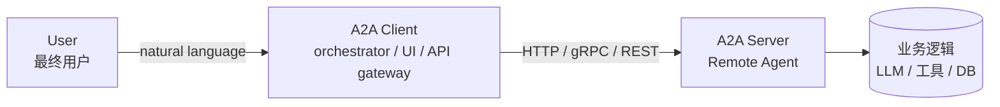
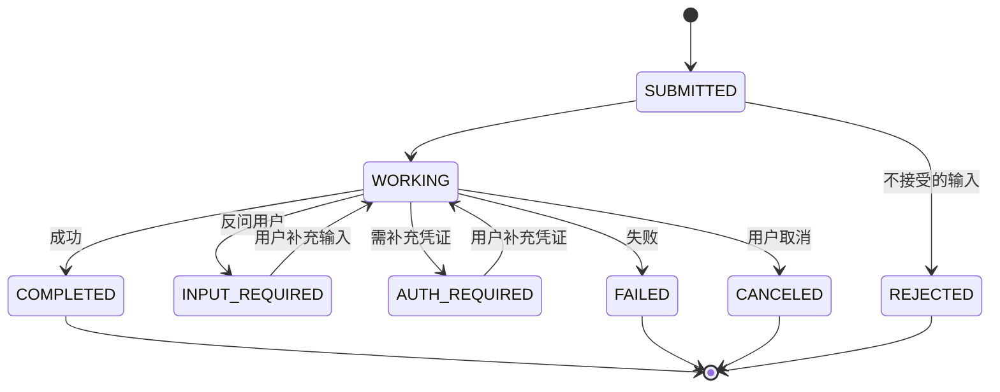
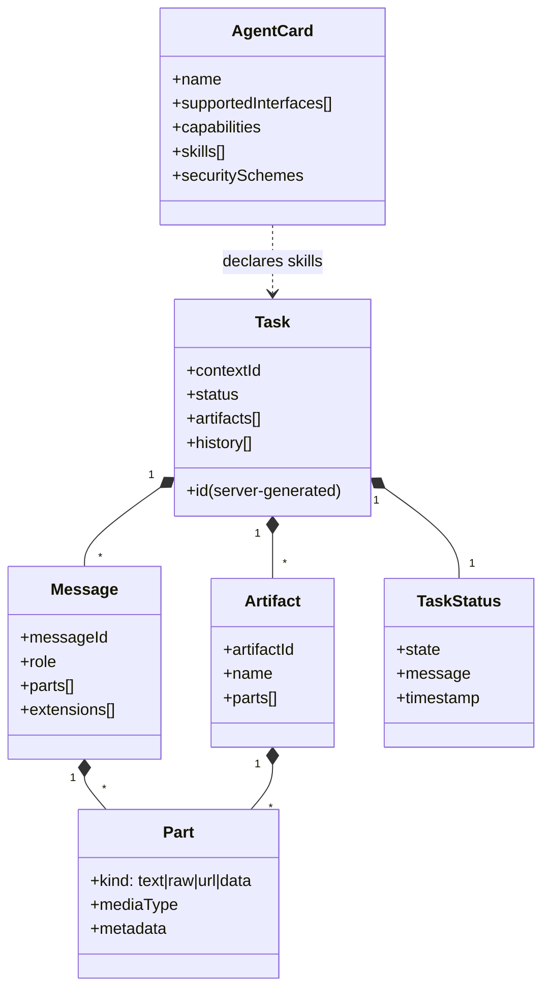

# 02 · A2A 核心概念

> 本节把 A2A 的"词汇表"过一遍。所有名词在后续章节都会反复用到。

## 2.1 一张表速览

| 概念 | 英文 | 一句话解释 |
|--|--|--|
| **Actor** | Actor | 协议里有 3 种角色：User / A2A Client / A2A Server |
| **Agent Card** | AgentCard | Agent 的"名片 / 菜单"，描述能力、技能、协议、鉴权方式 |
| **Task** | Task | 一段完整的"委托工作"，有 id、有生命周期、有产物 |
| **Message** | Message | 一条用户或 Agent 的发言（包含一组 Part） |
| **Part** | Part | 一条消息里的最小片段：文本 / 文件 / URL / 结构化数据 |
| **Artifact** | Artifact | Agent 完成任务后的"产物"（可以一个 Task 有多个 Artifact） |
| **Context** | contextId | 服务器分配的会话粘合剂，让多次往返都归属同一个上下文 |
| **Part 变体** | Part kind | `text` / `raw` / `url` / `data` 四种之一 |
| **任务状态** | TaskState | `submitted/working/input-required/auth-required/completed/failed/canceled/rejected` |
| **流事件** | Streaming Event | `task` / `message` / `statusUpdate` / `artifactUpdate` |

下面分组展开。

---

## 2.2 Actor：三个角色

A2A 的世界里只有**三个角色**。记住它们的分工，后面就不会被"agent / client / server / orchestrator / user"这些词搞晕。



- **User**：发起意图的人（或系统）。**不直接和 A2A Server 通信**——它通过 A2A Client 表达需求。
- **A2A Client**：**协议发起方**。所有 RPC 都是从 Client 发起的。它负责：
  - 拉 Agent Card
  - 构造 message/send 等请求
  - 维护 taskId / contextId
- **A2A Server**：**协议响应方**，对外是一个**不透明的黑盒**。它暴露 HTTP/gRPC 端点 + Agent Card，内部 AgentExecutor 把请求路由到业务逻辑。

> 一个进程**可以同时是 Client 和 Server**。例如 Orchestrator 对下层 Agent 来说是 Client，但对自己前端用户来说又是 Server。这不冲突，A2A 是**对称的**。

---

## 2.3 Agent Card：Agent 的"名片 / 菜单"

> *"我是谁？我会什么？我怎么联系你？我要什么权限？"*

**Agent Card 是一个 JSON 对象**，存放在固定的 well-known URI：

```
https://<agent-host>/.well-known/agent-card.json
```

### 关键字段

```jsonc
{
  // ---- 基本信息 ----
  "name": "Currency Agent",
  "description": "Converts currency using live rates",
  "version": "1.0.0",
  "provider": {
    "organization": "Example Corp",
    "url": "https://example.com"
  },
  "iconUrl": "https://example.com/icon.png",
  "documentationUrl": "https://example.com/docs",

  // ---- 通信端点（至少一个）----
  "supportedInterfaces": [
    { "url": "https://agent.example.com", "protocolBinding": "JSONRPC", "protocolVersion": "1.0" },
    { "url": "https://agent.example.com", "protocolBinding": "GRPC",    "protocolVersion": "1.0" },
    { "url": "https://agent.example.com", "protocolBinding": "HTTP+JSON","protocolVersion": "1.0" }
  ],

  // ---- 能力开关 ----
  "capabilities": {
    "streaming": true,                 // 支持 SSE 流式响应
    "pushNotifications": true,         // 支持 Webhook 回调
    "extendedAgentCard": false,        // 是否有"登录后才能拿到的"扩展 Card
    "stateTransitionHistory": true     // 是否保留完整状态变迁历史
  },

  // ---- 协议扩展（可选）----
  "extensions": [
    { "uri": "https://example.com/ext/replay", "description": "...", "required": false }
  ],

  // ---- 安全：哪些鉴权方式 ----
  "securitySchemes": {
    "bearer": {
      "type": "HTTP",
      "scheme": "bearer",
      "bearerFormat": "JWT"
    },
    "apiKey": {
      "type": "APIKey",
      "in": "header",
      "name": "X-API-Key"
    }
  },
  "security": [ { "bearer": [] } ],   // 默认必选 bearer

  // ---- 收发的 MIME ----
  "defaultInputModes":  ["text/plain", "application/json"],
  "defaultOutputModes": ["text/plain", "application/json"],

  // ---- 技能列表（核心卖点）----
  "skills": [
    {
      "id": "convert_currency",
      "name": "Currency Conversion",
      "description": "Convert between currencies with up-to-date rates",
      "tags": ["finance", "currency", "fx"],
      "examples": ["Convert 100 USD to EUR", "What is 5000 JPY in CNY?"],
      "inputModes":  ["text/plain"],
      "outputModes": ["text/plain", "application/json"],
      "securitySchemes": { /* 可以覆盖默认 */ }
    }
  ],

  // ---- 可选：对 Card 自身的签名（防伪）----
  "signatures": [ /* JWS / CWT 等 */ ]
}
```

### 设计要点

1. **`supportedInterfaces` 是一个数组**：同一个 Agent 可以同时开多种协议端点。Client 按优先级挑选自己支持的。
2. **`skills` 是 Card 的核心**：它告诉 LLM/调用者"我能干啥"。LLM-based 编排器会**根据 skills 决定调哪个 Agent**。
3. **`securitySchemes` + `security` 借鉴 OpenAPI**：声明了支持的鉴权方式，Client 必须挑一个用。
4. **`/skills/<skill-id>/agent-card.json`**：v1.0 还允许把**单个技能**拆出独立的 Card（在 base URL 下加 `skills/<id>/` 前缀）。适合能力特别多的 Agent。

---

## 2.4 Part：消息里的最小片段

> *一条 Message 由若干 Part 组成，每个 Part 是 4 种类型之一。*

```jsonc
{
  "parts": [
    { "kind": "text", "text": "Convert 100 USD to EUR" },            // 纯文本
    { "kind": "raw",  "raw": "aGVsbG8=",                            // base64 二进制
                    "mediaType": "application/pdf",
                    "filename": "invoice.pdf" },
    { "kind": "url",  "url":  "https://example.com/qr.png",         // 远程 URL
                    "mediaType": "image/png" },
    { "kind": "data", "data": {"price": 99.9, "currency": "USD"},   // 结构化 JSON
                    "mediaType": "application/json" }
  ],
  "metadata": { "trace-id": "abc123" }   // 可选：每个 Part 都可附加元数据
}
```

四种 Part 的语义：

| kind | 含义 | 何时用 |
|--|--|--|
| `text` | UTF-8 文本 | 90% 的对话 |
| `raw`  | inline base64 二进制 | 小文件（< 几 MB） |
| `url`  | 外部 URL | 大文件，让 Agent 自己下载 |
| `data` | JSON / 结构化数据 | 业务回调、表单值 |

**`mediaType`**（MIME）是描述子，对 raw / url / data 都强烈建议设置；它决定客户端怎么渲染。

**Part 数组是无序但有序的**（JSON 数组是有序的）——客户端按数组顺序展示。

> 实践中，**LLM 输入/输出都用 `text`**；**文件上传下载**用 `raw` 或 `url`；**结构化业务数据**（订单、参数）用 `data`。

---

## 2.5 Message：用户或 Agent 的一条发言

```jsonc
{
  "messageId": "msg-001",            // 全局唯一（UUID）
  "contextId": "ctx-xyz789",         // 可选：所属会话
  "taskId":     "task-abc123",       // 可选：所属任务（多轮时必填）
  "role": "ROLE_USER",               // ROLE_USER / ROLE_AGENT
  "parts": [ { "kind": "text", "text": "..." } ],
  "metadata": { ... },
  "extensions": ["https://example.com/ext/x"]   // 本条消息启用的扩展
}
```

要点：

- `messageId` 必须全局唯一（不仅是这个 Task 内）。
- `contextId` / `taskId` 在**多轮对话时由服务端生成**，**客户端不能自己造**。
- `role` 只有两种：`ROLE_USER`（来自最终用户 / 上游 Agent）和 `ROLE_AGENT`（来自被调用 Agent）。
- `extensions` 是消息级扩展，可以**临时启用**某个扩展（不必放进 AgentCard.extensions）。

---

## 2.6 Task：一次完整的委托

> *Task 是 A2A 里**最重要**的状态化对象。*

```jsonc
{
  "kind": "task",
  "id": "task-abc123",
  "contextId": "ctx-xyz789",
  "status": {
    "state": "TASK_STATE_WORKING",
    "message": { /* 最近一条 Agent 发言 */ },
    "timestamp": "2025-08-05T12:34:56.789Z"
  },
  "artifacts": [ /* 已产出的产物 */ ],
  "history": [ /* 完整消息流 */ ],
  "metadata": { /* 任意业务元数据 */ }
}
```

### Task 的关键属性

1. **id 由服务端生成**，客户端**永远不能**自己造（必须先发 `message/send`，让服务端返回 id）。
2. **Task 是不可变的快照**：每条 statusUpdate 都是一份新 Task，不是 in-place 改字段。
3. **`history` 包含完整对话记录**（可选，取决于 `stateTransitionHistory` 能力开关）。
4. **`artifacts` 是 Agent 已经"端出来"的产物**——客户端可以认为"这部分已经稳定可用"。
5. **`Task` ≠ `Message`**：如果同步调用、Agent 一次性返回，且不需要状态跟踪，服务端也可以**直接回一个 `Message` 而不是 `Task`**。

### Task 状态机



8 个状态分两类：

- **非终态**（仍在跑）：`SUBMITTED`、`WORKING`、`INPUT_REQUIRED`、`AUTH_REQUIRED`
- **终态**（已结束）：`COMPLETED`、`FAILED`、`CANCELED`、`REJECTED`

> 注意：`INPUT_REQUIRED` 和 `AUTH_REQUIRED` 是"**被打断**"——它不是终态，可以被**用户的进一步输入**推到 `WORKING` 继续。

---

## 2.7 Artifact：Agent 的产物

> *Task 的最终交付物。*

```jsonc
{
  "artifactId": "art-001",
  "name": "itinerary",
  "description": "7-day Iceland itinerary",
  "parts": [
    { "kind": "text", "text": "Day 1: ..." },
    { "kind": "data", "data": { /* 结构化行程 */ } }
  ],
  "metadata": { "version": "1.0", "generatedAt": "..." },
  "extensions": []
}
```

要点：

- **一个 Task 可以有多个 Artifact**（如"行程 + 装备清单 + 预算表"）。
- **Artifact 通过流式推送**：`TaskArtifactUpdateEvent` 用 `append` / `lastChunk` 标志位让客户端增量拼接。
- **Artifact 不必只在终态才出现**：流式过程中可以"边生成边产出"。

---

## 2.8 Context（contextId）：会话的粘合剂

> *跨多次往返的"会话 id"。*

### 为什么要 contextId

设想这个对话：

```
T1: User:    "plan a 7-day Iceland trip"
T2: Agent:   "what month?"
T3: User:    "next June"
T4: Agent:   "rough budget?"
T5: User:    "30000 CNY"
```

每来一条新消息，**服务端可以分配一个新 TaskId**，但**这 5 条消息都属于同一个 contextId**。客户端拿到 contextId 后，下一次请求只要带上它，Agent 就能"想起来"前文。

### 关键规则

1. **contextId 由服务端生成**，客户端**不能**自己造。
2. **同一个 contextId 下的所有 Task 共享"会话状态"**（多轮对话、上下文记忆）。
3. **可以并行**：同一个 contextId 下可以**并行开多个 Task**（如"机票"和"酒店"同时跑）。
4. **可以重连**：长任务断开后，客户端带 contextId + taskId 重新订阅。

---

## 2.9 数据模型总图



---

## 2.10 与 MCP 的边界感

把概念和 MCP 对比一下，能更深地理解 A2A 的设计取舍：

| 概念 | MCP | A2A |
|--|--|--|
| 基本单元 | `Tool`（无状态） | `Task`（有状态、有 id） |
| 进度回报 | 没有（同步调完返回） | 流式 statusUpdate + 终态 |
| 反馈 | 单次结果 | 完整对话历史 (`history`) |
| 内容类型 | JSON Schema 输入输出 | `Part` 多模态 |
| 中断 / 续传 | 不适用 | `input-required` + `contextId` |
| 错误 | 普通错误码 | JSON-RPC 错误码 + A2A 专属错误 |

> 简单记：**MCP 是"短平快"的工具调用；A2A 是"长任务 + 多轮对话"的委托**。

---

## 下一步

- 继续协议层：[03 · 协议深度](03-protocol-deep-dive.md) 看 JSON-RPC / gRPC / REST 绑定、错误码、流式协议。
- 跳到实战：[05 · 实战 1：Hello World](05-hands-on-helloworld.md) 把这些概念落到代码上。