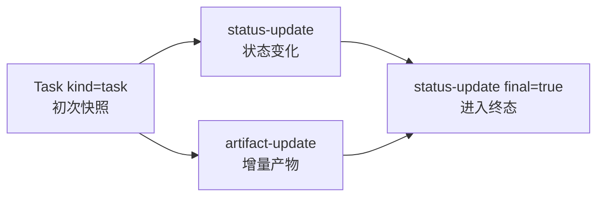

# 03 · A2A 协议深度

> 本节是协议细节的"参考书"风格：先讲分层结构，再把每个绑定、每个 RPC 方法、每个错误码都过一遍。

## 3.1 三层架构

A2A 把规范清晰地分成三层：

```
┌──────────────────────────────────────────────────────────┐
│ Layer 3 · Protocol Bindings   (怎么 wire)               │
│   JSON-RPC 2.0 over HTTPS  /  gRPC  /  HTTP+JSON/REST    │
├──────────────────────────────────────────────────────────┤
│ Layer 2 · Operations          (能调什么)                  │
│   message/send, message/stream, tasks/get, tasks/cancel, │
│   tasks/resubscribe, tasks/pushNotificationConfig/*, ... │
├──────────────────────────────────────────────────────────┤
│ Layer 1 · Data Model          (传输什么)                  │
│   AgentCard, Task, Message, Part, Artifact, ...           │
└──────────────────────────────────────────────────────────┘
```

- **Layer 1** = 数据结构（[02 节](02-core-concepts.md) 讲过的概念）。
- **Layer 2** = "RPC 方法名 + 参数 + 返回值" 的语义，**与传输无关**。
- **Layer 3** = 真正的 wire 格式：JSON-RPC、gRPC proto、REST 路径。

这种分层的好处是：业务层（"我要发个 message"）和传输层（"我要用 HTTP 还是 gRPC"）解耦。

---

## 3.2 协议绑定（Protocol Bindings）

Agent Card 的 `supportedInterfaces` 字段同时声明**协议 + 版本 + URL**：

```jsonc
{
  "supportedInterfaces": [
    { "url": "https://x.com/a2a", "protocolBinding": "JSONRPC",    "protocolVersion": "1.0" },
    { "url": "https://x.com/a2a", "protocolBinding": "GRPC",       "protocolVersion": "1.0" },
    { "url": "https://x.com",     "protocolBinding": "HTTP+JSON",  "protocolVersion": "1.0" }
  ]
}
```

### 3.2.1 JSON-RPC 2.0 over HTTPS

> **默认、最常见**的绑定。

#### HTTP 请求

```http
POST /a2a HTTP/1.1
Host: agent.example.com
Content-Type: application/json
Accept: application/json
A2A-Version: 1.0
Authorization: Bearer eyJhbGciOi...

{
  "jsonrpc": "2.0",
  "id": "req-001",
  "method": "message/send",
  "params": { "message": { ... } }
}
```

#### HTTP 响应（成功）

```http
HTTP/1.1 200 OK
Content-Type: application/json

{
  "jsonrpc": "2.0",
  "id": "req-001",
  "result": { /* Task 或 Message */ }
}
```

#### HTTP 响应（错误）

```http
HTTP/1.1 200 OK                       // 注意：JSON-RPC 错误仍用 HTTP 200
Content-Type: application/json

{
  "jsonrpc": "2.0",
  "id": "req-001",
  "error": {
    "code": -32603,
    "message": "Internal error",
    "data": { /* 业务上下文 */ }
  }
}
```

> JSON-RPC 2.0 规定：**协议层错误用 HTTP 200 + `error` 字段**；只有**传输层故障**才用 HTTP 4xx/5xx。

#### 服务参数（HTTP 头）

| Header | 说明 | 示例 |
|--|--|--|
| `A2A-Version` | 协议版本 | `1.0`（v0.3 之前可空） |
| `A2A-Extensions` | 本次请求启用的扩展 URI（逗号分隔） | `https://example.com/ext/replay` |
| `Authorization` | 鉴权令牌 | `Bearer eyJ...` |
| `X-API-Key` | API Key | (按 Agent Card 声明) |

#### 客户端 mTLS / 双向 TLS

可选，HTTPS 之上再加 mTLS（客户端证书）。**A2A 不强制**，但企业级部署强烈建议。

### 3.2.2 gRPC

> 高吞吐、低延迟场景的首选。

- 协议定义：`a2a.proto`（官方提供）。
- 序列化：Protocol Buffers v3。
- HTTP/2 多路复用。
- 客户端流 / 服务端流 / 双向流**原生支持**（流式 A2A 在 gRPC 下更自然）。

示例 stub（伪代码）：

```python
import grpc
import a2a_pb2, a2a_pb2_grpc

channel = grpc.insecure_channel("agent.example.com:443")
stub = a2a_pb2_grpc.A2AServiceStub(channel)

req = a2a_pb2.SendMessageRequest(
    request=a2a_pb2.Message(
        message_id="msg-001",
        role=a2a_pb2.ROLE_USER,
        parts=[a2a_pb2.Part(text=a2a_pb2.TextPart(text="hello"))]
    )
)
resp = stub.SendMessage(req)
```

### 3.2.3 HTTP+JSON / REST

> 给"不是 RPC 派"的传统开发者准备的。

把每个 RPC 方法映射到 RESTful 资源：

| RPC 方法 | REST 端点 |
|--|--|
| `message/send` | `POST /v1/message:send` |
| `message/stream` | `POST /v1/message:stream` (返回 SSE) |
| `tasks/get` | `GET /v1/tasks/{id}` |
| `tasks/cancel` | `POST /v1/tasks/{id}:cancel` |
| `tasks/list` | `GET /v1/tasks?contextId=...` |
| `tasks/resubscribe` | `GET /v1/tasks/{id}:resubscribe` (SSE) |
| `agent/getAuthenticatedExtendedCard` | `GET /v1/agent/authenticatedExtendedCard` |

REST 风格的 body 仍用 JSON，**字段命名走 camelCase**（不是 snake_case）。

---

## 3.3 核心 RPC 方法清单

下面这张表是 A2A 的"操作字典"。

| 方法 | 用途 | 同步/流式 | 必需能力 |
|--|--|--|--|
| `message/send` | 发一条消息，可能是新 Task 也可能是多轮 follow-up | 同步 (返回 Task 或 Message) | — |
| `message/stream` | 同上，但走 SSE 流式返回 | 流式 (SSE) | `streaming` |
| `tasks/get` | 查一个 Task 当前状态 | 同步 | — |
| `tasks/list` | 列某个 context 下的所有 Task | 同步 | — |
| `tasks/cancel` | 取消一个正在跑的 Task | 同步 | — |
| `tasks/resubscribe` | 重连到一个 Task 的流 | 流式 (SSE) | `streaming` |
| `tasks/pushNotificationConfig/set` | 注册 Webhook 回调 | 同步 | `pushNotifications` |
| `tasks/pushNotificationConfig/get` | 查已注册的回调 | 同步 | `pushNotifications` |
| `tasks/pushNotificationConfig/list` | 列所有回调 | 同步 | `pushNotifications` |
| `tasks/pushNotificationConfig/delete` | 删除回调 | 同步 | `pushNotifications` |
| `agent/getAuthenticatedExtendedCard` | 拿到"登录后才可见"的扩展 Card | 同步 | `extendedAgentCard` |

### 3.3.1 message/send 详解

请求：

```jsonc
{
  "jsonrpc": "2.0",
  "id": "req-001",
  "method": "message/send",
  "params": {
    "message": {
      "messageId": "msg-001",
      "role": "ROLE_USER",
      "parts": [{ "kind": "text", "text": "Plan my trip" }]
    },
    // 可选：续写对话时填
    "taskId":     "task-abc123",
    "contextId":  "ctx-xyz789",
    // 可选：客户端配置
    "configuration": {
      "blocking": true,           // true=同步等结果；false=立刻返回 Task 状态
      "acceptedOutputModes": ["application/json"],
      "pushNotificationConfig": {
        "url": "https://my.com/hook",
        "token": "secret",
        "authentication": {
          "schemes": ["Bearer"],
          "credentials": "eyJ..."
        }
      },
      "historyLength": 5
    }
  }
}
```

返回值有两种可能：

1. **`Message`**（Agent 一次性回复）：当 Agent **不需要保存长期 Task** 时回这个。
2. **`Task`**（带状态的对象）：Agent 创建了一个新 Task 或继续已有 Task。

服务端**自己决定**回哪一种。客户端**不要假设**——按"如果有 id 字段就是 Task"判断。

### 3.3.2 同步 vs 异步

`message/send` 的 `configuration.blocking` 是关键开关：

| blocking | 行为 | 适合场景 |
|--|--|--|
| `true`（默认） | 服务端等到 Task 进入终态才返回 | 短任务（< 数秒） |
| `false` | 立刻返回当前 Task 快照 | 长任务（数分钟到数小时） |

> 当 `blocking=false` 且服务端不支持流式，客户端**必须配合** push notification 或 polling 才能拿到结果。

### 3.3.3 tasks/resubscribe

长任务断开后，重连用：

```http
GET /v1/tasks/{id}:resubscribe HTTP/1.1
Accept: text/event-stream
```

服务端从**当前状态**重新开始 SSE 推送（不会重放历史事件）。

---

## 3.4 流式响应（SSE）

> A2A 选用 SSE 而不是 WebSocket，因为它**只服务端→客户端**，单向、更轻量，原生 HTTP。

### HTTP 请求

```http
POST /a2a HTTP/1.1
Accept: text/event-stream
A2A-Version: 1.0

{
  "jsonrpc": "2.0",
  "id": "req-002",
  "method": "message/stream",
  "params": { "message": { ... } }
}
```

### HTTP 响应

```http
HTTP/1.1 200 OK
Content-Type: text/event-stream

event: message
data: {"jsonrpc":"2.0","id":"req-002","result":{"kind":"task",...}}

event: status_update
data: {"jsonrpc":"2.0","id":"req-002","result":{"kind":"status-update","taskId":"...","status":{"state":"TASK_STATE_WORKING"}}}

event: artifact_update
data: {"jsonrpc":"2.0","id":"req-002","result":{"kind":"artifact-update","taskId":"...","artifact":{...}}}

event: status_update
data: {"jsonrpc":"2.0","id":"req-002","result":{"kind":"status-update","taskId":"...","status":{"state":"TASK_STATE_COMPLETED","final":true}}}
```

每个 `data:` 是一段 JSON，**外层仍包着 JSON-RPC envelope**——保证请求/响应在 wire 上一致。

### StreamResponse 的 4 种 kind



| kind | 含义 | 关键字段 |
|--|--|--|
| `task` | 流开始时的"当前快照"，可省略 | `id`, `contextId`, `status`, `artifacts[]`, `history[]` |
| `message` | Agent 又说了一句话 | `messageId`, `role=ROLE_AGENT`, `parts[]` |
| `status-update` | 状态变化 | `taskId`, `status.state`, `status.message?`, `final?` |
| `artifact-update` | 产物增量 | `taskId`, `artifact`, `append?`, `lastChunk?` |

`final=true` 的 status-update 表示**流结束**。

### 流式拼接 artifact

A2A 允许**边生成边产出** Artifact：

```jsonc
// 第一块
{ "kind": "artifact-update",
  "taskId": "task-1",
  "artifact": { "artifactId": "art-1", "parts": [{ "text": "Day 1: " }] },
  "append": false, "lastChunk": false }

// 第二块
{ "kind": "artifact-update",
  "taskId": "task-1",
  "artifact": { "artifactId": "art-1", "parts": [{ "text": "Reykjavik arrival" }] },
  "append": true,  "lastChunk": false }

// 最后一块
{ "kind": "artifact-update",
  "taskId": "task-1",
  "artifact": { "artifactId": "art-1", "parts": [{ "text": " and Blue Lagoon." }] },
  "append": true,  "lastChunk": true }
```

客户端按 `artifactId` 拼接即可。

---

## 3.5 Push Notification（Webhook）

> 流式 + blocking=false 之外的"第三种"长任务通知方式。

### 注册

```jsonc
{
  "jsonrpc": "2.0",
  "id": "r",
  "method": "tasks/pushNotificationConfig/set",
  "params": {
    "taskId": "task-abc",
    "config": {
      "url": "https://my-service.com/hooks/a2a",
      "token": "supersecret-token-uuid",
      "authentication": {
        "schemes": ["Bearer"],
        "credentials": "eyJhbGciOi..."
      }
    }
  }
}
```

### Agent 推送（POST 到你的 url）

```http
POST /hooks/a2a HTTP/1.1
Host: my-service.com
Content-Type: application/json
Authorization: Bearer eyJhbGciOi...
A2A-Token: supersecret-token-uuid

{
  "kind": "status-update",
  "taskId": "task-abc",
  "contextId": "ctx-xyz",
  "status": { "state": "TASK_STATE_COMPLETED", "timestamp": "2025-..." },
  "final": true
}
```

- **`Authorization`**: Agent 用配置的凭证做身份认证（证明"是合法 Agent 在调我"）。
- **`A2A-Token`**: 你注册时给的 token，证明"这个 task 确实绑了我的 webhook"。

### 安全要点

1. **必须用 HTTPS**。
2. **必须验证 JWT**：Agent 推送时在 `Authorization` 头部带 JWT；服务端用 Agent 的 JWKS 公钥验签。
3. **必须验证 taskId 与 token**：避免"任意人都能往你的 url 推消息"。
4. **必须用一次性 / 短期凭证**：避免长期 token 泄漏。

---

## 3.6 错误码

A2A 在 JSON-RPC 标准错误码之上扩展了**A2A 专属错误码**：

### 标准 JSON-RPC 错误码（沿用）

| Code | 名称 | 含义 |
|--|--|--|
| `-32700` | ParseError | JSON 解析失败 |
| `-32600` | InvalidRequest | 请求体不合法 |
| `-32601` | MethodNotFound | method 不存在 |
| `-32602` | InvalidParams | params 不合法 |
| `-32603` | InternalError | 服务端内部错误 |

### A2A 扩展错误码（-32001 ~ -32009）

| Code | 名称 | 含义 |
|--|--|--|
| `-32001` | TaskNotFoundError | 指定的 taskId 不存在 |
| `-32002` | TaskNotCancelableError | Task 已终态，无法取消 |
| `-32003` | PushNotificationNotSupportedError | 该 Agent 不支持 push |
| `-32004` | UnsupportedOperationError | 不支持的操作（如对未流式 Agent 调 `message/stream`） |
| `-32005` | ContentTypeNotSupportedError | Part 的 mediaType 不被支持 |
| `-32006` | InvalidAgentResponseError | Agent 自身内部错误 |
| `-32007` | AuthenticatedExtendedCardNotConfiguredError | 没配置扩展 Card |
| `-32008` | InvalidStateTransitionError | Task 状态机非法跳转 |
| `-32009` | ExtendedCardNotAvailableError | 客户端未鉴权拿不到扩展 Card |

### 错误响应示例

```json
{
  "jsonrpc": "2.0",
  "id": "req-001",
  "error": {
    "code": -32004,
    "message": "Streaming not supported",
    "data": {
      "agentName": "Currency Agent",
      "supportedBindings": ["JSONRPC"]
    }
  }
}
```

> `data` 字段是**业务上下文**，给客户端做更智能的错误处理。

---

## 3.7 扩展（Extensions）

> 协议演进不靠"硬编码"，靠 URI 标识的扩展。

### 声明（在 AgentCard）

```jsonc
{
  "extensions": [
    {
      "uri": "https://example.com/ext/replay",
      "description": "Re-stream all events from the start",
      "required": false,
      "params": { "version": "1.0" }
    }
  ]
}
```

`required=true` 表示**客户端不启用就不能用这个 Agent**。

### 启用（请求头）

```http
A2A-Extensions: https://example.com/ext/replay
```

### 消息级启用

```jsonc
{
  "message": {
    "messageId": "msg-1",
    "role": "ROLE_USER",
    "parts": [{ "text": "..." }],
    "extensions": ["https://example.com/ext/trace"]
  }
}
```

### 常见扩展设想

- `https://example.com/ext/trace` — 分布式 trace id 透传
- `https://example.com/ext/replay` — 重放历史
- `https://example.com/ext/human-in-loop` — 关键决策需要人复核

---

## 3.8 版本协商

```http
A2A-Version: 1.0
```

- 客户端发起请求时**必须**带上（v1.0+）。
- 服务端可以在 AgentCard 声明多个 `supportedInterfaces`，每个带不同 `protocolVersion`。
- **未来**版本不兼容时，客户端按优先级挑选自己能理解的版本。

> 兼容性策略：
>
> - **Minor 版本**（如 1.0 → 1.1）：**向后兼容**，可以混用。
> - **Major 版本**（如 1.x → 2.0）：**不兼容**，必须选一致。

---

## 3.9 一个完整的多轮对话 wire trace

> 把所有东西串起来：用户问两次，Agent 多轮返回。

```
# --- 1. discovery ---
GET /.well-known/agent-card.json
← AgentCard { capabilities.streaming=true, ... }

# --- 2. 第一轮 ---
POST /a2a
  method=message/stream
  params.message={ role=USER, parts=[text="plan my trip"] }
← SSE:  task kind=task status=working
← SSE:  status-update state=working
← SSE:  status-update state=input-required message="which month?"

# --- 3. 第二轮（续）---
POST /a2a
  method=message/stream
  params.message={ role=USER, parts=[text="next June"] }
  params.taskId="task-1" params.contextId="ctx-1"
← SSE:  status-update state=working
← SSE:  artifact-update artifact={parts:[text="Day 1..."]} lastChunk=false
← SSE:  artifact-update artifact={parts:[text="Day 2..."]} lastChunk=false
← SSE:  artifact-update artifact={parts:[text="Day 7..."]} lastChunk=true
← SSE:  status-update state=completed final=true
```

注意几个关键点：

1. 第二轮请求带回了**第一轮返回的 `taskId` 和 `contextId`**。
2. `input-required` 触发后流结束（不发送 `final=true`）。
3. 第二轮的流是**新的 SSE 连接**——重连逻辑由客户端 SDK 处理。

---

## 3.10 与 MCP 协同的 wire view

```
┌──────────────┐         A2A          ┌──────────────┐
│ Orchestrator │ ───────────────────▶ │ Travel Agent │
│   Agent      │ ◀─────────────────── │              │
└──────┬───────┘                       └──────┬───────┘
       │ MCP                                  │ MCP
       ▼                                      ▼
┌──────────────┐                       ┌──────────────┐
│ search_flights│                       │ book_hotel   │
└──────────────┘                       └──────────────┘
```

- **Agent 之间**走 A2A（任务级别）。
- **Agent 内部**走 MCP（工具级别）。

> 这是 A2A + MCP 的最佳实践：**用 A2A 做外脑、用 MCP 做手脚**。

---

## 下一步

- 想看**企业级落地**的认证、授权、可观测性：[04 · 安全与企业级](04-security-enterprise.md)
- 跳到**实战**，把 wire 上的 JSON 变成可运行代码：[05 · 实战 1：Hello World](05-hands-on-helloworld.md)