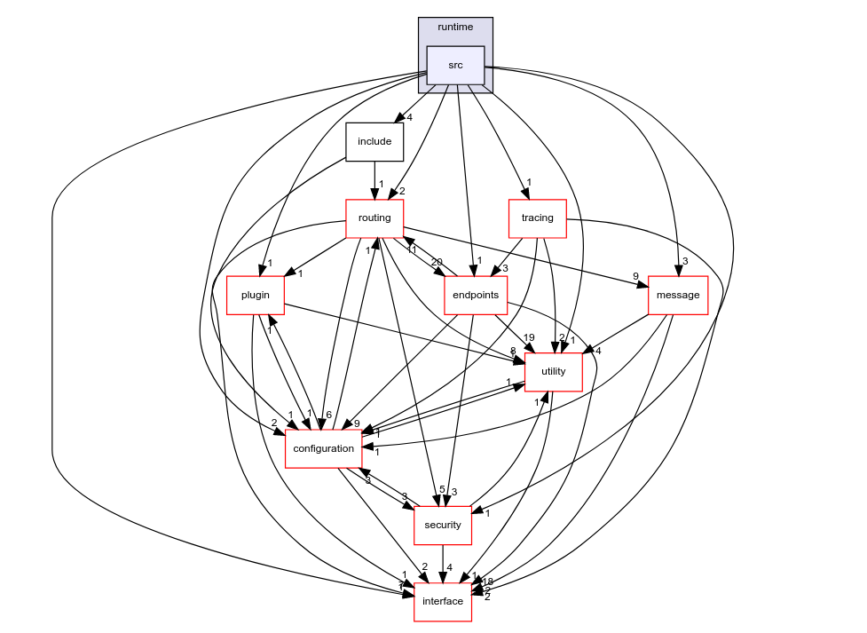

# VSOMEIP 源码学习分享 之 手摸手编译安装过源码


### Content:


1. 源码结构

2. 环境和编译

3. 核心内容  
  3.1 模块  
  3.2 配置 TODO

4. 总结

---

## 1. 源码结构

```bash
yshi10@dev:~/someip_space/vsomeip$ tree . -L 1
.
├── Android.bp
├── AUTHORS
├── CHANGES
├── CMakeLists.txt
├── config               --> 示例配置文件
├── documentation        --> 使用文档
├── examples             --> Demo
├── exportmap.gcc        --> 控制动态库的函数导出
├── implementation       --> 逻辑代码实现
├── interface            --> 代码接口设计
├── LICENSE
├── LICENSE_boost
├── README.md
├── test                 --> 测试代码
├── tools                --> someip_ctrl 工具
├── vsomeip3Config.cmake.in            --|
├── vsomeip3ConfigVersion.cmake.in       |
├── vsomeip3.pc.in                       |
├── vsomeipConfig.cmake.in               | ==> cmake 配置
├── vsomeipConfigVersion.cmake.in        |
├── vsomeip.pc.in                        |
└── vsomeip.xml                        --|
```

> 代码实现都在 `implementation` 下

### implementation


#### `impelemention`:
```bash
yshi10@dev:~/someip_space/vsomeip/implementation$ tree . -L 1
.
├── compat                 --> 3.x 和 2.x 兼容层
├── configuration          --> 配置模块: 配置读取,加载; 插件配置
├── e2e_protection         --> e2e模块
├── endpoints              --> client/server, tcp/udp, TP endpoint 实现
├── helper                 --> boost 兼容层
├── logger                 --> logger
├── message                --> message, payload, (反)序列化 实现
├── plugin                 --> 插件模块: 插件管理
├── routing                --> 路由模块 
├── runtime                --> 运行时: 管理 APP , runtime 资源
├── security               --> 安全模块: policy, credentials 
├── service_discovery      --> 服务发现: 
                                    发现注册模块, 
                                    IPv4/IPv6 Options, 
                                    负载均衡, 
                                    远程订阅
├── tracing                --> tracing: 配置 dlt-daemon
└── utility                --> 通用工具
```


## 2. 环境和编译

### 环境

OS环境:

```bash
yshi10@dev:~$ lsb_release -a
No LSB modules are available.
Distributor ID:	Ubuntu
Description:	Ubuntu 21.10
Release:	21.10
Codename:	impish
```

> 实测 18.04, 20.04, 20.10 都没有问题, 官方推荐14.04 及以上, 最新的21.10 上 boost v1.71 与 最新的 glibc v2.34 不兼容, 同步了 boost v1.78 的变更解决这个问题

#### 工具

* CMake

  > ref : https://apt.kitware.com/

```bash
# For Ubuntu Bionic Beaver (18.04) and newer:
sudo apt-get update
sudo apt-get install gpg wget

# For Ubuntu Xenial Xerus (16.04):
sudo apt-get update
sudo apt-get install apt-transport-https wget

# Obtain a copy of our signing key:
wget -O - https://apt.kitware.com/keys/kitware-archive-latest.asc 2>/dev/null | gpg --dearmor - | sudo tee /usr/share/keyrings/kitware-archive-keyring.gpg >/dev/null

# Add the repository to your sources list and update

# For Ubuntu Focal Fossa (20.04):
echo 'deb [signed-by=/usr/share/keyrings/kitware-archive-keyring.gpg] https://apt.kitware.com/ubuntu/ focal main' | sudo tee /etc/apt/sources.list.d/kitware.list >/dev/null

sudo apt-get update

# For Ubuntu Bionic Beaver (18.04):
echo 'deb [signed-by=/usr/share/keyrings/kitware-archive-keyring.gpg] https://apt.kitware.com/ubuntu/ bionic main' | sudo tee /etc/apt/sources.list.d/kitware.list >/dev/null

sudo apt-get update


# For Ubuntu Xenial Xerus (16.04):
echo 'deb [signed-by=/usr/share/keyrings/kitware-archive-keyring.gpg] https://apt.kitware.com/ubuntu/ xenial main' | sudo tee /etc/apt/sources.list.d/kitware.list >/dev/null

sudo apt-get update

# Install the kitware-archive-keyring package to ensure that your keyring stays up to date as we rotate our keys:
sudo rm /usr/share/keyrings/kitware-archive-keyring.gpg
sudo apt-get install kitware-archive-keyring

# install cmake
sudo apt-get install cmake

```

* g++ / clang++

  __必需支持 C++11__ 

* boost 1.71 (1.55 ~ 1.74)

  1.71 刚好和 DoIP boost版本保持一致
  - repo:(master branch) 

    ```bash
    Ethernet/boost_1_71_0
    ```

##### 可选
```bash
# 编译文档

sudo apt install -y asciidoc source-highlight doxygen graphviz

# pkg-config 配合make install
# Return metainformation about installed libraries

sudo apt install -y pkg-config
```

### 编译&安装

``` bash
cd vsomeip-3.1.20/
mkdir build;cd build;

# 默认配置
cmake ..

##  自定义的CMake配置
# install path
cmake -DCMAKE_INSTALL_PREFIX:PATH=$YOUR_PATH ..
# ip addr
cmake -DUNICAST_ADDRESS=<YOUR IP ADDRESS> ..
# diagnosis addr
cmake -DDIAGNOSIS_ADDRESS=<YOUR DIAGNOSIS ADDRESS> ..
# configuration folder
cmake -DDEFAULT_CONFIGURATION_FOLDER=<DEFAULT CONFIGURATION FOLDER> ..
# default configuration file
cmake -DDEFAULT_CONFIGURATION_FILE=<DEFAULT CONFIGURATION FILE> ..
# signal handling
cmake -DENABLE_SIGNAL_HANDLING=1 ..

make

sudo make install

# tool: vsomeip_ctrl
make vsomeip_ctrl
```

## 3. 核心模块

vSOMEIP 整体设计是 模块化,插件化,自上而下来看可以简化为以下:
```
------------------------------
| Application                 |
------------------------------
       |       /|\ 
      \|/       |
------------------------------
| runtime       |            |
----------------|     SD     |
| application   | -----------|
----------------|     CFG    |
| messgae       | ---------  |
----------------|   Plugin   |
|  payload      |            |
------------------------------
```

### Plugin

装卸载插件, 加载库和导入符号表

* get_plugin

* load_plugin

* load_library

* load_symbol

* add_plugin

* unload_plugi


### __runtime__



上图为runtime 类在代码中与其他类的关系.

这个类主要用于创建和管理其他所有公共资源和获取runtime属性。
管理的资源包括:

- application

- message

- payload

主要的功能函数:

* get
  - `runtime`
  - `application`

* set/get_property:
  - `map<string, string>`

* create_xxx
  - `application`
  - `message`
  - `request`
  - `response`
  - `notification`
  - `payload`

* remove_application


### __application__

__最核心的一个部分__

每个客户端都存在且仅存在一份。  
`Application` 可以通过 `Runtime` 的接口来实例化。  
管理着vSomeIP客户端的生命周期和生命周期内的所有通讯。  

管理的资源:

- plugin
- configuration
- routing
- endpoint
- security
- connector

#### 函数实现:

自身状态管理:
- init
- start
- stop
- process
- is_available 
- are_available 
- is_routing

属性:
- get_name
- get_client
- get_diagnosis
- get_security_mode
- get_offered_services_async 
- get_sd_acceptance_required
- set_routing_state
- set_sd_acceptance_required 
- set_sd_acceptance_required

handler 类(调用client 传入的函数):

- register_state_handler
- unregister_state_handler

- register_message_handler 
- unregister_message_handler 

- register_availability_handler
- unregister_availability_handler 

- register_subscription_handler 
- register_async_subscription_handler
- register_subscription_status_handler 
- unregister_subscription_status_handler
- unregister_subscription_handler 

- register_routing_ready_handler 
- register_routing_state_handler 

- clear_all_handler 

- register_sd_acceptance_handler 

- register_reboot_notification_handler 

- set_watchdog_handler 


消息服务类:
- update_service_configuration 
- update_security_policy_configuration
- remove_security_policy_configuration 

- offer_service 
- stop_offer_service

- offer_event 
- stop_offer_event

- request_service 
- release_service

- request_event 
- release_event 

- subscribe
- unsubscribe

- send 
- notify 
- notify_one 


### __messgae & payload__


message & payload 模块与其他模块之间的交互;
主要负责 `set/get` 相关的属性(session, payload, id...), (反)序列化功能.

由以下 `.cpp` 文件实现功能:

* message_base_impl.cpp
* message_header_impl.cpp
* message_impl.cpp
* payload_impl.cpp

### __endpoint__


按功能分成如下:

#### client  
  base: client_endpoint_impl.cpp
  - remote (udp/tcp): udp/tcp_client_endpoint_impl.cpp
  - local(Unix Domain): local_client_endpoint_impl.cpp

#### server  
  base: server_endpoint_impl.cpp
  - remote (udp/tcp): udp/tcp_server_endpoint_impl.cpp
  - local(Unix Domain): server_client_endpoint_impl.cpp

#### 以`local_client_endpoint_impl` 为例子

`endpoint` 是所有vsomeip通讯实例的基础.

> `endpoint`的生命周期其实就是一个“连接”的生命周期。

* start

code: 

```cpp
void local_client_endpoint_impl::start() {
    connect();
}
```

`start()`函数中会根据`endpoint`的类型创建一个socket链接, 并且开始触发第一次消息接收。
如果在连接建立起来之前，就已经有消息被放入队列中了。那么，在连接成功之后，会将队列中缓存的消息逐一发出。也就是说，vsomeip对于服务端和客户端启动的先后顺序没有强制要求.

> 在实际 connect() 中 对 socket连接都开启了 `reuse_address`

* connect

1. open socket (set asio::socket_base::reuse_address(true))

2. state = CONNECTING

3.  connect

4. call connect_cbk() (async)

* send

插入数据到一个`buffer`中, 然后设置标志位(判断当前`queue`大小) `void client_endpoint_impl<Protocol>::queue_train` 调用`send_queued()`

> 这里的`queue`数据类型: deque<std::shared_ptr<std::vector<uint8_t> > >

* send_queued

通过 `asio::async_write()` 将数据写入socket然后调用`client_endpoint_impl::send_cbk`


* receive

具体实现如下: 
```cpp
void local_client_endpoint_impl::receive() {
    std::lock_guard<std::mutex> its_lock(socket_mutex_);
    if (socket_->is_open()) {
        socket_->async_receive(
            boost::asio::buffer(recv_buffer_),
            strand_.wrap(
                std::bind(
                    &local_client_endpoint_impl::receive_cbk,
                    std::dynamic_pointer_cast<
                        local_client_endpoint_impl
                    >(shared_from_this()),
                    std::placeholders::_1,
                    std::placeholders::_2
                )
            )
        );
    }
}
```
通过asio的 `async_receive()`接受 `receive_cbk()`的方式,接受数据.

* restart

```cpp
# 设置如下属性
state_ = cei_state_e::CONNECTING;
sending_blocked_ = false;
was_not_connected_ = true;
reconnect_counter_ = 0;

# 调用如下函数
queue_.clear();
shutdown_and_close_socket_unlocked(true);
start_connect_timer();
```

* stop

```cpp
# 1. reset CONNECT_TIMEOUT
connect_timer_.cancel(ec);
connect_timeout_ = VSOMEIP_DEFAULT_CONNECT_TIMEOUT;

# 2. check socket open or not
# if open go to 3 else go to 4
is_open = socket_->is_open();

# 3. check queue empty or not
# 3.1 if empty, go to 4
# 3.2 else 
std::this_thread::sleep_for(std::chrono::milliseconds(10));
times_slept++;

# 4 shutdown
shutdown_and_close_socket(false);

```

##### manager

manager 的本质是 __增删查__

* 增
  - create_local_server
  - create_remote_client
  - create_client_endpoint
  - add_remote_service_info

* 删
  - remove_instance
  - remove_instance_multicast
  - release_port


* 查
  - find_instance
  - find_instance_multicast
  - find_remote_client
  - on_connect
  - on_disconnect

* helper
  - log_client_states
  - log_server_states
  - on_error
  - print_status
  - is_remote_service_known


##### netlink

监控了如下消息:
* RTMGRP_LINK
* RTMGRP_IPV4_IFADDR
* RTMGRP_IPV6_IFADDR 
* RTMGRP_IPV4_ROUTE 
* RTMGRP_IPV6_ROUTE 
* RTMGRP_IPV4_MROUTE
* RTMGRP_IPV6_MROUTE


##### TP
  - tp.cpp
  - tp_message.cpp
  - tp_reassembler.cpp

* tp.cpp

定义最大的分片

```cpp
const std::uint16_t tp::tp_max_segment_length_ = 1392;
```

分片函数:
```cpp
tp_split_messages_t tp::tp_split_message(const std::uint8_t * const _data, std::uint32_t _size)
```


>TODO
---
### __routing__

* event
* eventgroupinfo
* remote_subscription
* serviceinfo
* manager


### __service discovery__


