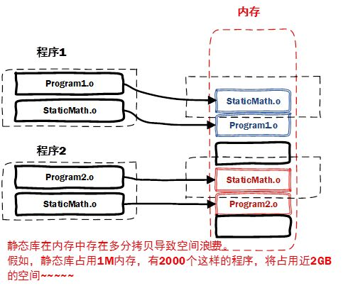
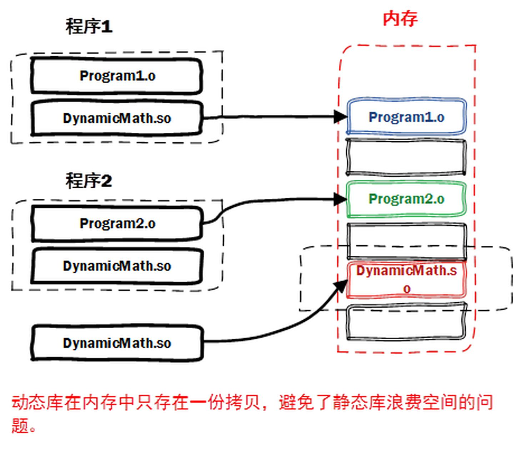

# C++ 基本概念

## CPP 编译过程

编译过程分为四个过程：
   * 编译
     * 编译预处理
     * 编译
     * 优化
   * 汇编
   * 链接

编译预处理： 处理以 `#` 开头的指令；

编译、优化： 将源码 `.cpp `文件翻译成 `.s` 汇编代码；

汇编： 将汇编代码 `.s` 翻译成机器指令 `.o` 文件；

链接： 汇编程序生成的目标文件，即 `.o` 文件，并不会立即执行，因为可能会出现：`.cpp` 文件中的函数引用了另一个 `.cpp` 文件中定义的符号或者调用了某个库文件中的函数。那链接的目的就是将这些文件对应的目标文件连接成一个整体，从而生成可执行的程序文件。


### 链接分为两种：

#### 静态链接：  
代码从其所在的静态链接库中拷贝到最终的可执行程序中，在该程序被执行时，这些代码会被装入到该进程的虚拟地址空间中。

#### 动态链接：  
代码被放到动态链接库或共享对象的某个目标文件中，链接程序只是在最终的可执行程序中记录了共享对象的名字等一些信息。
在程序执行时，动态链接库的全部内容会被映射到运行时相应进行的虚拟地址的空间。


### 二者的优缺点：

#### 静态链接： 
 
浪费空间，每个可执行程序都会有目标文件的一个副本，这样如果目标文件进行了更新操作，
就需要重新进行编译链接生成可执行程序（更新困难）；优点就是执行的时候运行速度快，因为可执行程序具备了程序运行的所有内容。

#### 动态链接：


节省内存、更新方便，但是动态链接是在程序运行时，每次执行都需要链接，相比静态链接会有一定的性能损失。

## 内存管理

C++ 内存分区： 栈、堆、全局/静态存储区、常量存储区、代码区。

* 栈：
   存放函数的局部变量、函数参数、返回地址等，由编译器自动分配和释放。

* 堆：
   动态申请的内存空间，就是由 malloc 分配的内存块，由程序员控制它的分配和释放，如果程序执行结束还没有释放，操作系统会自动回收。

* 全局区/静态存储区（.bss 段和 .data 段）：
   存放全局变量和静态变量，程序运行结束操作系统自动释放，在 C 语言中，未初始化的放在 .bss 段中，初始化的放在 .data 段中，C++ 中不再区分了。

* 常量存储区（.data 段）：
存放的是常量，不允许修改，程序运行结束自动释放。

* 代码区（.text 段）：
   存放代码，不允许修改，但可以执行。编译后的二进制文件存放在这里。

> 从操作系统的本身来讲，以上存储区在内存中的分布是如下形式(从低地址到高地址)：`.text 段` --> `.data 段` --> `.bss 段` --> `堆` --> `unused` --> `栈` --> `env`

```cpp
#include <iostream>
using namespace std;

/*
说明：C++ 中不再区分初始化和未初始化的全局变量、静态变量的存储区，如果非要区分下述程序标注在了括号中
*/

int g_var = 0; // g_var 在全局区（.data 段）
char *gp_var;  // gp_var 在全局区（.bss 段）

int main()
{
    int var;                    // var 在栈区
    char *p_var;                // p_var 在栈区
    char arr[] = "abc";         // arr 为数组变量，存储在栈区；"abc"为字符串常量，存储在常量区
    char *p_var1 = "123456";    // p_var1 在栈区；"123456"为字符串常量，存储在常量区
    static int s_var = 0;       // s_var 为静态变量，存在静态存储区（.data 段）
    p_var = (char *)malloc(10); // 分配得来的 10 个字节的区域在堆区
    free(p_var);
    return 0;
}

```
### 变量的区别
全局变量、局部变量、静态全局变量、静态局部变量的区别:

C++ 变量根据定义的位置的不同的生命周期，具有不同的作用域，作用域可分为 6 种：
1. 全局作用域
2. 局部作用域
3. 语句作用域
4. 类作用域
5. 命名空间作用域和文件作用域

#### 从作用域看：

* 全局变量：
  具有全局作用域。全局变量只需在一个源文件中定义，就可以作用于所有的源文件。当然，其他不包含全局变量定义的源文件需要用 extern 关键字再次声明这个全局变量。

* 静态全局变量：
  具有文件作用域。它与全局变量的区别在于如果程序包含多个文件的话，它作用于定义它的文件里，不能作用到其它文件里，即被 static 关键字修饰过的变量具有文件作用域。这样即使两个不同的源文件都定义了相同名字的静态全局变量，它们也是不同的变量。

* 局部变量：
  具有局部作用域。它是自动对象（auto），在程序运行期间不是一直存在，而是只在函数执行期间存在，函数的一次调用执行结束后，变量被撤销，其所占用的内存也被收回。

* 静态局部变量：
  具有局部作用域。它只被初始化一次，自从第一次被初始化直到程序运行结束都一直存在，它和全局变量的区别在于全局变量对所有的函数都是可见的，而静态局部变量只对定义自己的函数体始终可见。

#### 从分配内存空间看：

* 静态存储区：
  * 全局变量
  * 静态局部变量
  * 静态全局变量
  
* 栈： 局部变量

说明：

* 静态变量和栈变量（存储在栈中的变量）、堆变量（存储在堆中的变量）的区别：
   - 静态变量会被放在程序的静态数据存储区（.data 段）中（静态变量会自动初始化），这样可以在下一次调用的时候还可以保持原来的赋值。

   - 栈变量或堆变量不能保证在下一次调用的时候依然保持原来的值。

* 静态变量和全局变量的区别：
  - 静态变量用 static 告知编译器，自己仅仅在变量的作用范围内可见。

#### 初始化
全局变量、文件域的静态变量和类的静态成员变量在main执行之前的静态初始化过程中分配内存并初始化；
局部静态变量（一般为函数内的静态变量）在第一次使用时分配内存并初始化。这里的变量包含内置数据类型和自定义类型的对象。

#### 存储持续性、作用域与链接性
全局变量: 外部链接性、静态持续变量

静态全局变量:  内部链接性、静态持续变量

静态局部变量: 无链接性、静态持续变量

局部变量: 自动存储持续性的变量

> 总结：
> 变量的四大类型：`全局变量`，`静态全局变量`，`局部变量`，`静态局部变量`。
> * 全局变量：
>  全局作用域：一个文件中定义，同属于一个程序的其他文件之中使用extern声明后也可使用。
> * 静态全局变量：
> 文件作用域，不同文件之间不共享。
> * 局部变量：
> 局部作用域，函数体执行完被销毁，存放在栈区。
> * 静态局部变量：
> 局部作用域，程序执行结束后被销毁
> 
> 如果在头文件中定义全局变量，当该头文件被多个文件 include 时，
> 该头文件中的全局变量就会被定义多次，导致重复定义，因此不能再头文件中定义全局变量。

### 栈和堆的区别
申请方式：
栈是系统`自动分配`，堆是程序员`主动申请`。

* 申请后系统响应：
   分配栈空间，如果剩余空间大于申请空间则分配成功，否则分配失败栈溢出；申请堆空间，堆在内存中呈现的方式类似于链表（记录空闲地址空间的链表），在链表上寻找第一个大于申请空间的节点分配给程序，将该节点从链表中删除，大多数系统中该块空间的首地址存放的是本次分配空间的大小，便于释放，将该块空间上的剩余空间再次连接在空闲链表上。

   栈在内存中是连续的一块空间（向低地址扩展）最大容量是系统预定好的，堆在内存中的空间（向高地址扩展）是不连续的。

* 申请效率：
   栈是有系统自动分配，申请效率高，但程序员无法控制；堆是由程序员主动申请，效率低，使用起来方便但是容易产生碎片。

* 存放的内容：
   栈中存放的是局部变量，函数的参数；堆中存放的内容由程序员控制。


----

### C++ 中的左值（Lvalues）和右值（Rvalues）
C++ 中有两种类型的表达式：

* 左值（lvalue）：
 指向内存位置的表达式被称为左值（lvalue）表达式。左值可以出现在赋值号的左边或右边。

* 右值（rvalue）：
 术语右值（rvalue）指的是存储在内存中某些地址的数值。右值是不能对其进行赋值的表达式，也就是说，右值可以出现在赋值号的右边，但不能出现在赋值号的左边。

变量是左值，因此可以出现在赋值号的左边。数值型的字面值是右值，因此不能被赋值，不能出现在赋值号的左边。下面是一个有效的语句：

```cpp
int g = 20;
```

但是下面这个就不是一个有效的语句，会生成编译时错误：

```cpp
10 = 20;
```

### C++ 存储类

存储类定义 C++ 程序中变量/函数的范围（可见性）和生命周期。这些说明符放置在它们所修饰的类型之前。下面列出 C++ 程序中可用的存储类：

* auto
* register
* static
* extern
* mutable

#### auto
auto 存储类是所有局部变量默认的存储类。

```cpp 
{
   int mount;
   auto int month;
}
```
上面的实例定义了两个带有相同存储类的变量，auto 只能用在函数内，即 auto 只能修饰局部变量。

#### register 
register 存储类用于定义存储在寄存器中而不是 RAM 中的局部变量。这意味着变量的最大尺寸等于寄存器的大小（通常是一个词），且不能对它应用一元的 '&' 运算符（因为它没有内存位置）。
```cpp 
   register int  miles;

```
寄存器只用于需要快速访问的变量，比如计数器。还应注意的是，定义 'register' 并不意味着变量将被存储在寄存器中，它意味着变量可能存储在寄存器中，这取决于硬件和实现的限制。

#### `static` 

`static` 存储类指示编译器在程序的生命周期内保持局部变量的存在，而不需要在每次它进入和离开作用域时进行创建和销毁。因此，使用 `static` 修饰局部变量可以在函数调用之间保持局部变量的值。

`static` 修饰符也可以应用于全局变量。当 `static` 修饰全局变量时，会使变量的作用域限制在声明它的文件内。

在 C++ 中，当 `static` 用在类数据成员上时，会导致仅有一个该成员的副本被类的所有对象共享。

```c++
#include <iostream>
 
// 函数声明 
void func(void);
 
static int count = 10; /* 全局变量 */
 
int main()
{
    while(count--)
    {
       func();
    }
    return 0;
}

// 函数定义
void func( void )
{
    static int i = 5; // 局部静态变量
    i++;
    std::cout << "变量 i 为 " << i ;
    std::cout << " , 变量 count 为 " << count << std::endl;
}
```

#### extern 
extern 存储类用于提供一个全局变量的引用，全局变量对所有的程序文件都是可见的。当您使用 'extern' 时，对于无法初始化的变量，会把变量名指向一个之前定义过的存储位置。

当您有多个文件且定义了一个可以在其他文件中使用的全局变量或函数时，可以在其他文件中使用 extern 来得到已定义的变量或函数的引用。可以这么理解，extern 是用来在另一个文件中声明一个全局变量或函数。

extern 修饰符通常用于当有两个或多个文件共享相同的全局变量或函数的时候，如下所示：

第一个文件：main.cpp

#include <iostream>
 
int count ;
extern void write_extern();
 
int main()
{
   count = 5;
   write_extern();
}
第二个文件：support.cpp

#include <iostream>
 
extern int count;
 
void write_extern(void)
{
   std::cout << "Count is " << count << std::endl; 
} 
在这里，第二个文件中的 extern 关键字用于声明已经在第一个文件 main.cpp 中定义的 count。现在 ，编译这两个文件，如下所示：

$g++ main.cpp support.cpp -o write
这会产生 write 可执行程序，尝试执行 write，它会产生下列结果：

$ ./write
Count is 5
mutable 存储类
mutable 说明符仅适用于类的对象，这将在本教程的最后进行讲解。它允许对象的成员替代常量。也就是说，mutable 成员可以通过 const 成员函数修改。


mutable 存储类
mutable 说明符仅适用于类的对象，这将在本教程的最后进行讲解。它允许对象的成员替代常量。也就是说，mutable 成员可以通过 const 成员函数修改。