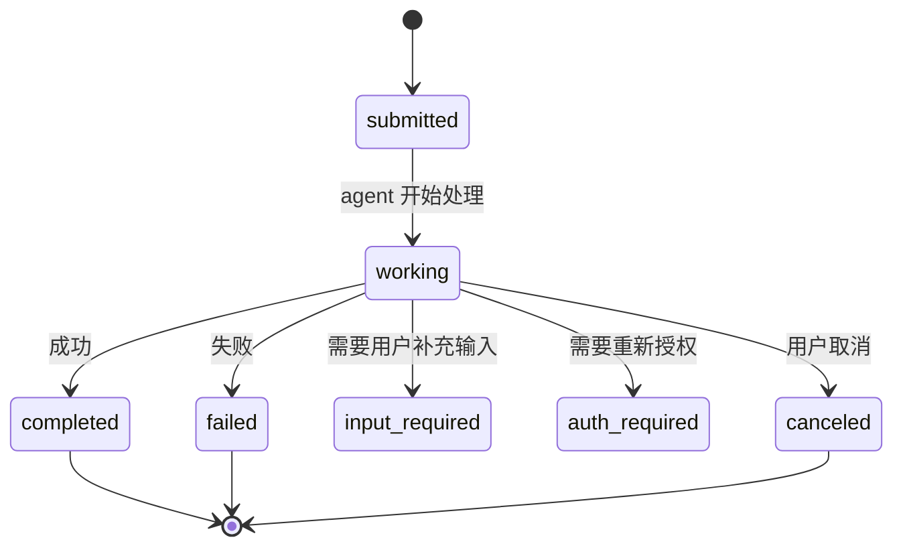

# A2A 协议入门指南

> 范围：从零开始理解 A2A（Agent-to-Agent）协议，并在车端场景下快速上手。
> 前置文档：
> - [`a2a.md`](./a2a.md)：车内 A2A 部署 + TEE + KMSS
> - [`a2a_spiffe.md`](./a2a_spiffe.md)：SPIFFE/SPIRE 零信任方案
> - [`a2a_iam_integration.md`](./a2a_iam_integration.md)：与车端 IAM 的集成设计
>
> 本文是入门篇，不深入协议细节，只回答"是什么 / 为什么 / 怎么学 / 怎么动手"。
> 完整设计视角（含 IAM 三模块 + SPIRE 组件部署图）：见 [`a2a_iam_integration.md §0`](./a2a_iam_integration.md#0-总览架构图一图流) 与 [`a2a_spiffe.md §0`](./a2a_spiffe.md#0-总览架构图spiffe-视角)。

---

## 0. 一图流（A2A 在车端怎么跑）

```mermaid
flowchart LR
    classDef agent fill:#e1f5ff,stroke:#0277bd,stroke-width:2px
    classDef infra fill:#f3e5f5,stroke:#6a1b9a,stroke-width:2px

    CD["CD Agent<br/>座舱域 LLM"]:::agent
    AD["AD Agent<br/>智驾域感知"]:::agent
    KMSS["KMSS Server<br/>SPIRE + TEE 私钥"]:::infra

    CD <-. ① 拉 X.509-SVID .-> KMSS
    KMSS <-. ② 拉 X.509-SVID .-> AD
    CD ==>|"③ A2A 调用<br/>HTTP/2 + mTLS<br/>+ JSON-RPC<br/>+ SSE 流式"| AD
```

**30 秒看懂**：

1. **两个 Agent**：CD（座舱大模型）、AD（智驾感知），各自在不同域控制器上跑
2. **中间 KMSS**：车端"证书工厂"，每个 Agent 启动时去拉一张 X.509-SVID（含 SPIFFE ID）
3. **A2A 调用**：CD 用 SVID 做 mTLS，调用 AD 的能力；AD 用 SVID 验 CD 身份
4. **背后协议**：HTTP/2 + JSON-RPC + SSE，长任务用流式或推送

如果这张图已经让你理解 A2A 在车端的核心动作，可以跳过直接看 §2；否则按下面章节继续。

---

## 1. 协议本质

**A2A（Agent-to-Agent Protocol）** 是一个让两个 AI Agent 互相发现、调用、协作的开放协议。

- **作者**：Google 于 2025 年 4 月发布，后捐赠给 Linux Foundation
- **官网**：[a2a.dev](https://a2a.dev)
- **核心议题**：
  - Agent A 如何"发现" Agent B 能做什么
  - Agent A 如何"调用" Agent B 的能力
  - 长任务如何"异步"协作
  - 如何"鉴权"和"安全"通信

### 1.1 一句话类比

```
A2A ≈ Agent 界的 HTTP + OpenAPI + JWT
     ├─ Agent Card       ≈ OpenAPI / Swagger spec（能力声明）
     ├─ JSON-RPC 2.0     ≈ HTTP 请求/响应协议
     ├─ HTTP/2 + SSE     ≈ HTTP/2 + EventSource（流式响应）
     └─ mTLS / SPIFFE    ≈ 鉴权层
```

### 1.2 与已有概念的对应

| A2A 概念 | 等价已有概念 | 用途 |
|---|---|---|
| Agent | 微服务 | 提供能力的服务端 |
| Agent Card | OpenAPI / gRPC reflection | 声明能力 |
| Task | 异步任务 / Job | 一次调用单元 |
| Message | HTTP Request | 一轮输入 |
| Artifact | HTTP Response Body | 输出结果 |
| Part | multipart/form-data 段 | 载荷原子单位 |
| SSE Stream | WebSocket / SSE | 流式输出 |

---

## 2. 四个核心概念

### 2.1 Agent Card — Agent 的"身份证 + 菜单"

每个 Agent 必须暴露一个 JSON 文档，告诉别人"我能做什么"。

**位置**：`GET /.well-known/agent-card.json`

**格式**：

```json
{
  "name": "weather-agent",
  "url": "https://weather.example.com/a2a",
  "version": "1.0",
  "skills": [
    {
      "id": "get_forecast",
      "description": "未来 7 天天气预报",
      "input_schema": {
        "type": "object",
        "properties": {
          "city": { "type": "string" },
          "days": { "type": "integer", "default": 7 }
        },
        "required": ["city"]
      }
    }
  ],
  "authentication": {
    "schemes": ["mtls", "bearer"]
  },
  "capabilities": {
    "streaming": true,
    "push_notifications": true
  }
}
```

**关键字段**：

| 字段 | 必填 | 说明 |
|---|---|---|
| `name` | 是 | Agent 唯一名 |
| `url` | 是 | Agent Card + RPC 端点（同一域） |
| `skills` | 是 | 能力数组，每个含 id/description/input_schema |
| `authentication.schemes` | 是 | 鉴权方式：bearer / mtls / oauth2 / spiffe |
| `capabilities.streaming` | 否 | 是否支持 SSE |
| `capabilities.push_notifications` | 否 | 是否支持 webhook |

### 2.2 Task — 调用单元

A2A 把"调用 Agent 完成一件事"抽象为 **Task**。

**状态机**：



**关键字段**：

```json
{
  "id": "task-uuid-1234",
  "context_id": "session-uuid-5678",
  "status": "working",
  "messages": [...],
  "artifacts": [...],
  "created_at": "2025-XX-XXT...",
  "updated_at": "2025-XX-XXT..."
}
```

| 字段 | 说明 |
|---|---|
| `id` | Task 全局唯一 ID |
| `context_id` | 同一次会话的所有 Task 共享，便于多轮 |
| `status` | 当前状态 |
| `messages` | 用户与 agent 的对话历史 |
| `artifacts` | agent 产出的结果 |

### 2.3 Message / Artifact / Part — 载荷三层结构

```
Task
├─ Message[]    # 一轮对话（user → agent，或 agent → user）
│   └─ Part[]   # 文本 / 文件 / 数据
└─ Artifact[]   # agent 产出的结果
    └─ Part[]   # 同上
```

**Part 类型**：

| 类型 | 字段 | 用途 |
|---|---|---|
| **TextPart** | `text: string` | 普通文本 |
| **FilePart** | `file: { name, mimeType, bytes | uri }` | 文件（base64 或 URL） |
| **DataPart** | `data: object` | 结构化数据（JSON） |

**示例**：

```json
{
  "messages": [
    {
      "role": "user",
      "parts": [
        { "type": "text", "text": "上海明天会下雨吗？" }
      ]
    }
  ],
  "artifacts": [
    {
      "name": "weather_forecast",
      "parts": [
        {
          "type": "data",
          "data": {
            "city": "上海",
            "date": "2025-XX-XX",
            "rain_probability": 0.7,
            "temperature": "18-24°C"
          }
        },
        {
          "type": "file",
          "file": {
            "name": "forecast_chart.png",
            "mimeType": "image/png",
            "uri": "https://example.com/chart.png"
          }
        }
      ]
    }
  ]
}
```

### 2.4 调用模式 — 三种

| 模式 | 方法 | 协议 | 适用 |
|---|---|---|---|
| **阻塞式** | `message/send` | JSON-RPC 请求/响应 | 短任务（< 30s） |
| **流式** | `message/stream` | JSON-RPC + SSE | 长任务、实时反馈 |
| **推送** | `tasks/pushNotification` | webhook | 异步回调 |

**SSE 流式协议**：

```
Client → Server:
  POST /a2a/v1/stream HTTP/2
  { "method": "message/stream", "params": {...} }

Server → Client:
  HTTP/2 200 OK
  Content-Type: text/event-stream
  
  data: {"jsonrpc":"2.0","id":"...","result":{"status":"working",...}}
  
  data: {"jsonrpc":"2.0","id":"...","result":{"status":"working","delta":"..."}}
  
  data: {"jsonrpc":"2.0","id":"...","result":{"status":"completed","artifacts":[...]}}
```

---

## 3. 协议规范精读指引

### 3.1 必读材料

| 优先级 | 资源 | 链接 |
|---|---|---|
| ★★★★★ | 官方协议规范 | [a2a.dev](https://a2a.dev) |
| ★★★★★ | Reference 实现 + Spec | github.com/a2a-mcp/a2a |
| ★★★★ | Google 博客原文 | "A2A: Agent-to-Agent Protocol" |
| ★★★★ | Linux Foundation AI 公告 | lfai.foundation |
| ★★★ | 各云厂商解读 | AWS / Azure / GCP Agent 服务博客 |

### 3.2 Spec 推荐精读顺序

| 顺序 | 章节 | 主题 | 耗时 |
|---|---|---|---|
| 1 | §1 Introduction | 动机、与 MCP 的区别 | 10 min |
| 2 | §2 Agent Card | JSON schema 完整规范 | 20 min |
| 3 | §3 Transport & Protocol | HTTP/2 + JSON-RPC 2.0 绑定 | 15 min |
| 4 | §4 Authentication | Bearer / mTLS / OAuth / SPIFFE | 20 min |
| 5 | §5 Core Objects | Task / Message / Artifact / Part | 30 min |
| 6 | §6 Methods | `message/send` / `message/stream` / `tasks/get` 等 | 30 min |
| 7 | §7 Streaming | SSE 协议细节（重连、心跳） | 15 min |
| 8 | §8 Push Notifications | webhook 安全 | 15 min |
| 9 | §9 Extensions | 自定义扩展（车规会用到） | 20 min |

### 3.3 与 MCP 的关系（重要澄清）

```
┌─────────────────────────────────────────────────────┐
│ MCP（Model Context Protocol）                         │
│   = Agent → Tool / Resource 调用协议                 │
│   = 一个 Agent 用 N 个工具                           │
│   = 类似进程内函数调用                                │
└─────────────────────────────────────────────────────┘
                       ▲
                       │ 互补
                       ▼
┌─────────────────────────────────────────────────────┐
│ A2A（Agent-to-Agent Protocol）                        │
│   = Agent ↔ Agent 协作协议                           │
│   = 多个 Agent 互相调用                                │
│   = 类似进程间 RPC                                    │
└─────────────────────────────────────────────────────┘
```

**关键差异**：

| 维度 | MCP | A2A |
|---|---|---|
| 调用方 | Agent → Tool | Agent ↔ Agent |
| 鉴权 | 通常本地无鉴权 | 必须鉴权（mTLS / OAuth / SPIFFE） |
| 状态 | 通常无状态 | 有 Task 状态机 |
| 协议载体 | stdio / JSON-RPC | HTTP/2 + JSON-RPC + SSE |
| 异步 | 弱 | 强（SSE / Push） |
| 适用 | 单 Agent 工具扩展 | 多 Agent 协作 |

**两者不冲突，可叠加**：Agent A 用 MCP 调本地工具，Agent A 用 A2A 调 Agent B 的能力。

---

## 4. 动手实践（4 步上手）

### Step 1：跑通官方 demo

```bash
git clone https://github.com/a2a-mcp/a2a
cd a2a/samples
python -m venv .venv && source .venv/bin/activate
pip install -r requirements.txt

# 启动一个 weather agent
python weather_agent.py --port 8001

# 另开终端，启动 client 调用
python client.py --target http://localhost:8001
```

**预期现象**：client 拉取 agent card → 调用 `get_forecast` → 收到 SSE 流式更新 → 最终得到 artifacts。

### Step 2：写一个最小 Agent（Python）

```python
from a2a import A2AStarletteApplication, AgentCard, Skill

# 1. 定义能力
AGENT_CARD = AgentCard(
    name="echo-agent",
    url="http://localhost:9999",
    skills=[
        Skill(
            id="echo",
            description="echo back the input",
            input_schema={
                "type": "object",
                "properties": {"text": {"type": "string"}},
                "required": ["text"]
            }
        )
    ],
    authentication={"schemes": ["bearer"]}
)

# 2. 实现 message/send handler
async def handle_send(task_id: str, message: dict):
    user_text = message["parts"][0]["text"]
    return {
        "task_id": task_id,
        "status": "completed",
        "artifacts": [{
            "parts": [{"type": "text", "text": f"echo: {user_text}"}]
        }]
    }

# 3. 启动服务
app = A2AStarletteApplication(AGENT_CARD, handle_send)
uvicorn.run(app, host="0.0.0.0", port=9999)
```

### Step 3：调通三种调用模式

```python
# 阻塞式
result = await client.send_message(
    target="http://localhost:9999",
    message={"parts": [{"type": "text", "text": "hello"}]}
)

# 流式（SSE）
async for update in client.stream_message(
    target="http://localhost:9999",
    message={"parts": [{"type": "text", "text": "hello"}]}
):
    print(update)

# 异步推送（webhook）
task = await client.send_message(
    target="http://localhost:9999",
    message={"parts": [{"type": "text", "text": "hello"}]},
    push_notification={
        "url": "https://my-server.com/webhook",
        "token": "shared-secret"
    }
)
```

### Step 4：加鉴权（mTLS）

```python
# Server 侧：要求客户端证书
app = A2AStarletteApplication(
    AGENT_CARD,
    handle_send,
    ssl={
        "certfile": "server.crt",      # server cert（含 spiffe_id）
        "keyfile": "server.key",
        "ca_certs": "trust_bundle.pem", # 信任的客户端 CA
        "verify_mode": "CERT_REQUIRED"
    }
)

# Agent Card 声明
AGENT_CARD = AgentCard(
    ...,
    authentication={"schemes": ["mtls"]}
)
```

---

## 5. 各语言 SDK 状态（2025 年中）

| 语言 | SDK | 状态 | 适用 |
|---|---|---|---|
| **Python** | `a2a-sdk` | ✅ GA | 主力开发、参考实现 |
| **JavaScript / TS** | `a2a-js` | ✅ GA | 浏览器 / Node |
| **Java** | `a2a-java` | 🟡 Beta | 后端服务 |
| **Go** | `a2a-go` | 🟡 Alpha | 后端服务 |
| **Rust** | `a2a-rs` | 🟡 Alpha | 嵌入式 / 高性能 |
| **C# / .NET** | `a2a-dotnet` | 🟡 Beta | 微软生态 |
| **C++** | ❌ 官方未提供 | ❌ | 需要自己实现或封装 |

> **车端重要提示**：截至 2025 年中，A2A 官方没有 C++ SDK。如果要在车规域控制器（典型 C++ 环境）部署，需要：
> 1. 自己实现 `AgentCard` JSON 解析 + JSON-RPC 2.0 序列化
> 2. 嵌入 SSE 客户端（例如基于 [libcurl](https://curl.se/libcurl/) + 简单 parser）
> 3. 复用 [`a2a_iam_integration.md`](./a2a_iam_integration.md) §14 推荐的 C++ 开源栈
> 4. 用 [`wolfSSL`](https://www.wolfssl.com/) 或 [`mbedTLS`](https://www.trustedfirmware.org/projects/mbed-tls/) 实现 mTLS

完整开源栈选型见 [`a2a_iam_integration.md §14`](./a2a_iam_integration.md#14-c-开源栈选型)。

---

## 6. 车端专属学习路径

如果你要把 A2A 部署到车上，**入门之后立刻要看这 3 篇**：

| 步骤 | 阅读 | 解决的问题 |
|---|---|---|
| 1 | [`a2a.md`](./a2a.md) | TEE + KMSS 车内部署的硬件安全底座 |
| 2 | [`a2a_spiffe.md`](./a2a_spiffe.md) | SPIFFE/SPIRE 给 Agent 发"零信任身份证" |
| 3 | [`a2a_iam_integration.md`](./a2a_iam_integration.md) | 与现有 IAM 三模块（Identity/Auth/Credential）的对接 |

### 6.1 车端与云端的关键差异

| 维度 | 云端 A2A | 车端 A2A |
|---|---|---|
| 网络 | Internet / 内网 HTTP/2 | CAN / Ethernet / SOME/IP |
| 鉴权 | OAuth 2.0 / OIDC | mTLS（SPIFFE-SVID） |
| 证书来源 | PKI / Vault | 域控制器 TEE + KMSS |
| 实时性要求 | 秒级 | 毫秒级（紧急制动 < 50ms） |
| 安全等级 | 商业级 | ASIL-B/D（功能安全） |
| 生命周期管理 | K8s / 容器 | OEM 工厂下线配证书、热更新 |
| 协议载体 | gRPC / SSE | vsomeip / iceoryx / 自研 HTTP/2-over-SOME/IP |

### 6.2 车端落地分三步

```
Phase 1（1 个月）：基础设施
  ├─ 部署 KMSS 或 SPIRE 在域内
  ├─ 给每个 Agent 配置 SPIFFE ID
  └─ 实现 mTLS 双向认证

Phase 2（2 个月）：协议层
  ├─ 选 SOME/IP 或 HTTP/2 as 传输
  ├─ 实现 AgentCard 服务（OEM 注册中心）
  ├─ 实现 message/send + tasks/get
  └─ 实现 message/stream（SSE-over-SOME/IP 或直接 HTTP/2）

Phase 3（2 个月）：安全增强
  ├─ 接入任务级 JWT（Task Token）
  ├─ 实现跨域 delegation（联邦信任链）
  ├─ 实现凭证轮换 / 撤销
  └─ 注入 ASIL step-down 校验
```

---

## 7. 常见问题（FAQ）

### Q1：A2A 和 gRPC 是什么关系？

A2A **运行在 HTTP/2 + JSON-RPC 之上**，可以借助 gRPC 的 HTTP/2 传输层。两者并不冲突：
- gRPC：RPC 框架（生成 stub、序列化）
- A2A：Agent 协作协议（能力声明、任务状态机）

车端可以考虑用 gRPC 作传输层，但暴露 gRPC 接口的同时也暴露 A2A `AgentCard` JSON。

### Q2：A2A 用了 HTTP，传输层还能用 SOME/IP 吗？

可以。A2A 规范明确支持"任何 HTTP/2 兼容传输"。
- 高带宽低延迟域（自动驾驶）→ SOME/IP
- 中等带宽（座舱 / 网关）→ 标准 HTTP/2 over Ethernet
- 跨域聚合 → vsomeip

### Q3：如何处理长任务（>10 分钟）？

两条路径：
1. **SSE 流式**：连接保持，每 10s 一个 `working` 状态心跳
2. **推送**：`tasks/pushNotification` 注册 webhook，agent 完成后主动 POST

推荐：**80% 任务用推送**（避免长连接浪费资源），只有需要"实时看进展"的场景才用 SSE。

### Q4：如何在车端生成 Agent Card？

Agent Card 是普通 JSON 文件，可以放在：
1. 文件系统（OTA 更新）
2. KMSS 数据库（动态拉取）
3. OEM 注册中心 API

**最佳实践**：用 KMSS Private Key 签名 Agent Card，客户端用 KMSS Trust Bundle 验签 → 防止伪造。

### Q5：A2A 鉴权做几层？

推荐 3 层叠加：

| 层 | 作用 | 凭证 |
|---|---|---|
| L7（A2A 层） | 应用层鉴权 | JWT Task Token |
| L5（会话层） | 任务级授权 | JWT Session Token |
| L4（传输层） | 双向身份 + 信道加密 | mTLS / SPIFFE-SVID |

详见 [`a2a_iam_integration.md §4`](./a2a_iam_integration.md#4-ttl-分级与-a2a-生命周期)。

---

## 8. 推荐资源

### 8.1 必读官方文档

- [a2a.dev](https://a2a.dev) — 协议规范官网
- [github.com/a2a-mcp/a2a](https://github.com/a2a-mcp/a2a) — Reference 实现 + samples
- [Google A2A 博客](https://developers.googleblog.com/) — 原始发布说明

### 8.2 中文 / 中文社区

- Linux Foundation AI 中文公告
- 各国产大模型厂的 Agent 平台博客（百度、阿里、字节）

### 8.3 视频 / 课程

- A2A 官方 YouTube demo
- Google IO / Cloud Next 中关于 Agent 的 talk

### 8.4 相关协议

- [MCP 规范](https://modelcontextprotocol.io) — Model Context Protocol，与 A2A 互补
- [JSON-RPC 2.0](https://www.jsonrpc.org/specification) — A2A 的请求格式
- [Server-Sent Events (SSE)](https://html.spec.whatwg.org/multipage/server-sent-events.html) — A2A 流式底层

### 8.5 车规相关

- [`a2a.md`](./a2a.md)
- [`a2a_spiffe.md`](./a2a_spiffe.md)
- [`a2a_iam_integration.md`](./a2a_iam_integration.md)

---

## 9. 修订记录

| 日期 | 版本 | 修订人 | 改动 |
|---|---|---|---|
| 2025-XX-XX | v0.1 | copilot | 初稿：协议本质、四核心概念、规范精读路径、动手实践、车端专属路径、FAQ、推荐资源 |