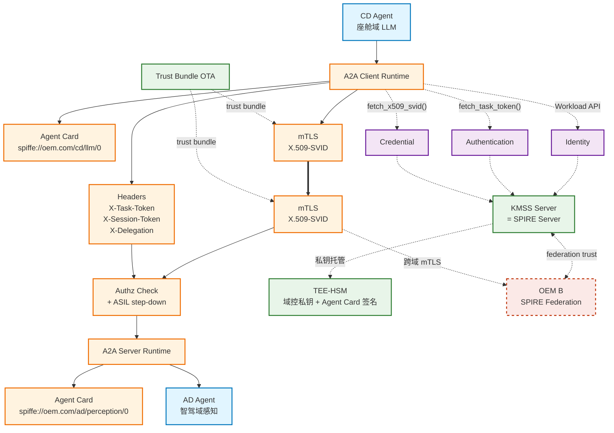
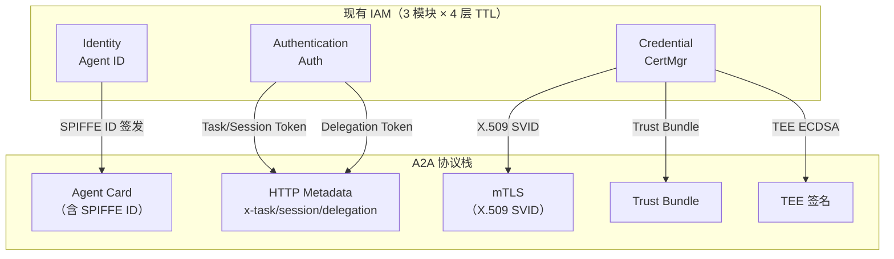
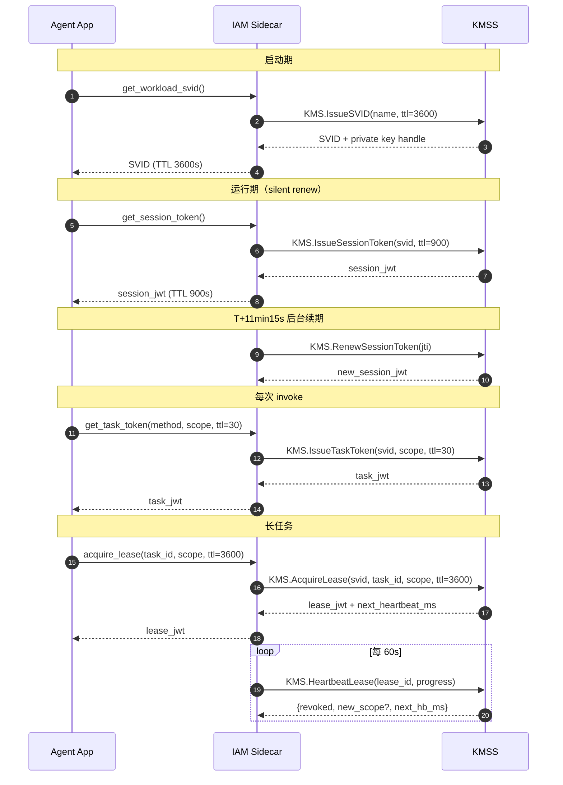
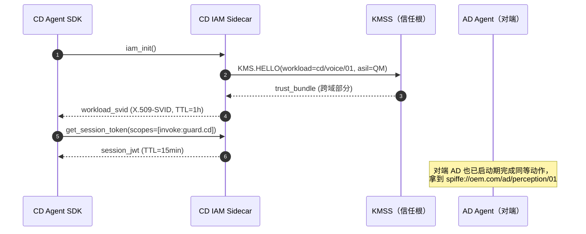
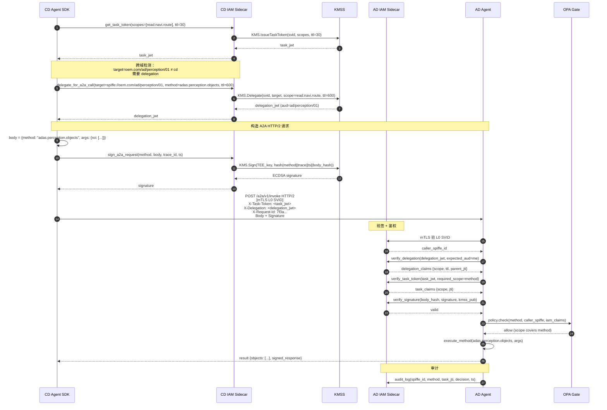

# A2A 协议 × 车端 IAM 集成设计

> 前置文档：
> - [`a2a.md`](./a2a.md)：车内 A2A 部署 + TEE + KMSS
> - [`a2a_spiffe.md`](./a2a_spiffe.md)：SPIFFE/SPIRE-based 零信任方案
> - [`../security/llm_agent_defense/iam_auth_architecture.md`](../security/llm_agent_defense/iam_auth_architecture.md)：3 模块 4 层 TTL IAM 设计
>
> 本文聚焦：**现有 IAM（Identity / Authentication / Credential）如何与 A2A 协议栈对齐**，给出最小侵入改造路径、端到端集成示例与 C++ 开源栈选型。

---

## 0. 总览架构图（一图流）

本节用一张大图把"应用 → A2A 协议 → IAM 三模块 → KMSS → TEE → 跨域联邦"端到端贯通。后续 §1-§15 都是这张图的局部放大。



### 0.1 五层结构解读

| 层 | 组件 | 职责 |
|---|---|---|
| **应用层** | CD Agent / AD Agent | 业务逻辑，发起 / 接收 A2A 调用 |
| **A2A 协议层** | Runtime + Agent Card + Token Headers | 协议语义、能力声明、凭证携带 |
| **传输层** | mTLS X.509-SVID | 信道加密 + 双向身份 |
| **IAM 层** | Identity / Auth / Credential | 凭证签发 + 验签 + scope 检查 |
| **基础设施层** | KMSS Server + TEE-HSM | 凭证签发根 + 私钥硬件保护 |
| **联邦层** | OEM B SPIRE Server | 跨域信任 + 跨域凭证委托 |

### 0.2 三类数据流

| 流向 | 线型 | 走线 | 频次 |
|---|---|---|---|
| **数据面** | 实线 → | 应用 → Runtime → mTLS → Server Runtime → 对端应用 | 每次 A2A 调用 |
| **凭证面** | 虚线 -. | Runtime → KMSS lib → KMSS Server → TEE | SVID 1h / Token 30s |
| **联邦面** | 点划线 -. | KMSS Server ↔ OEM B SPIRE Server（federation） | 跨域首次握手 |

### 0.3 与后续章节的对应关系

| 章节 | 主题 | 对应总览图的哪一部分 |
|---|---|---|
| §1 | 设计动机 | 0.1 五层存在的理由 |
| §2 | 三模块映射总览 | 0.2 数据面 + 凭证面的拆分 |
| §3-§4 | SPIFFE ID + TTL | IAM 三模块的命名 + 时长约定 |
| §5 | 端到端流程 | 0.1 数据面展开（启动 + 调用双时序） |
| §6 | KMSS lib API | 0.2 凭证面的 7 个新 C API |
| §8 | 与 SPIRE 共存 | 0.2 凭证面的两种实现路径 |
| §9 | A2A 规范集成点 | 0.1 中"A2A 协议层"的协议字段 |
| §11 | RFC 字段对应表 | 0.1 A2A 协议层的 12 个协议字段 |
| §14 | C++ 开源栈 | 0.1 各层的具体库选型 |

### 0.4 阅读建议

- **第一次看本笔记**：先看 §0 → §1 → §2 → §5 → §6
- **要写代码**：跳到 §6（KMSS API）+ §7（Runtime 示例）+ §14（开源栈）
- **要选型**：跳到 §8（SPIRE 共存）+ §14（开源栈）
- **要审计/Review**：跳到 §10（验证清单）+ §11（RFC 字段对应）

---

## 1. 设计动机

A2A（Agent-to-Agent）协议本质上是一组**调用约定 + 凭证传递约定**，而车端 IAM 已经定义了：

- 身份（SPIFFE ID）
- 4 层 TTL 凭证（Workload SVID / Task Token / Session Token / Lease Token）
- 跨域 delegation 链
- TEE 保护的私钥 + KMSS 中心化签发

**核心结论**：A2A 协议**不是**一个独立的 IAM 体系，而是 IAM 凭证的**传输层与寻址层**。把 A2A 协议叠加到现有 IAM 上：

- mTLS 自动获得 Workload SVID（L0）
- HTTP metadata 自动携带 Task / Session / Delegation Token（L1/L2/跨域）
- Agent Card 把 SPIFFE ID 暴露给其他域

无需引入新的身份基础设施，只在 KMS lib 加 4 个 API、在 A2A Runtime 调 6 个 SDK 调用即可。

---

## 2. 三模块映射总览

### 2.1 模块映射表

| IAM 模块 | A2A 对应物 | 集成点 |
|---|---|---|
| **Identity（Agent ID）** | Agent Card + SPIFFE ID | Agent Card 含 SPIFFE ID；对端通过 SVID 信任 |
|   - SPIFFE ID 签发 / 解析 | A2A 寻址（`a2a+tls://adas-dc.local:8443`） | URI 嵌入 spiffe_id |
|   - Workload SVID（L0） | mTLS 客户端 / 服务端证书 | HTTP/2 TLS 握手自动用 SVID |
| **Authentication（Auth）** | A2A 调用 metadata + scope 传递 | Token 放在 HTTP header |
|   - Task Token（L1） | `X-Task-Token` header | 单次调用的精确 scope |
|   - Session Token（L2） | `X-Session-Token` header | 长连接的会话级 scope |
|   - Delegation Token | `X-Delegation` header | 跨域 A2A 调用 step-down 凭证 |
| **Credential（CertMgr）** | mTLS 信任链 + 撤销机制 | Trust bundle / CRL 推送 |
|   - X.509 SVID（L0） | TLS 握手证书 | KMSS 签发 SPIRE Server 兼容的 X.509-SVID |
|   - 4 层密钥生命周期 | TTL 模型 | Workload 1h / Task 30s / Session 15min / Lease 任务匹配 |
|   - Lease Token（L3） | A2A 长时间 Task 生命周期 | Lease 状态机 ↔ A2A Task 状态机 |
|   - TEE 私钥保护 | TEE 签名 A2A 请求体 | `kmss_sign_a2a_request()` |
|   - Trust Bundle OTA | A2A 信任锚（CA） | 启动加载 + Notifier 推送 |

### 2.2 关键映射关系图



---

## 3. SPIFFE ID 命名统一

**沿用现有 IAM 的 SPIFFE ID 格式**，直接映射到 A2A Agent Card：

```
spiffe://oem.com/{domain}/{agent-name}/{instance}
```

| 字段 | 取值 | 来自 |
|---|---|---|
| `oem.com` | trust domain | KMSS trust root 配置 |
| `domain` | `ad` / `cd` / `vd` / `tbox` / `body` | DC 类型 |
| `agent-name` | `perception` / `voice` / `planner` / `guard` | Agent 角色 |
| `instance` | `01` / `02` | 多实例编号 |

### 3.1 Agent Card 格式（KMSS 签名）

```json
{
  "name": "adas-perception-01",
  "spiffe_id": "spiffe://oem.com/ad/perception/01",
  "domain": "ad",
  "trust_domain": "oem.com",
  "skills": [
    { "id": "adas.perception.objects",   "scope": "read:navi.route" },
    { "id": "adas.perception.lanes",     "scope": "read:navi.route" },
    { "id": "adas.perception.weather",   "scope": "read:weather.local" }
  ],
  "endpoints": [
    "a2a+tls://adas-dc.local:8443"
  ],
  "asil": "D",
  "km_attest": "<TEE evidence, base64>",
  "signature": "<ECDSA(KMSS_root, card_hash)>"
}
```

签名算法：KMSS 用 Intermediate CA 私钥对 `card_hash` 做 ECDSA-P256 签名；对端验证时从 trust bundle 拉 KMSS 的 Intermediate CA 公钥。

### 3.2 Agent Card 分发方式

| 场景 | 分发机制 |
|---|---|
| 域内 | KMSS 推送 `agent_card.pb` 到本域所有 Sidecar（inotify 触发 reload） |
| 跨域 | KMSS Federation：信任锚 + 路由同步；目标域 Sidecar 缓存远域 Agent Card |
| 运行时 | A2A 客户端首次调用时拉取 `/.well-known/agent-card.json`（HTTP/2 over mTLS） |

---

## 4. 四层 TTL 直接对接 A2A 生命周期

### 4.1 映射表

| IAM 层 | TTL | A2A 场景 | 协议载体 |
|---|---|---|---|
| **L0 Workload SVID** | 1h | mTLS 长连接的根身份；A2A Runtime 全程使用 | TLS 握手证书 |
| **L1 Task Token** | 30s–5min | 单次 A2A `invoke`；method 级别精确授权 | `X-Task-Token` header |
| **L2 Session Token** | 15min | A2A SSE 流式订阅；多步工具编排 | `X-Session-Token` header |
| **L3 Lease Token** | 任务匹配（15min ~ 数小时） | A2A 长时间 `Task`（行程规划、OTA 协调） | 心跳协议 |
| **跨域 Delegation** | ≤ 父 L3 TTL | 跨域 A2A 调用 step-down | `X-Delegation` header |

### 4.2 协议字段对应

```
A2A HTTP 请求（HTTP/2 over mTLS）

TLS 层：
  client cert  = L0 Workload SVID
  server cert  = L0 Workload SVID
  (TLS 握手完成 → 拿到对端 SPIFFE ID)

HTTP/2 headers:
  X-Spiffe-Id     : spiffe://oem.com/cd/voice/01       （来自 mTLS）
  X-Session-Token : <JWT, L2>
  X-Task-Token    : <JWT, L1>
  X-Delegation    : <JWT, 跨域时携带>
  X-Request-Id    : W3C Trace ID
  X-A2A-Method    : adas.perception.objects

HTTP body：
  <JSON-RPC 或 protobuf 编码的 A2A 调用>
  + Signature: ECDSA(KMSS_TEE_key, canonical_sign_payload)
```

### 4.3 TTL 续期时序



---

## 5. 端到端集成流程：CD Agent → AD Agent

### 5.1 启动阶段（两侧都跑完）



### 5.2 调用阶段



### 5.3 关键不变量（SDK 必须保证）

| 不变量 | 说明 | 验证点 |
|---|---|---|
| `child_ttl ≤ parent_ttl` | 子凭证不能比父凭证活更久 | KMSS 签发时强制 |
| `child_scope ⊆ parent_scope` | 子凭证 scope 是父的子集 | KMSS 签发时强制 |
| `delegation.aud = 目标 SPIFFE ID` | 防止 delegation token 被误用 | AD Sidecar 验签时校验 |
| `task_token.scope ⊇ method` | task token 必须覆盖调用方法 | AD Sidecar 验签时校验 |
| **跨 ASIL step-down** | QM scope 不能驱动 ASIL-D 动作 | OPA Gate + KMSS 拒绝 delegation |
| **SPIFFE ID 一致性** | mTLS 取到的 spiffe_id 必须 = task_token.sub | AD Sidecar 比对 |

---

## 6. KMSS lib API 改造清单

> 仅扩展 KMSS lib（demo 中为 libkmss.so），现有 IAM 代码 90% 不动。

### 6.1 新增 C API（kmss_agent.h 追加）

```c
/* ===== Identity 模块扩展 ===== */

/* Agent Card 签发（KMSS 用 Intermediate CA 私钥签名） */
typedef struct {
    char*    name;
    char*    spiffe_id;
    char**   skills;
    size_t   n_skills;
    char*    endpoint;
    char*    card_json;        /* 序列化 JSON */
    uint8_t* signature;        /* ECDSA-P256 */
    size_t   sig_len;
} kmss_agent_card_t;

kmss_agent_card_t* kmss_issue_agent_card(
    const char* workload_name,
    const char** skills, size_t n_skills,
    const char* endpoint,
    const char* asil_level      /* "QM" / "B" / "C" / "D" */
);

void kmss_free_agent_card(kmss_agent_card_t*);


/* 在 SVID 的 URI SAN 中嵌入 A2A methods（可选） */
kmss_svid_t* kmss_issue_workload_svid_ext(
    const char* workload_name,
    uint32_t ttl_seconds,
    const char** a2a_methods, size_t n_methods
);


/* ===== Authentication 模块扩展 ===== */

/* A2A 调用 metadata 辅助结构 */
typedef struct {
    char* svid_jwt;        /* Workload SVID（JWT 形态） */
    char* session_jwt;     /* 可选 */
    char* task_jwt;        /* 必填 */
    char* delegation_jwt;  /* 可选 */
    char* trace_id;
    char* request_id;
} a2a_metadata_t;

a2a_metadata_t* kmss_build_a2a_metadata(
    kmss_svid_t* svid,
    kmss_token_t* session,
    kmss_token_t* task,
    kmss_delegation_t* delegation
);

/* 序列化为 HTTP headers 字符串 */
int kmss_metadata_to_http_headers(
    a2a_metadata_t* meta,
    char* buf, size_t* buf_len
);

void kmss_free_a2a_metadata(a2a_metadata_t*);


/* 跨域 A2A 调用的 delegation 一键签发 */
kmss_delegation_t* kmss_delegate_for_a2a_call(
    kmss_svid_t* parent,
    const char* target_spiffe_id,
    const char* a2a_method,
    uint32_t ttl_seconds
);
/* 内部：
 *   1. 根据 method 查 skills→scopes 映射表
 *   2. 检查 child_scope ⊆ parent_scope
 *   3. 检查 ASIL step-down（QM 不能签 ASIL-D）
 *   4. 签发 delegation token, aud=target_spiffe_id
 */


/* ===== Credential 模块扩展 ===== */

/* Trust Bundle 主动推送（KMSS → 对端 Sidecar） */
int kmss_push_trust_bundle(
    const char* target_domain,
    const uint8_t* bundle, size_t len
);

/* CRL 主动推送（<1s 全网生效） */
int kmss_push_crl(
    const char* target_domain,
    const uint8_t* crl, size_t len
);

/* TEE 内 ECDSA 签名 A2A 请求体 */
int kmss_sign_a2a_request(
    kmss_svid_t* svid,
    const uint8_t* method, size_t mlen,
    const uint8_t* body, size_t blen,
    const uint8_t* trace_id, size_t tlen,
    uint64_t timestamp_ms,
    uint8_t* sig, size_t* sig_len
);
/* canonical_sign_payload = method || trace_id || timestamp_ms || SHA256(body)
 * 私钥在 TEE 内不外出；返回 64-byte ECDSA 签名 */
```

### 6.2 skills → scopes 映射表

```c
/* 由 OEM 静态定义，启动期加载到 KMSS */
typedef struct {
    const char* skill_id;       /* "adas.perception.objects" */
    const char* required_scope; /* "read:navi.route" */
    const char* asil_floor;     /* "D" */
} skill_scope_entry_t;

/* 示例 */
static const skill_scope_entry_t skill_table[] = {
    {"adas.perception.objects",   "read:navi.route",        "D"},
    {"adas.perception.lanes",     "read:navi.route",        "D"},
    {"adas.perception.weather",   "read:weather.local",     "C"},
    {"adas.planner.route",        "invoke:planner.ad",      "D"},
    {"cd.voice.synthesize",       "tool:media.play",        "QM"},
    {"vd.body.window.control",    "tool:body.window",       "B"},
    /* ... */
};
```

### 6.3 与现有 API 的关系

| 新 API | 复用现有 API | 备注 |
|---|---|---|
| `kmss_issue_agent_card` | `kmss_sign` + `kmss_issue_workload_svid` | 拼装 + 签名 |
| `kmss_issue_workload_svid_ext` | `kmss_issue_workload_svid` | URI SAN 扩展 |
| `kmss_build_a2a_metadata` | `kmss_verify_token` 等 | 包装层 |
| `kmss_delegate_for_a2a_call` | `kmss_delegate` | 加 ASIL 检查 |
| `kmss_push_trust_bundle` | OTA 注入 | 增加 push 模式 |
| `kmss_push_crl` | `kmss_revoke` | CRL 生成 + 推送 |
| `kmss_sign_a2a_request` | `kmss_sign` | canonical payload 构造 |

---

## 7. A2A Runtime 集成代码示例

### 7.1 客户端侧（Python 伪代码）

```python
import kmss  # libkmss.so 的 Python binding

class A2AClient:
    def __init__(self, agent_name: str, domain: str):
        self.agent_name = agent_name
        self.domain = domain
        self.kmss = kmss.Client()
        self.svid: kmss.SVID = None
        self.session_token: kmss.Token = None
        self.http_client = None
    
    async def start(self):
        # 1. 启动期：拿 L0 Workload SVID
        self.svid = await self.kmss.issue_workload_svid(
            workload_name=f"{self.domain}/{self.agent_name}",
            ttl_seconds=3600
        )
        
        # 2. 配置 mTLS（HTTP/2 客户端用 L0 SVID 做 TLS）
        self.http_client = build_http2_client(
            cert_pem=self.svid.cert_pem,
            key_pem=self.svid.key_handle,  # TEE handle, 不出 Secure World
            trust_bundle_path="/etc/agent/bundles/oem_com.pb"
        )
        
        # 3. 申请初始 Session Token
        self.session_token = await self.kmss.issue_session_token(
            parent=self.svid,
            scopes=self.my_required_scopes(),
            ttl_seconds=900
        )
        
        # 4. 启动后台 silent renew
        asyncio.create_task(self._renew_session_loop())
    
    async def _renew_session_loop(self):
        while True:
            await asyncio.sleep(13 * 60)  # 13 分钟 (75% TTL)
            try:
                self.session_token = await self.kmss.renew_session_token(self.session_token)
            except kmss.KMSSUnavailable:
                # 30s grace
                await asyncio.sleep(30)
                self.session_token = await self.kmss.renew_session_token(self.session_token)
    
    async def invoke(self, target_spiffe_id: str, method: str, args: dict) -> dict:
        """调用远程 A2A Agent"""
        
        # 1. 申请 Task Token（单次授权）
        scopes = self.lookup_scopes_for_method(method)
        task_token = await self.kmss.issue_task_token(
            parent=self.svid,
            scopes=scopes,
            ttl_seconds=30
        )
        
        # 2. 跨域：申请 Delegation
        delegation = None
        target_domain = target_spiffe_id.split('/')[3]  # "ad"
        if target_domain != self.domain:
            delegation = await self.kmss.delegate_for_a2a_call(
                parent=self.svid,
                target_spiffe_id=target_spiffe_id,
                a2a_method=method,
                ttl_seconds=600
            )
        
        # 3. 构造请求体
        body = json.dumps({"method": method, "args": args}).encode()
        trace_id = generate_w3c_trace_id()
        
        # 4. TEE 签名请求
        signature = await self.kmss.sign_a2a_request(
            svid=self.svid,
            method=method.encode(),
            body=body,
            trace_id=trace_id.encode(),
            timestamp_ms=int(time.time() * 1000)
        )
        
        # 5. 构造 metadata
        metadata = self.kmss.build_a2a_metadata(
            svid=self.svid,
            session=self.session_token,
            task=task_token,
            delegation=delegation
        )
        
        # 6. HTTP/2 over mTLS 发送
        headers = {
            **self.kmss.metadata_to_http_headers(metadata),
            "X-A2A-Method": method,
            "X-Trace-Id": trace_id,
            "X-Body-Signature": base64.b64encode(signature).decode()
        }
        response = await self.http_client.post(
            url=self._endpoint_for(target_spiffe_id),
            headers=headers,
            body=body
        )
        
        # 7. 清理
        await self.kmss.free_token(task_token)
        if delegation:
            await self.kmss.free_delegation(delegation)
        
        return response.json()
    
    def lookup_scopes_for_method(self, method: str) -> list:
        """从 skill_table 查 method 对应 scope"""
        for entry in self.skill_table:
            if entry.skill_id == method:
                return [entry.required_scope]
        raise ValueError(f"Unknown method: {method}")
```

### 7.2 服务端侧（Python 伪代码）

```python
class A2AServer:
    def __init__(self, agent_name: str, kmss_client, opa_client):
        self.agent_name = agent_name
        self.kmss = kmss_client
        self.opa = opa_client
        self.my_spiffe_id = None
        self.trust_bundle = None
    
    async def start(self, port: int):
        # 1. 加载本域 trust bundle
        self.trust_bundle = await load_trust_bundle("/etc/agent/bundles/oem_com.pb")
        
        # 2. 配置 mTLS 服务端（要求客户端证书 = L0 SVID）
        self.my_spiffe_id = await self.discover_my_spiffe_id()
        server = build_http2_server(
            port=port,
            cert_pem=self.my_cert_pem,
            client_ca_bundle=self.trust_bundle,
            verify_client=True
        )
        
        # 3. 注册 A2A 方法
        for method_name, handler in self.method_handlers.items():
            server.register(method_name, self._wrap_handler(method_name, handler))
        
        await server.start()
    
    async def _wrap_handler(self, method_name: str, handler):
        async def wrapped(request):
            return await self._authorize_and_call(method_name, handler, request)
        return wrapped
    
    async def _authorize_and_call(self, method_name, handler, request):
        # 1. mTLS 已验过 L0 SVID，从 peer cert 提取 spiffe_id
        caller_spiffe_id = extract_spiffe_id_from_cert(request.peer_cert)
        
        # 2. 验证 Task Token
        task_jwt = request.headers['X-Task-Token']
        try:
            task_claims = await self.kmss.verify_token(
                token=task_jwt,
                trust_bundle=self.trust_bundle
            )
        except kmss.TokenInvalid as e:
            raise PermissionDenied(f"Invalid task token: {e}")
        
        # 3. 检查 task token 的 sub 必须等于 caller_spiffe_id（防冒用）
        if task_claims['sub'] != caller_spiffe_id:
            raise PermissionDenied("Task token sub mismatches mTLS spiffe_id")
        
        # 4. 检查 task token.scope 必须覆盖 method
        method_scope = self._scope_for_method(method_name)
        if method_scope not in task_claims['scope']:
            raise PermissionDenied(f"Task token scope lacks {method_scope}")
        
        # 5. 如果有 Delegation，验证跨域权限
        if 'X-Delegation' in request.headers:
            delegation_jwt = request.headers['X-Delegation']
            try:
                delegation_claims = await self.kmss.verify_delegation(
                    token=delegation_jwt,
                    trust_bundle=self.trust_bundle,
                    expected_aud=self.my_spiffe_id
                )
            except kmss.DelegationInvalid as e:
                raise PermissionDenied(f"Invalid delegation: {e}")
            
            # step-down 不变量
            if not set(delegation_claims['scope']).issubset(set(task_claims['scope'])):
                raise PermissionDenied("Delegation scope exceeds task token")
            
            # TTL 不变量
            if delegation_claims['exp'] > task_claims['exp']:
                raise PermissionDenied("Delegation TTL exceeds task token")
            
            # ASIL step-down 检查
            my_asil = self.asil_for_method(method_name)
            if my_asil == 'D' and not self.caller_asil_compatible(caller_spiffe_id):
                raise PermissionDenied("ASIL step-down violation")
        
        # 6. 验签请求体
        if 'X-Body-Signature' in request.headers:
            sig_valid = await self.kmss.verify_a2a_signature(
                svid_pub=caller_spiffe_id,
                method=method_name.encode(),
                body=request.body,
                trace_id=request.headers['X-Trace-Id'].encode(),
                timestamp_ms=request.timestamp_ms,
                signature=base64.b64decode(request.headers['X-Body-Signature'])
            )
            if not sig_valid:
                raise PermissionDenied("Invalid request signature")
        
        # 7. OPA 决策
        decision = await self.opa.evaluate(
            method=method_name,
            caller_spiffe_id=caller_spiffe_id,
            target_spiffe_id=self.my_spiffe_id,
            iam=task_claims,
            delegation=request.headers.get('X-Delegation'),
            asil_required=self.asil_for_method(method_name)
        )
        if not decision.allow:
            raise PermissionDenied(decision.reason)
        
        # 8. 审计日志
        await self.audit.log(
            spiffe_id=caller_spiffe_id,
            method=method_name,
            task_jti=task_claims['jti'],
            delegation_jti=delegation_claims.get('jti') if 'X-Delegation' in request.headers else None,
            decision='allow',
            timestamp_ms=int(time.time() * 1000)
        )
        
        # 9. 执行业务逻辑
        result = await handler(request.body)
        
        return result
```

---

## 8. 与 SPIRE 的共存策略

### 8.1 KMSS lib 与 SPIRE 的关系

```
现有设计                       SPIRE 等价物
───────────────────────────────────────────────────────────
KMSS lib (libkmss.so)    ≡   SPIRE Server（含 UpstreamCA）
kmss_issue_workload_svid →   SPIRE Server 签发 X.509-SVID
kmss_issue_task_token    →   SPIRE Server 签发 JWT-SVID（短 TTL）
kmss_issue_session_token →   SPIRE Server 签发 JWT-SVID（中 TTL）
kmss_acquire_lease       →   SPIRE Server + 自定义 Lease 管理
kmss_heartbeat_lease     →   自定义 heartbeat 协议
kmss_delegate            →   SPIRE Federation + step-down token
kmss_revoke              →   SPIRE Server 推送 CRL
kmss_set_trust_domain_bundle → SPIRE Notifier 推送 trust bundle
```

**结论**：现有 KMSS lib 已经是 SPIRE Server 的功能等价实现（或可平滑升级）。

### 8.2 选项 A：最小侵入（推荐 demo 阶段）

**SPIRE Agent 与 KMSS lib 并存**：

```
┌─────────────────────────────────────────────────┐
│  每个 Agent 进程                                 │
│                                                  │
│  ┌──────────────────┐  ┌────────────────────┐   │
│  │ A2A Runtime      │  │ IAM SDK            │   │
│  │  (mTLS)          │  │  (gRPC + Task/Session) │
│  └────────┬─────────┘  └────────┬───────────┘   │
│           │                     │                │
│           ▼                     ▼                │
│  ┌──────────────────┐  ┌────────────────────┐   │
│  │ SPIRE Agent      │  │ KMSS lib           │   │
│  │  → X.509-SVID    │  │  → Task/Session/Lease │
│  │  → Workload Att. │  │  → Delegation      │   │
│  └────────┬─────────┘  └────────┬───────────┘   │
└───────────┼─────────────────────┼────────────────┘
            │                     │
            ▼                     ▼
        SPIRE Server ←──────────→ KMSS（共享 trust root）
```

**优点**：
- 现有 IAM 代码 90% 不动
- SPIRE 处理 mTLS + Workload Attestation
- KMSS lib 处理 4 层 TTL + delegation

**缺点**：
- 两套凭证体系（X.509 SVID + JWT）共存
- 需要保持 spiffe_id 一致性（SPIRE Agent 和 KMSS lib 共享 workload name 配置）

### 8.3 选项 B：深度重构（长期目标）

**KMSS 内嵌 SPIRE Server**：

```
┌─────────────────────────────────────────────────┐
│  KMSS 内部                                       │
│                                                  │
│  ┌──────────────────────────────────────────┐   │
│  │ SPIRE Server (Go, port 8081)              │   │
│  │   - 注册中心                              │   │
│  │   - X.509 SVID 签发                       │   │
│  │   - Trust Bundle Notifier                 │   │
│  └──────────────┬───────────────────────────┘   │
│                 │                                │
│  ┌──────────────▼───────────────────────────┐   │
│  │ KMSS 扩展模块（Go/CGO）                   │   │
│  │   - Task/Session/Lease Token 签发         │   │
│  │   - Delegation step-down                  │   │
│  │   - 心跳协议                               │   │
│  └──────────────┬───────────────────────────┘   │
│                 │                                │
│  ┌──────────────▼───────────────────────────┐   │
│  │ PKCS#11 Backend (TEE/HSM)                │   │
│  └──────────────────────────────────────────┘   │
└─────────────────────────────────────────────────┘
```

**优点**：
- 体系统一
- 车云 SPIFFE Federation 自然落地（cloud SPIRE ↔ vehicle SPIRE）
- 与 [`a2a_spiffe.md`](./a2a_spiffe.md) 设计完全对齐

**缺点**：
- 重构工作量大
- SPIRE Go 生态在车端需要移植（CGO + TEE binding）
- 现有 IAM demo 需重写

### 8.4 选型建议

| 场景 | 推荐选项 | 理由 |
|---|---|---|
| Demo / PoC（≤ 6 月） | A 最小侵入 | 快速验证集成可行性 |
| 量产准备期（6–18 月） | A → B 平滑迁移 | KMSS lib 逐步演化为 SPIRE Server 兼容 API |
| 量产（≥ 18 月） | B 深度重构 | 与云端 SPIFFE Federation 一致 |

---

## 9. 与 A2A 协议规范的集成点

### 9.1 HTTP/2 over mTLS

A2A 协议标准要求 HTTP/2 + TLS。直接复用：

```python
# 客户端 mTLS 配置
ssl_ctx = ssl.SSLContext(ssl.PROTOCOL_TLS_CLIENT)
ssl_ctx.load_cert_chain(
    certfile=self.svid.cert_pem_path,      # L0 Workload SVID
    keyfile=self.svid.key_handle_path      # TEE handle, 实际是 PKCS#11 URI
)
ssl_ctx.load_verify_locations(
    cafile="/etc/agent/bundles/oem_com.pb" # Trust bundle
)
ssl_ctx.verify_mode = ssl.CERT_REQUIRED
ssl_ctx.check_hostname = False  # 用 SPIFFE ID 而非 hostname
```

### 9.2 A2A Agent Card 发现协议

`GET /.well-known/agent-card.json` 端点由 IAM Sidecar 自动托管：

```python
class A2AServer:
    async def handle_agent_card(self, request):
        # mTLS 已验证 caller
        caller_spiffe = extract_spiffe_id_from_cert(request.peer_cert)
        
        # 返回本域 Agent Card（同域免费，跨域按 trust bundle 决策）
        if caller_spiffe.startswith(f"spiffe://oem.com/{self.my_domain}/"):
            return Response(json.dumps(self.my_agent_card), mimetype='application/json')
        
        # 跨域：从 KMSS Federation 缓存查
        card = await self.kmss.lookup_remote_agent_card(caller_spiffe)
        if card and card.trust_valid:
            return Response(json.dumps(card), mimetype='application/json')
        
        raise NotFound("Agent card unavailable")
```

### 9.3 A2A Stream / SSE

长任务用 SSE 流式响应，配合 L2 Session Token：

```python
class A2AServer:
    async def handle_stream(self, request):
        # 复用同套 IAM 验证流程
        await self._authorize_and_call(...)
        
        # 返回 SSE 流
        async def event_stream():
            async for update in self.long_running_method():
                yield f"data: {json.dumps(update)}\n\n"
                # 心跳：可选 KMS.HeartbeatLease() 续 lease
                await self.kmss.heartbeat_lease_if_needed(self.lease_id)
        
        return Response(event_stream(), mimetype='text/event-stream')
```

---

## 10. 验证清单

### 10.1 启动期

- [ ] Agent 启动能从 KMSS 拿到 L0 SVID（X.509 + JWT）
- [ ] trust bundle 加载成功，包含跨域 KMSS Intermediate CA
- [ ] mTLS 握手能用 L0 SVID 验证对端 SPIFFE ID
- [ ] Session Token silent renew 线程跑起来

### 10.2 调用期

- [ ] 单次 A2A 调用带 Task Token（TTL 30s）
- [ ] Task Token scope 覆盖 method（OPA allow）
- [ ] Task Token scope 不覆盖 method（OPA deny）
- [ ] Task Token TTL 过期 → 拒绝
- [ ] Task Token sub ≠ mTLS spiffe_id → 拒绝

### 10.3 跨域

- [ ] CD Agent 调 AD Agent：带 delegation token
- [ ] delegation.aud = AD Agent spiffe_id 匹配
- [ ] delegation.scope ⊆ task_token.scope
- [ ] delegation TTL ≤ task_token TTL
- [ ] QM Agent 申请 ASIL-D delegation → KMSS 拒绝
- [ ] AD Agent 验 delegation 失败 → 返回 401

### 10.4 撤销与续期

- [ ] `kmss_revoke(jti)` 后 <1s 对端拒绝该 token
- [ ] lease 心跳超时 → 30s grace → TASK_ABORT
- [ ] KMSS 主动收紧 lease scope → 下次心跳生效

### 10.5 换件 / OTA

- [ ] DC 换件后 SVID 重新签发成功
- [ ] OTA 更新 trust bundle → Sidecar 重新加载
- [ ] OTA 更新 KMSS Intermediate CA → 双签过渡期验签通过

---

## 11. 与 A2A 协议 RFC 草案的对应关系

> 假设 A2A 协议规范（如 `a2a-v1.json`）定义的字段如下：

| A2A 规范字段 | 本文映射 | 实现位置 |
|---|---|---|
| `agent_card.spiffe_id` | Agent Card JSON 字段 | KMS lib `kmss_issue_agent_card` |
| `invocation.signature` | HTTP body 后 `Signature` header | KMS lib `kmss_sign_a2a_request` |
| `invocation.timestamp_ms` | HTTP header `X-A2A-Ts` | SDK 注入 |
| `invocation.trace_id` | HTTP header `X-Trace-Id` | SDK 注入 |
| `invocation.method` | HTTP header `X-A2A-Method` | SDK 注入 |
| `invocation.scopes` | HTTP header `X-Task-Token` 内 JWT claims | KMS lib |
| `invocation.delegation` | HTTP header `X-Delegation` | KMS lib |
| `invocation.session` | HTTP header `X-Session-Token` | KMS lib |
| `invocation.peer_spiffe_id` | mTLS peer cert URI SAN | TLS 层 |
| `response.signature` | HTTP body 后 `Signature` header | KMS lib `kmss_sign_a2a_response` |
| `stream.subscription_token` | HTTP header `X-Session-Token` | KMS lib（复用 L2） |
| `error.code` 401/403 | PermissionDenied → 映射 | A2A Server |

---

## 12. 风险与 TODO

### 12.1 风险

| 风险 | 影响 | 缓解 |
|---|---|---|
| SPIRE Agent 与 KMSS lib 双凭证不同步 | mTLS 失败 / 鉴权失败 | 共享 workload name 配置 + 启动期健康检查 |
| Trust bundle 推送失败 | 跨域调用全部失败 | 回退 OTA 文件推送 + 缓存 ≥ 7d |
| KMSS lib TEE 实现跨平台差异 | 不同 DC 签名兼容性问题 | 统一 PKCS#11 接口 + 跨平台抽象层 |
| A2A 调用频次高时 KMSS 热点 | L1 token 签发达不到 SLA | L1 签发本地缓存（短 TTL）+ KMSS 集群化 |
| Delegation token 链过长（>5 层） | 验签延迟 | 限制最大 delegation 深度（建议 ≤ 3 层） |

### 12.2 TODO

- [ ] 实现 `kmss_issue_agent_card` API
- [ ] 实现 `kmss_delegate_for_a2a_call` API（含 ASIL step-down 检查）
- [ ] 实现 `kmss_sign_a2a_request` API（canonical payload 规范）
- [ ] 实现 `kmss_push_trust_bundle` / `kmss_push_crl` 推送通道
- [ ] 定义 `skill_table` 静态配置文件格式
- [ ] 在现有 IAM demo 中加入 A2A 跨域调用 demo
- [ ] 评估 SPIRE Agent 与 KMSS lib 在 TEE 内并存的资源消耗
- [ ] 与 A2A 协议规范（若有 RFC）做字段对齐

---

## 13. 修订记录

| 版本 | 日期       | 变更                                                                                  |
|------|------------|---------------------------------------------------------------------------------------|
| v0.1 | 2025-XX-XX | 初稿：三模块映射、四层 TTL 对接、端到端流程、KMSS API 改造、SDK 集成示例、SPIRE 共存策略 |

---

## 14. C++ 开源栈选型

> 范围：A2A Runtime + IAM SDK + KMSS lib 全部用 C++ 实现时，可以借力的开源项目。
> 选型原则：
> - **车规适配**：ASIL-B/D 量产项目偏好 wolfSSL、TEE-bound PKCS#11、AUTOSAR 兼容
> - **实时性**：High-Perf DC（智驾/座舱）允许 gRPC；BCM/ECU 必须走 vsomeip 或 SOME/IP
> - **离线可用**：所有依赖必须能在无网情况下编译运行（车厂内网）
> - **TEE 集成**：统一 PKCS#11 抽象，避免每种 TEE 重写

### 14.1 核心：身份与凭证（**必选**）

| 库 | 用途 | 车规适用度 | 备注 |
|---|---|---|---|
| **[c-spiffe](https://github.com/Snowflake-Labs/c-spiffe)** | SPIFFE Workload API C 实现 | ★★★★★ | **核心推荐** — 直接对接 SPIRE Agent 取 X.509-SVID / JWT-SVID，Apache 2.0 |
| **[jwt-cpp](https://github.com/Thalhammer/jwt-cpp)** | JWT 编解码 | ★★★★★ | Header-only，支持 ES256/RS256，车规主流 |
| **[libjwt](https://github.com/benmcollins/libjwt)** | JWT C 库 | ★★★★ | 更轻量，适合 Classic AUTOSAR |
| **OpenSSL / BoringSSL** | TLS + X.509 + ECDSA | ★★★★ | 功能全但体积大；BoringSSL 更精简 |
| **[wolfSSL](https://github.com/wolfSSL/wolfssl)** | TLS 库 | ★★★★★ | **车规首选 TLS** — FIPS 140-3、ASIL-D 认证支持（视 OEM） |
| **[mbedTLS](https://github.com/Mbed-TLS/mbedtls)** | TLS 库 | ★★★★ | ARM 优化，ARM PSA Crypto API |

### 14.2 A2A 协议载体

| 库 | 用途 | 车规适用度 | 备注 |
|---|---|---|---|
| **gRPC C++** | RPC 框架（HTTP/2 + protobuf） | ★★★★★ | **首选** — 车载常用，社区成熟 |
| **[nghttp2](https://github.com/nghttp2/nghttp2)** | HTTP/2 C 库 | ★★★★ | 自实现 A2A Server 时的备选 |
| **[nlohmann/json](https://github.com/nlohmann/json)** | JSON 序列化 | ★★★★★ | Header-only，对人友好 |
| **[rapidjson](https://github.com/Tencent/rapidjson)** | JSON 序列化 | ★★★★ | 速度最快，DOM/SAX 双模式 |
| **[Cap'n Proto](https://github.com/capnproto/capnproto-cpp)** | 序列化 + RPC | ★★★★ | 车规常用（vsomeip 用），零拷贝 |

### 14.3 车规通信栈（与 A2A 并存或竞争）

| 库 | 用途 | 车规适用度 | 备注 |
|---|---|---|---|
| **vsomeip** (Vector) | SOME/IP 实现 | ★★★★★ | **仓库已有** — ASIL-B/D 量产项目大量使用 |
| **[iceoryx](https://github.com/eclipse-iceoryx/iceoryx)** | 零拷贝共享内存 | ★★★★★ | 高频同主机 A2A 调用可走 iceoryx（替代 UDS） |
| **[eCAL](https://github.com/continental-ecal/ecal)** | Pub/Sub + RPC | ★★★★ | Continental 出品，protobuf 原生 |
| **CommonAPI C++** (Covesa) | 服务框架 | ★★★★ | 标准化，绑定 D-Bus / vsomeip |
| **ara::com** | AUTOSAR Adaptive | ★★★★★ | 量产 Adaptive DC 必选，但集成成本高 |

### 14.4 TEE / HSM / PKCS#11

| 库 | 用途 | 车规适用度 | 备注 |
|---|---|---|---|
| **PKCS#11 标准接口** | HSM/TEE 抽象层 | ★★★★★ | **统一抽象** — KMSS lib 应基于此 |
| **[SoftHSM2](https://github.com/softhsm/SoftHSM2)** | HSM 模拟 | ★★★★★ | demo 后端 |
| **[OP-TEE client lib](https://github.com/OP-TEE/optee_os)** | OP-TEE 客户端 | ★★★★ | TrustZone OS 平台 |
| **[libp11](https://github.com/opensc/libp11)** | PKCS#11 高层封装 | ★★★★ | 与 OpenSSL 配合 |

### 14.5 策略决策（OPA / Rego）

| 库 | 用途 | 车规适用度 | 备注 |
|---|---|---|---|
| **[OPA](https://github.com/open-policy-agent/opa)** (Go sidecar) | Rego 策略引擎 | ★★★★ | **首选** — Go sidecar 部署在每个 DC，gRPC 调用 |
| **[cpp-rego](https://github.com/Ph0nk0/cpp-rego)** | Rego C++ 评估器 | ★★★ | 嵌入式场景备选（无 sidecar） |
| **[Cerbos](https://github.com/cerbos/cerbos)** | 授权决策服务 | ★★★ | 替代 OPA，但车规案例少 |

### 14.6 Token / 凭证格式

| 库 | 用途 | 车规适用度 | 备注 |
|---|---|---|---|
| **[cjose](https://github.com/cisco/cjose)** | C JOSE（JWS/JWE） | ★★★★ | JWT/CWT 都支持，Cisco 出品 |
| **[libcborld](https://github.com/cborld/cborld)** | CWT (CBOR) 编解码 | ★★★ | 车规带宽紧时用 CWT 优于 JWT |
| **tinycbor** | CBOR 编解码 | ★★★★ | 轻量 |

### 14.7 日志 / 审计 / 可观测性

| 库 | 用途 | 车规适用度 | 备注 |
|---|---|---|---|
| **[spdlog](https://github.com/gabime/spdlog)** | 结构化日志 | ★★★★★ | Header-only，极快 |
| **[protobuf](https://github.com/protocolbuffers/protobuf)** | 审计日志序列化 | ★★★★ | 与 gRPC 共用 |
| **DDS / CycloneDDS** | 监控数据分发 | ★★★ | 车规可选 |

### 14.8 推荐最小栈组合

**组合 A：标准 AUTOSAR Adaptive（高算力 DC，如座舱 / 智驾）**

```
通信：gRPC C++ + nlohmann/json
TLS：wolfSSL
身份：c-spiffe ←→ SPIRE Agent (Go, 独立部署在 DC)
Token：jwt-cpp
TEE：PKCS#11 ←→ OEM TEE (OP-TEE/QNX/TEEGRIS)
策略：OPA sidecar (Go, gRPC)
日志：spdlog + protobuf
```

**组合 B：嵌入式 / Classic AUTOSAR（低算力 DC，如车控 BCM）**

```
通信：vsomeip 或 raw SOME/IP
TLS：mbedTLS
身份：自实现 SPIFFE Workload API 客户端（参考 c-spiffe 源码精简）
Token：libjwt
TEE：PKCS#11
策略：cpp-rego 内嵌（无 sidecar）
```

**组合 C：高频同主机（Agent ↔ Sidecar 走 UDS 的场景）**

```
IPC：iceoryx（替代 UDS，零拷贝）
TLS：mbedTLS
身份：c-spiffe + SPIRE Agent
Token：jwt-cpp
策略：OPA sidecar 或 cpp-rego 内嵌
```

### 14.9 关键开源项目链接汇总

| 类别 | 项目 | 仓库 |
|---|---|---|
| **身份** | c-spiffe | github.com/Snowflake-Labs/c-spiffe |
| **身份** | SPIRE | github.com/spiffe/spire |
| **TLS** | wolfSSL | github.com/wolfSSL/wolfssl |
| **TLS** | mbedTLS | github.com/Mbed-TLS/mbedtls |
| **Token** | jwt-cpp | github.com/Thalhammer/jwt-cpp |
| **Token** | cjose | github.com/cisco/cjose |
| **RPC** | gRPC C++ | github.com/grpc/grpc |
| **JSON** | nlohmann/json | github.com/nlohmann/json |
| **车规 RPC** | vsomeip | github.com/COVESA/vsomeip |
| **车规共享内存** | iceoryx | github.com/eclipse-iceoryx/iceoryx |
| **车规 RPC** | eCAL | github.com/continental-ecal/ecal |
| **策略** | OPA | github.com/open-policy-agent/opa |
| **策略** | cpp-rego | github.com/Ph0nk0/cpp-rego |
| **HSM demo** | SoftHSM2 | github.com/softhsm/SoftHSM2 |

### 14.10 库在 KMSS lib 中的接入点

| 库 | KMSS lib 接入位置 | 备注 |
|---|---|---|
| **wolfSSL / mbedTLS** | `kmss_sign_a2a_request` 内部的 ECDSA 签名 | 通过 PKCS#11 调用 TEE 私钥，不直接调 TLS |
| **c-spiffe** | `kmss_issue_workload_svid` 拉 X.509-SVID | 通过 SPIRE Agent Workload API（UDS） |
| **jwt-cpp** | 编解码 JWT (Task/Session/Lease) | 纯库函数调用，不依赖外部 |
| **nlohmann/json** | `kmss_issue_agent_card` 序列化 + skill_table 解析 | 纯库函数调用 |
| **spdlog** | KMSS lib 内部结构化日志 | 异步 logger，不阻塞 TEE 调用 |
| **protobuf** | trust bundle / CRL 推送消息序列化 | 与 OPA / SPIRE Notifier 协议对接 |
| **PKCS#11** | 所有 TEE 操作统一入口 | 通过 libp11 封装 |
| **SoftHSM2** | demo 阶段替代真 TEE | 通过 PKCS#11 接口，prod 切换无感 |

### 14.11 选型风险与陷阱

| 风险 | 说明 | 缓解 |
|---|---|---|
| **c-spiffe 与 KMSS lib 重复拉取 SVID** | SPIRE Agent 与 KMSS lib 各自向 SPIRE Server 拿 SVID，资源浪费 | 让 KMSS lib 直接消费 SPIRE Agent 缓存（UDS / 共享内存） |
| **gRPC 静态库依赖过重** | gRPC 静态编译后 > 30MB，对低端 DC 不友好 | 高端 DC 用 gRPC，低端 DC 换 iceoryx 或 vsomeip |
| **wolfSSL 商业许可** | wolfSSL dual license，GPLv2 / commercial | OEM 内部使用 GPL 一般无问题；对外分发需评估 |
| **jwt-cpp 仅 header-only** | 编译时间随项目增大 | 预编译为 .pch / 拆 lib |
| **cpp-rego 维护活跃度低** | Rego 标准演进时跟进慢 | 关注 OPA 官方 → 长期回归 OPA sidecar 方案 |
| **iceoryx 与 AUTOSAR 集成** | 经典 AUTOSAR 不支持 POSIX 共享内存 | 仅用于 Adaptive DC 或 Linux-only 子系统 |
| **OpenSSL EOL 风险** | OpenSSL 3.x LTS 政策不明朗 | 优先 wolfSSL 或 BoringSSL |

---

## 15. 修订记录（更新）

| 版本 | 日期       | 变更                                                                                  |
|------|------------|---------------------------------------------------------------------------------------|
| v0.1 | 2025-XX-XX | 初稿：三模块映射、四层 TTL 对接、端到端流程、KMSS API 改造、SDK 集成示例、SPIRE 共存策略 |
| v0.2 | 2025-XX-XX | 新增 §0 总览架构图（mermaid 一图流）+ 五层结构 + 三类数据流 + 章节索引 + 阅读建议 |
| v0.2 | 2025-XX-XX | 新增 §14 C++ 开源栈选型（8 类库 + 3 个组合 + 链接汇总 + 接入点 + 风险）              |