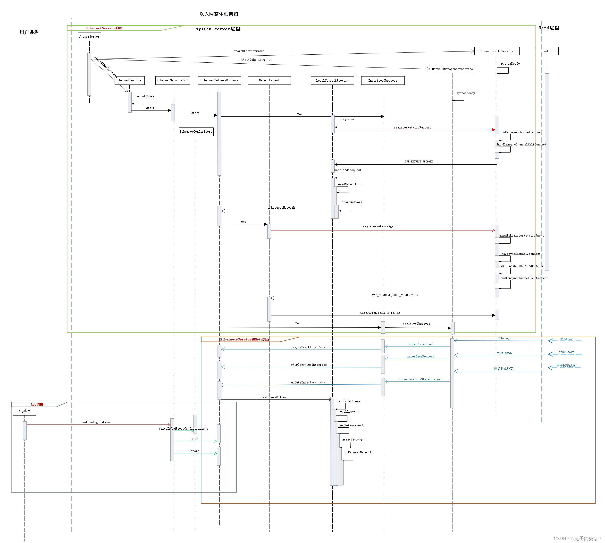
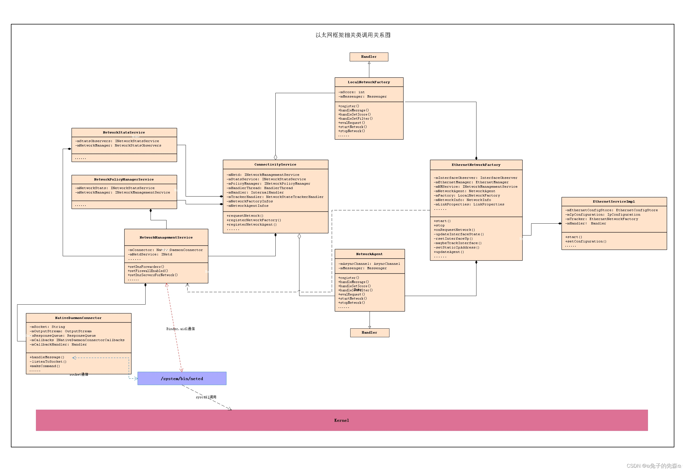

## 系统启动流程

__Linux内核启动__

上电, BootLoader 加载后, 会启动Linux内核.

内核启动, 然后设置缓存, 被保护存储器, 计划列表, 加载驱动.

完成相应的设置后, 在文件系统中寻找 `init.rc`文件, 启动 `init` 进程.

### init 启动

`init` 进程做的工作比较多，主要用来初始化和启动属性服务，也用来启动Zygote进程。

#### 入口函数

`main`在 `system/core/init/main.cpp` 中:

```cpp
int main(int argc, char** argv) {
#if __has_feature(address_sanitizer)
    __asan_set_error_report_callback(AsanReportCallback);
#endif

    if (!strcmp(basename(argv[0]), "ueventd")) {
        return ueventd_main(argc, argv);
    }

    if (argc > 1) {
        if (!strcmp(argv[1], "subcontext")) {
            android::base::InitLogging(argv, &android::base::KernelLogger);
            const BuiltinFunctionMap& function_map = GetBuiltinFunctionMap();

            return SubcontextMain(argc, argv, &function_map);
        }

        if (!strcmp(argv[1], "selinux_setup")) {
            return SetupSelinux(argv);
        }

        if (!strcmp(argv[1], "second_stage")) {
            return SecondStageMain(argc, argv);
        }
    }

    return FirstStageMain(argc, argv);
}
```


## network 框架 : Ethernet
Android 11 源码路径:

```java
frameworks/base/services/java/com/android/server:
---SystemConfigService.java
---SystemServer.java

frameworks/base/core/java/android/net/
---ConnectivityManager.java
---EthernetManager.java
---IConnectivityManager.aidl
---IEthernetManager.aidl
---LinkProperties.java
---NetworkPolicy.java
---NetworkAgent.java
---NetworkFactory.java
---NetworkInfo.java
---ProxyInfo.java

frameworks/opt/net/ethernet/java/com/android/server/ethernet/
---EthernetConfigStore.java
---EthernetNetworkFactory.java
---EthernetServiceImpl.java
---EthernetService.java
```

### Overview

整体框架图:


主要涉及以下三个方面:
* EthenetService 启动和注册流程
* 应用层调用的相关功能接口
* 与Netd, ConnectivityService 的交互

调用类图如下:



### 基本Android以太网知识

#### Android Framework中网络相关的Service
* ConnectivityService
系统网络连接管理服务，
也是整个整个Android Framework层网络框架的核心类。
主要处理APP网络监听和请求，通知网络变化；
处理WiFi/Telephony/Ethernet等各个链路的网络注册，更新链路信息；
网络检测/评分与网络选择。

* NetworkPolicyManagerService
网络策略管理服务，
这些策略一般指对APP的网络和限制和放行，通过netfilter来实现。

* NetworkStatsService
收集网络数据，
如各个Iface上下行网络流量的字节数等。
APP或者其他服务可以通过该服务获取网络流量信息等。

* NetworkManagementService
网络管理服务，
NetworkManagementService为ConnectivityService和其他Framework中的服务建立了与Netd之间通信的渠道，
NetworkPolicyManagerService对各个UID的策略最终都会通过 NetworkManagementService向Netd发送；
另外，NetworkManagementService还会监听Netd服务的状态，处理Socket返回的消息，
如 Bandwidth/Iface/Route/Address/Dns Server等的变化，同时将这些变化通知“感兴趣”的模块。

#### Netd
Android网络的管理和控制。
* 监听Kernel消息并通知NMPS；
* 防火墙设置（Firewall）；
* 处理网络地址转换（NAT）；
* 进行网络共享配置（Tethering，如softap，usb网络共享）等

### EthernetService 

#### 启动
`EthernetService` 在 `system_server` 进程的 `startOtherServices` 的方法中启动，

源码路径: `frameworks/base/services/java/com/android/server/SystemServer.java`

```java
public final class SystemServer {
// ...
    private static final String ETHERNET_SERVICE_CLASS =
            "com.android.server.ethernet.EthernetService";
// ...

    public static void main(String[] args) {
        new SystemServer().run();
    }

    public SystemServer() { //... }

    private void run() { //... }

    private void startOtherServices(@NonNull TimingsTraceAndSlog t) {
        if (mPackageManager.hasSystemFeature(PackageManager.FEATURE_ETHERNET) ||
        mPackageManager.hasSystemFeature(PackageManager.FEATURE_USB_HOST)) {
            t.traceBegin("StartEthernet");
            mSystemServiceManager.startService(ETHERNET_SERVICE_CLASS);
            t.traceEnd();
        }
    }
}
```
Android 的 feather 特性通常定义在 `frameworks/native/data/etc` 中，
这里借助 `SystemServiceManager` 的 `startService` 方法通过类名启动了 `EthernetService` 服务

#### EthernetService
源码路径: `/home/jshen14/D511/frameworks/opt/net/ethernet/java/com/android/server/ethernet`

实现代码: 

```Java
public final class EthernetService extends SystemService {

    private static final String TAG = "EthernetService";
    final EthernetServiceImpl mImpl;

    public EthernetService(Context context) {
        super(context);
        mImpl = new EthernetServiceImpl(context);
    }

    @Override
    public void onStart() {
        Log.i(TAG, "Registering service " + Context.ETHERNET_SERVICE);
        publishBinderService(Context.ETHERNET_SERVICE, mImpl);
    }

    @Override
    public void onBootPhase(int phase) {
        if (phase == SystemService.PHASE_SYSTEM_SERVICES_READY) {
            mImpl.start();
        }
    }
}
```

`EthernetService` 被调用的时候创建 `EthernetServiceImpl` 对象, 它是 `EthernetManager` 的Binde服务端。
再调用 `EthernetService `的 `onStart()`方法后，会将该服务注册到 `ServiceManager` 中以供客户端使用。
至此用户可以通过对外暴露的 `EthernetManager` 接口使用以太网相关的服务了，而这里的 `EthernetServiceImpl` 又像 `EthernetManager` 提供服务，
并且最终 `EthernetServiceImpl` 又讲相关的事务委托给 `EthernetNetworkFactory` 来包揽所有的以太网网络管理操作。 

`onBootPhase() `可以在boot的各个阶段被调用。
在 `EthernetService` 中，当系统处于 `PHASE_SYSTEM_SERVICES_READY` 阶段时，
会调用 `EthernetServiceImpl.start()` 方法，做一些Ethernet的初始化工作，此处即启动 `EthernetServiceImpl` 服务


#### EthernetServiceImpl

源码路径为 `frameworks/base/services/java/com/android/server/EthernetServiceImpl.java`

```java
public class EthernetServiceImpl extends IEthernetManager.Stub {
    private static final String TAG = "EthernetServiceImpl";

    private final Context mContext;
    private final AtomicBoolean mStarted = new AtomicBoolean(false);

    private Handler mHandler;
    private EthernetTracker mTracker;

    public EthernetServiceImpl(Context context) {
        mContext = context;
    }

    private void enforceAccessPermission() {
    }

    private void enforceUseRestrictedNetworksPermission() {
    }

    private boolean checkUseRestrictedNetworksPermission() {
    }

    public void start() {
    }

    @Override
    public String[] getAvailableInterfaces() throws RemoteException {
        return mTracker.getInterfaces(checkUseRestrictedNetworksPermission());
    }

    /**
     * Get Ethernet configuration
     * @return the Ethernet Configuration, contained in {@link IpConfiguration}.
     */
    @Override
    public IpConfiguration getConfiguration(String iface) {
    }

    /**
     * Set Ethernet configuration
     */
    @Override
    public void setConfiguration(String iface, IpConfiguration config) {
    }

    /**
     * Indicates whether given interface is available.
     */
    @Override
    public boolean isAvailable(String iface) {
    }

    /**
     * Adds a listener.
     * @param listener A {@link IEthernetServiceListener} to add.
     */
    public void addListener(IEthernetServiceListener listener) {
    }

    /**
     * Removes a listener.
     * @param listener A {@link IEthernetServiceListener} to remove.
     */
    public void removeListener(IEthernetServiceListener listener) {
    }

    @Override
    public void setIncludeTestInterfaces(boolean include) {
    }

    @Override
    public void requestTetheredInterface(ITetheredInterfaceCallback callback) {
    }

    @Override
    public void releaseTetheredInterface(ITetheredInterfaceCallback callback) {
    }

    @Override
    protected void dump(FileDescriptor fd, PrintWriter writer, String[] args) {
    }
}
```


