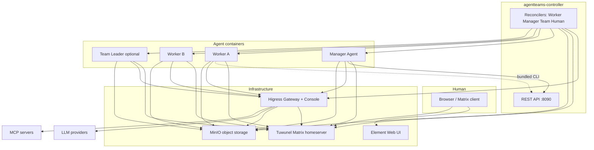
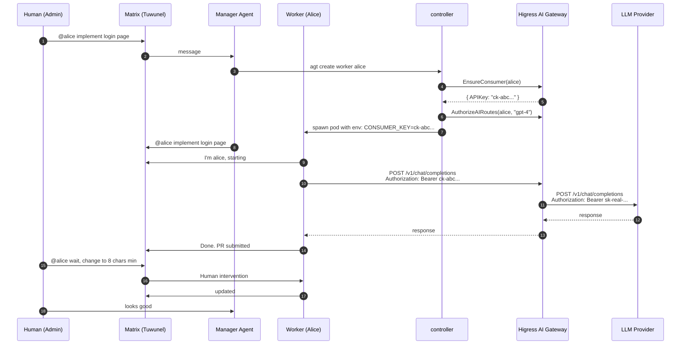

# AgentTeams 深度分析 · 跟 agentgateway 的交叉视图

> **仓库**：[agentscope-ai/AgentTeams](https://github.com/agentscope-ai/AgentTeams)（克隆于 2026-08-05）
> **关联**：本仓库是阿里通义实验室 AgentScope 生态中的**多 Agent 编排平台**，<strong>深度集成前两轮分析的 agentgateway（作为 Higress AI Gateway）</strong>。
> **核心视角**：把 AgentTeams 当成 "agentgateway 之上的企业级多 Agent 编排与凭据供给层"，<strong>用三轮分析累积的视角交叉看</strong>。
> **NIO 场景关联**：座舱 8295+QTEE / 智驾 Orin+OP-TEE / 车控 S32G+OP-TEE+HSM、30B~0.1B 多 LLM、离线优先、车控 50Hz、ASIL-D。

---

## 目录

- [一、关键发现：AgentTeams ⊕ agentgateway 是同一生态的上下层](#一关键发现agentteams--agentgateway-是同一生态的上下层)
- [二、AgentTeams 顶层架构：Manager-Workers + 多 Runtime](#二agentteams-顶层架构manager-workers--多-runtime)
- [三、K8s CRD 体系：Worker / Manager / Team / Human](#三k8s-crd-体系worker--manager--team--human)
- [四、AuthN 三层防线：SA Token → OIDC → Matrix AppService](#四authn-三层防线sa-token--oidc--matrix-appservice)
- [五、AuthZ 引擎：4 角色 × 6 资源 × 12 动作](#五authz-引擎4-角色--6-资源--12-动作)
- [六、凭据安全模型：Consumer Token 模式](#六凭据安全模型consumer-token-模式)
- [七、身份系统：4 种 IdentitySource 实现](#七身份系统4-种-identitysource-实现)
- [八、AgentTeams ↔ agentgateway 集成点（核心交叉）](#八agentteams--agentgateway-集成点核心交叉)
- [九、Manager 编排模式：Human-in-the-Loop by Default](#九manager-编排模式human-in-the-loop-by-default)
- [十、对 NIO 车端 AI Agent 安全的可借鉴点](#十对-nio-车端-ai-agent-安全的可借鉴点)
- [十一、已知风险与坑](#十一已知风险与坑)
- [附录 A：关键源码索引](#附录-a关键源码索引)

---

## 一、关键发现：AgentTeams ⊕ agentgateway 是同一生态的上下层

> **最大洞见**：前两轮分析的 `agentgateway`（agentgateway/agentgateway）项目，<strong>就是 AgentTeams README 反复提到的 "Higress AI Gateway"</strong>。

证据链：

| AgentTeams 描述 | 对应 agentgateway 实现 |
|---|---|
| "Higress AI Gateway" | `agentgateway/agentgateway`（Rust workspace，14 crate） |
| "OpenAI-compatible routes through Higress" | `crates/llm/` + `crates/agentgateway/src/types/agent.rs:2690-2717` |
| "per-identity consumer key auth" | `crates/agentgateway/src/http/auth/` (JWT/Basic/APIKey) |
| "MCP servers" + "McpAuthentication" | `crates/agentgateway/src/mcp/auth.rs` (1096 行) |
| "agent card discovery" | `crates/agentgateway/src/a2a/mod.rs` (222 行) |
| "Bearer token + gateway consumer key" | `crates/agentgateway/src/http/auth/jwt.rs:550`（删除透传 token） |
| "Token Exchange / CrossAppAccess" | `crates/agentgateway/src/http/auth/oauth/cross_app_access.rs` |

**结论**：AgentTeams 解决"多 Agent 编排 + K8s 生命周期 + Matrix 通信 + 凭据注入"，而 agentgateway 解决"<strong>AI 协议层流量治理 + 鉴权 + 可观测</strong>"。两者是一体的——AgentTeams controller 调 agentgateway 的 API 来发凭据、配 consumer、配 MCP route。

---

## 二、AgentTeams 顶层架构：Manager-Workers + 多 Runtime

### 2.1 核心组件（`docs/architecture.md:9-15`）

| 层 | 角色 | 镜像 |
|---|---|---|
| **agentteams-controller** | Go operator：调谐 Worker/Manager/Team/Human CRD；REST API；worker/manager 生命周期；gateway consumer 配置；cloud 凭据供给 | `agentteams-controller` (K8s) 或 `agentteams-controller-embedded` (local) |
| **Manager** | 协调 agent：管理 tasks/workers/teams/humans/Higress routes/MCP | `agentteams-manager` (OpenClaw) 或 `agentteams-manager-qwenpaw` (QwenPaw) |
| **Worker** | 任务执行器：每个 worker 一个容器，按需创建；无状态；配置和工件在对象存储 | `agentteams-worker` (OpenClaw) / `agentteams-copaw-worker` / `agentteams-hermes-worker` |

### 2.2 完整组件图（来自 `docs/architecture.md`）



### 2.3 三大 Worker Runtime

| Runtime | 栈 | 角色 | 关键文件 |
|---|---|---|---|
| **OpenClaw** (默认) | Node.js / OpenClaw | 主 worker 路径；mcporter 通过 Higress 调用 MCP | `worker/Dockerfile`, `worker/scripts/worker-entrypoint.sh` |
| **QwenPaw/CoPaw** | Python / QwenPaw | 替代 worker runtime；Matrix via QwenPaw channels | `copaw/src/copaw_worker/`, `copaw-worker` on PyPI |
| **Hermes** | Python / hermes-worker | Matrix worker runtime + 策略/配置树 | `hermes/src/` (`hermes_worker`, `hermes_matrix`, CLI) |
| **OpenHuman** | Rust + native Matrix | Worker-only, `channel-matrix` feature flag | `openhuman/Dockerfile` (multi-stage rust:1.93-bookworm) |

Manager 启动方式：

```bash
AGENTTEAMS_MANAGER_RUNTIME=openclaw  # Node/OpenClaw gateway（默认）
AGENTTEAMS_MANAGER_RUNTIME=qwenpaw   # Python QwenPaw workspace（默认）
```

### 2.4 关键设计：**Manager 不接触真实密钥**

`README.md:350-358` 的核心安全模型：

```
Worker (consumer token only)
    → Higress AI Gateway (holds real API keys, GitHub PAT)
        → LLM API / GitHub API / MCP Servers
```

> "Workers see only their consumer token. The gateway handles all real credentials. The Manager knows what Workers are doing but never touches the actual keys."

这是车端最重要的设计模式 ——<strong> Worker 的攻击面 = consumer token</strong>，真实 LLM key 永远留在 gateway 侧。

---

## 三、K8s CRD 体系：Worker / Manager / Team / Human

### 3.1 4 个 CRD（`api/v1beta1/types.go`）

| CRD | 关键 Spec 字段 | 状态字段 | 总行数 |
|---|---|---|---|
| **Worker** (171-261) | `model`, `runtime`, `image`, `skills`, `mcpServers`, `expose`, `channelPolicy`, `state`, `accessEntries` | `matrixUserID`, `roomID`, `phase`, `containerState`, `lastHeartbeat`, `exposedPorts` | 90 行 |
| **Manager** (629-669) | `model`, `runtime`, `image`, `soul`, `agents`, `skills`, `mcpServers`, `config` (heartbeat/workerIdle/notify) | `matrixUserID`, `roomID`, `version`, `welcomeSent` | 40 行 |
| **Team** (417-445) | `teamName`, `admin`, `workerMembers[]`, `peerMentions`, `channelPolicy`, `heartbeatEvery` | `teamRoomID`, `leaderDMRoomID`, `leaderReady`, `readyWorkers` | 28 行 |
| **Human** (572-588) | `displayName`, `username`, `email`, `permissionLevel`, `accessibleTeams`, `accessibleWorkers`, `identitySource` | `matrixUserID`, `initialPassword` (一次性), `emailSent`, `rooms` | 16 行 |

### 3.2 核心抽象

**AccessEntry**（types.go:64-68）—— cloud 凭据供给：
```go
type AccessEntry struct {
    Service     string                `json:"service"`     // "object-storage" | "ai-gateway" | "ai-registry"
    Permissions []string              `json:"permissions,omitempty"`
    Scope       *apiextensionsv1.JSON `json:"scope,omitempty"`  // schema-less JSON, ${self.name} 模板变量
}
```

**AgentIdentitySpec**（types.go:72-74）—— workload identity 桥接：
```go
type AgentIdentitySpec struct {
    WorkloadIdentityName string  // 关联 K8s service account 或外部 ID
}
```

**CredentialBinding**（types.go:85-88）—— Worker 用的运行时凭据：
```go
type CredentialBinding struct {
    CredentialRef CredentialRef  // 引用 tokenVault / apiKeyCredentialProvider，不携带明文
    ToolWhitelist []string       // 工具白名单
}
```

**ChannelPolicy**（types.go:352-357）—— 通信策略：
```go
type ChannelPolicySpec struct {
    GroupAllowExtra []string  // 群组允许列表（追加）
    GroupDenyExtra  []string  // 群组拒绝列表
    DmAllowExtra    []string  // DM 允许列表
    DmDenyExtra     []string  // DM 拒绝列表
}
```

**关键注释**（types.go:55-63）：
> "AccessEntry is only honored when the controller runs with a credential-provider sidecar. In local higress+minio deployments the field is accepted by the CRD but not read by the controller."

—— 字段在 K8s 模式才生效，local Docker 模式被忽略。

### 3.3 关键 Label / Annotation

```go
LabelController     = "agentteams.io/controller"  // 多 controller 隔离
LabelWorker         = "agentteams.io/worker"
LabelManager        = "agentteams.io/manager"
LabelRole           = "agentteams.io/role"
LabelRuntime        = "agentteams.io/runtime"
LabelWorkerSvcName  = "agentteams.io/worker-svc-name"  // ClusterIP Service
LabelWorkerEdgeUUID = "agentteams.io/worker-edge-uuid"  // Edge 模式 UUID

AnnotationEdgeAppliedUUID = "agentteams.io/edge-applied-uuid"  // 凭据轮换检测
AnnotationWorkerTeamName  = "agentteams.io/team-name"          // team 作用域
```

**`AnnotationEdgeAppliedUUID` 关键设计**（types.go:40-44）：

> "tracks the UUID that was last used to issue an SA token, used for rotation detection. When the current LabelWorkerEdgeUUID differs from this annotation, the controller re-issues credentials and updates the annotation to match."

—— 凭据轮换是**显式**的，不是隐式的。

---

## 四、AuthN 三层防线：SA Token → OIDC → Matrix AppService

### 4.1 第一层：K8s ServiceAccount Token（`auth/authenticator.go`）

**`CallerIdentity` 结构**（authenticator.go:33-41）：

```go
type CallerIdentity struct {
    Role                    string  // admin | manager | team-leader | worker
    Username                string  // canonical name
    Team                    string  // team name
    WorkerName              string  // == Username when worker/team-leader
    ServiceAccountNamespace string  // 来自 SA token
    ServiceAccountName      string
}
```

**TokenReviewAuthenticator**（authenticator.go:55-65）：
- 调 K8s `TokenReview` API 验证 SA token
- 缓存：1000 entries / 5min TTL / 1min cleanup
- cacheMax 触发 → sweep expired → LRU evict（防 DoS）
- **adversarial input 防护**：用 SHA-256(token) 作 key

### 4.2 第二层：OIDC（Keycloak / 自托管）—— Human 身份

`humanidentity/externalsso/source.go` —— OIDC SSO 实现。
`humanidentity/legacypassword/source.go` —— 旧密码实现。

**核心契约**（`identity_source.go:85-129`）：

```go
type IdentitySource interface {
    Key() string                                                          // 注册键
    DeriveMatrixUserID(spec, metadataName) (string, error)                // 纯函数, 跨进程一致
    EnsurePrecreated(ctx, spec, metadataName) (Credentials, error)        // 创建/识别
    ManagesInitialPassword() bool                                          // 是否管密码
    EnsureUserToken(ctx, spec, status, metadataName) (string, error)        // 拿 fresh token
    EnsureDeactivated(ctx, spec, status) error                              // 清理
}
```

**关键安全设计**（identity_source.go:107-115）——**defence-in-depth 双重门**：

> "When true, the reconciler will persist Credentials.Password into Status.InitialPassword on first creation; when false it will not, regardless of what Credentials.Password contains. The double-gate is a defence-in-depth check: a buggy implementation that returns a non-empty Password while reporting ManagesInitialPassword=false still does not leak the password into Status."

—— 即使 SSO 实现 bug 误返回密码，只要它声明 `ManagesInitialPassword=false`，Status 也不会泄露。

### 4.3 第三层：Matrix AppService（`matrix/appservice.go`）

**RenderAppServiceRegistration** 把 controller 注册为 Matrix App Service：

```go
// types.go:30-32 - 默认 namespace
userRegex := cfg.AppServiceUserNamespaceRegex
if userRegex == "" {
    userRegex = fmt.Sprintf("@.*:%s", domain)  // ← 默认: 整个 homeserver namespace
}
```

**关键安全警告**（appservice.go:14-29）：

> "By default the registration claims the exclusive `@.*:<domain>` user namespace, which means the as_token can impersonate EVERY local user on the homeserver. This is only safe when the homeserver is exclusively AgentTeams-managed.

> **DO NOT enable AppService mode against a shared or pre-existing homeserver that also hosts non-AgentTeams users.** Doing so would let the as_token impersonate those users. Instead set `AGENTTEAMS_MATRIX_APPSERVICE_USER_NAMESPACE_REGEX` to a restrictive regex (e.g. `@agentteams-.*:<domain>`)."

**车端警示**：如果车端用 Matrix，**必须**配 restrictive regex（`@nio-.*`），否则 AppService 模式会被反向利用。

**`RenderAppServiceRegistration` 完整设计**：

```go
return AppServiceRegistration{
    ID:              cfg.AppServiceID,
    URL:             pushURL,  // nil = passwordless-only
    ASToken:         cfg.AppServiceToken,  // never logged
    HSToken:         cfg.AppServiceHSToken,  // reserved
    SenderLocalpart: cfg.AppServiceSenderLocalpart,
    RateLimited:     false,
    Namespaces: AppServiceNamespaces{
        Users:   []AppServiceNamespace{{Exclusive: true, Regex: userRegex}},
        Aliases: []AppServiceNamespace{{Exclusive: false, Regex: fmt.Sprintf("#agentteams-.*:%s", domain)}},
        Rooms:   []AppServiceNamespace{},
    },
}
```

### 4.4 三层防线的串联

```
请求进入 controller
  ↓
1. SA Token 验证 (TokenReview API)
  ↓ 解析 SA username
  ↓
2. CallerIdentity (Role: admin/manager/team-leader/worker)
  ↓
3. 检查目标资源类型 + action → Authorize()
  ↓
4. 检查 team membership / self-only
  ↓
5. 调 Matrix 调谐用户/房间（如 human 创建/邀请）
  ↓
6. 调 Higress AI Gateway 配 consumer / authorize AI route
```

---

## 五、AuthZ 引擎：4 角色 × 6 资源 × 12 动作

### 5.1 完整权限矩阵（`auth/authorizer.go:39-141`）

```go
const (
    ActionCreate             = "create"
    ActionUpdate             = "update"
    ActionDelete             = "delete"
    ActionGet                = "get"
    ActionList               = "list"
    ActionWake               = "wake"
    ActionSleep              = "sleep"
    ActionEnsureReady        = "ensure-ready"
    ActionReady              = "ready"
    ActionSTS                = "sts"
    ActionStatus             = "status"
    ActionRefreshMatrixToken = "refresh-matrix-token"
    ActionGateway            = "gateway"
)
```

| Role \ Resource | status | worker (self) | worker (other) | team | credentials (STS) | credentials (其他) |
|---|---|---|---|---|---|---|
| **admin / manager** | ✅ | ✅ | ✅ | ✅ | ✅ | ✅ |
| **team-leader** | ✅ | ❌ 需同 team | ❌ | GET/LIST only | ✅ (self-scoped) | ❌ |
| **worker** | ✅ | ✅ | ❌ | ❌ | ✅ (self) | ❌ |

**关键设计原则**（authorizer.go:75-83）：

> "Credential endpoints (STS + Matrix token refresh) are always self-scoped: the issued token / refreshed credential is bound to the calling identity, and these routes never embed a target ResourceName, so no requireSelf check is needed."

—— 凭据端点**严格自约束**，永远不能代表别人。

### 5.2 跨 team 防护（authorizer.go:143-152）

```go
func (a *Authorizer) requireSameTeam(caller, req) error {
    if caller.Team == "" {
        return fmt.Errorf("authorization denied: team-leader %q has no team", caller.Username)
    }
    if req.ResourceTeam != "" && req.ResourceTeam != caller.Team {
        return fmt.Errorf("authorization denied: team-leader %q (team %s) cannot access resource in team %s",
            caller.Username, caller.Team, req.ResourceTeam)
    }
    return nil
}
```

### 5.3 错误信息（authorizer.go:163-165）

```go
return fmt.Errorf("authorization denied: %s %q cannot %s %s",
    caller.Role, caller.Username, req.Action, req.ResourceKind)
```

—— 错误信息明确暴露 role + username + action + resource（<strong>审计友好</strong>），但<strong>没有暴露敏感数据</strong>。

### 5.4 中间件模式（`auth/middleware.go`）

`middleware.go` 174 行 —— 把 authenticator + authorizer 串成 HTTP 中间件，每个 API 请求自动鉴权。

---

## 六、凭据安全模型：Consumer Token 模式

### 6.1 核心思想

`README.md:350-358` 的关键图：

```
Worker (consumer token only)
    → Higress AI Gateway (holds real API keys, GitHub PAT)
        → LLM API / GitHub API / MCP Servers
```

**Worker 永远看不到 LLM 真实 API key**。

### 6.2 凭据供给实现（`gateway/higress.go:140-168`）

**`EnsureConsumer`**：给每个 Worker 创建 Higress consumer + 颁发 API key：

```go
func (c *HigressClient) EnsureConsumer(ctx, req ConsumerRequest) (*ConsumerResult, error) {
    body := map[string]interface{}{
        "name": req.Name,  // 形如 "agentteams-worker-alice"
        "credentials": []map[string]interface{}{
            {
                "type":   "key-auth",     // ← key-auth 类型
                "source": "BEARER",       // ← Bearer token
                "values": []string{req.CredentialKey},  // ← consumer-level key
            },
        },
    }
    _, statusCode, err := c.doJSON(ctx, http.MethodPost, "/v1/consumers", body)
    // ...
    return &ConsumerResult{Status: status, APIKey: req.CredentialKey}, nil
}
```

**`AuthorizeAIRoutes`**：把 consumer 加入 AI route 的 allowedConsumers：

```go
func (c *HigressClient) AuthorizeAIRoutes(ctx, consumerName, modelAPIID) error {
    return c.modifyAIRoutes(ctx, consumerName, modelAPIID, true)
}

func (c *HigressClient) modifyAIRoutes(ctx, consumerName, modelAPIID, add bool) error {
    respBody, statusCode, err := c.doJSON(ctx, http.MethodGet, "/v1/ai/routes", nil)
    // 遍历 routes, 修改 allowedConsumers
    // ...
}
```

### 6.3 双 gateway 实现（`gateway/aigateway.go`）

`AIGatewayClient` 是阿里云 APIG 实现，**跟 `HigressClient` 实现同样的 `gateway.Client` 接口**：

```go
// aigateway.go:48-60
// Only the consumer-oriented operations (EnsureConsumer, DeleteConsumer,
// AuthorizeAIRoutes, DeauthorizeAIRoutes) are functional. Route and
// provider initialization is the responsibility of the APIG platform...
//
// K4 decision: cloud failures should not silently degrade.
type AIGatewayClient struct {
    config AIGatewayConfig
    client apigClient  // 阿里云 APIG SDK
}
```

**关键安全洞警告**（aigateway.go:16-21）：

> "ErrUnsupportedOp is returned by AIGatewayClient for operations that only make sense on a self-hosted gateway. On Alibaba Cloud AI Gateway these resources are provisioned out-of-band through the APIG console or Terraform and the agentteams control plane must not try to create them itself."

—— 云端模式必须 fail-fast，**不能静默降级**（K4 设计原则：cloud failures should not silently degrade）。

### 6.4 凭据轮换检测（types.go:40-44）

```go
const AnnotationEdgeAppliedUUID = "agentteams.io/edge-applied-uuid"
// tracks the UUID that was last used to issue an SA token, used for rotation detection.
// When the current LabelWorkerEdgeUUID differs from this annotation, the controller
// re-issues credentials and updates the annotation to match.
```

—— 凭据轮换是**显式、幂等、可观测**的。

---

## 七、身份系统：4 种 IdentitySource 实现

### 7.1 IdentitySource 接口（`humanidentity/identity_source.go:85-129`）

接口设计原则（注释 4-30）：

> "The HumanReconciler main loop must NOT branch on identity type. All differences ... are expressed as different return values from a single uniform interface.
>
> The controller code must NOT name any specific identity provider. Implementations are keyed by the protocol-layer abstraction they implement.
>
> Adding a new identity protocol must be additive: drop a new file with an init() that calls Register, and the main loop picks it up unchanged."

—— <strong>plugin 模式 + 协议层抽象</strong>，加新协议零侵入。

### 7.2 现有实现

```go
const (
    KeyLegacyPassword = "legacy_password"  // 旧 Matrix 密码流
    KeyExternalSSO    = "external_sso"     // hash-rendezvous OIDC/SAML 流
)
```

### 7.3 `ResolvedIdentity`（types.go:67-75）

```go
type ResolvedIdentity struct {
    Source                 IdentitySource
    MatrixUserID           string                  // 全 MXID
    MatrixLocalpart        string
    ManagesInitialPassword bool                    // ← 关键双重门
}
```

### 7.4 credential 设计（types.go:42-60）

```go
type Credentials struct {
    UserID      string  // 完整 MXID
    AccessToken string
    Password    string  // ONLY when ManagesInitialPassword() returns true AND new account created
    Created     bool    // true if newly created, false if existing user logged in
}
```

### 7.5 Human 房间管理（`human_reconcile_rooms.go`）

**关键设计 —— 懒加载 token**（注释 95-101）：

> "every Login call creates a new device session on Tuwunel ... so issuing a Login on every 5-minute requeue would accumulate ~288 orphan devices per human per day. By gating the Login behind 'we actually have a new room to /join', a Human whose spec is quiescent triggers zero Logins regardless of requeue cadence."

—— 5 分钟 reconcile 周期不触发 login，<strong>避免设备会话膨胀</strong>。

**Admin 总是有 visibility**（team_controller.go:55-59）：

> "SystemAdminUser is the global system admin username (from AGENTTEAMS_ADMIN_USER). Resolved to a full Matrix user ID and always included in every worker's allowlist so the operator admin retains visibility regardless of team membership."

—— 即使 worker/team 改了 policy，<strong>admin 永远在 allowlist</strong>。

---

## 八、AgentTeams ↔ agentgateway 集成点（核心交叉）

### 8.1 5 个集成维度

| 维度 | AgentTeams 调 agentgateway | agentgateway 提供的原语 |
|---|---|---|
| **凭据注入** | `EnsureConsumer` 创建 consumer-level API key | `BackendAuth::Key` 接收 secret 注入 header |
| **路由授权** | `AuthorizeAIRoutes` 把 consumer 加到 `allowedConsumers` | `HTTPAuthorizationSet` (RBAC + CEL) |
| **MCP 暴露** | `mcpServers[].url = gw/mcp-servers/<name>/mcp` | `MCP gateway` + `McpAuthentication` (6 IDP) |
| **A2A 暴露** | 通过 gateway 暴露 worker 端口（`spec.expose[].port`） | `A2aPolicy` + agent card URL 重写 |
| **可观测** | 通过 Higress 拿到 LLM/MCP metrics | OTLP trace + access log + dtrace |

### 8.2 MCP 集成的完整链路

**AgentTeams 端**（`agentconfig/mcporter.go:10-11`）：

```go
// GenerateMcporterConfig produces mcporter-servers.json content for a worker or
// manager's MCP servers. Each entry's URL is used verbatim (the CRD carries the
// gateway URL pattern).
```

→ 生成 `mcporter-servers.json` 注入到 worker

**agentgateway 端**（`crates/agentgateway/src/mcp/auth.rs:73-146`）：

```go
pub async fn handle_mcp_request(req, auth, client) -> Result<...> {
    match req.uri().path() {
        path if path == "/.well-known/oauth-protected-resource" => protected_resource_metadata(...),
        path if path == "/.well-known/oauth-authorization-server" => authorization_server_metadata(...),
        path if path.ends_with("/client-registration") => client_registration(...),
        _ => Ok(None),  // 透传到上游 MCP server
    }
}
```

→ agentgateway 作为 MCP Resource Server，<strong>完整实现 RFC 9728 / 8414 / 7591 / 7636</strong>。

### 8.3 关键注释（types.go:90-101）

```go
// The controller translates this slice directly into mcporter-servers.json and
// injects an Authorization: Bearer <consumer-key> header using the same
// gateway consumer key the agent uses for LLM access. The controller does not
// perform any gateway-side authorization for MCP servers — upstream access
// control is the gateway operator's responsibility (or, for local Higress
// deployments, handled out-of-band by Manager skills).
```

—— Worker 用**同一个 consumer key** 同时调 LLM 和 MCP，<strong>统一身份</strong>。

### 8.4 完整鉴权时序



---

## 九、Manager 编排模式：Human-in-the-Loop by Default

### 9.1 真实场景（README.md:326-337）

```
You: Create a Worker named alice for frontend development

Manager: Done. Worker alice is ready.
         Room: Worker: Alice
         Tell alice what to build.

You: @alice implement a login page with React

Alice: On it... [a few minutes later]
       Done. PR submitted: https://github.com/xxx/pull/1
```

→ 任何 Worker/Team 都有专属 Matrix 房间，<strong>人类随时能介入</strong>。

### 9.2 Manager 与 Team Leader 区别

| 角色 | 用途 | 房间 |
|---|---|---|
| **Manager** | 顶层协调者（OpenClaw/QwenPaw） | 跟 Human admin 的 DM |
| **Team Leader** | Team 内协调者（worker 角色 + team_leader role） | team 房间 + DM 到 admin |
| **Worker** | 任务执行器 | 1:1 房间跟 Manager + Team Leader |

### 9.3 关键设计

- `ChannelPolicySpec` —— 4 维 allow/deny 列表（group + DM）
- `SystemAdminUser` 永远在 allowlist
- `peerMentions` —— Team 内成员可以 @ 互相
- 任何房间都是同一个 Matrix room，**可观测**

### 9.4 跟车端"硬实时 + 鉴权"的冲突

**车端挑战**：车控 50Hz 不可能让人介入每个决策。

**AgentTeams 模式可以借鉴的部分**：
- ✅ 凭据注入（Worker → Gateway 模式）
- ✅ 多 Runtime 选型（OpenClaw/QwenPaw/Hermes）
- ✅ CRD 声明式管理

**不能直接借鉴的部分**：
- ❌ Matrix 房间（车端不用 IM）
- ❌ 5 分钟 reconcile 周期（车控要毫秒级）
- ❌ Human-in-the-Loop by Default（车控要 fail-operational）

---

## 十、对 NIO 车端 AI Agent 安全的可借鉴点

### 10.1 直接 ship 的设计

#### ✅ **1. Consumer Token 模式（README 核心安全模型）**

车端实现：
- 智驾域 agent → consumer token (短 TTL) → Higress AI Gateway → 真实 LLM key
- 真实 API key 永远在 gateway 侧，agent 看不到
- 即使 agent 被攻破，<strong>攻击面 = consumer token</strong>，可以快速 rotate

```yaml
# 智驾域 Worker（车端简化版）
apiVersion: agentteams.io/v1beta1
kind: Worker
metadata:
  name: adas-perception-agent
spec:
  model: ada-llm-7b
  runtime: hermes  # 自主代码执行
  mcpServers:
  - name: adas-tools
    url: https://higress.nio.internal/mcp-servers/adas-tools/mcp
  accessEntries:
  - service: ai-gateway
    permissions: ["chat.completions:write"]
    scope:
      modelAPIID: "ada-llm-7b"
  state: Running
  accessEntries:
  - service: object-storage
    permissions: ["read:agents/adas-perception-agent/*"]
```

#### ✅ **2. IdentitySource 抽象（plugin 模式）**

车端实现：
- `legacy_password` → 不用
- `external_sso` → 用！OIDC + Keycloak + 车端 IdP
- 扩展：加 `vehicle_vin`（用 VIN 作为身份源）
- 扩展：加 `tee_attest`（TEE attestation 作为身份源）

```rust
// 车端扩展 IdentitySource
pub trait IdentitySource {
    fn key(&self) -> &str;
    fn derive_agent_id(&self, spec: &HumanSpec, metadata_name: &str) -> Result<String>;
    fn ensure_precreated(&self, ...) -> Result<Credentials>;
    fn manages_initial_password(&self) -> bool;  // false: TEE 不会泄露密钥
    fn ensure_user_token(&self, ...) -> Result<String>;
    fn ensure_deactivated(&self, ...) -> Result<()>;
}

// 新增: TEE attest
pub struct TeeAttestSource { ... }
impl IdentitySource for TeeAttestSource { ... }
```

#### ✅ **3. 4 角色 × N 资源 AuthZ 引擎**

车端扩展：
- 加 `vehicle_adas` / `vehicle_cockpit` / `vehicle_vc` 资源
- 加 `permission_level` 0=driver, 1=service, 2=engineer, 3=ota
- 借 `require_same_team` 实现 "智驾 agent 只能调智驾域资源"

```go
// 车端扩展
const (
    RoleDriver    = "driver"
    RoleService   = "service"
    RoleEngineer  = "engineer"
    RoleOTA       = "ota"
    RoleAgentECU  = "agent-ecu"  // 车端 agent 是 ECU
)

const (
    ResourceADASBackend    = "adas-backend"
    ResourceCockpitApp     = "cockpit-app"
    ResourceVCResource     = "vc-resource"
    ResourceCloudLLM       = "cloud-llm"
    ResourceCredential      = "credentials"
)
```

#### ✅ **4. 凭据轮换（AnnotationEdgeAppliedUUID）**

车端实现：
- `agentteams.io/vin-bound-uuid` 注解
- 每次 vehicle power cycle 重新签发
- 旧 token 通过缓存失效机制自动失效

#### ✅ **5. CRD + Reconcile 模式**

车端实现：
- `VehicleAgent` CRD（不是 Worker）
- `Reconcile` 周期：30s（不是 5min）
- 状态字段：vehicle_state, last_can_message, last_drive_cycle

### 10.2 不能直接借鉴的设计

| AgentTeams 设计 | 车端问题 | 替代方案 |
|---|---|---|
| Matrix 房间 | 车端不用 IM | 用车内 CAN/以太网总线 + dtrace |
| 5 min reconcile | 50Hz 硬实时不够 | 100ms 增量 reconcile |
| Human-in-the-Loop by Default | 50Hz 不能等 | L4 Network AuthZ + Safety fallback |
| 3 Worker Runtime | 车端只需 hermes-like | 单一 runtime + 模式切换 |
| 4 角色 RBAC | 车端有 7+ 角色（OTA/服务/驾驶员/智驾/座舱/车控/远程） | 扩展 role + 资源 |
| AppService 模式 | 车端无 Matrix | 不需要 |

### 10.3 AgentTeams 在车端的具体定位

**车端应该把 AgentTeams 当成"概念参考"而不是直接 ship**：
- ✅ 借鉴：CRD 模式、Consumer Token、IdentitySource 抽象、AuthZ 引擎
- ❌ 不用：Matrix、5 min reconcile、Human-in-the-Loop
- 🔧 改造：加车端资源（VIN/CAN/TEE）、加车规认证

---

## 十一、已知风险与坑

### 11.1 文档明确警告

| 风险 | 位置 | 缓解 |
|---|---|---|
| **AppService 默认 namespace 太宽** | `appservice.go:14-29` | 共享 homeserver 必须配 restrictive regex |
| **Higress default admin/admin 竞态** | `higress.go:62-87` | 启动时 password convergence + 重 login |
| **cloud 模式不能静默降级** | `aigateway.go:16-21` | K4 原则: fail-fast |
| **STS 凭据必须自约束** | `authorizer.go:75-83` | 路径固定用 caller.Username |
| **DingTalk 客户端凭据存在 CRD** | `types.go:363-373` | 应该有 SecretRef 替代明文（已部分实现） |

### 11.2 车端要规避的设计

| AgentTeams 设计 | 车端问题 | 替代 |
|---|---|---|
| 5 min reconcile 周期 | 50Hz 不够 | 30s/100ms 增量 |
| 房间式沟通 | 车端不用 IM | CAN + dtrace |
| `InitialPassword` 显示一次 | 一次性密码泄露风险 | 用 OIDC 一次性跳转 |
| `channelPolicy` allow/deny 列表 | 列表维护成本 | 走 CEL 表达式 |
| `state: Running/Sleeping/Stopped` | 50Hz 不能 Sleep | 加 `Active/Idle/Emergency` |
| `expose[]` 暴露端口 | 车端防火墙复杂 | 走 mTLS 内部通信 |

### 11.3 agentgateway 集成相关

| 风险 | 来源 | 缓解 |
|---|---|---|
| Worker 用同一 consumer key 调 LLM + MCP | `types.go:90-101` | 用 ExtAuthz 二次鉴权 |
| MCP 路由由 operator 控制（不在 controller） | `types.go:96-99` | 自动化 MCP 路由的审计 |
| `mcporter` 客户端可能在 agent 里做奇怪的事 | `agentconfig/mcporter.go` | 沙箱化 worker runtime |

---

## 附录 A：关键源码索引

### 核心 CRD 与类型

| 路径 | 行数 | 作用 |
|---|---|---|
| `agentteams-controller/api/v1beta1/types.go` | 712 | **4 个 CRD + 14 个辅助类型** |
| `agentteams-controller/api/v1beta1/register.go` | - | CRD 注册 |
| `agentteams-controller/api/v1beta1/zz_generated.deepcopy.go` | - | 自动生成的 DeepCopy |

### AuthN / AuthZ

| 路径 | 行数 | 作用 |
|---|---|---|
| `internal/auth/authenticator.go` | 219 | **K8s TokenReview authenticator**（含 LRU 缓存） |
| `internal/auth/authorizer.go` | 165 | **4 角色 RBAC 引擎** |
| `internal/auth/middleware.go` | 174 | HTTP 中间件集成 |
| `internal/auth/enricher.go` | 101 | 把 CallerIdentity 扩展到下游 |
| `internal/auth/prefix.go` | 155 | SA username 解析为 ResourcePrefix |

### 身份系统

| 路径 | 行数 | 作用 |
|---|---|---|
| `internal/controller/humanidentity/identity_source.go` | 237 | **IdentitySource 接口契约** |
| `internal/controller/humanidentity/externalsso/source.go` | 125 | OIDC/SAML SSO 实现 |
| `internal/controller/humanidentity/legacypassword/source.go` | - | 旧密码实现 |

### 矩阵 / 房间

| 路径 | 行数 | 作用 |
|---|---|---|
| `internal/matrix/client.go` | 1,195 | **完整 Matrix CS API 客户端** |
| `internal/matrix/types.go` | 136 | Matrix 类型 + Config |
| `internal/matrix/appservice.go` | 133 | **AppService 模式 + 命名空间安全警告** |

### 控制器

| 路径 | 行数 | 作用 |
|---|---|---|
| `internal/controller/worker_controller.go` | 991+ | **Worker Reconcile 主循环** |
| `internal/controller/team_controller.go` | 1,334 | **Team + Members Reconcile** |
| `internal/controller/manager_controller.go` | - | Manager Reconcile |
| `internal/controller/human_controller.go` | 158 | Human 主循环 |
| `internal/controller/human_reconcile_infra.go` | 93 | **Human 一次性密码 + 防止 login 累积** |
| `internal/controller/human_reconcile_rooms.go` | 125 | **Human 房间管理 + 懒加载 token** |
| `internal/controller/human_reconcile_delete.go` | 52 | Human 清理 |
| `internal/controller/auto_sleep_controller.go` | - | Worker 自动睡眠 |

### Gateway 集成

| 路径 | 行数 | 作用 |
|---|---|---|
| `internal/gateway/higress.go` | 825 | **Higress Client（自托管）** |
| `internal/gateway/aigateway.go` | 462 | **Alibaba Cloud APIG Client（托管）** |
| `internal/gateway/types.go` | 69 | Consumer / ConsumerRequest 类型 |
| `internal/gateway/client.go` | 63 | gateway.Client 接口 |

### 部署

| 路径 | 作用 |
|---|---|
| `helm/agentteams/` | **K8s Helm chart**（含 Higress、Tuwunel、MinIO、controller、Manager CR） |
| `install/agentteams-install.sh` | local Docker Compose 安装 |
| `Makefile` | 统一 build/test/push 入口 |

### 镜像与 Runtime

| 路径 | 作用 |
|---|---|
| `manager/Dockerfile` | OpenClaw Manager 镜像 |
| `manager/Dockerfile.qwenpaw` | QwenPaw Manager 镜像 |
| `manager/agent/` | 16 个 Manager skills + 4 个 worker 模板 |
| `copaw/` | CoPaw Python package (PyPI) |
| `hermes/` | Hermes Python package |
| `openhuman/` | Rust worker + native Matrix |
| `openclaw-base/` | Ubuntu + Node.js + mcporter 基础镜像 |

### 文档与设计

| 路径 | 作用 |
|---|---|
| `docs/architecture.md` | **完整架构文档**（含 mermaid 图） |
| `docs/k8s-native-agent-orch.md` | K8s 原生编排 |
| `docs/declarative-resource-management.md` | 声明式资源管理 |
| `design/design.md` | 完整产品设计 |
| `AGENTS.md` | 281 行 AI Agent / 开发者导航 |
| `blog/` | 5+ 篇 release notes |

### 与 agentgateway 交叉点

| AgentTeams 入口 | agentgateway 实现 |
|---|---|
| `gateway/higress.go::EnsureConsumer` | `BackendAuth::Key` + `api/v1beta1/consumers` |
| `gateway/higress.go::AuthorizeAIRoutes` | `Authorization CEL` + 路由 `allowedConsumers` |
| `mcpServers[].url` | `mcp/auth.rs::handle_mcp_request` |
| `expose[].port` | 端口代理 + agent card URL 重写 |
| `Matrix AppService` (reg/ident) | OIDC/SAML/OAuth 全部由 agentgateway 代理 |
| `Internal Admin Console` | Higress Console（同一 service） |

---

> **本报告基于 `agentscope-ai/AgentTeams` v1.2.0 源码（克隆于 2026-08-05）**
> **配套三轮报告**：
> - 第一轮（agentgateway 架构 + A2A + 身份 + 鉴权综述）：`README.md`
> - 第二轮（IAM + AuthN + AuthZ + A2A 任务级授权）：`iam-authn-authz-a2a.md`
> - 本轮（AgentTeams 深度分析 + 交叉视图）：`agentteams-deep-dive.md`
