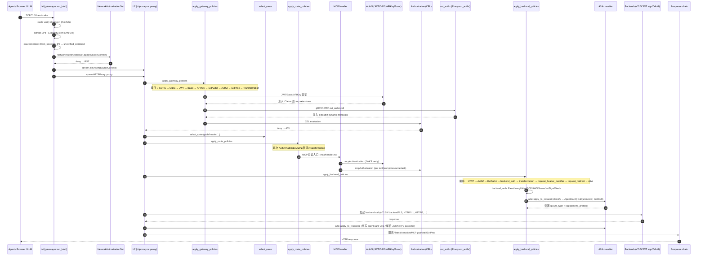

# Agentgateway 深度分析报告

> **目标项目**：[agentgateway/agentgateway](https://github.com/agentgateway/agentgateway) v1.0.0+
> **分析日期**：2026-08-05
> **重点关注**：A2A、Agent ID 身份、权限、认证
> **关联上下文**：NIO 车端 AI Agent 安全（30B~0.1B 多规模 LLM，端云混合，ASILD）

---

## 目录

- [一、项目定位与全景](#一项目定位与全景)
- [二、Workspace 与 Crate 拓扑](#二workspace-与-crate-拓扑)
- [三、整体数据流（控制面 ↔ 数据面）](#三整体数据流控制面--数据面)
- [四、核心数据结构（IR）](#四核心数据结构ir)
- [五、请求生命周期（端到端时序）](#五请求生命周期端到端时序)
- [六、A2A 模块深挖](#六a2a-模块深挖)
- [七、Agent ID 身份体系](#七agent-id-身份体系)
- [八、认证（AuthN）全栈](#八认证authn全栈)
- [九、授权（AuthZ）引擎与 RBAC](#九授权authz引擎与-rbac)
- [十、CEL 上下文与安全相关表达式](#十cel-上下文与安全相关表达式)
- [十一、对 NIO 车端 AI Agent 安全的可借鉴点](#十一对-nio-车端-ai-agent-安全的可借鉴点)
- [十二、风险点与未覆盖的洞](#十二风险点与未覆盖的洞)
- [附录 A：关键源码索引](#附录-a关键源码索引)

---

## 一、项目定位与全景

**agentgateway**（前身 kgateway 的数据面）是一个为 **AI Agent 系统** 设计的开源数据平面代理：

> "The first complete connectivity solution for Agentic AI. An open source proxy built on AI-native protocols (MCP & A2A) that provides drop-in security, observability, and governance for agent-to-LLM, agent-to-tool, and agent-to-agent communication."

四个一等公民场景：

| 场景 | 协议 | 角色 |
|---|---|---|
| Agent → LLM | OpenAI / Anthropic / Bedrock / Gemini / Vertex / Azure | 统一 OpenAI 兼容 API、budget/限流、prompt 增强、failover |
| Agent → Tool | **MCP** (stdio / HTTP / SSE / Streamable HTTP) | 工具联邦、OAuth 鉴权、CEL 细粒度授权、guardrail |
| Agent ↔ Agent | **A2A** (JSON-RPC over HTTP) | 能力发现 (agent card)、模态协商、任务协作 |
| Self-hosted LLM | Kubernetes Inference Gateway extensions | GPU 利用率、KV cache、LoRA、队列深度选择 |

技术栈：Rust（数据面）、Go（K8s controller）、ProtoBuf（xDS）、CEL（策略表达式）、JSON Schema（配置/前端）。

---

## 二、Workspace 与 Crate 拓扑

```
agentgateway/ (Rust workspace)
├── crates/
│   ├── agentgateway         # 主二进制 (CLI、run、test)
│   ├── agentgateway-app     # 主库
│   ├── core                 # 通用基础（strng/arc/telemetry/prelude）
│   ├── http                 # HTTP 抽象 + JWT/AuthZ/ExtAuthz
│   ├── hbone                # HBONE（Envoy 隧道协议）
│   ├── llm                  # LLM provider 抽象（OpenAI/Anthropic/...）
│   ├── pool                 # 连接池
│   ├── xds                  # xDS 客户端
│   ├── protos               # Protobuf 生成代码
│   ├── cel-fork/cel         # 内部 fork 的 CEL 实现
│   ├── celx                 # CEL 扩展（CIDR/IP/strings/math/通用）
│   └── htpasswd-verify-fork # htpasswd fork
├── controller/              # Go：K8s Gateway API controller + xDS server
├── ui/                      # Web UI（探索/调试）
├── examples/                # 32+ 个 example（含 mcp-authentication、traffic-a2a、...）
├── architecture/            # 架构文档
├── design/                  # EP（Enhancement Proposal）
└── schema/                  # JSON schema + 文档
```

### 关键数据面模块（按 `crates/agentgateway/src/` 拆）

| 模块 | 关键文件 | 作用 |
|---|---|---|
| `proxy/` | `httpproxy.rs` (4347 行)、`gateway.rs`、`tcpproxy.rs` | 主代理逻辑 |
| `a2a/` | `mod.rs` (222 行) | A2A 协议识别 + agent card 重写 |
| `mcp/` | `handler.rs` (2026)、`auth.rs` (1096)、`rbac.rs`、`session.rs` | MCP 协议 + 鉴权 + 工具联邦 |
| `http/auth/` | `mod.rs`、`jws.rs`、`jwt_sign.rs`、`aws.rs`、`azure.rs`、`gcp.rs`、`oauth/` | 多种 AuthN 后端 |
| `http/oidc/` | `mod.rs` (370+)、`callback.rs`、`session.rs`、`provider.rs`、`redirect.rs` | OIDC 浏览器登录 |
| `http/authorization.rs` | 374 行 | RBAC + CEL 策略引擎 |
| `http/jwt.rs` | 590 行 | JWT 验证 |
| `http/apikey.rs` | 299 行 | API Key 认证（恒时比较） |
| `http/basicauth.rs` | 214 行 | Basic Auth（bcrypt/htpasswd） |
| `http/ext_authz.rs` | 1462 行 | Envoy ext_authz 协议 + CEL 元数据 |
| `http/ext_proc/` | 多文件 | Envoy ext_proc（gRPC/HTTP） |
| `cel/types.rs` | 2370 行 | CEL 类型系统（Executor / ContextBuilder） |
| `transport/tls.rs` | 1100+ | mTLS / SPIFFE 身份提取 |
| `store/` | 多文件 | 内部表示（IR）构建与缓存 |
| `types/agent.rs` | 3693 行 | 用户面配置 + 编译期结构 |
| `control/` | 多文件 | 配置变更监听、热重载 |
| `telemetry/log.rs` | 2466 行 | access log / 字段选择器 / CEL 日志 |

### 关键安全相关依赖

- `jsonwebtoken` 10.4：JWS 验签
- `rustls` 0.23 + `aws-lc-rs`：TLS 1.2/1.3、mTLS、PQ-Ready（X25519_MLKEM768）
- `x509-parser`：证书解析、SPIFFE URI 提取
- `cel`（fork）+ `celx`：策略引擎
- `secrecy`：secret 内存保护
- `subtle`：恒时比较（API Key、HMAC）
- `bcrypt` 0.19：htpasswd 密码哈希
- `pwhash` 1：另一种密码哈希
- `reqwest`/`hyper`/`hyper-rustls`：HTTP 客户端

---

## 三、整体数据流（控制面 ↔ 数据面）

```
┌──────────────────────────────────────────────────────────────┐
│                      K8s / Standalone                         │
│  ┌──────────────┐   ┌──────────────┐   ┌──────────────┐       │
│  │ HTTPRoute /  │   │ Agentgateway-│   │ JWT Secret / │       │
│  │ Gateway /    │   │ Policy       │   │ TLS Profile  │       │
│  │ Backend      │   │              │   │              │       │
│  └──────┬───────┘   └──────┬───────┘   └──────┬───────┘       │
└─────────┼──────────────────┼──────────────────┼───────────────┘
          │                  │                  │
          ▼                  ▼                  ▼
┌──────────────────────────────────────────────────────────────┐
│  controller/ (Go) - agw controller                            │
│  ┌──────────────────────────────────────────────────┐         │
│  │  krt collection: 监听 K8s 资源 + 计算 IR        │         │
│  │  plugins/ (a2a, ai, backend_tls, jwt, oauth,…)  │         │
│  └────────────────────┬─────────────────────────────┘         │
│                       │  xDS (LDS/RDS/CDS/EDS)               │
│                       │  本机或 TLS（自动证书管理）            │
└───────────────────────┼──────────────────────────────────────┘
                        ▼
┌──────────────────────────────────────────────────────────────┐
│  data plane: agentgateway (Rust)                              │
│  ┌──────────────────────────────────────────────────┐         │
│  │  XdsUpdater ──> Store ──> ProxyInputs           │         │
│  │  (agent-xds) (types::Store) (Arc<ProxyInputs>)   │         │
│  └────────────────────┬─────────────────────────────┘         │
│                       ▼                                       │
│  ┌──────────────────────────────────────────────────┐         │
│  │  Gateway::run_bind() ── accept TCP/TLS          │         │
│  │   ├─ mTLS verify client cert (可选)              │         │
│  │   ├─ 提取 SPIFFE identity → SourceContext         │         │
│  │   ├─ SourceContext::from_stores (按 IP 解析)     │         │
│  │   ├─ NetworkAuthorizationSet.apply (L4 authz)   │         │
│  │   └─ spawn HTTPProxy::proxy()                    │         │
│  └────────────────────┬─────────────────────────────┘         │
│                       ▼                                       │
│  ┌──────────────────────────────────────────────────┐         │
│  │  HTTPProxy::proxy (per connection)               │         │
│  │  1. apply_gateway_policies  (CORS, OIDC, JWT,    │         │
│  │     Basic, APIKey, ExtAuthz, AuthZ, ExtProc,     │         │
│  │     Transformation)                              │         │
│  │  2. select_route → apply_route_policies (限流,   │         │
│  │     timeout, retry, MCP, A2A, LLM 等)            │         │
│  │  3. build_service_call (选 backend)              │         │
│  │  4. apply_backend_policies (backend_auth,        │         │
│  │     authorization, ext_authz, A2A 协议识别)     │         │
│  │  5. make_backend_call (TLS / 直连)                │         │
│  │  6. apply_to_response (A2A agent card 重写,       │         │
│  │     限流, transformation, MCP guardrail 等)      │         │
│  └──────────────────────────────────────────────────┘         │
└──────────────────────────────────────────────────────────────┘
```

### 三种配置源

| 配置 | 用途 | 加载机制 |
|---|---|---|
| **Static** | 进程级（log、port） | 启动时一次，env/YAML |
| **Local** | 全部功能（bind、listener、route、backend、policy） | 文件 watch + 热重载 → IR |
| **XDS** | 同上但通过 controller 推送 | xDS stream → IR（无 URL fetch，节省控制面） |

> 设计哲学：用户面 API ↔ XDS ↔ IR **接近直接映射**，避免 Envoy 那种 listener→route list 的扇出膨胀。
> 见 `architecture/configuration.md:21-56`。

---

## 四、核心数据结构（IR）

`crates/agentgateway/src/types/agent.rs` 定义了**用户面的编译目标**（同时也是 IR）：

### 4.1 顶层容器

```rust
// 简化的字段层次
struct Config {
  binds: Vec<Bind>,           // 监听端点
  // ...
}

struct Bind {
  port: u16,
  listeners: Vec<Listener>,
}

struct Listener {
  name: Strng,
  hostname: Strng,
  protocol: ListenerProtocol,    // HTTP / HTTPS / TLS / TCP
  routes: Vec<Route>,            // 或者 ListenerSet
  policies: FrontendPolices,     // 包含 network_authorization, tls, tcp
}

struct Route {
  matches: Vec<Match>,
  policies: RoutePolicies,       // jwt, oidc, basic, api_key, authz, ext_authz, llm, mcp, ...
  backends: Vec<RouteBackend>,
}

struct RouteBackend {
  backend: BackendReference,     // service / host / mcp / ai / static / ...
  policies: BackendPolicies,     // backend_auth, backend_tls, a2a, authz, ...
}
```

### 4.2 策略集（关键安全相关）

```rust
// store/binds.rs:139-152
pub struct FrontendPolices {
  pub network_authorization: Option<NetworkAuthorizationSet>,  // L4 authz
  pub tls, pub tcp, pub http, pub proxy, pub connect: ...,
  // ...
}

// store/binds.rs:392-405
pub struct GatewayPolicies {
  pub cors, pub ext_proc, pub oidc, pub jwt, pub authorization, pub ext_authz,
  pub transformation, pub basic_auth, pub api_key, pub buffer,
}

// store/binds.rs:363-390
pub struct RoutePolicies {
  pub local_rate_limit, pub remote_rate_limit,
  pub authorization, pub jwt, pub oidc, pub basic_auth, pub api_key,
  pub ext_authz, pub ext_proc, pub transformation, pub csrf, pub direct_response,
  pub llm, pub timeout, pub retry, pub delay,
  pub request_header_modifier, pub response_header_modifier,
  pub request_redirect, pub url_rewrite, pub hostname_rewrite,
  pub request_mirror, pub cors, pub buffer,
}

// types/agent.rs:2690-2717
pub enum BackendTrafficPolicy {
  Authorization(Authorization),       // ← AuthZ
  McpAuthorization, McpAuthentication, McpGuardrails,
  A2a(A2aPolicy),                    // ← A2A 协议处理
  HTTP, TCP, Tunnel, BackendTLS,
  BackendAuth(BackendAuth),          // ← 后端认证
  InferenceRouting,
  AI(Arc<llm::Policy>),              // ← LLM 策略
  ExtAuthz(Arc<ext_authz::ExtAuthz>),
  SessionAffinity,
  Transformation, Health,
  RequestHeaderModifier, ResponseHeaderModifier,
  RequestRedirect, RequestMirror,
}
```

注意 **A2A policy 是个空 struct**（`types/agent.rs:2731-2732`）—— 它只做"协议识别 + agent card 重写"，所有真正的鉴权/授权走常规 `Authorization` + `Jwt` + `ExtAuthz` 链。

---

## 五、请求生命周期（端到端时序）



**关键安全特性**：
- **L4 → L7 → Backend 三层 AuthN/AuthZ**（network_authorization 在 L4，authorization 在 L7，backend_auth 在调用后端前）
- **A2A 协议识别发生在 backend 阶段**（不是 route 阶段），确保上游身份已验证
- **每层失败都立即返回 4xx**，不会让请求渗透到下一层

---

## 六、A2A 模块深挖

### 6.1 协议识别（`crates/agentgateway/src/a2a/mod.rs`）

A2A v0.3+ 是 JSON-RPC over HTTP 协议。Agentgateway 把 A2A 当成**一个语义识别层**，而不是完整的协议翻译器：

```rust
// a2a/mod.rs:11-55
pub async fn apply_to_request(_: &A2aPolicy, req: &mut Request<Body>) -> RequestType {
    classify_request(req).await
}

async fn classify_request(req: &mut Request<Body>) -> RequestType {
    match (req.method(), req.uri().path()) {
        // GET /.well-known/agent.json (v0.3-)  /  agent-card.json (v1.0+)
        (m, path) if m == GET && (path.ends_with("/.well-known/agent.json")
                                || path.ends_with("/.well-known/agent-card.json")) => {
            // 用 OriginalUrl 找到客户端发起的原始 URL（用于响应重写）
            let uri = req.extensions().get::<filters::OriginalUrl>()
                .map(|u| u.0.clone())
                .unwrap_or_else(|| req.uri().clone());
            let uri = crate::http::x_headers::apply_forwarded_scheme(uri, req.headers());
            RequestType::AgentCard(uri)
        },
        (m, _) if m == POST => {
            // 检查 Content-Type，peek JSON-RPC method
            let method = match classify_content_type(req.headers()) {
                WellKnownContentTypes::Json => match inspect_method(req).await {
                    Ok(method) => method,
                    Err(_) => Strng::from("unknown"),  // 解析失败不阻塞
                },
                _ => Strng::from("unknown"),
            };
            RequestType::Call(method)
        },
        _ => RequestType::Unknown,
    }
}
```

关键点：
- **A2A Policy 是空 struct**（`types/agent.rs:2731`），本身不施加限制
- **agent card 路径识别**支持 v0.3 的 `agent.json` 和 v1.0 的 `agent-card.json`
- **method 提取**容错：JSON 解析失败时降级为 `unknown`（不让恶意输入导致解析器 panic）
- **OriginalUrl 处理**：用客户端实际发起的 URL 而不是 backend URL 重写响应

### 6.2 Agent Card URL 重写（防 bypass 关键）

```rust
// a2a/mod.rs:122-172
pub async fn apply_to_response(pol, a2a_type, resp) -> ... {
    match a2a_type {
        RequestType::AgentCard(uri) => {
            // 读取并解析 agent card
            let mut agent_card = json::from_body_with_limit::<Value>(body, buffer_limit).await?;
            let gateway_base = build_agent_path(uri);

            // v1.0: supportedInterfaces[] 数组
            if let Some(interfaces) = agent_card.get_mut("supportedInterfaces") {
                for iface in interfaces.as_array_mut()?.iter_mut() {
                    if let Some(url_val) = iface.get_mut("url")
                        && let Some(s) = url_val.as_str()
                        && let Ok(iface_uri) = s.parse::<Uri>() {
                        // 替换为 gateway 路径
                        let path_and_query = iface_uri.path_and_query()
                            .map(|pq| pq.as_str()).unwrap_or(iface_uri.path());
                        *url_val = Value::String(format!("{gateway_base}{path_and_query}"));
                    }
                }
            }
            // v0.3: 顶层 url
            else if let Some(url_field) = json::traverse_mut(&mut agent_card, &["url"]) {
                *url_field = Value::String(gateway_base);
            } else {
                anyhow::bail!("agent card missing URL");
            }
            *resp.body_mut() = json::to_body(agent_card)?;
        },
        RequestType::Call(_) => Ok(inspect_call_response(resp).await),  // 提取 result.kind, status.state
        _ => Ok(None),
    }
}
```

**这个重写是核心安全特性**——防止客户端看到后端真实地址（如 `http://backend.internal:8080`）后绕过 gateway 直连。

测试覆盖（`a2a/tests.rs:175-280`）：
- v0.3 单 url 字段
- v1.0 单 interface
- v1.0 多 interface（JSONRPC、GRPC 等）
- v1.0 root path
- X-Forwarded-Proto 头处理
- 子路径处理

### 6.3 与 backend 策略链的串联

```rust
// proxy/httpproxy.rs:381-396  apply_backend_policies 内的位置
if let Some(a2a) = a2a {
    let a2a_type = a2a::apply_to_request(a2a, req).await;
    if let a2a::RequestType::Call(method) = &a2a_type {
        log.add(|l| { l.a2a_method = Some(method.clone()); });  // 写入访问日志
    }
    if matches!(a2a_type, RequestType::Call(_) | RequestType::AgentCard(_)) {
        log.add(|l| { l.backend_protocol = Some(cel::BackendProtocol::a2a); });
    }
    rp.a2a_type = a2a_type;
}
```

**位置很关键**：A2A 分类发生在：
- `authorization` (RBAC) 之后 ✅
- `ext_authz` 之后 ✅
- `backend_auth`（向后端插入凭证）之后 ✅
- `transformation` 之后 ✅

也就是说 **所有 AuthN/AuthZ 都先于 A2A 协议解析**——安全边界正确。

### 6.4 A2A Backend Policy 激活路径

**K8s 侧**（`controller/pkg/agentgateway/plugins/a2a_plugin.go`）：

```go
// 当 Service 端口标注 appProtocol: agentgateway.dev/a2a
// 自动生成 BackendPolicy { A2A: {} }
const (
    legacyA2aProtocol = "kgateway.dev/a2a"
    a2aProtocol       = "agentgateway.dev/a2a"
)

for _, port := range svc.Spec.Ports {
    if port.AppProtocol != nil && (*port.AppProtocol == a2aProtocol || ...) {
        // 生成 Policy{A2A: {}}，target = Service
        policy := &api.Policy{
            Kind: &api.Policy_Backend{Backend: &api.BackendPolicySpec{
                Kind: &api.BackendPolicySpec_A2A_{A2A: &api.BackendPolicySpec_A2A{}},
            }},
        }
    }
}
```

**Standalone 侧**（`types/local.rs:2516`）：

```yaml
policies:
  a2a: {}  # 空对象，仅触发识别
backends:
  - host: localhost:9999
```

### 6.5 A2A 在 CEL / 可观测中的暴露

```rust
// cel/types.rs:148 - backend.protocol 枚举包含 a2a
pub enum BackendProtocol { Http, Tcp, A2a, Mcp, Llm }

// telemetry/log.rs:1400-1422 - 访问日志字段
("a2a.method", log.a2a_method.display()),
("a2a.response.outcome", ...),
("a2a.response.error_code", ...),
("a2a.result.kind", ...),       // task/message/event
("a2a.task.state", ...),         // submitted/working/completed/failed/canceled
```

**重要洞见**：A2A 是 **唯一** 把协议层方法/状态注入可观测性的协议。MCP 也类似（`mcp.tool.name`），但 A2A 走的是**后端协议识别**而非**应用层解析**。

### 6.6 A2A 模块整体评价

| 维度 | 实现 | 评价 |
|---|---|---|
| 协议识别 | 仅 POST JSON-RPC + GET well-known | ⭐⭐⭐⭐ 简洁、容错 |
| 协议翻译 | 不翻译 body，只识别 + 重写 URL | ⭐⭐⭐⭐ 透明 |
| 端到端认证 | 复用 `Authorization` 策略 | ⭐⭐⭐⭐ 复用 |
| 端到端授权 | 复用 `Authorization` 策略 | ⭐⭐⭐⭐ 可写 `backend.protocol == "a2a" && jwt.sub == "..."` |
| Agent Card 保护 | URL 重写防 bypass | ⭐⭐⭐⭐⭐ 关键安全特性 |
| 任务层授权 | **缺失** | ❌ 无 per-method RBAC（vs MCP 完整） |
| 任务级可观测 | result.kind / status.state | ⭐⭐⭐⭐ |

---

## 七、Agent ID 身份体系

Agentgateway 把 "Agent ID 身份" 拆成 **三个独立来源**，每种都有不同的信任强度。

### 7.1 L4 阶段：SPIFFE / mTLS 身份（强信任）

```rust
// transport/tls.rs:947-998
pub struct TlsInfo {
    pub identity: Option<IstioIdentity>,
    pub subject_alt_names: Vec<Strng>,
    pub issuer: Strng,
    pub subject: Strng,
    pub subject_cn: Option<Strng>,
    pub certificate: Option<Strng>,  // PEM（仅在握手有客户端证书时存在）
}

pub struct IstioIdentity {
    trust_domain: Strng,
    namespace: Strng,
    service_account: Strng,
}

impl Display for IstioIdentity {
    fn fmt(&self, f) -> write!(f, "spiffe://{}/ns/{}/sa/{}",
        self.trust_domain, self.namespace, self.service_account)
}
```

**提取逻辑**（`transport/tls.rs:1000-1035`）：

```rust
pub fn identity_from_connection(conn: &rustls::CommonState) -> Option<TlsInfo> {
    let cert = conn.peer_certificates()?.first()?;
    let (issuer, subject, subject_cn) = names(&cert);
    let (istio, sans) = sans(&cert).ok()?;
    Some(TlsInfo {
        identity: istio.into_iter().next().map(|i| {
            let Identity::Spiffe { trust_domain, namespace, service_account } = i;
            IstioIdentity { trust_domain, namespace, service_account }
        }),
        // ...
    })
}

// sans() 解析 URI SAN，识别 spiffe:// scheme
let istio = names.iter().filter_map(|n| {
    let id = match n {
        GeneralName::URI(uri) => Identity::from_str(uri),
        _ => return None,
    };
    // ...
});
```

**mTLS 验证链**（`types/agent.rs:488-518`）：
- `root_pem`：CA roots（来自 `Listener.tls.certificates` 或 `caCertificates`）
- `WebPkiClientVerifier`：rustls 提供的证书验证
- `allow_insecure_mtls`：当 `true` 时，证书验证失败但仍放行（不安全，仅测试用）

**注意**：信任域校验在 `transport/tls.rs:704-820` 的测试代码中体现。**生产中需要配置 `additional_trust_domains`**（见 v1.2.0-alpha.1 CHANGELOG: "Support additional trusted trust domains on hbone income"）。

### 7.2 L4 阶段：按 IP 解析的 Workload 身份（弱信任）

```rust
// cel/types.rs:269-318
pub struct SourceContext {
    pub address: IpAddr,        // 解析后地址（可能经过 PROXY protocol）
    pub port: u16,
    pub raw_address: IpAddr,    // 原始 TCP peer
    pub raw_port: u16,
    pub tls: Option<TlsInfo>,   // ← 来自 mTLS，强信任
    pub unverified_workload: Option<WorkloadContext>,  // ← 来自 IP 解析，弱信任
    pub connect_headers: http::HeaderMap,  // CONNECT 隧道头
}
```

**关键代码注释**（`cel/types.rs:294-297`）：

> "All fields live under `unverified` to make it clear that the data is resolved by IP, not cryptographically verified. Policy authors should prefer `source.identity.*` for trust-sensitive checks."

```rust
// cel/types.rs:375-394
impl WorkloadContext {
    pub fn from_stores(stores, network, addr) -> Option<WorkloadContext> {
        let discovery = stores.read_discovery();
        discovery.workloads.find_address(&NetworkAddress {
            network: network.clone(),
            address: addr,
        }).map(|w| WorkloadContext {
            name: w.name.clone(),
            namespace: w.namespace.clone(),
            service_account: w.service_account.clone(),
        })
    }
}
```

**L4 串联**（`proxy/gateway.rs:863-885`）：

```rust
let unverified_workload = crate::cel::WorkloadContext::from_stores(
    &inputs.stores, &inputs.cfg.network, tcp.peer_addr.ip());

let mut src = crate::cel::SourceContext::from_tcp_connection(
    tcp,
    tls.and_then(|t| t.src_identity.clone()),  // 来自 mTLS
    unverified_workload,                       // 来自 IP
);

if let Some(network_authorization) = policies.network_authorization.as_ref()
    && let Err(e) = network_authorization.apply(&src)
{
    anyhow::bail!("network authorization denied: {e}");  // ← L4 立即拒绝
}

stream.ext_mut().insert(src);
```

### 7.3 L7 阶段：JWT / APIKey / Basic / OIDC 身份

详见第八节。这些身份通过 `Request.extensions` 注入，并在 CEL 上下文中以 `jwt.*`、`apiKey.*`、`basicAuth.*` 形式暴露。

### 7.4 Agent ID 身份的统一抽象：SourceContext + Extensions

```rust
// proxy/httpproxy.rs:617-619  每个连接开始时注入
connection.copy::<cel::SourceContext>(req.extensions_mut());
connection.copy::<cel::DestinationContext>(req.extensions_mut());

// jwt.rs:550  JWT 验证后注入
req.extensions_mut().insert(claims);

// apikey.rs 类似
req.extensions_mut().insert(Claims { key, metadata });
```

整个请求处理链中，**每个策略/后端调用都能从 extensions 里取出身份**，避免重复解析。

### 7.5 信任层级总结

| 来源 | 信任强度 | CEL 访问 | 适用决策 |
|---|---|---|---|
| mTLS SPIFFE | 🔴 强（密码学验证） | `source.identity.trustDomain/namespace/serviceAccount` | 信任敏感 |
| Workload by IP | 🟡 弱（网络可达性） | `source.unverifiedWorkload.*` | 仅用于日志/路由 |
| JWT claims | 🔴 强（JWKS 签名验证） | `jwt.*` | 信任敏感 |
| API Key | 🔴 强（配置侧定义） | `apiKey.*` + metadata | 信任敏感 |
| Basic Auth | 🟡 中（密码哈希） | `basicAuth.*` | 一般信任 |
| OIDC session | 🔴 强（PKCE + ID token 验签） | `jwt.*`（同 JWT） | 信任敏感 |
| ExtAuthz | 取决于外部服务 | `extauthz.*` | 由实现决定 |

**设计原则**：**用 `source.identity.*`（mTLS）做信任决策**，**用 `source.unverifiedWorkload.*` 做路由/审计**。两者在结构上明确分离。

---

## 八、认证（AuthN）全栈

### 8.1 体系总览

```
┌──────────────────────────────────────────────────────────────┐
│  AuthN 入口（按配置层级）                                     │
│  ┌─────────────┐  ┌─────────────┐  ┌─────────────┐           │
│  │ Gateway     │  │ Route       │  │ Backend     │           │
│  │ Policies    │  │ Policies    │  │ Policies    │           │
│  └─────────────┘  └─────────────┘  └─────────────┘           │
│        │                │                │                   │
│        ▼                ▼                ▼                   │
│   ┌─────────┐     ┌──────────┐    ┌──────────────┐           │
│   │ CORS    │     │ CSRF     │    │ BackendAuth  │           │
│   │ OIDC    │     │ JWT      │    │ - Passthrough│           │
│   │ JWT     │     │ OIDC     │    │ - Key        │           │
│   │ Basic   │     │ Basic    │    │ - GCP        │           │
│   │ APIKey  │     │ APIKey   │    │ - AWS        │           │
│   │ ExtAuthz│     │ ExtAuthz │    │ - Azure      │           │
│   └─────────┘     │ MCP-Authn│    │ - Copilot    │           │
│                   └──────────┘    │ - JwtSign    │           │
│                                  │ - OAuthExch  │           │
│                                  │ - CrossApp   │           │
│                                  └──────────────┘           │
└──────────────────────────────────────────────────────────────┘
```

### 8.2 JWT 验证（`http/jwt.rs`，590 行）

**三种 Mode**（`http/jwt.rs:179-192`）：

| Mode | 行为 | 默认 | 安全建议 |
|---|---|---|---|
| `Strict` | 必须有有效 JWT，否则 401 | 否 | ✅ 生产推荐 |
| `Optional` | 有则验证，无则放行 | **是** | ⚠️ 需配合 AuthZ |
| `Permissive` | 有则验证，无效也放行 | 否 | 🪲 仅调试 |

**关键流程**（`http/jwt.rs:490-552`）：

```rust
pub async fn apply(&self, log, req) -> Result<(), TokenError> {
    let Some(token) = self.location.extract(req) else {
        if self.mode == Mode::Strict { return Err(TokenError::Missing); }
        return Ok(());  // 其他 mode 放过
    };
    let claims = match self.validate_claims(&token) {
        Ok(c) => c,
        Err(e) if self.mode == Mode::Permissive => return Ok(()),  // 验证失败也放行
        Err(e) => return Err(e),
    };
    if let Some(serde_json::Value::String(sub)) = claims.inner.get("sub") {
        log.jwt_sub = Some(sub.to_string());  // 写入访问日志
    }
    self.location.remove(req)?;  // ← **关键：从请求中删除 token，防止透传到后端**
    req.extensions_mut().insert(claims);  // 注入到 extensions
    Ok(())
}
```

**安全特性**：
- 验证后**立即从请求中移除 token**（防透传泄露）
- 通过 JWKS 远程拉取（带缓存，见 controller 侧的 `Modernize remote JWKS handling`）
- 多 provider 支持（multi-issuer）
- Custom Location（header/cookie/query）支持
- 强制声明验证：`exp`, `nbf`, `aud`, `iss`, `sub`（其他如 `iat` 不强制）

**Claims 在 CEL 中**：

```rust
// http/jwt.rs:450-461
impl DynamicType for Claims {
    fn field(&self, field: &str) -> Option<cel::Value<'_>> {
        match field {
            "rawToken" => Some(crate::cel::secret_string_to_value(&self.jwt)),
            _ => self.inner.field(field),
        }
    }
}
```

注意 `rawToken` 标记为 secret（在 CEL 中默认 redact，需 `.unredacted()` 显式取出）。

### 8.3 API Key（`http/apikey.rs`，299 行）

**安全特性**：
- **常量时间比较**（`http/apikey.rs:88-99`）：

  ```rust
  impl PartialEq for APIKey {
      fn eq(&self, other: &Self) -> bool {
          // 防止时序攻击：常量时间比较
          self.0.expose_secret().as_bytes()
              .ct_eq(other.0.expose_secret().as_bytes())
              .into()
      }
  }
  ```
- **SHA-256 哈希存储**（`http/apikey.rs:111-115`）：

  ```rust
  impl APIKeyHash {
      pub fn from_raw_key(key: &str) -> Self {
          let digest = crate::crypto::digest::sha256(key.as_bytes());
          APIKeyHash(hex::encode(digest))
      }
  }
  ```
- 三种 Mode：Strict / Optional / Permissive
- 支持 metadata（任意 JSON）

**CEL 访问**：`apiKey.key`（默认 redact，需 `.unredacted()`），`apiKey.metadata.*`

### 8.4 Basic Auth（`http/basicauth.rs`，214 行）

- 使用 `htpasswd-verify-fork`（fork 自 htpasswd-verify）
- bcrypt 密码哈希
- CEL 访问：`basicAuth.username`（注意：没有 password 字段，password 验证后丢弃）

### 8.5 OIDC 浏览器登录（`http/oidc/`，自 v1.1.0）

完整 OAuth2/OIDC 流程，作为 `oauth2-proxy` 的原生替代：

```
agentgateway                    浏览器                  IdP
    │  GET /resource              │                       │
    │<── 302 Location: IdP /authorize?code_challenge ────│
    │── 302 转发到 IdP ──────────>│                       │
    │                             │<── IdP login page ───│
    │                             │<── IdP 返回 code ────│
    │<── 302 /callback?code&state ──│                     │
    │  校验 transaction cookie     │                     │
    │  ── IdP /token (code_verifier) ──────────────────>│
    │<─ id_token + access_token ─────────────────────────│
    │  验证 id_token, 设置 session cookie                │
    │  302 → /resource                                    │
    │  后续请求带 session cookie 验证
```

**关键安全**（`http/oidc/mod.rs:196-235`）：

```rust
pub async fn apply(&self, log, req, client) -> Result<PolicyResponse, Error> {
    if let Some(response) = self.maybe_handle_callback(req, client.clone()).await? {
        return Ok(response);  // 优先处理 callback
    }
    if is_cors_preflight(req) { return Ok(PolicyResponse::default()); }
    if let Some(cookie) = read_request_cookie(req, &self.session.cookie_name) {
        match self.session.decode_browser_session(&cookie) {
            Ok(browser_session) => {
                if browser_session.policy_id == self.policy_id
                    && let Ok(claims) = self.provider.id_token_validator
                        .validate_claims(browser_session.raw_id_token.expose_secret())
                {
                    // ← **关键**：每次请求都验签 id_token，不是只信 session cookie
                    if let Some(Value::String(sub)) = claims.inner.get("sub") {
                        log.jwt_sub = Some(sub.clone());
                    }
                    req.extensions_mut().insert(claims);
                    return Ok(PolicyResponse::default());
                }
            },
            Err(err) => debug!(...),
        }
    }
    callback::start_login(self, req)  // 未认证 → 启动登录
}
```

**安全特性**：
- **PKCE**（每次请求都用 code_verifier）
- **CSRF 防护**（transaction cookie 中的 state 与 callback state 必须匹配）
- **每次请求都验签 id_token**（session cookie 本身不可信）
- **policy_id 绑定**（防止 session 被另一个 policy 复用）

### 8.6 ext_authz（`http/ext_authz.rs`，1462 行）

完整实现 Envoy ext_authz 协议：

```rust
// http/ext_authz.rs:78-89
pub enum FailureMode {
    Allow,           // 外部失败时放行
    #[default] Deny, // 外部失败时拒绝（默认更安全）
    DenyWithStatus(u16),
}

pub enum Protocol {
    Grpc { context, metadata },           // envoy.service.auth.v3
    Http { path, redirect, body,
           include_response_headers, add_request_headers, metadata },
}
```

**特性**：
- 10000 条缓存
- CEL 计算 path/headers/body
- dynamic metadata 注入到 CEL 上下文 `extauthz.*`
- gRPC 和 HTTP 双协议

### 8.7 BackendAuth（`http/auth/mod.rs:74-111`）

向后端发起请求时插入凭证：

```rust
pub enum BackendAuthKind {
    Passthrough { location },   // 透传验证过的 JWT
    Key { value, location },    // 静态 API key
    Gcp(gcp::GcpAuth),          // GCP Service Account
    Aws(aws::AwsAuth),          // AWS SigV4
    Azure(azure::AzureAuth),    // Azure AD
    Copilot,                    // GitHub Copilot
    JwtSign(Box<JwtSignAuth>),  // 短期 JWT（client_assertion）
    OAuthTokenExchange(Box<OAuthTokenExchangeAuth>),  // RFC 8693
    CrossAppAccess(Box<CrossAppAccessAuth>),          // RFC 8693 → ID-JAG → RFC 7523
}
```

**JwtSign**：每次请求用配置的私钥签短期 JWT（适合 client_credentials OAuth）

**OAuthTokenExchange**（`http/auth/oauth/mod.rs`）：
- RFC 8693 完整实现
- 支持 subject_token / actor_token（委托链）
- 支持 chained_exchange（ID-JAG → access token）
- Token 缓存（默认 8192 entries / 300s TTL）

**CrossAppAccess**（`http/auth/oauth/cross_app_access.rs`）：
- 专门针对 Google/CAEP 跨域访问协议
- 把 ID token 链式交换为 ID-JAG，再换为资源 access token

### 8.8 凭据保密

所有 secret 在内存中用 `secrecy::SecretString` 保护，调试输出自动 redact：

```rust
// http/auth/mod.rs:84
#[serde(serialize_with = "ser_redact")]  // 序列化时输出 [REDACTED]
value: SecretString,

// http/auth/jws.rs:91
impl fmt::Debug for SigningKey {
    fn fmt(&self, f) -> f.write_str("[REDACTED]")  // Debug 也 redact
}
```

Header 设置 sensitive flag（`http/auth/mod.rs:183`）：

```rust
let mut header_value = HeaderValue::from_str(&value)?;
header_value.set_sensitive(true);  // 防止日志泄露
```

---

## 九、授权（AuthZ）引擎与 RBAC

### 9.1 核心算法（`http/authorization.rs:255-275`）

```rust
pub fn validate(&self, exec: &Executor) -> bool {
    let rule_sets = &self.0;
    let has_rules = self.has_rules();
    let allowed = if !has_rules {
        true                                          // 1. 无规则 → 默认允许
    } else if rule_sets.iter().any(|r| r.denies(exec)) {
        false                                         // 2. 任何 DENY 匹配 → 拒绝
    } else if rule_sets.iter().any(|r| !r.all_requires_match(exec)) {
        false                                         // 3. 任何 REQUIRE 不匹配 → 拒绝
    } else if rule_sets.iter().any(|r| r.allows(exec)) {
        true                                          // 4. 任何 ALLOW 匹配 → 允许
    } else {
        !rule_sets.iter().any(|r| r.has_allow_rules())  // 5. 只有 DENY（denylist）vs 都没有匹配（allowlist）
    };
    // ...
    allowed
}
```

**三态规则**：
- `allow`：`expr == true` 时放行
- `deny`：`expr == true` 时拒绝（**注意：表达式错误时不会 deny**）
- `require`：所有 require 必须都满足（最小必备条件）

**文档建议**（`http/authorization.rs:131-141`）：

> "Deny is not recommended because expression failures fail to deny; prefer Allow or Require. If used, design expressions defensively against evaluation errors."

### 9.2 MCP RBAC（`mcp/rbac.rs`）

```rust
pub enum ResourceType {
    Tool(ResourceId),       // MCP 工具
    Prompt(ResourceId),     // MCP prompt
    Resource(ResourceId),   // MCP resource
    Task(ResourceId),       // SEP-2663 task
}

impl McpAuthorizationSet {
    pub fn validate(&self, res: &ResourceType, cel: &CelExecWrapper) -> bool {
        if !self.0.has_rules() { return true; }
        let mcp = crate::mcp::MCPInfo::from(res);
        let exec = crate::cel::Executor::new_mcp_request(cel.0.as_ref(), &mcp);
        self.0.validate(&exec)
    }
}
```

**典型策略**（`examples/mcp-authorization/config.yaml`）：

```yaml
mcpAuthorization:
  rules:
  # Allow anyone to call 'echo'
  - 'mcp.tool.name == "echo"'
  # Only test-user can call 'get-sum'
  - 'jwt.sub == "test-user" && mcp.tool.name == "get-sum"'
  # Any user with the nested.key claim can call 'get-env'
  - 'mcp.tool.name == "get-env" && jwt.nested.key == "value"'
```

**重要安全特性**：
- 工具名可被 CEL 访问
- JWT claims 可被 CEL 访问
- CEL 错误 → 工具被拒绝（fail-closed）

### 9.3 Network Authorization（`store/binds.rs:2403-2413`）

L4 阶段授权，只看 SourceContext：

```rust
fn create_network_authorization_policy(cidr: &str) -> FrontendPolicy {
    FrontendPolicy::NetworkAuthorization(NetworkAuthorization(RuleSet::new(
        PolicySet::new(
            vec![Arc::new(cel::Expression::new_strict(
                format!(r#"cidr("{cidr}").containsIP(source.address)"#)
            ).unwrap())],
            vec![], vec![],
        )
    )))
}
```

支持基于：
- `source.address` + `cidr("10.0.0.0/8").containsIP()`
- `source.identity.trustDomain`
- `source.port`

### 9.4 测试覆盖的关键边界（`http/authorization_tests.rs`）

代码中有详尽测试覆盖了：
- 默认 allow / deny
- 多个 RuleSet 合并
- Require 失败
- Allow 失败
- 表达式错误处理
- CEL 错误 → 默认拒绝

---

## 十、CEL 上下文与安全相关表达式

### 10.1 ContextBuilder：按需捕获（性能关键）

```rust
// 编译期：扫描表达式，提取依赖的变量
fn attributes_for(program.expression()) -> FlagSet<Attributes>;

// 请求期：只把表达式需要的字段加到上下文
ctx.with_request_body_if_needed();   // body 特别贵
ctx.with_headers_if_needed();         // headers 也贵
```

**核心设计**（`architecture/cel.md:31-37`）：

> "During CEL policy parsing (which happens on configuration change, not each request), we extract which variables are referenced in the expression.
> During request processing, ContextBuilder.with_xxx() is called to conditionally add fields into the context.
> For example, if an expression requires request.body we will store a copy of the body in the context, but if no expression requires it the data will be ignored.
> This ensures users only pay for what they use."

### 10.2 安全相关表达式示例

| 需求 | CEL 表达式 |
|---|---|
| 限制只有 prod-sa 的 pod 能访问 | `source.identity.serviceAccount == "prod-sa" && source.identity.namespace == "prod"` |
| 限制 IP 段 | `cidr("10.0.0.0/8").containsIP(source.address)` |
| 限制 JWT issuer | `jwt.iss == "https://auth.example.com"` |
| 限制 JWT audience | `"my-api" in jwt.aud` |
| 限制 JWT scope | `"admin" in jwt.scope.split(" ")` |
| 限制 mcp 工具 | `mcp.tool.name == "echo" && jwt.sub == "user-1"` |
| 强制 TLS 版本 | `source.subject.startsWith("CN=")` (扩展) |
| 阻断 A2A 特定方法 | `backend.protocol == "a2a" && a2a_method == "tasks/send" && jwt.sub == "trusted-agent"` |
| 限制 HTTP 方法 | `request.method == "POST"` |
| 限制 path 前缀 | `request.path.startsWith("/api/v1/")` |

### 10.3 内置函数（`schema/cel-functions.md`）

**标准 CEL**：`contains` `size` `has` `map` `filter` `all` `max` `startsWith` `endsWith` `string` `bytes` `double` `int` `uint` `matches` 等

**时间/数学**：`duration` `timestamp` `math.least` `math.greatest` `math.floor` `math.isInf` 等

**字符串扩展**：参考 cel-go strings ext

**K8s CIDR**：`cidr("10.0.0.0/8").containsIP("10.1.2.3")`

**通用工具**（`crates/celx/src/general.rs`）：
- `json(string)` / `toJson(value)`
- `unvalidatedJwtPayload(token)` ← **⚠️ 不验签，只解码**
- `base64.encode/decode` / `url.encode/decode` / `form.encode/decode`
- `sha1.encode` / `sha256.encode` / `md5.encode`
- `regexReplace` / `uuid` / `random`
- `default` / `coalesce` / `fail`

### 10.4 自定义函数（`crates/celx/src/custom.rs`）

支持用户自定义 CEL 函数（带属性依赖追踪）。配置期注册，运行时求值。

### 10.5 完整 CEL Schema 速查（参考 `schema/cel.md`）

```yaml
request:           { method, uri, host, scheme, path, pathAndQuery, version, headers, body, bodyPrefix, startTime, endTime }
response:          { code, grpcStatus, headers, body, bodyPrefix }
proxy:             { bind, gateway, listener, route, requestProcessingDuration, upstreamDuration, responseProcessingDuration }
env:               { podName, namespace, gateway }
jwt:               { ...claims..., rawToken (secret) }
apiKey:            { key (secret), metadata }
basicAuth:         { username }
llm:               { streaming, requestModel, responseModel, provider, inputTokens, outputTokens, prompt[], completion[], toolCalls[], params, cost, costRates }
llmRequest:        <raw LLM request>
source:            { address, port, rawAddress, rawPort, identity{trustDomain,namespace,serviceAccount}, subjectAltNames, issuer, subject, subjectCn, certificate, unverifiedWorkload{name,namespace,serviceAccount}, connectHeaders }
destination:       { address, port }
mcp:               { methodName, sessionId, tool{target,name,arguments,result,error}, prompt{target,name}, resource{target,name}, task{target,name} }
backend:           { name, type{ai,mcp,static,dynamic,service,unknown}, protocol{http,tcp,a2a,mcp,llm} }
extauthz:          <ext_authz dynamic metadata>
extproc:           <ext_proc dynamic metadata>
mcpGuardrails:     <mcp guardrail dynamic metadata>
metadata:          <transformation metadata>
```

---

## 十一、对 NIO 车端 AI Agent 安全的可借鉴点

> **NIO 场景**（基于 User Profile）：座舱 8295+QTEE / 智驾 Orin+OP-TEE / 车控 S32G+OP-TEE+HSM
> 30B~0.1B 多规模 LLM，离线优先，车控 50Hz，ASIL-D

### 11.1 直接可复用的设计

#### ✅ **1. 三层身份模型**

NIO 可以把车端 Agent 身份拆成：
- **强信任**：HSM 中存储的 SPIFFE/VCert 证书（车机/智驾 ECU）
- **中信任**：TEE 中 attest 出的 workload 身份
- **弱信任**：CAN 总线地址（按 IP 类比）

参考 `SourceContext` 结构，明确分 `identity` 和 `unverified` 字段，文档强制写明只信任前者。

#### ✅ **2. RBAC + CEL 授权**

`http/authorization.rs:255-275` 的三态算法（allow/deny/require）非常适合车端场景：
- `require "ispeed < 0 && has(jwt) && jwt.vin matches VIN_PATTERN"`（高速场景必须验证）
- `allow "jwt.role == 'OEM' && mcp.tool.name in ['OTA', '诊断']"`
- `deny "request.path.startsWith('/brake') && jwt.role != 'OEM-Diagnostic'"`

**比硬编码 ACL 灵活，比 BPF/eBPF 易审计**。

#### ✅ **3. A2A 协议识别 + Agent Card 重写**

NIO 多 ECU 通信（座舱 ↔ 智驾 ↔ 车控）天然是 A2A 场景。`a2a/mod.rs:122-172` 的 agent card URL 重写**正是车端防 bypass 的关键**：
- 防止智驾 agent 看到车控 IP:port 后绕过 gateway 直接控制刹车
- 重写为 gateway URL，强制走完整 AuthN/AuthZ

#### ✅ **4. ext_authz 委托权威决策**

车端某些决策需要"硬实时"或"特殊权限"（如安全气囊触发），
- 默认路径：agentgateway 内 CEL 决策（快速）
- 关键决策：ext_authz → 委托给独立 ASIL-D 域决策（严格）

#### ✅ **5. mTLS + SPIFFE**

完全借鉴：智驾 Orin+OP-TEE 域内每个 Agent 配 SPIFFE 身份。
车控 S32G+OP-TEE+HSM 域使用 HSM 存储 CA 根证书。

#### ✅ **6. Backend 端 JwtSign + OAuthTokenExchange**

车端调用云端 LLM 时：
- **JwtSign** 用车机私钥签短期 JWT（client_assertion）
- **OAuthTokenExchange** 拿 ID token 换 access token（受车端用户身份约束）
- **缓存** 减少网络往返（车端常弱网）

#### ✅ **7. 凭据内存保护**

`secrecy::SecretString` + `set_sensitive(true)` 是车端必须：
- Debug 日志自动 redact
- Header 标记为 sensitive（防止 tracing 工具意外导出）

#### ✅ **8. Network AuthZ (L4)**

车端可用 SourceContext 做：
```cel
cidr("10.0.0.0/8").containsIP(source.address)  // 仅内网
source.identity.serviceAccount in ["ada-pilot", "adas-controller"]  // 仅 ECU
```

**车控 50Hz 场景**：L4 决策比 L7 决策快一个数量级，适合 hard real-time 过滤。

### 11.2 适配车端的扩展建议

| 车端需求 | agentgateway 已支持 | 需要的扩展 |
|---|---|---|
| 离线运行 | xDS 缓存、文件 watch、本地配置 | 增加"完全离线模式"（无控制面），参考 controller/cmd 启动 |
| 车规级 TLS | rustls + aws-lc-rs（已 PQ-Ready） | 验证 PQ 算法 X25519_MLKEM768 在 ECU 上的可用性 |
| 50Hz 周期 | L4 authz 极快 | 用 `Cel::Expression` 预编译 + 零分配（已实现） |
| 整车 CA 在车端 | CA 根证书 PEM 加载 | 验证 HSM 集成路径（已支持 allow_insecure_mtls 等价物） |
| 多 LLM 部署 | LLM provider 抽象完整 | 增加 "local-only" provider（不依赖云端） |
| 时延敏感 | L4 fast path | 把关键策略编译为字节码（已部分实现） |

### 11.3 NIO 应该直接 ship 的最小子集

如果只取 agentgateway 一部分代码到 NIO 车端，最小可用配置：

```yaml
# nio-a2a-minimal.yaml
binds:
- port: 8443
  tls:
    mode: TERMINATE
    certificates:
    - cert: hsm://vcert/cockpit
      key: hsm://vcert/cockpit-key
      root: |
        # ECU CA 根证书（PEM）
  listeners:
  - routes:
    - matches:
      - path: { prefix: "/a2a" }
      policies:
        jwt:
          mode: Strict
          issuer: "spiffe://nio.local/ns/adas/sa/orchestrator"
          audiences: ["spiffe://nio.local/ns/cockpit/sa/agent"]
          jwks:
            inline: { ... }  # 本地缓存的 JWKS
        authorization:
          rules:
          - require: 'source.identity.serviceAccount in ["cockpit-agent", "adas-agent"]'
          - require: 'cidr("10.0.0.0/8").containsIP(source.address)'
          - allow: 'jwt.role == "adas-orchestrator" && mcp.tool.name == "perception"'
          - deny: 'request.path.contains("/brake")'  # 永远不允许 A2A 调刹车
        ext_authz:
          failureMode: Deny
          service: ...
    - matches:
      - path: { exact: "/.well-known/agent.json" }
      policies:
        a2a: {}  # 触发 A2A 协议识别
    backends:
    - mcp:
        targets:
        - name: cockpit
          stdio: { ... }
        policies:
          backend_auth:
            jwtSign:
              algorithm: ES256
              key: hsm://vcert/cockpit-sign
```

---

## 十二、风险点与未覆盖的洞

| 风险 | 位置 | 说明 | 缓解 |
|---|---|---|---|
| `unvalidatedJwtPayload` 不验签 | `celx/src/general.rs:339` | 仅解码 base64，攻击者可以伪造任何 payload | 仅用于日志/可观测，不用于 auth 决策 |
| `Deny` 规则在 CEL 错误时**不**触发 | `http/authorization.rs:255` | CEL 表达式失败会跳过 deny | 文档建议用 `require`/`allow` 替代 |
| `Optional` 是默认 JWT mode | `http/jwt.rs:187` | 不强制 JWT 验证 | 必须显式设置 `Strict` |
| OIDC session cookie 不签名则不可信 | `http/oidc/session.rs` | 必须配合加密 session 校验 | 每次请求都验签 id_token |
| 配额泄漏：Express 错误暴露内部信息 | 一些错误处理 | `anyhow::bail!("agent card invalid JSON")` | 错误信息应统一 sanitize |
| mTLS `allow_insecure_mtls` 选项 | `types/agent.rs:97` | 测试模式，正式禁用 | 默认 false，需显式开启 |
| `unverifiedWorkload` 名字暗示"未验证" | `cel/types.rs:333-345` | 文档清楚但需用户仔细读 | 命名清晰 + 文档明确 |
| JWT Token 透传到 backend 风险 | `http/auth/mod.rs:76-80` | `Passthrough` 模式会转发 | 用 `Key` 或 `JwtSign` 替代 |
| ExtAuthz 失败模式 `Allow` | `http/ext_authz.rs:83` | 外部服务挂了放行不安全 | 默认 `Deny` |
| 大量 MCP 工具 = 大量 CEL 表达式 | `mcp/rbac.rs` | 每个工具都有 RBAC 规则 | 规则数大时启动慢 |
| Network authz 在 L4 阶段，无 HTTP context | `proxy/gateway.rs:881` | 不能基于 HTTP path 决策 | 配 L7 authz |
| A2A 任务级授权缺失 | `a2a/mod.rs` | 不能区分 `tasks/send` vs `tasks/cancel` | 通过 backend protocol = "a2a" + CEL 表达式实现 |
| Prometheus metrics 可能含 PII | `telemetry/metrics.rs` | source IP、user-agent 暴露 | 字段过滤 |

---

## 附录 A：关键源码索引

### 数据面（Crate: `crates/agentgateway`）

| 路径 | 行数 | 作用 |
|---|---|---|
| `src/lib.rs` | - | 模块入口 |
| `src/app.rs` | - | 应用装配 |
| `src/proxy/httpproxy.rs` | 4347 | **主代理（核心）** |
| `src/proxy/gateway.rs` | - | **L4 入口** |
| `src/proxy/tcpproxy.rs` | - | TCP 代理 |
| `src/proxy/dtrace.rs` | 909 | 请求级调试追踪器 |
| `src/a2a/mod.rs` | 222 | **A2A 协议识别** |
| `src/a2a/tests.rs` | 578 | A2A 测试（含 agent card URL 重写） |
| `src/mcp/handler.rs` | 2026 | **MCP 协议处理** |
| `src/mcp/auth.rs` | 1096 | **MCP 认证（OAuth / JWKS）** |
| `src/mcp/rbac.rs` | 246 | **MCP RBAC** |
| `src/mcp/session.rs` | 1121 | MCP 会话管理 |
| `src/mcp/guardrails/` | - | MCP 内容过滤 |
| `src/mcp/upstream/` | - | MCP upstream 多路复用 |
| `src/http/auth/mod.rs` | 497 | **BackendAuth 总入口** |
| `src/http/auth/jws.rs` | 121 | JWS 签名 |
| `src/http/auth/jwt_sign.rs` | 196 | JwtSign Auth |
| `src/http/auth/aws.rs` | 1372 | AWS SigV4 |
| `src/http/auth/azure.rs` | 463 | Azure AD |
| `src/http/auth/gcp.rs` | 456 | GCP Service Account |
| `src/http/auth/copilot.rs` | 176 | GitHub Copilot |
| `src/http/auth/oauth/mod.rs` | 912 | **OAuth Token Exchange** |
| `src/http/auth/oauth/cross_app_access.rs` | 306 | **Cross-App Access (ID-JAG)** |
| `src/http/auth/oauth/client_auth.rs` | 578 | Private Key JWT |
| `src/http/auth/oauth/cache.rs` | 451 | Token 缓存 |
| `src/http/oidc/mod.rs` | 370+ | **OIDC 浏览器登录** |
| `src/http/oidc/callback.rs` | - | OIDC callback |
| `src/http/oidc/session.rs` | - | 加密 session cookie |
| `src/http/oidc/provider.rs` | - | OIDC provider discovery |
| `src/http/oidc/redirect.rs` | - | 重定向 URI 验证 |
| `src/http/authorization.rs` | 374 | **RBAC + CEL 引擎** |
| `src/http/jwt.rs` | 590 | **JWT 验证** |
| `src/http/apikey.rs` | 299 | **API Key（恒时比较）** |
| `src/http/basicauth.rs` | 214 | Basic Auth |
| `src/http/ext_authz.rs` | 1462 | **Envoy ext_authz** |
| `src/http/ext_proc.rs` | - | Envoy ext_proc |
| `src/http/csrf.rs` | - | CSRF 保护 |
| `src/http/backendtls.rs` | - | 后端 TLS |
| `src/http/transformation_cel.rs` | - | CEL-based transformation |
| `src/cel/types.rs` | 2370 | **CEL 类型系统** |
| `src/cel/mod.rs` | 442 | CEL 入口 |
| `src/cel/custom.rs` | 675 | 自定义 CEL 函数 |
| `src/cel/properties.rs` | 77 | 属性依赖追踪 |
| `src/cel/query.rs` | 314 | Query accessor |
| `src/transport/tls.rs` | 1100+ | **TLS / mTLS / SPIFFE 提取** |
| `src/transport/stream.rs` | - | TCP/TLS 流 |
| `src/crypto/jwt.rs` | 19 | JWT crypto provider |
| `src/crypto/aead.rs` | - | AEAD (AES-GCM, ChaCha20) |
| `src/crypto/digest.rs` | - | 哈希（SHA-256 等） |
| `src/crypto/tls.rs` | - | TLS 配置 |
| `src/store/binds.rs` | 4000+ | **IR 存储 + 策略解析** |
| `src/types/agent.rs` | 3693 | **用户面配置 schema** |
| `src/types/agent_xds.rs` | - | xDS ↔ IR 转换 |
| `src/types/backend.rs` | - | Backend 类型 |
| `src/types/frontend.rs` | - | Frontend 类型 |
| `src/telemetry/log.rs` | 2466 | 访问日志 |
| `src/telemetry/metrics.rs` | - | Prometheus 指标 |
| `src/control/` | - | 配置变更监听 |
| `src/store/discovery.rs` | - | Service discovery |

### Crate: `crates/celx`

| 路径 | 行数 | 作用 |
|---|---|---|
| `src/lib.rs` | 123 | 入口 |
| `src/general.rs` | 501 | 通用函数（json、base64、sha256） |
| `src/strings.rs` | 435 | 字符串扩展 |
| `src/math.rs` | 378 | 数学扩展 |
| `src/cidr.rs` | 186 | CIDR / IP |
| `src/flatten.rs` | 98 | flatten for logging |
| `src/optimize.rs` | 134 | 性能优化 |
| `src/function_tests.rs` | 647 | 函数测试 |

### Crate: `crates/core`

| 路径 | 作用 |
|---|---|
| `src/lib.rs` | Prelude |
| `src/strng.rs` | 不可变字符串优化 |
| `src/arc.rs` | Arc 优化 |
| `src/telemetry.rs` | 基础遥测 |

### K8s Controller

| 路径 | 作用 |
|---|---|
| `controller/pkg/agentgateway/plugins/a2a_plugin.go` | **A2A Service 自动发现** |
| `controller/pkg/agentgateway/plugins/ai_policies.go` | AI 策略转换 |
| `controller/pkg/agentgateway/plugins/backend_tls_plugin.go` | BackendTLS 转换 |
| `controller/pkg/agentgateway/plugins/jwks_lookup.go` | JWKS 远程获取 |
| `controller/pkg/agentgateway/plugins/registry.go` | 插件注册 |
| `controller/cmd/` | Controller 启动 |
| `controller/test/e2e/a2a_test.go` | A2A e2e 测试 |
| `controller/hack/testbox/a2a.go` | A2A 测试 server |

### 配置与文档

| 路径 | 作用 |
|---|---|
| `architecture/README.md` | 架构入口 |
| `architecture/configuration.md` | 配置体系 |
| `architecture/cel.md` | CEL 体系 |
| `design/README.md` | EP 流程 |
| `design/288-inferencepool-ai-policies.md` | InferencePool AI 策略（示例） |
| `schema/cel.md` | **CEL 上下文 schema**（必读） |
| `schema/cel-functions.md` | **CEL 函数参考**（必读） |
| `schema/cel-functions.rs` | 函数定义源 |
| `schema/cel.json` | CEL JSON schema |
| `examples/traffic-a2a/config.yaml` | A2A 示例 |
| `examples/mcp-authentication/config.yaml` | MCP 认证示例 |
| `examples/mcp-authorization/config.yaml` | MCP 授权示例 |
| `examples/traffic-jwt-sign/` | JWT 签名示例 |
| `examples/traffic-token-exchange/` | Token Exchange 示例 |
| `examples/traffic-oidc/` | OIDC 示例 |
| `examples/traffic-tailscale-auth/` | Tailscale auth 示例 |

### 关键 RBAC 规则测试

| 文件 | 测试目标 |
|---|---|
| `http/authorization_tests.rs` | RBAC 三态规则、合并 |
| `mcp/rbac.rs` 内 test 模块 | MCP RBAC 完整覆盖 |
| `http/oidc/tests.rs` | OIDC 浏览器登录 |
| `http/jwt_tests.rs` | JWT 模式（Strict/Optional/Permissive） |
| `http/apikey_tests.rs` | API Key 恒时比较 |
| `http/ext_authz_tests.rs` | ext_authz 协议 |

---

> 本报告基于 `agentgateway/agentgateway` v1.0.0 之后的源码（commit hash 与 1.3.0-alpha.1 CHANGELOG 描述一致）。
> 仓库地址：`/Users/sphinx.shi/workspace/research/agentgateway/`
> 报告地址：`/Users/sphinx.shi/workspace/research/agentgateway-analysis/`
