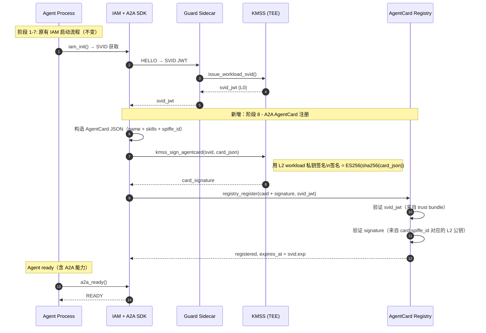
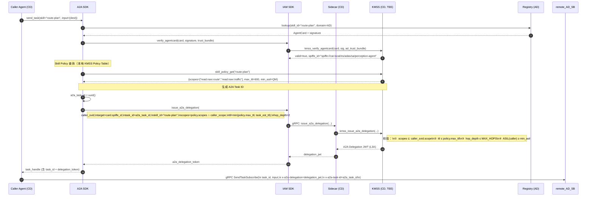
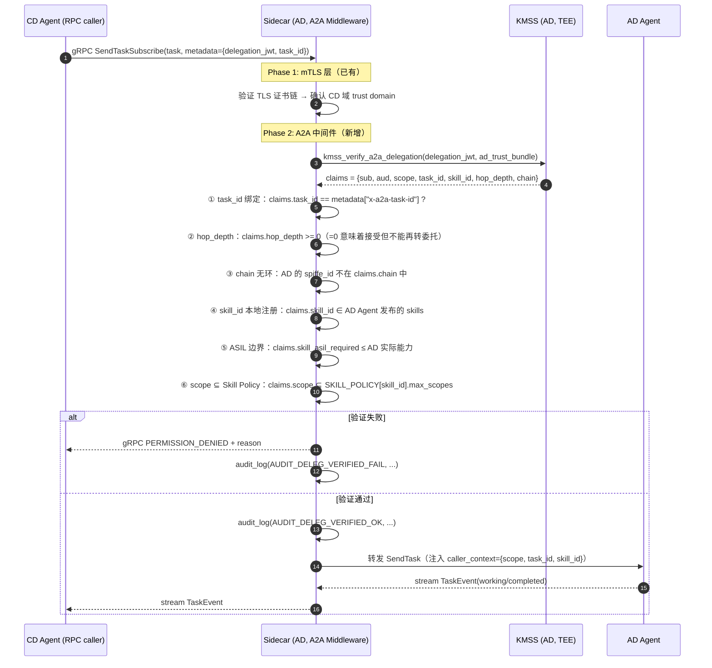

# 车载 A2A + IAM 融合架构设计

> **目标**：在不破坏现有 KMSS / SVID / 分层 TTL 设计的前提下，
> 将 A2A 协议（AgentCard 发现 + Task 生命周期 + 多跳链路）
> 整合进车端 IAM 体系，形成**统一的身份-授权-跨域-任务编排**架构。
>
> **前置文档**：
> - [`iam_auth_architecture.md`](./iam_auth_architecture.md) — KMSS / 分层 TTL / 凭据管理
> - [`a2a_vehicle_protocol.md`](./a2a_vehicle_protocol.md) — A2A 协议基础与车端设计

---

## 目录

- [1. 现有架构的适配缺口](#1-现有架构的适配缺口)
- [2. 融合架构设计原则](#2-融合架构设计原则)
- [3. 更新后的 Token 模型](#3-更新后的-token-模型)
- [4. 更新后的软件分层](#4-更新后的软件分层)
- [5. 核心 IAM 流程更新](#5-核心-iam-流程更新)
- [6. KMSS 新增 API 设计](#6-kmss-新增-api-设计)
- [7. Sidecar A2A 中间件](#7-sidecar-a2a-中间件)
- [8. 多跳 Agent 链路设计](#8-多跳-agent-链路设计)
- [9. Skill Policy 与 Scope 推导](#9-skill-policy-与-scope-推导)
- [10. 状态机联动](#10-状态机联动)
- [11. 架构演进路径](#11-架构演进路径)
- [12. 修订记录](#12-修订记录)

---

## 1. 现有架构的适配缺口

引入 A2A 后，原有 IAM 架构在以下四个维度出现**结构性缺口**：

### 1.1 身份模型缺口：AgentCard 与 SVID 脱节

```text
原有模型：
  L0: Workload SVID ─────────────── 身份根（TEE 签发）
                    │
  L3: Lease Token ──────────────── 跨域凭据（硬编码 target SPIFFE ID）

问题：
  A2A AgentCard 是 Agent 的能力声明文档
  ↓
  AgentCard 从哪来？谁能发布？真假 AgentCard 如何区分？
  ↓
  当前没有机制把 AgentCard 与 SVID 绑定 → AgentCard 可被伪造
```

**缺口**：AgentCard 是游离于 IAM 之外的"匿名文档"，没有加密绑定到 Workload SVID。

### 1.2 授权模型缺口：Scope 来源不清晰

```
原有模型：
  delegation = kmss_delegate(caller_svid, target_spiffe_id, scopes[], ttl)
  scope 由调用方（Agent 业务代码）手动填写

问题：
  A2A Skill 声明了 required_scopes（来自 AgentCard）
  ↓
  调用方需要手动把 AgentCard 的 scopes 传给 KMSS
  ↓
  没有强制校验机制：Agent 可以故意少写（导致调用失败）或多写（scope 越权）
```

**缺口**：skill → scope 映射是运行时软约束，没有编译期或 KMSS 层的强制保证。

### 1.3 Token 生命周期缺口：Lease 与 Task 双套状态

```
原有模型：
  Lease 有自己的状态机：ACTIVE → SCOPE_TIGHTENED → REVOKED
  A2A Task 有自己的状态机：submitted → working → completed/canceled/failed

问题：
  两个状态机独立运行：
  A2A Task CANCELED ─── SDK 需手动调 kmss_release_lease()
  Lease REVOKED     ─── SDK 需手动传播给 A2A Task → cancel

  如果两者不同步：
  • Task 已 canceled，但 Lease 还活着 → scope 泄露
  • Lease 被 revoke，但 Task 不知道 → Agent 继续执行
```

**缺口**：两套状态机需要人工粘合，存在同步窗口期。

### 1.4 多跳链路缺口：无深度控制机制

```
原有模型：
  CD --delegation_jwt--> AD: 一跳
  没有机制限制 AD 继续 sub-delegate 给 VD

问题：
  A2A 允许 CD → AD → VD → ... 多跳链路
  如果 AD 拿到 delegation_jwt，可以用同一个 jwt 对任意第三方伪装成 CD
  ↓
  需要：hop_depth 字段 + chain 记录 + 链深上限（防止无限委托）
  ↓
  现有 delegation_jwt 没有这些字段
```

**缺口**：跨域 delegation 不支持多跳深度控制和防止"转委托滥用"。

---

## 2. 融合架构设计原则

基于以上四个缺口，融合架构遵循以下原则：

| 原则 | 说明 |
|---|---|
| **AgentCard 是 IAM 一等公民** | AgentCard 必须由 SVID 私钥签名；注册表验证签名才接受注册；验证方通过 trust bundle 确认 AgentCard 真实性 |
| **Skill Policy 编译期固化** | 每个 skill 的 required_scopes / max_ttl / min_caller_asil 在 KMSS 中作为只读策略表存在；Agent 业务代码无法覆盖 |
| **Task-Lease 1:1 强绑定** | A2A Task 与 Lease Token 生命周期完全同步；任意一方的状态变化都自动传播到另一方 |
| **多跳链路显式追踪** | delegation token 内嵌 hop_depth（计数下行）和 chain（已经过的 SPIFFE ID 列表）；每个中间节点必须验证并更新 |
| **KMSS 是唯一权威** | scope 推导、hop 验证、AgentCard 签名验证全部通过 KMSS lib 完成；不依赖 Agent 业务代码的自我声明 |

---

## 3. 更新后的 Token 模型

### 3.1 Token 层级总览（融合后）

```
┌──────────────────────────────────────────────────────────────────────────┐
│  Layer 4  │ Persistent Token     │ TTL 24h │ read:metrics only (skip)   │
├───────────┼──────────────────────┼─────────┼────────────────────────────┤
│  Layer 3  │ Lease Token (基础)   │ TTL 任务 │ 本域长任务，心跳续期       │
│  Layer 3A │ A2A Delegation Token │ TTL 任务 │ 跨域 A2A 任务              │
│           │ (Lease 扩展)         │ 匹配    │ + task_id + skill + hops   │
├───────────┼──────────────────────┼─────────┼────────────────────────────┤
│  Layer 2  │ Session Token        │ TTL 15min│ 会话级凭证，silent renew  │
│  Layer 2A │ A2A Session Token    │ TTL 15min│ + a2a_session_id           │
│           │ (Session 扩展)       │         │ 绑定 A2A sessionId         │
├───────────┼──────────────────────┼─────────┼────────────────────────────┤
│  Layer 1  │ Task Token           │ TTL 30s-5min │ 单次工具调用 scope    │
│  Layer 1A │ A2A Skill Token      │ TTL 30s-5min │ + skill_id + task 关联│
│           │ (Task Token 扩展)    │              │ 精确到单次 skill 调用  │
├───────────┼──────────────────────┼─────────┼────────────────────────────┤
│  Layer 0  │ Workload SVID        │ TTL 1h  │ 工作负载身份（不变）       │
│  Layer 0A │ AgentCard Signature  │ TTL=SVID│ AgentCard + SVID 签名     │
│           │ (SVID 扩展)          │ TTL     │ 能力声明的密码学绑定       │
└───────────┴──────────────────────┴─────────┴────────────────────────────┘
```

**设计原则**：每个扩展层（A 后缀）都是对基础层的**严格超集**，基础层 API 完全向后兼容。

### 3.2 A2A Delegation Token（L3A）Claims

在现有 delegation_jwt 基础上新增 A2A 专属字段：

```json
{
  // ===== 现有标准 Claims（不变）=====
  "iss": "spiffe://car.local/ad/kmss",
  "sub": "spiffe://car.local/cd/voice/01",       // caller SVID
  "aud": "spiffe://car.local/ad/perception/01",  // target SVID
  "exp": 1753879808,
  "nbf": 1753879508,
  "iat": 1753879508,
  "jti": "0192f9b7-c3a4-7def-9b2e-aaaa",
  "scope": ["read:navi.route", "read:navi.traffic"],

  // ===== 现有 task 字段（扩展）=====
  "task": {
    "type": "a2a_delegation",         // 区分基础 lease 与 A2A delegation
    "id": "trip-2026-07-29-001",
    "parent_jti": "0192f9b0-session-jti",

    // ===== 新增 A2A 字段 =====
    "a2a_task_id":  "a2a-task-ad-20260729-001",  // 绑定 A2A Task ID（不可变）
    "a2a_skill_id": "route-plan",                 // 本次委托的 skill
    "hop_depth":    1,                            // 剩余可再次委托的深度（0=不可再委托）
    "hop_chain": [                                // 已经过的节点（防重放/防环路）
      "spiffe://car.local/cd/voice/01"           // caller 链
    ],
    "hop_max": 2,                                 // 初始设定的最大深度（审计用）
    "skill_asil_required": "QM",                  // 该 skill 要求的最低调用方 ASIL
    "lease_heartbeat_ms": 30000,
    "lease_grace_ms": 15000
  },

  // ===== 现有 TEE 证明（不变）=====
  "km_attest": "<TEE evidence>",
  "x5c": ["..."]
}
```

### 3.3 AgentCard Signature（L0A）

AgentCard 本身是 JSON，签名结果是独立字段：

```json
{
  // AgentCard 正文
  "name": "AD Perception Agent",
  "x-spiffe-id": "spiffe://car.local/ns/adas/sa/perception-agent",
  "skills": [...],

  // 签名扩展（L0A）
  "x-iam-signature": {
    "alg":        "ES256",
    "kid":        "l2-workload-ad-percept-01",   // KMSS key handle
    "svid_jti":   "0192f9b0-svid-jti",           // 绑定的 SVID
    "signed_at":  1753879508,
    "sig":        "<base64url(sign(sha256(canonical_json)))>"
  }
}
```

**验证路径**：
1. 从 trust bundle 取 AD 域 L1 公钥链
2. 用 `svid_jti` 关联的 L2 leaf 公钥验签
3. `signed_at + SVID TTL` > 当前时间（签名新鲜度）

---

## 4. 更新后的软件分层

### 4.1 五层架构（全景）

```
┌──────────────────────────────────────────────────────────────────┐
│  应用层：Agent Business Logic                                    │
│                                                                  │
│  Agent 只调用两类 API：                                          │
│  • A2A API：send_task / cancel_task / subscribe_events          │
│  • 工具 API：camera / navi / CAN / ...（不直接携带 token）       │
└───────────────────────────────┬──────────────────────────────────┘
                                │
┌───────────────────────────────▼──────────────────────────────────┐
│  A2A SDK Layer【新增】                                           │
│                                                                  │
│  ┌──────────────────┐  ┌──────────────────┐  ┌───────────────┐ │
│  │ AgentCard Mgr    │  │ Task Lifecycle   │  │ Skill Policy  │ │
│  │                  │  │ Manager          │  │ Resolver      │ │
│  │ • sign(card)     │  │                  │  │               │ │
│  │ • register(card) │  │ • submit_task()  │  │ • skill→scope │ │
│  │ • verify(card)   │  │ • cancel_task()  │  │ • asil_check  │ │
│  │ • lookup(skill)  │  │ • heartbeat()    │  │ • ttl_derive  │ │
│  └──────────────────┘  └──────────────────┘  └───────────────┘ │
│                                │                                 │
│              ┌─────────────────┼─────────────────┐              │
│              │  Task-Lease     │ 状态机联动       │              │
│              │  Binding Layer  │ (Task ↔ Lease)   │              │
│              └─────────────────┼─────────────────┘              │
└───────────────────────────────┬──────────────────────────────────┘
                                │ IAM API 调用
┌───────────────────────────────▼──────────────────────────────────┐
│  IAM SDK Layer (libiamguard.so)【扩展】                         │
│                                                                  │
│  ┌─────────────────────────────────────────────────────────┐   │
│  │              现有 API（保持不变）                        │   │
│  │  issue_workload_svid | issue_task_token                  │   │
│  │  issue_session_token | acquire_lease                     │   │
│  │  heartbeat_lease | release_lease | delegate              │   │
│  └─────────────────────────────────────────────────────────┘   │
│  ┌─────────────────────────────────────────────────────────┐   │
│  │              新增 A2A 专属 API                           │   │
│  │  sign_agentcard() | verify_agentcard()                   │   │
│  │  issue_a2a_delegation() | verify_a2a_delegation()        │   │
│  │  sub_delegate_a2a()     [多跳时使用]                     │   │
│  │  issue_a2a_skill_token()  [L1A]                          │   │
│  └─────────────────────────────────────────────────────────┘   │
└───────────────────────────────┬──────────────────────────────────┘
                                │ gRPC / UDS / TCP+mTLS
┌───────────────────────────────▼──────────────────────────────────┐
│  Guard Sidecar【扩展】                                           │
│                                                                  │
│  ┌────────────┐  ┌──────────────────────┐  ┌────────────────┐  │
│  │ mTLS 层    │  │ A2A 中间件【新增】   │  │ Guard.Check    │  │
│  │ (cert 验证) │  │                      │  │ (现有不变)     │  │
│  │            │→ │ ① task_id 绑定校验   │→ │                │  │
│  │            │  │ ② hop_depth ≥ 1     │  │ scope 粒度     │  │
│  │            │  │ ③ chain 无环路      │  │ 检查           │  │
│  │            │  │ ④ skill_id 本地注册  │  │                │  │
│  │            │  │ ⑤ ASIL 边界过滤     │  │                │  │
│  │            │  │ ⑥ AgentCard 签名核实 │  │                │  │
│  └────────────┘  └──────────────────────┘  └────────────────┘  │
└───────────────────────────────┬──────────────────────────────────┘
                                │ UDS
┌───────────────────────────────▼──────────────────────────────────┐
│  KMSS Daemon (libkmss.so)【扩展】                                │
│                                                                  │
│  ┌─────────────────────────────────────────────────────────┐   │
│  │ 现有 TEE 操作（全部保留）                                │   │
│  └─────────────────────────────────────────────────────────┘   │
│  ┌─────────────────────────────────────────────────────────┐   │
│  │ 新增 A2A 操作                                            │   │
│  │  • issue_a2a_delegation (验证 hop_depth、chain、scope)   │   │
│  │  • verify_a2a_delegation (含 chain 验证)                 │   │
│  │  • sign_agentcard / verify_agentcard                     │   │
│  │  • sub_delegate (中间节点再次委托时减 hop_depth)          │   │
│  └─────────────────────────────────────────────────────────┘   │
│  ┌─────────────────────────────────────────────────────────┐   │
│  │ Skill Policy Table（编译期固化）                         │   │
│  │  skill_id → {required_scopes, max_ttl, min_asil}        │   │
│  │  由 ARXML/IDL 在构建时生成，OTA 可更新（bundle 内）      │   │
│  └─────────────────────────────────────────────────────────┘   │
│                          │ TEE 边界                             │
│  ┌─────────────────────────────────────────────────────────┐   │
│  │ TrustZone: L0 OEM Root | L1 Domain | L2 Workload key   │   │
│  │ AgentCard 签名 = 复用 L2 workload key（无需新增 TEE key）│   │
│  └─────────────────────────────────────────────────────────┘   │
└──────────────────────────────────────────────────────────────────┘
```

### 4.2 新旧对比矩阵

| 组件 | 原有（A2A 前）| 更新（A2A 后）|
|---|---|---|
| **Agent 层** | 直接调 Guard.Check + 携带 token | 通过 A2A SDK 发任务；不直接管理 token |
| **A2A SDK** | 不存在 | 新增：AgentCard 管理、Task 生命周期、Skill→Scope 推导 |
| **IAM SDK** | SVID + 4 层 token | 扩展：+ A2A delegation + AgentCard sign/verify |
| **Sidecar** | mTLS + Guard.Check | 新增 A2A 中间件（6 项检查）|
| **KMSS** | sign/delegate/revoke | 扩展：+ A2A delegation + AgentCard + Skill Policy |
| **Token** | L0~L3 | 扩展：L0A(AgentCard) + L1A(SkillToken) + L2A(A2A Session) + L3A(A2A Delegation) |

---

## 5. 核心 IAM 流程更新

### 5.1 Agent 启动流程（含 A2A 注册）



**关键变化**：Agent 启动后新增 AgentCard 的 KMSS 签名 + Registry 注册，从而建立"能力声明 ↔ 密码学身份"的绑定。

### 5.2 发起 A2A 任务（Caller 侧）



### 5.3 接收 A2A 任务（Server 侧，含 Sidecar 验证）



---

## 6. KMSS 新增 API 设计

### 6.1 AgentCard 签名/验签

```c
// kmss_a2a.h

// ===== AgentCard 签名（Agent 启动时调用，复用 L2 workload key）=====

// card_json: canonical JSON（key 排序后的 UTF-8）
// sig_out: 输出 ES256 签名（~64 字节）
// 返回 0=成功，-1=SVID 已过期，-2=TEE 故障
int kmss_sign_agentcard(
    kmss_svid_t*    svid,            // 签名者的 workload SVID
    const uint8_t*  card_json,       // AgentCard JSON（canonical）
    size_t          card_len,
    uint8_t*        sig_out,         // 输出 buffer（≥ 72 字节）
    size_t*         sig_len
);

// 验证 AgentCard 签名
// expected_spiffe_id: 预期签名者 SPIFFE ID（来自 AgentCard 内的 x-spiffe-id）
// trust_bundle: 签名者所在域的 trust bundle
// 返回 0=有效，-1=签名无效，-2=SPIFFE ID 不匹配，-3=SVID 过期
int kmss_verify_agentcard(
    const uint8_t*  card_json,
    size_t          card_len,
    const uint8_t*  sig,
    size_t          sig_len,
    const char*     expected_spiffe_id,
    const uint8_t*  trust_bundle,
    size_t          bundle_len
);
```

### 6.2 A2A Delegation Token 签发

```c
// ===== A2A Delegation Token（L3A，扩展 Lease）=====

typedef struct {
    kmss_svid_t*     caller_svid;
    const char*      target_spiffe_id;

    // A2A 专属字段
    const char*      a2a_task_id;      // A2A Task UUID（必须）
    const char*      a2a_skill_id;     // 本次 skill（必须）
    uint8_t          hop_depth;        // 剩余可再委托深度（0~3）
    const char**     existing_chain;   // 已过节点 SPIFFE ID 列表（sub-delegation 时传入）
    size_t           chain_len;

    // IAM 字段（继承自 delegate()）
    const char**     scopes;
    size_t           n_scopes;
    uint32_t         ttl_seconds;

    // 心跳参数（继承自 lease）
    uint32_t         heartbeat_ms;     // 默认 30000
    uint32_t         grace_ms;         // 默认 15000
} kmss_a2a_delegation_params_t;

// KMSS 内部校验顺序：
//  ① caller_svid 有效（TEE 签名）
//  ② scopes ⊆ caller_svid 的 scope
//  ③ scopes ⊆ SKILL_POLICY[skill_id].max_scopes（Skill Policy 约束）
//  ④ ttl ≤ SKILL_POLICY[skill_id].max_ttl
//  ⑤ ASIL(caller) ≥ SKILL_POLICY[skill_id].min_caller_asil
//  ⑥ hop_depth ≤ MAX_A2A_HOPS（= 3，编译期常量）
//  ⑦ target_spiffe_id ∉ existing_chain（防环路）
kmss_token_t* kmss_issue_a2a_delegation(
    const kmss_a2a_delegation_params_t* params
);

// ===== 验证 A2A Delegation Token =====

typedef struct {
    char     sub[128];
    char     aud[128];
    char     a2a_task_id[64];
    char     a2a_skill_id[64];
    uint8_t  hop_depth;          // 收到的 token 中剩余深度（验证方用）
    char     hop_chain[4][128];  // 链路（验证方可检查是否包含自身）
    char**   scopes;
    size_t   n_scopes;
    uint64_t exp;
    uint32_t heartbeat_ms;
    uint32_t grace_ms;
} kmss_a2a_claims_t;

// expected_task_id: 验证方期望的 task ID（防 task 劫持）
// expected_skill_id: 验证方期望的 skill（防 skill 替换）
int kmss_verify_a2a_delegation(
    kmss_token_t*         token,
    const char*           expected_task_id,
    const char*           expected_skill_id,
    const uint8_t*        trust_bundle,
    size_t                bundle_len,
    kmss_a2a_claims_t*    out_claims
);

// ===== 多跳再委托（中间节点使用）=====
// 接收到 parent_token 后，sub-delegate 给下一个节点
// hop_depth 自动减 1；chain 自动追加 delegator_spiffe_id
kmss_token_t* kmss_sub_delegate_a2a(
    kmss_token_t*   parent_token,  // 收到的 A2A Delegation Token（hop_depth ≥ 1）
    kmss_svid_t*    delegator_svid,// 再委托者的 SVID
    const char*     next_target,   // 下一跳的 SPIFFE ID
    const char**    scopes, size_t n_scopes,  // ⊆ parent_token.scopes
    uint32_t        ttl_seconds    // ≤ parent_token.remaining_ttl
);
```

### 6.3 Skill Policy Table API

```c
// ===== Skill Policy（编译期固化，运行时只读查询）=====

typedef struct {
    const char*  skill_id;
    const char** required_scopes;  // 调用此 skill 必须有的最小 scope
    size_t       n_scopes;
    uint32_t     max_ttl_seconds;  // delegation TTL 上限
    uint8_t      min_caller_asil;  // 0=QM, 1=A, 2=B, 3=C, 4=D
} kmss_skill_policy_t;

// 查询 Skill Policy（只读，O(1) 哈希表查找）
const kmss_skill_policy_t* kmss_skill_policy_get(const char* skill_id);

// 批量校验：caller_scope 是否满足 skill 的 required_scopes
// 返回 0=满足, -1=scope 不足（out_missing 包含缺少的 scope）
int kmss_skill_scope_check(
    const char*  skill_id,
    const char** caller_scopes, size_t n,
    const char** out_missing[],  size_t* n_missing
);
```

---

## 7. Sidecar A2A 中间件

### 7.1 处理流水线（更新后）

```
请求进入 Sidecar
       │
       ▼
┌──────────────────────────────────────────────────────────────┐
│ Phase 1: mTLS 验证（现有，不变）                              │
│  • 验证 TLS 证书链 → 确认来源域                              │
│  • 提取 peer SPIFFE ID                                        │
└──────────────────────┬───────────────────────────────────────┘
                       │ mTLS OK
                       ▼
┌──────────────────────────────────────────────────────────────┐
│ Phase 2: A2A 中间件（新增）                                   │
│                                                              │
│  检测是否携带 x-a2a-delegation header                         │
│       │                                                      │
│  是 ──┼──▶ A2A Delegation 验证流程：                         │
│       │    ① kmss_verify_a2a_delegation(token)              │
│       │    ② task_id 绑定检查                               │
│       │    ③ hop_depth ≥ 0（=0 允许接受，不允许再委托）      │
│       │    ④ chain 无环（aud 不在 chain 中）                 │
│       │    ⑤ skill_id ∈ 本 Agent 注册的 skills              │
│       │    ⑥ scope ⊆ Skill Policy 允许范围                  │
│       │    ⑦ ASIL 边界（caller domain ASIL 检查）            │
│       │    任一失败 → PERMISSION_DENIED + audit log         │
│       │                                                      │
│  否 ──┼──▶ 非 A2A 路径，继续走原有 Bearer/Task Token 验证   │
│                                                              │
└──────────────────────┬───────────────────────────────────────┘
                       │ A2A Middleware OK
                       ▼
┌──────────────────────────────────────────────────────────────┐
│ Phase 3: Guard.Check（现有，不变）                            │
│  • 每次工具调用验证 scope ⊆ delegation scope                 │
│  • 基于 delegation claims 注入 caller_context               │
└──────────────────────────────────────────────────────────────┘
```

### 7.2 A2A 中间件核心逻辑（伪代码）

```c
// a2a_middleware.c

typedef enum {
    A2A_MW_OK           = 0,
    A2A_MW_INVALID_TOKEN = 1,
    A2A_MW_TASK_MISMATCH = 2,
    A2A_MW_HOP_EXCEEDED  = 3,
    A2A_MW_CHAIN_LOOP    = 4,
    A2A_MW_SKILL_UNKNOWN = 5,
    A2A_MW_SCOPE_EXCEED  = 6,
    A2A_MW_ASIL_BOUNDARY = 7,
} a2a_mw_result_t;

a2a_mw_result_t a2a_middleware_check(
    const grpc_metadata_t* meta,
    const agent_config_t*  local_agent,
    const trust_bundle_t*  bundle,
    kmss_a2a_claims_t*     out_claims
) {
    // 取 delegation token
    const char* deleg = grpc_meta_get(meta, "x-a2a-delegation");
    if (!deleg) return A2A_MW_OK;  // 非 A2A 路径，跳过

    const char* req_task_id = grpc_meta_get(meta, "x-a2a-task-id");

    // ① 验签
    kmss_a2a_claims_t claims;
    if (kmss_verify_a2a_delegation(deleg, req_task_id,
                                   NULL,  // skill_id 由 ⑤ 检查
                                   bundle->data, bundle->len,
                                   &claims) != 0)
        return A2A_MW_INVALID_TOKEN;

    // ② task_id 绑定
    if (strcmp(claims.a2a_task_id, req_task_id) != 0)
        return A2A_MW_TASK_MISMATCH;

    // ③ hop_depth ≥ 0（接受）；< 0 的情况在 verify 内已处理
    // （这里不需要额外检查，verify 已保证）

    // ④ chain 无环
    for (size_t i = 0; i < claims.hop_chain_len; i++) {
        if (strcmp(claims.hop_chain[i], local_agent->spiffe_id) == 0)
            return A2A_MW_CHAIN_LOOP;
    }

    // ⑤ skill_id 本地注册
    if (!agent_has_skill(local_agent, claims.a2a_skill_id))
        return A2A_MW_SKILL_UNKNOWN;

    // ⑥ scope ⊆ Skill Policy 最大 scope
    const kmss_skill_policy_t* policy =
        kmss_skill_policy_get(claims.a2a_skill_id);
    const char* missing[16]; size_t n_missing = 0;
    // scope 不超 policy 上限（policy 是服务端定义的最大允许 scope）
    // 注：这里用反向检查：claims.scope 的每个元素必须 ∈ policy.max_scopes
    if (scope_exceeds_policy(claims.scopes, claims.n_scopes,
                              policy->max_scopes, policy->n_max_scopes,
                              missing, &n_missing) != 0)
        return A2A_MW_SCOPE_EXCEED;

    // ⑦ ASIL 边界（调用方 ASIL 不低于 skill 要求）
    asil_level_t caller_asil = trust_domain_asil(claims.sub);
    if (caller_asil < policy->min_caller_asil)
        return A2A_MW_ASIL_BOUNDARY;

    *out_claims = claims;
    return A2A_MW_OK;
}
```

---

## 8. 多跳 Agent 链路设计

### 8.1 三跳场景：CD → AD → VD

```
场景：用户发起"边驾驶边播放导航语音" —— 需要 CD（语音）→ AD（路径规划）→ VD（HMI 显示）

Token 链路：

CD Voice Agent
  └─ 申请 A2A Delegation Token：
     {aud=AD, skill=route-plan, hop_depth=2, chain=[CD], ttl=600s}
        │
        ▼
AD Perception Agent（收到，hop_depth=2 ≥ 1，chain 中无 AD）
  └─ 处理路径规划
  └─ 需要 VD 显示结果 → 再次委托
     调用 kmss_sub_delegate_a2a(
       parent=received_token,
       delegator=AD_svid,
       next_target=VD_hmi_spiffe_id,
       scopes=["write:hmi.route_overlay"],  // ⊆ parent.scopes
       ttl=300  // ≤ parent TTL 剩余
     )
     得到：{aud=VD, skill=hmi-overlay, hop_depth=1, chain=[CD, AD], ttl=300s}
        │
        ▼
VD HMI Agent（收到，hop_depth=1 ≥ 1，chain=[CD, AD]，无 VD）
  └─ 显示路径覆盖层
  └─ hop_depth=1 → 可以再委托一次（但本场景不需要）
  └─ 任务结束 → 发送 TaskEvent(COMPLETED) 给 AD
        │
        ▼
AD → CD → Task COMPLETED
CD SDK: kmss_release_lease(original_delegation_token)
```

### 8.2 多跳 Token Claims 变化

```
初始发起（CD → AD）：
{
  sub: "spiffe://car.local/cd/voice/01",
  aud: "spiffe://car.local/ad/perception/01",
  hop_depth: 2,
  hop_chain: ["spiffe://car.local/cd/voice/01"],
  scope: ["read:navi.route", "read:navi.traffic", "write:hmi.route_overlay"]
}

中间委托（AD → VD，kmss_sub_delegate_a2a）：
{
  sub: "spiffe://car.local/ad/perception/01",  // 现在是 AD
  aud: "spiffe://car.local/vd/hmi/01",
  hop_depth: 1,                                 // 减 1
  hop_chain: [
    "spiffe://car.local/cd/voice/01",
    "spiffe://car.local/ad/perception/01"        // 追加 AD
  ],
  scope: ["write:hmi.route_overlay"],            // 只保留 VD 需要的
  parent_jti: "0192f9b7-...",                    // 链式追溯
  ttl: ≤ parent 剩余 TTL
}
```

### 8.3 链路不变量

| 不变量 | 强制方 | 违反后果 |
|---|---|---|
| `hop_depth_new = hop_depth_parent - 1` | `kmss_sub_delegate_a2a()` | 拒绝签发 |
| `hop_depth ≥ 0` 才能 sub-delegate | `kmss_sub_delegate_a2a()` | 返回 ERR_NO_MORE_HOPS |
| `child.scopes ⊆ parent.scopes` | KMSS sign 阶段 | 拒绝签发 |
| `child.ttl ≤ parent.remaining_ttl` | KMSS sign 阶段 | 拒绝签发 |
| `next_target ∉ chain` | `kmss_sub_delegate_a2a()` | ERR_CHAIN_LOOP |
| `chain` 追加当前节点 spiffe_id | `kmss_sub_delegate_a2a()` | 自动追加，不可绕过 |
| Sidecar 校验 chain 无本机 ID | Sidecar A2A 中间件 | PERMISSION_DENIED |

---

## 9. Skill Policy 与 Scope 推导

### 9.1 Skill Policy Table（编译期固化）

```c
// skill_policy_table.c（由 ARXML/IDL 构建时自动生成，OTA bundle 内可更新）

static const char* ROUTE_PLAN_SCOPES[] = {
    "read:navi.route",
    "read:navi.traffic",
    "invoke:guard.ad"
};
static const char* HMI_OVERLAY_SCOPES[] = {
    "write:hmi.route_overlay"
};
static const char* OBJ_DETECT_SCOPES[] = {
    "read:sensor.camera",
    "read:sensor.lidar"
};
static const char* BRAKE_CTRL_SCOPES[] = {
    "tool:control.brake"   // 只有 ASIL-D 调用方才能获得
};

static const kmss_skill_policy_t SKILL_POLICY_TABLE[] = {
    { "route-plan",     ROUTE_PLAN_SCOPES,  3, 600, ASIL_QM  },
    { "hmi-overlay",    HMI_OVERLAY_SCOPES, 1, 300, ASIL_QM  },
    { "obj-detection",  OBJ_DETECT_SCOPES,  2, 30,  ASIL_QM  },
    { "brake-control",  BRAKE_CTRL_SCOPES,  1, 5,   ASIL_D   },  // 仅 ASIL-D 可调
    { NULL, NULL, 0, 0, 0 }  // 终止符
};
```

### 9.2 Scope 推导流程

```
A2A SDK 调用 send_task(skill="route-plan") 时：

Step 1: 查询 Skill Policy
        policy = kmss_skill_policy_get("route-plan")
        → required_scopes = ["read:navi.route", "read:navi.traffic", "invoke:guard.ad"]
        → max_ttl = 600, min_asil = QM

Step 2: 计算实际 scope = required_scopes ∩ caller_actual_scope
        caller_actual_scope（来自 caller SVID / Session Token）
        = ["read:navi.route", "read:navi.traffic", "invoke:guard.ad", "read:user.profile"]
        ↓
        actual = ["read:navi.route", "read:navi.traffic", "invoke:guard.ad"]  ✓

Step 3: 若 required_scopes ⊄ caller_actual_scope
        缺少 "invoke:guard.ad" → 返回 ERR_INSUFFICIENT_SCOPE
        Agent 需要先申请更高 scope 的 Session Token

Step 4: 计算 TTL
        ttl = min(
            policy.max_ttl,           // = 600s
            task_estimated_duration,  // Agent 提供的预估
            caller_session_remaining  // Session Token 剩余 TTL
        )

Step 5: ASIL 检查
        ASIL(caller) = QM ≥ policy.min_asil = QM  → 通过
```

---

## 10. 状态机联动

### 10.1 A2A Task ↔ IAM Lease 双向绑定

```
┌─────────────────────────────────────────────────────────────────┐
│               Task-Lease 联动状态机                              │
├──────────────┬──────────────────────────────────────────────────┤
│ A2A Task     │ IAM Lease (L3A)                                  │
├──────────────┼──────────────────────────────────────────────────┤
│ submitted    │ → Lease ACQUIRING                                │
│ working      │ ↔ Lease ACTIVE（心跳同步，A2A 进度驱动心跳）     │
│ input-req    │ → Lease 心跳间隔延长（避免超时）                  │
│ completed    │ → Lease RELEASED（kmss_release_lease()）         │
│ canceled     │ → Lease REVOKED（kmss_revoke(lease.jti)）        │
│ failed       │ → Lease REVOKED                                  │
├──────────────┼──────────────────────────────────────────────────┤
│ （外部触发） │ Lease REVOKED → Task 强制 CANCELED               │
│              │ Lease SCOPE_TIGHT → Task 继续（scope 已收紧）    │
│              │ Lease 心跳失败 Grace → Task 进入 input-required  │
└──────────────┴──────────────────────────────────────────────────┘
```

### 10.2 联动实现（A2A SDK 内）

```c
// task_lifecycle.c

// A2A SDK 注册 Lease 事件回调
void a2a_task_init_lease_binding(
    a2a_task_handle_t* task,
    kmss_lease_t*      lease
) {
    task->lease = lease;

    // Lease 事件 → Task 事件
    kmss_lease_on_revoke(lease, [](void* ctx) {
        a2a_task_handle_t* t = (a2a_task_handle_t*)ctx;
        a2a_task_cancel(t, "lease_revoked");  // 触发 Task CANCELED
    }, task);

    kmss_lease_on_scope_tight(lease, [](void* ctx, const char** new_scopes, size_t n) {
        // scope 收紧不 cancel task，但 Agent 业务层收到通知
        a2a_task_handle_t* t = (a2a_task_handle_t*)ctx;
        a2a_task_notify_scope_changed(t, new_scopes, n);
    }, task);
}

// A2A Task 状态 → Lease 操作
void a2a_task_on_state_change(a2a_task_handle_t* task, TaskState new_state) {
    switch (new_state) {
    case TASK_STATE_COMPLETED:
    case TASK_STATE_FAILED:
        kmss_release_lease(task->lease);
        break;
    case TASK_STATE_CANCELED:
        kmss_revoke(task->lease->jti);  // 立即 revoke，比 release 更快
        break;
    case TASK_STATE_INPUT_REQUIRED:
        // 延长心跳间隔（用户可能要回答一段时间）
        kmss_lease_extend_heartbeat(task->lease, 120000);  // 2 分钟
        break;
    default:
        break;
    }
}
```

---

## 11. 架构演进路径

### 11.1 三个阶段

```
Phase 0（当前）             Phase 1（近期）              Phase 2（远期）
─────────────────────────────────────────────────────────────────
• SVID + 4层 Token          • + AgentCard 签名            • + 多跳 Chain
• 硬编码跨域 SPIFFE ID       • + Skill Policy Table        • + 完整 Task-Lease 联动
• 手动 delegation scope      • + A2A Delegation Token (L3A)• + Skill Policy OTA 更新
• 无 A2A Task 概念           • + Sidecar A2A 中间件        • + 审计链路 A2A 感知
                             • + Task-Lease 基础绑定       • + 车云 A2A Federation
```

### 11.2 Phase 1 落地清单

**KMSS 扩展**（优先级 P0）：
- [ ] `kmss_sign_agentcard()` / `kmss_verify_agentcard()`
- [ ] `kmss_issue_a2a_delegation()` — 含 Skill Policy 校验
- [ ] `kmss_verify_a2a_delegation()` — 含 task_id / chain 校验
- [ ] Skill Policy Table（静态）— 编译期生成

**Sidecar 扩展**（优先级 P0）：
- [ ] A2A 中间件：7 项检查（Phase 2 的 A2A 请求路径）
- [ ] 非 A2A 请求路径不变

**A2A SDK（新模块，优先级 P1）**：
- [ ] AgentCard Manager（sign / register / verify / lookup）
- [ ] Task Lifecycle Manager（submit / cancel / heartbeat）
- [ ] Task-Lease Binding（单向：Task → Lease 操作）

**Agent Registry（新进程，优先级 P1）**：
- [ ] gRPC 接口（register / lookup / deregister）
- [ ] SVID 验证（注册时）
- [ ] TTL 自动过期

### 11.3 Phase 2 落地清单

**KMSS 扩展**（Phase 2）：
- [ ] `kmss_sub_delegate_a2a()` — 多跳再委托
- [ ] Skill Policy OTA 更新（bundle 内携带 policy diff）

**联动完善**：
- [ ] Lease → Task 反向传播（revoke / scope_tight → A2A cancel/notify）
- [ ] `input-required` 状态时 heartbeat 延长

**审计增强**：
- [ ] 审计记录中加入 A2A task_id / skill_id / hop_depth 字段
- [ ] 多跳链路可视化（按 parent_jti 串联）

---

## 12. 修订记录

> **深度篇**（边界情况分析 + gRPC 5 阶段演进）见 [`a2a_iam_grpc_deep_dive.md`](./a2a_iam_grpc_deep_dive.md)

| 版本 | 日期 | 内容 |
|---|---|---|
| 1.0 | 2026-07-29 | 初稿：四类缺口分析 + 融合架构 + 新 Token 模型 + KMSS API + Sidecar 中间件 + 多跳设计 |

> ⚠️ **注意**：本文档是"侵入式融合"设计，AgentCard / Task 包含了 IAM 字段。  
> 若需要对 A2A 协议零侵入的设计，参见 [`a2a_iam_nonintrusive.md`](./a2a_iam_nonintrusive.md)。
