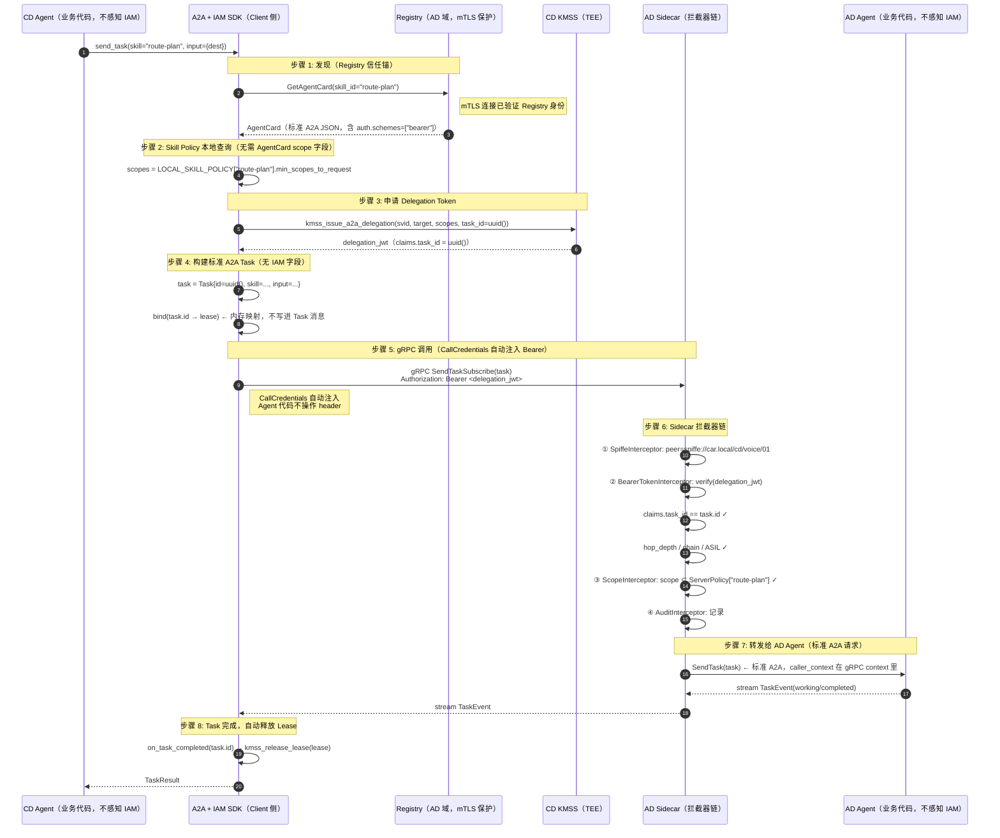

# 车载 IAM 对 A2A 的零侵入设计

> **问题**：现有 [`a2a_iam_integration_arch.md`](./a2a_iam_integration_arch.md) 将 IAM 字段
> 直接写进 AgentCard、Task 消息和 gRPC header，导致对 A2A 协议有结构性侵入。
>
> **本文目标**：重新设计，使 IAM 对 A2A 协议**零改动**——
> A2A AgentCard/Task/TaskEvent proto 完全不变，A2A Agent 业务代码完全不感知 IAM。

---

## 目录

- [1. 侵入点清单与分类](#1-侵入点清单与分类)
- [2. 零侵入设计原则](#2-零侵入设计原则)
- [3. AgentCard 完整性：三种非侵入方案](#3-agentcard-完整性三种非侵入方案)
- [4. Token 传递：Bearer + CallCredentials](#4-token-传递bearer--callcredentials)
- [5. Skill→Scope：Server-Side Policy 替代 AgentCard 声明](#5-skillscope-server-side-policy-替代-agentcard-声明)
- [6. Task-Lease 联动：SDK 内部映射](#6-task-lease-联动sdk-内部映射)
- [7. 零侵入后的完整架构图](#7-零侵入后的完整架构图)
- [8. 新旧改动对比表](#8-新旧改动对比表)
- [9. 约束与权衡](#9-约束与权衡)
- [10. 修订记录](#10-修订记录)

---

## 1. 侵入点清单与分类

### 1.1 现有设计的侵入点

下表对现有设计的每个 IAM 改动点按"侵入性"分类。

| 编号 | 改动位置 | 改动内容 | 侵入性质 |
|---|---|---|---|
| **I-1** | AgentCard JSON | 新增 `x-iam-signature`、`x-spiffe-id`、`x-asil-level`、`x-scope-required`、`x-max-delegation-depth` | **数据模型侵入**：发布方必须调 KMSS 签名后才能注册 Card |
| **I-2** | AgentSkill proto | 新增 `required_scopes` 字段 | **协议侵入**：IAM Scope 概念渗透进 A2A skill 定义 |
| **I-3** | Task proto | 新增 `lease_token_jti` 字段 | **协议侵入**：IAM 内部 ID 写进 A2A Task 消息 |
| **I-4** | gRPC 请求 metadata | 要求携带 `x-a2a-delegation`、`x-a2a-task-id` header | **调用协议侵入**：标准 A2A SDK 不携带这些 header |
| **I-5** | 发现路径 | 用私有 Registry 完全替代 `/.well-known/agent.json` | **发现协议侵入**：与标准 A2A 发现机制不兼容 |

### 1.2 侵入层次分析

```
A2A 协议边界
┌─────────────────────────────────────────────────────────┐
│  数据模型层   AgentCard JSON、Task proto                 │  ← I-1, I-2, I-3 侵入这里
│  调用协议层   gRPC metadata header                       │  ← I-4 侵入这里
│  发现机制层   /.well-known/ vs 私有 Registry             │  ← I-5 侵入这里
└─────────────────────────────────────────────────────────┘
IAM 应该只触碰的层
┌─────────────────────────────────────────────────────────┐
│  传输层       mTLS / TLS 证书（A2A 完全不感知）          │  ← 应该在这里
│  框架层       gRPC CallCredentials / Authorization header│  ← 应该在这里
│  代理层       Sidecar 拦截器（业务代码不感知）            │  ← 应该在这里
│  SDK 内部     Token 生命周期、Lease 绑定（内存状态）      │  ← 应该在这里
└─────────────────────────────────────────────────────────┘
```

**结论**：现有设计把 IAM 关注点推到了 A2A 协议边界内侧，应当**全部下移**到传输层 / 框架层 / 代理层。

---

## 2. 零侵入设计原则

| 原则 | 具体约束 |
|---|---|
| **A2A 数据模型不变** | AgentCard JSON、Task、TaskEvent、AgentSkill proto 完全不新增 IAM 字段 |
| **A2A Agent 代码不感知** | Agent 业务逻辑不调用任何 IAM API；只实现标准 A2A handler |
| **A2A 发现路径向后兼容** | 私有 Registry 是增量路径；标准 `/.well-known/` 路径保留（安全降级） |
| **Token 走标准 HTTP 语义** | 使用 `Authorization: Bearer <token>`（RFC 6750），不造自定义 header |
| **IAM 关注点限于代理层** | Sidecar 负责验证；Agent 后面的代码无论如何都收到已验证的请求 |

---

## 3. AgentCard 完整性：签名 vs 加密的选择

### 3.0 为什么不需要加密（威胁模型推导）

这里通过威胁模型严格推导，说明 AgentCard 需要**签名（Integrity）**而非**加密（Confidentiality）**。

#### 3.0.1 AgentCard 包含什么

```json
{
  "name": "AD Perception Agent",
  "skills": [{"id": "route-plan", "name": "路径规划"}],
  "authentication": {"schemes": ["bearer"]}
}
```

这是**能力声明（Capability Advertisement）**，等价于服务的接口文档，不包含业务数据、用户信息或系统内部参数。

#### 3.0.2 攻击者能用 AgentCard 做什么

```
场景 A: 攻击者读到了 AgentCard（知道 route-plan skill 存在）
  → 接下来需要调用 Agent
  → 调用需要：有效 Bearer Token（KMSS 签发）+ mTLS 证书（SPIFFE SVID）
  → 没有 Token，知道 skill 名称也无法调用
  → 加密 AgentCard 对目标 A 无效

场景 B: 攻击者想知道整车 Agent 拓扑（有哪些 Agent、什么能力）
  → 需要连接到 Registry 读取
  → Registry 是 mTLS 保护的，只有持有有效 SVID 的工作负载才能连接
  → 未授权的攻击者根本连不上 Registry
  → 加密 AgentCard 内容是对"已经进入 Registry 授权范围"的主体的再加密 = 重复保护
  → 对目标 B 也无效

场景 C: 攻击者篡改 AgentCard（将 endpoint 改为恶意地址，或修改 skill 声明）
  → 这是完整性威胁（Tampering），不是机密性威胁（Disclosure）
  → 加密（JWE）不阻止篡改！只有签名（JWS）才阻止篡改
  → 这是真正需要防御的威胁
```

#### 3.0.3 安全需求映射

```
AgentCard 的实际安全需求：
  ✅ 完整性（Integrity）: 确认 Card 没有被篡改，来自真实 Agent
     → 签名（JWS）解决

  ❌ 机密性（Confidentiality）: 隐藏 skill 列表内容
     → 威胁模型分析：Registry 访问已受控，内容本身非敏感
     → 加密（JWE）不必要，且破坏标准 A2A 发现协议

加密的代价 vs 收益：
  代价: 标准 A2A 客户端无法读取 skill 列表（发现功能失效）
        密钥分发问题（与 mTLS 证书同等复杂但保护价值更低）
        增加延迟（JWE 解密是 CPU 密集操作）
  收益: 几乎没有（已经被 Registry mTLS 访问控制覆盖）
```

> **结论**：AgentCard 需要签名（防篡改），不需要加密（机密性已由 Registry mTLS 访问控制保证）。加密的是**调用时传输的业务数据**，不是能力声明本身。

#### 3.0.4 唯一例外：AgentCard 包含敏感参数

若 AgentCard 中的某个 skill 参数本身是敏感信息（如内部系统地址、时序参数），
**正确做法是把这些参数移出 AgentCard**（放到调用时请求体中，通过 mTLS 保护），
而不是加密整个 AgentCard。

---

### 3.1 三种非侵入完整性方案对比

| 方案 | 修改 AgentCard 结构？ | 离线验证？ | 推荐场景 |
|---|---|---|---|
| **A: Registry 信任锚** | ❌ 完全不改 | ❌（依赖实时 mTLS）| 车端常规场景（mTLS 始终可用）|
| **B: 外层 JWS 签名** | ❌ 完全不改 | ✅（可缓存验签）| 需要离线验证或缓存场景 |
| **C: AgentCard 内 `x-` 扩展** | ⚠️ 增加可选字段 | ✅ | 跨信任域传播（最小侵入备选）|
| ~~加密（JWE）~~ | —— | —— | ~~不推荐：破坏发现协议~~ |

### 3.2 方案 A：Registry 信任锚（推荐，零侵入）

```text
核心思路：信任 Card 内容 = 信任发布 Card 的 Registry

类比：浏览器不对 HTML 内容单独签名，
     但通过验证 HTTPS 证书（服务器身份）来信任整个页面。

Registry 本身有 SPIFFE SVID → 用 mTLS 暴露服务
Client 通过 mTLS 连到 Registry → 连接已经验证了 Registry 身份
Registry 返回的 AgentCard → 被隐式认为"Registry 为其背书"
                             （Registry 注册时已验证了 Agent 的 SVID）
```

**Registry 服务配置**：

```
spiffe://car.local/ns/infra/sa/ad-registry   ← Registry 的 SPIFFE ID
gRPC 端口: 8080，mTLS（服务端证书 = Registry SVID L2 证书）
Client 连接时：
  验证服务端证书链 → 确认是 ad-registry，来自 car.local 域
  连接成功 → 此连接上的一切响应均由 Registry 背书
  无需对 AgentCard JSON 内容单独验签
```

**AgentCard（完全标准格式）**：

```json
{
  "name": "AD Perception Agent",
  "description": "自动驾驶域感知与规划 Agent",
  "url": "grpcs://ad-sidecar.car.local:7000",
  "version": "1.2.0",
  "capabilities": { "streaming": true },
  "skills": [
    {
      "id": "route-plan",
      "name": "路径规划",
      "inputModes": ["data"],
      "outputModes": ["data"]
    }
  ],
  "authentication": { "schemes": ["bearer"] }
}
```

`authentication.schemes = ["bearer"]` 是 **A2A 规范已定义的字段**，
IAM SDK 看到后知道需要通过 KMSS 获取 token，无需任何额外扩展字段。

### 3.3 方案 B：外层 JWS 签名（Registry 响应签名，可离线验证）

适用于：AgentCard 需要缓存后离线验证，或在 mTLS 无法实时验证的环境中传播。

```
Registry 在返回 AgentCard 时，将完整响应包在 JWS 信封里：
（注意：AgentCard JSON 本身完全不变，包裹在外层 payload 字段中）

{
  "payload":   "<base64url(原始 AgentCard JSON)>",
  "protected": "<base64url({\"alg\":\"ES256\",\"kid\":\"registry-l2-20260729\",\"iat\":1753879508})>",
  "signature": "<base64url(ES256(protected + '.' + payload))>"
}
```

**Client 处理**：
- **IAM-aware Client**：先验签 `signature`（用 Registry SVID L2 公钥），通过后解 `payload`
- **标准 A2A Client**：如果直接对 `payload` 做 base64url decode 就得到原始 AgentCard
- **AgentCard JSON 内容本身**：完全未修改

**Registry 签名 / Client 验签 API**：

```c
// Registry：签名响应（复用 Registry 自身的 L2 workload key）
int registry_sign_response(
    const uint8_t* card_json, size_t card_len,
    kmss_svid_t*   registry_svid,
    uint8_t*       jws_out, size_t* jws_len   // 紧凑序列化 JWS
);

// Client：验证并解包
int iam_sdk_verify_registry_response(
    const uint8_t* jws, size_t jws_len,
    const uint8_t* trust_bundle, size_t bundle_len,  // Registry 所在域的 bundle
    uint8_t*       card_json_out, size_t* card_len   // 输出原始 AgentCard JSON
);
// 返回 0=有效, -1=签名无效, -2=registry SVID 已过期, -3=bundle 过期
```

**JWS 的 `protected` header 中必须包含 `iat`（签名时间戳）**，
Client 校验 `iat + SVID TTL > now`，防止缓存的老 Card 签名被重放。

### 3.4 方案 C：`x-` 扩展字段（最小侵入备选）

适用于：AgentCard 需要脱离 Registry 自描述（如直接写在配置文件中、通过 OTA bundle 分发）。

```json
{
  "name": "...",
  "skills": [...],
  "authentication": { "schemes": ["bearer"] },
  "x-iam-sig": {
    "alg": "ES256",
    "kid": "l2-ad-percept-01",
    "iat": 1753879508,
    "sig": "<base64url(ES256(sha256(canonical_json_without_x_iam_sig)))>"
  }
}
```

签名对象 = `sha256(去掉 x-iam-sig 字段后的 canonical JSON)`。

**优点**：Card 可完全离线自验（无需连 Registry）。
**缺点**：Agent 启动时必须主动调 KMSS 签名 → 业务代码需感知 KMSS（仍有侵入）。
**推荐场景**：方案 A/B 均不可用时的备选，或需要在 A2A 消息之外传播 Card 的场景。

**车端推荐**：**方案 A（Registry 信任锚）** 为主，需要离线缓存时叠加**方案 B（JWS）**。

---

## 4. Token 传递：Bearer + CallCredentials

### 4.1 消除 `x-a2a-delegation` 侵入

**现有侵入**：要求 gRPC metadata 携带 `x-a2a-delegation`（自定义 header）。

**零侵入替代**：标准 HTTP/gRPC `Authorization: Bearer <token>`。

```
A2A 协议对 bearer token 的完整支持路径：

1. AgentCard 声明：authentication.schemes = ["bearer"]
   （A2A 标准字段，Client 知道需要 bearer token）

2. IAM SDK 获取 token：
   token = kmss_issue_a2a_delegation(...)
   （内部操作，A2A 协议不感知）

3. gRPC CallCredentials 注入：
   Authorization: Bearer <token>
   （HTTP/gRPC 标准，A2A Server 不需要解析，Sidecar 处理）

4. Sidecar 拦截器：
   从 Authorization header 提取 + 验证 bearer token
   （A2A Agent handler 之前完成）

5. A2A Agent 收到请求：
   ServerContext 里有 Authorization header，但 Agent 代码不读它
   （完全透明）
```

### 4.2 task_id 绑定的非侵入实现

**现有侵入**：需要 `x-a2a-task-id` header，且 Task proto 里有 `lease_token_jti`。

**零侵入替代**：利用 **A2A Task.id 本身**完成绑定，无需新增 header。

```
原有方案（侵入）：
  delegation_jwt.claims.task_id == x-a2a-task-id header（需新增 header）

零侵入方案：
  delegation_jwt.claims.task_id == A2A Task.id（已有标准 A2A 字段）

绑定验证（Sidecar 伪代码）：
  bearer_token = parse_authorization_header(meta["authorization"])
  claims = kmss_verify_a2a_delegation(bearer_token, trust_bundle)
  
  // 从 A2A 请求 body 提取 task_id（标准字段）
  a2a_task = proto_unmarshal(request_body, A2ATaskSubmit)
  
  if claims.task_id != a2a_task.task_id:
      return PERMISSION_DENIED  // task 绑定失败
```

**关键点**：A2A `Task.id` 是已有标准字段，KMSS 签发 delegation token 时将其写入 claims。
不需要任何新的 header 或 proto 字段。

### 4.3 gRPC CallCredentials 完整实现

```
Client 侧（IAM SDK 封装，对 Agent 业务代码透明）：

  A2AIAMCredentials.GetRequestMetadata() {
      token = sdk.get_or_refresh_delegation(task_ctx)
      return { "authorization": "Bearer " + token.raw }
  }

  // mTLS（Channel 级）+ Bearer（Call 级）= CompositeChannelCredentials
  channel = grpc_create_channel(
      "ad-sidecar:7000",
      CompositeChannelCredentials(
          SslCredentials(ca_cert, client_cert, client_key),  // SPIFFE SVID
          A2AIAMCredentials(sdk, task_ctx)
      )
  )
  // Agent 业务代码通过此 channel 正常发 A2A RPC，完全不管 IAM

Server 侧（Sidecar 拦截器，在 A2A handler 前）：

  BearerTokenInterceptor.Intercept(ctx, req) {
      bearer = ctx.meta["authorization"].strip_prefix("Bearer ")
      claims = kmss_verify_a2a_delegation(bearer, trust_bundle)
      // 验证 task_id 绑定（见 4.2）
      ctx.set("iam_claims", claims)  // 注入上下文，A2A handler 可选读取
      return next.handle(ctx, req)
  }
```

---

## 5. Skill→Scope：Server-Side Policy 替代 AgentCard 声明

### 5.1 移除 `required_scopes` 的理由

**现有侵入**：AgentSkill proto 有 `required_scopes` 字段，要求 Agent 发布方声明所需 scope。

这是设计方向错误：**Scope 是 Server 侧的策略，不是 Client 发现时需要知道的**。

```
错误方向（侵入）：
  AgentCard 里写 required_scopes → Client 用这个 scope 去申请 token
  问题：AgentCard 里的 scope 可以被恶意 Agent 填假值
       （少填：导致 Client token 不足，无法调用）
       （多填：诱导 Client 申请过宽 token，提升 Client 暴露面）

正确方向（非侵入）：
  KMSS Skill Policy Table（Server 端，编译期固化）里存 required_scopes
  Client 按 skill_id 在本地查 Policy Table，得到应该申请的 scope
  AgentCard 只说"我有 route-plan skill"，scope 由本地 Policy 决定
```

### 5.2 Skill Policy：双端各持一份

```
Client 侧（IAM SDK 内置，编译期）：
  KMSS_SKILL_POLICY["route-plan"] = {
      min_scopes_to_request: ["read:navi.route", "read:navi.traffic"],
      max_ttl: 600,
      min_caller_asil: QM
  }
  // Client 用 min_scopes 申请 delegation token
  // Client 不依赖 AgentCard 里的 scope 声明

Server 侧（Sidecar 内置，编译期）：
  KMSS_SKILL_POLICY["route-plan"] = {
      max_allowed_scopes: ["read:navi.route", "read:navi.traffic", "invoke:guard.ad"],
      max_ttl: 600,
      min_caller_asil: QM
  }
  // Sidecar 验证：token.scope ⊆ max_allowed_scopes
  // Server 端是权威，Client 端声明不可信
```

**两份 Policy 的分工**：
- Client Policy（`min_scopes_to_request`）：告诉 Client 最少要申请哪些 scope，否则调用会失败
- Server Policy（`max_allowed_scopes`）：Server 端的上限，防止 Client 申请过宽 scope 然后传给 Server

### 5.3 AgentCard 只携带 skill ID（无 scope）

```json
{
  "skills": [
    {
      "id": "route-plan",
      "name": "路径规划",
      "description": "给定目的地返回最优驾驶路径"
    }
  ]
}
```

Client SDK 看到 `skill_id = "route-plan"` → 查本地 `KMSS_SKILL_POLICY["route-plan"]`
→ 得到应申请的 scope → 申请 delegation token → 调用 Server。

AgentCard **不声明 scope**，完全标准 A2A 格式。

---

## 6. Task-Lease 联动：SDK 内部映射

### 6.1 移除 Task.lease_token_jti

**现有侵入**：Task proto 里有 `lease_token_jti`，把 IAM 内部 ID 写入 A2A 消息。

**零侵入替代**：SDK 内部用 `task_id → lease_jti` 的内存/持久化映射。

```c
// IAM SDK 内部（不暴露给 A2A 业务代码）
typedef struct {
    char task_id[64];        // A2A Task.id（标准字段）
    char lease_jti[37];      // IAM Lease JTI（内部状态）
    kmss_lease_t* lease;     // Lease 句柄
} task_lease_binding_t;

// SDK 维护一个 hash map
// key = task_id（来自 A2A Task.id）
// value = task_lease_binding_t

void sdk_bind_task_to_lease(const char* task_id, kmss_lease_t* lease) {
    task_lease_binding_t* b = hash_map_insert(&sdk.bindings, task_id);
    b->lease = lease;
    strncpy(b->lease_jti, lease->jti, 36);
}

// A2A Task cancel 回调（A2A SDK 触发，IAM SDK 内部响应）
void on_a2a_task_canceled(const char* task_id) {
    task_lease_binding_t* b = hash_map_get(&sdk.bindings, task_id);
    if (b) {
        kmss_revoke(b->lease_jti);  // IAM 内部操作
        hash_map_remove(&sdk.bindings, task_id);
    }
}
```

**A2A Task proto**（完全标准，无任何 IAM 字段）：

```proto
message Task {
  string id         = 1;   // A2A 标准字段
  string session_id = 2;
  TaskStatus status = 3;
  repeated Message history   = 4;
  repeated Artifact artifacts = 5;
  // 没有 lease_token_jti！
}
```

IAM SDK 通过 `Task.id`（已有标准字段）在内部完成与 Lease 的关联，零协议侵入。

---

## 7. 零侵入后的完整架构图

### 7.1 分层边界

```
┌──────────────────────────────────────────────────────────────────┐
│  A2A 协议边界（以下内容完全不变）                                  │
│                                                                  │
│  AgentCard JSON: name / skills / authentication.schemes          │
│  Task proto: id / session_id / status / history / artifacts      │
│  TaskEvent proto: TaskState / Message / Artifact                 │
│  A2ATaskService: SendTask / Subscribe / CancelTask               │
│  A2A Agent 业务代码: 只实现 A2A handler                           │
└──────────────────────────────────────────────────────────────────┘
        ▲ A2A 协议边界，IAM 在此线之下，不越界
        │
┌───────┴──────────────────────────────────────────────────────────┐
│  IAM 层（全部在 A2A 协议边界之外）                                 │
│                                                                  │
│  ┌─────────────────────────────────────────────────────────┐    │
│  │ 传输层（mTLS + SPIFFE SVID）                             │    │
│  │  • Channel 级身份验证                                   │    │
│  │  • Registry 访问控制                                    │    │
│  │  • A2A 完全不感知                                        │    │
│  └─────────────────────────────────────────────────────────┘    │
│                                                                  │
│  ┌─────────────────────────────────────────────────────────┐    │
│  │ 框架层（gRPC CallCredentials）                           │    │
│  │  • A2AIAMCredentials.GetRequestMetadata()               │    │
│  │  → 自动注入 Authorization: Bearer <token>               │    │
│  │  • Token 获取 / 缓存 / 刷新对 Agent 透明                 │    │
│  └─────────────────────────────────────────────────────────┘    │
│                                                                  │
│  ┌─────────────────────────────────────────────────────────┐    │
│  │ 代理层（Guard Sidecar 拦截器链）                         │    │
│  │  1. SpiffeInterceptor   → 提取 TLS peer SPIFFE ID       │    │
│  │  2. BearerTokenInterceptor → 验证 Authorization: Bearer  │    │
│  │     • kmss_verify_a2a_delegation()                      │    │
│  │     • task_id 绑定（claims.task_id == Task.id）          │    │
│  │     • hop_depth / chain / skill / ASIL 检查             │    │
│  │  3. ScopeInterceptor    → scope ⊆ Server Skill Policy   │    │
│  │  4. AuditInterceptor    → 写入审计日志                   │    │
│  │  A2A Agent handler 在上述全部通过后才收到请求             │    │
│  └─────────────────────────────────────────────────────────┘    │
│                                                                  │
│  ┌─────────────────────────────────────────────────────────┐    │
│  │ SDK 内部（IAM SDK，对 Agent 业务代码透明）                │    │
│  │  • Token 生命周期（SVID / Session / Lease）              │    │
│  │  • task_id → lease_jti 内存映射（非 A2A 消息字段）       │    │
│  │  • Skill Policy Table（Client 侧，编译期固化）           │    │
│  │  • Task 状态 → Lease 操作的内部回调                      │    │
│  └─────────────────────────────────────────────────────────┘    │
│                                                                  │
│  ┌─────────────────────────────────────────────────────────┐    │
│  │ 注册层（AgentCard Registry，基础设施）                    │    │
│  │  • mTLS-protected gRPC 服务（Registry SVID）            │    │
│  │  • 注册时验证 Agent SVID → Card 可信性由连接保证         │    │
│  │  • 可选：JWS 响应签名（方案 B）                          │    │
│  │  • AgentCard 内容：标准 A2A JSON，无 IAM 字段            │    │
│  └─────────────────────────────────────────────────────────┘    │
└──────────────────────────────────────────────────────────────────┘
```

### 7.2 一次完整的 A2A 调用全流程（零侵入版）



---

## 8. 新旧改动对比表

| 位置 | 旧设计（侵入）| 新设计（零侵入）|
|---|---|---|
| **AgentCard 结构** | 新增 `x-iam-signature`、`x-spiffe-id`、`x-asil-level` 等 5 个 IAM 字段 | **完全不变**；可信性由 mTLS Registry 连接保证 |
| **AgentSkill proto** | 新增 `required_scopes` | **完全不变**；scope 来自 Client 侧 Skill Policy Table |
| **Task proto** | 新增 `lease_token_jti` | **完全不变**；task→lease 映射在 SDK 内存中 |
| **gRPC metadata** | 自定义 `x-a2a-delegation`、`x-a2a-task-id` header | **标准 `Authorization: Bearer`**（RFC 6750） |
| **task_id 绑定** | 需要 `x-a2a-task-id` header（新增字段）| 用已有的 `Task.id`（标准 A2A 字段）与 token claims 绑定 |
| **发现机制** | 私有 Registry 完全替代 `/.well-known/` | Registry 是**增量路径**；`/.well-known/` 保留为 fallback |
| **Agent 业务代码** | 需要感知 `caller_context`（含 IAM claims）| **完全不感知 IAM**；只实现标准 A2A handler |
| **AgentCard 完整性** | Agent 启动时主动调 KMSS 签名，写入 `x-iam-signature` | Registry 连接的 mTLS 即为完整性保证（方案 A）；可选方案 B（JWS 包裹，AgentCard 本身不变）|
| **Skill Policy 来源** | AgentCard 的 `required_scopes`（Agent 自己声明） | **Server 端 Skill Policy Table**（编译期固化，更安全）|

### 哪些地方仍然需要 IAM 感知？

| 组件 | 需要感知 IAM | 原因 |
|---|---|---|
| **IAM SDK** | ✅ 是 | 管理 SVID / Token / Lease 生命周期（完全封装，Agent 不感知）|
| **Guard Sidecar** | ✅ 是 | 验证 Bearer token，执行 Skill Policy（代理层职责）|
| **Registry** | ✅ 是 | 注册时验证 Agent SVID（基础设施层职责）|
| **KMSS** | ✅ 是 | 签发 / 撤销 token（IAM 核心层）|
| **A2A Agent 业务代码** | ❌ 否 | 仅实现标准 A2A handler，不调任何 IAM API |
| **AgentCard JSON** | ❌ 否 | 标准 A2A 格式，`authentication.schemes=["bearer"]` 是标准字段 |
| **Task / TaskEvent proto** | ❌ 否 | 完全标准 A2A，无 IAM 字段 |

---

## 9. 约束与权衡

### 9.1 移除 `required_scopes` 的风险

**风险**：Client 侧 Skill Policy Table 与 Server 侧 Skill Policy Table 可能不同步（OTA 后）。

**缓解**：
- Client Policy 只记录`min_scopes`（必须有这些才能调），Server Policy 记录`max_scopes`（不超过这些）
- 两者更新机制：通过同一份 OTA bundle（`skill_policy_bundle.pb`）同步推送
- 不同步的后果：Client 少申请 scope → Server 拒绝（安全 fail-closed，可重试）；不存在安全越权

### 9.2 Registry 信任锚的 mTLS 依赖

**风险**：若 Client 无法建立 mTLS 连接到 Registry（证书轮换、网络故障），无法验证 Card。

**缓解**：
- 本地 AgentCard 缓存（5min TTL），mTLS 故障时使用缓存
- 紧急降级：可选方案 B（JWS 签名），脱离 mTLS 实现离线验签

### 9.3 `Authorization: Bearer` 与现有 gRPC mTLS 的兼容性

Bearer token 在 HTTP/2 的 `authorization` 伪首部中传输，与 mTLS（TLS 层）**正交**，可同时存在：
- mTLS 验证 Channel 级身份（"谁在连接"）
- Bearer 验证 Call 级授权（"这次调用有权做什么"）

gRPC `CompositeChannelCredentials` 原生支持两者叠加，无需任何协议扩展。

---

## 10. 修订记录

| 版本 | 日期 | 内容 |
|---|---|---|
| 1.0 | 2026-07-30 | 初稿：5 个侵入点分析 + 零侵入重设计（Registry 信任锚 + Bearer + Server-Side Skill Policy + SDK 内部 Task-Lease 映射）|
| 1.1 | 2026-07-30 | §3 重写：补充加密 vs 签名的威胁模型推导（§3.0），明确加密不必要的三个场景分析；JWS 方案增加 `iat` 时间戳要求 |
