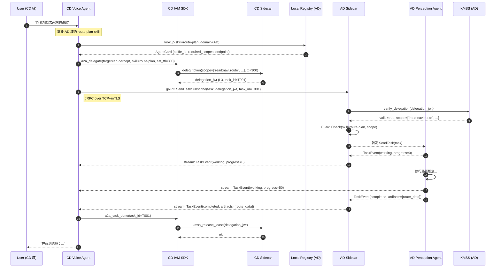

# 车载 LLM Agent A2A 协议设计

> **A2A（Agent-to-Agent）** 是 Google 于 2025 年 4 月发布的开放标准协议，
> 用于 AI Agent 之间的能力发现、任务委托与结果交换。
>
> 本文档描述如何将 A2A 协议应用于车端三域（AD/CD/VD）LLM Agent 场景，
> 以及与 [`iam_auth_architecture.md`](./iam_auth_architecture.md)（KMSS IAM 体系）的集成方式。

---

## 目录

- [1. A2A 协议基础](#1-a2a-协议基础)
- [2. 核心概念](#2-核心概念)
- [3. 车载 A2A 设计](#3-车载-a2a-设计)
- [4. A2A ↔ IAM 集成](#4-a2a--iam-集成)
- [5. 安全威胁与防护](#5-安全威胁与防护)
- [6. 与现有 delegation 机制的关系](#6-与现有-delegation-机制的关系)
- [7. 实现路径](#7-实现路径)
- [8. 参考](#8-参考)

---

## 1. A2A 协议基础

### 1.1 设计动机

在多 Agent 编排场景中，各 Agent 来自不同团队甚至不同供应商，需要一种**标准化的互操作协议**让：

- Client Agent（调用方）可以发现 Remote Agent（被调方）的能力
- 双方能够安全地发起、跟踪、撤销任务
- 长时运行任务支持流式返回（SSE）和推送通知（Webhook）

原始规范基于 HTTP/JSON，本文档扩展到**车端 gRPC-over-mTLS** 场景。

### 1.2 与 MCP 的关系

| 维度 | MCP（Model Context Protocol） | A2A（Agent-to-Agent Protocol） |
|---|---|---|
| 定位 | Agent ↔ Tool | Agent ↔ Agent |
| 方向 | Client → 工具服务（单向） | 双向委托 |
| 发现 | 工具列表（tools/list） | AgentCard（能力名片） |
| 状态 | 无状态 RPC | 有状态 Task 生命周期 |
| 身份 | OAuth 2.0 token | OIDC / SPIFFE SVID |
| 车端适配 | 工具调用层 | 跨域任务编排层 |

**车端使用原则**：
- MCP 用于 Agent 调用具体工具（camera snapshot、CAN dump 等）
- A2A 用于 Agent 之间的任务委托（CD Agent 把路径规划子任务委托给 AD Agent）

---

## 2. 核心概念

### 2.1 AgentCard

AgentCard 是 A2A 协议的**能力发现文档**，相当于 Agent 的"服务名片"。

**标准 AgentCard 字段**：

```json
{
  "name": "AD Perception Agent",
  "description": "自动驾驶域感知与规划 Agent",
  "url": "https://ad.car.local:7000/a2a",
  "version": "1.2.0",
  "capabilities": {
    "streaming": true,
    "pushNotifications": false,
    "stateTransitionHistory": true
  },
  "skills": [
    {
      "id": "route-plan",
      "name": "路径规划",
      "description": "给定目的地返回最优驾驶路径",
      "inputModes": ["text", "data"],
      "outputModes": ["data"]
    },
    {
      "id": "object-detection",
      "name": "障碍物检测（只读）",
      "inputModes": ["data"],
      "outputModes": ["data"]
    }
  ],
  "authentication": {
    "schemes": ["spiffe"]
  },
  "securitySchemes": {
    "spiffe": {
      "type": "svid",
      "trustDomain": "car.local"
    }
  }
}
```

**车端扩展字段**（非标准扩展，用 `x-` 前缀）：

```json
{
  "x-vehicle-domain": "AD",
  "x-asil-level": "ASIL-D",
  "x-scope-required": ["read:navi.route"],
  "x-spiffe-id": "spiffe://car.local/ns/adas/sa/perception-agent",
  "x-max-delegation-depth": 2
}
```

### 2.2 AgentCard 发现路径

**标准路径**（公网）：`https://host/.well-known/agent.json`

**车端私有发现**（不走公网）：

```
车端 AgentCard 注册表（Local Registry）
    AD 域: ad-registry.car.local:8080
    CD 域: cd-registry.car.local:8080
    VD 域: vd-registry.car.local:8080

查询方式:
    GET /agents/{agent-id}        → 单个 AgentCard
    GET /agents?domain=AD         → 域内所有 Agent
    GET /agents?skill=route-plan  → 能提供该 skill 的 Agent

mTLS 保护：和 IAM Sidecar 共用同一套 trust bundle
```

### 2.3 Task 生命周期

```
                ┌──────────────────────────────────┐
                │        Task 状态机                │
                └──────────────────────────────────┘

Client 提交任务
       │
       ▼
  ┌──────────┐
  │ submitted │ ← Client 提交，Server 已收到
  └────┬─────┘
       │ Server 开始处理
       ▼
  ┌──────────┐
  │  working  │ ← 进行中（可推送进度 SSE）
  └────┬─────┘
       │
   ┌───┴─────────────────┐
   │                     │
   ▼                     ▼
┌──────────┐      ┌──────────────┐
│ completed│      │input-required│ ← 需要 Client 补充输入
└──────────┘      └──────┬───────┘
                         │ Client 补充输入
                         ▼
                    ┌──────────┐
                    │  working  │
                    └──────────┘

任意状态可转入：
  ┌──────────┐     ┌──────────┐
  │ canceled │     │  failed  │
  └──────────┘     └──────────┘
```

**Task 对象结构**：

```json
{
  "id": "task-ad-20260729-001",
  "sessionId": "sess-cd-abc123",
  "status": {
    "state": "working",
    "message": {
      "role": "agent",
      "parts": [{"type": "text", "text": "正在计算最优路径..."}]
    },
    "timestamp": "2026-07-29T10:00:00Z"
  },
  "history": [...],
  "artifacts": [...],
  "metadata": {}
}
```

### 2.4 Message 与 Part 模型

```
Message
  ├── role: "user" | "agent"
  └── parts[]
        ├── TextPart    { type: "text", text: "..." }
        ├── FilePart    { type: "file", file: { name, mimeType, bytes/uri } }
        └── DataPart    { type: "data", data: { ... } }  ← 结构化数据
```

**车端典型 Part 使用**：

| Part 类型 | 车载用途 | 示例 |
|---|---|---|
| TextPart | 自然语言指令/回复 | "规划去南站的路线" |
| DataPart | 传感器数据、路况、路径坐标 | GPS 坐标数组、地图 JSON |
| FilePart | 日志、模型 artifact | 诊断日志 binary |

### 2.5 流式响应（SSE）

长时任务（如路径规划、OTA 下载）使用 Server-Sent Events：

```
Client → Server: POST /tasks/send-subscribe
Server → Client: 持续推送

event: update
data: {"id":"task-001","status":{"state":"working","progress":30}}

event: update
data: {"id":"task-001","status":{"state":"working","progress":80}}

event: done
data: {"id":"task-001","status":{"state":"completed"},"artifacts":[...]}
```

**车端适配**：HTTP SSE → gRPC 双向流（`stream TaskEvent`）

---

## 3. 车载 A2A 设计

### 3.1 三域 A2A 拓扑

```
┌──────────────────────────────────────────────────────────────────┐
│                       整车 A2A 拓扑                              │
│                                                                  │
│  ┌─────────────────┐      ┌─────────────────┐                  │
│  │   CD 域 (QM)     │      │   AD 域 (ASIL-D) │                  │
│  │                 │      │                 │                  │
│  │  Voice Agent    │─────▶│  Perception     │                  │
│  │  (A2A Client)   │  A2A │  Agent          │                  │
│  │                 │◀─────│  (A2A Server)   │                  │
│  │  Navigation     │      │                 │                  │
│  │  Agent          │      │  Planning Agent  │                  │
│  │  (A2A Server)   │◀─────│  (A2A Client)   │                  │
│  └─────────────────┘      └─────────────────┘                  │
│           │                       │                             │
│           └──────────┬────────────┘                             │
│                      │                                          │
│              ┌───────▼─────────┐                               │
│              │   VD 域 (ASIL-D) │                               │
│              │                 │                               │
│              │  HMI Agent      │                               │
│              │  (A2A Server)   │                               │
│              └─────────────────┘                               │
│                                                                  │
│  通信：gRPC over TCP + mTLS（跨域）/ gRPC over UDS（域内）       │
└──────────────────────────────────────────────────────────────────┘
```

### 3.2 车载 A2A gRPC 接口定义

```proto
syntax = "proto3";
package vehicle.a2a.v1;

// A2A 服务端（被调 Agent）必须实现
service A2AService {
  // 获取 AgentCard
  rpc GetAgentCard(GetAgentCardRequest) returns (AgentCard);

  // 提交任务（非流式）
  rpc SendTask(SendTaskRequest) returns (Task);

  // 提交任务（流式进度）
  rpc SendTaskSubscribe(SendTaskRequest) returns (stream TaskEvent);

  // 获取任务状态
  rpc GetTask(GetTaskRequest) returns (Task);

  // 取消任务
  rpc CancelTask(CancelTaskRequest) returns (Task);

  // 补充输入（input-required 状态时）
  rpc SendTaskUpdate(SendTaskUpdateRequest) returns (Task);
}

message AgentCard {
  string name                    = 1;
  string description             = 2;
  string spiffe_id               = 3;  // 车端扩展：SPIFFE ID
  string vehicle_domain          = 4;  // 车端扩展：AD/CD/VD
  string asil_level              = 5;  // 车端扩展：ASIL 等级
  repeated AgentSkill skills     = 6;
  AgentCapabilities capabilities = 7;
}

message AgentSkill {
  string id          = 1;
  string name        = 2;
  string description = 3;
  repeated string required_scopes = 4;  // 调用本 skill 需要的 scope
}

message Task {
  string id        = 1;
  string session_id = 2;
  TaskStatus status = 3;
  repeated Message history  = 4;
  repeated Artifact artifacts = 5;
  string lease_token_jti = 6;  // 车端扩展：绑定的 IAM Lease Token
}

message TaskStatus {
  TaskState state   = 1;
  Message message   = 2;
  string timestamp  = 3;
}

enum TaskState {
  TASK_STATE_UNKNOWN        = 0;
  TASK_STATE_SUBMITTED      = 1;
  TASK_STATE_WORKING        = 2;
  TASK_STATE_INPUT_REQUIRED = 3;
  TASK_STATE_COMPLETED      = 4;
  TASK_STATE_CANCELED       = 5;
  TASK_STATE_FAILED         = 6;
}
```

### 3.3 AgentCard 注册表（Local Registry）

车端不使用 `/.well-known/`，改用私有注册表：

```c
// agent_registry.h
typedef struct {
    char agent_id[64];
    char spiffe_id[128];
    char vehicle_domain[4];  // "AD" / "CD" / "VD"
    char asil_level[8];
    char grpc_endpoint[256];
    uint8_t skill_ids[8][32];
    uint8_t n_skills;
    uint64_t registered_at;
    uint64_t expires_at;     // TTL（与 SVID TTL 一致，1h）
} agent_registry_entry_t;

// 注册（Agent 启动时调用）
int registry_register(const agent_registry_entry_t* entry,
                      kmss_svid_t* svid);  // 必须携带有效 SVID

// 查询
int registry_lookup_by_skill(const char* skill_id,
                              agent_registry_entry_t* out,
                              size_t max_results);

// 注销
int registry_deregister(const char* agent_id, kmss_svid_t* svid);
```

**注册表安全**：
- 注册时必须携带有效 SVID（KMSS 签发，Sidecar 验证）
- 注册表条目 TTL = SVID TTL（1h），自动过期
- 跨域查询需要 delegation token

---

## 4. A2A ↔ IAM 集成

### 4.1 整体集成架构

```
┌───────────────────────────────────────────────────────────────┐
│                    A2A 调用完整流程                            │
└───────────────────────────────────────────────────────────────┘

Step 1: Client Agent 发现 Remote Agent
    Client SDK → Local Registry: lookup(skill_id)
    Local Registry → Client SDK: AgentCard + SPIFFE ID

Step 2: Client Agent 申请 A2A Delegation Token
    Client SDK → KMSS Sidecar: request delegation(
        target_spiffe_id = remote_agent.spiffe_id,
        scope = skill.required_scopes,          ← 来自 AgentCard
        ttl = estimated_task_duration
    )
    KMSS → Client SDK: delegation_token (L3 Lease, 带 task_id)

Step 3: Client 向 Remote Agent 发起 A2A 任务
    gRPC metadata:
        x-svid: <Client 的 SVID JWT>
        x-delegation: <delegation_token>
        x-a2a-task-id: <task_id>

Step 4: Remote Agent Sidecar 验证
    Remote Sidecar → KMSS: verify_delegation(delegation_token)
    KMSS → Remote Sidecar: valid=true, claims={scope, ttl, ...}
    Remote Sidecar → Remote Agent: 转发请求（通过 Guard.Check）

Step 5: 任务执行期间的 Token 管理
    - Remote Agent 用 task_token (L1) 做每次工具调用
    - 任务结束：Remote Agent → Client: TaskEvent(COMPLETED)
    - Client SDK: kmss_release_lease(delegation_token)
```

### 4.2 Token 层与 A2A Task 对应关系

```
IAM 层级              A2A 层级                说明
─────────────────────────────────────────────────────────
L0: Workload SVID  ←→  AgentCard.spiffe_id  工作负载身份
L2: Session Token  ←→  A2A SessionId        会话级身份凭证
L3: Lease Token    ←→  A2A Task             任务级授权，TTL = 任务时长
L1: Task Token     ←→  每次 skill 调用       单次操作的精确 scope
```

**绑定规则**：
- 一个 A2A Task 对应**一个 L3 Lease Token**
- L3 Lease Token 的 `task_id` 字段记录 A2A `task.id`
- A2A Task 取消（CANCELED）→ 立刻触发 `kmss_release_lease()`
- A2A Task 超时（心跳中断）→ Lease 心跳失败 → KMSS revoke

### 4.3 scope 与 skill 的映射

AgentCard 中每个 skill 声明所需 scope，IAM 在 delegation 时使用：

```
AgentCard.skills[route-plan].required_scopes = [
    "read:navi.route",
    "read:navi.traffic",
    "invoke:guard.ad"
]

↓  转换为 delegation scope

kmss_delegate(
    parent = caller_svid,
    target = "spiffe://car.local/ns/adas/sa/perception-agent",
    scopes = ["read:navi.route", "read:navi.traffic", "invoke:guard.ad"],
    ttl    = 300  // 5 分钟，对应 route-plan 任务预估时长
)
```

**scope 自动衰减**：
- Client Agent 只能 delegate ⊆ 自身 scope
- Cross-domain: QM → ASIL-D scope 自动过滤（`tool:control.*` 不允许）
- AgentCard 若声明 scope 超过 Client 实际 scope → IAM 拒绝并返回 403

### 4.4 A2A 认证流（gRPC metadata）

```
Client → Server gRPC 请求 metadata:

  Authorization: Bearer <session_jwt>      // L2 Session Token（常设）
  x-a2a-delegation: <delegation_jwt>       // L3 Lease Token（A2A 专用）
  x-a2a-task-id: <task_uuid>
  x-svid-cert: <base64(SVID X.509 DER)>    // 可选，mTLS 已包含时省略
  x-a2a-version: "1.0"

Server Sidecar 验证顺序：
  1. mTLS 连接层：验证 Client 的 TLS 证书链 → 确认 trust domain
  2. delegation JWT：kmss_verify_delegation() → scope / ttl / parent_jti
  3. task-id 绑定：delegation.task_id == x-a2a-task-id（防 task 劫持）
  4. Guard.Check：action = skill_id，scope 命中检查
```

### 4.5 时序图：跨域 A2A 任务（CD → AD）



---

## 5. 安全威胁与防护

### 5.1 威胁矩阵（A2A 专项）

| # | 威胁 | STRIDE 类别 | 攻击场景 | 防护措施 |
|---|---|---|---|---|
| T1 | **AgentCard 伪造** | 欺骗 (S) | 恶意进程冒充 AD Agent 注册虚假 AgentCard，诱导 CD Agent 发送任务 | AgentCard 注册必须携带有效 SVID；注册表用 mTLS 保护 |
| T2 | **Task 劫持** | 欺骗 (S) | 中间人拦截 task_id，用旧 delegation_jwt 重放 | delegation_jwt 绑定 task_id（`claims.task_id`）；KMSS 验证匹配 |
| T3 | **Skill scope 越权** | 特权提升 (E) | Client Agent 声称 skill 只需 read scope 但实际执行 write | Server Sidecar 在 Guard.Check 时验证每次工具调用 scope ⊆ delegation scope |
| T4 | **恶意 AgentCard 注入** | 篡改 (T) | 攻击者通过 OTA 或 LLM prompt 注入伪造的 AgentCard URL | AgentCard 来源必须是受信注册表（不信任 LLM 输出的 URL） |
| T5 | **任务时间延长攻击** | 特权提升 (E) | Remote Agent 故意不返回 COMPLETED，让 Lease Token 一直有效 | Lease 心跳超时自动 revoke；每个 skill 设置 max_task_ttl |
| T6 | **跨域 scope 升级** | 特权提升 (E) | CD Agent（QM）通过 A2A 调用 AD Agent，绕过 ASIL 边界执行 ASIL-D 操作 | `x-asil-level` 字段在 IAM 校验；QM→ASIL-D 的 scope 在 delegation 时过滤 |
| T7 | **A2A 协议降级** | 欺骗 (S) | 攻击者强制 Client 使用 HTTP 明文（无 mTLS）发送 delegation_jwt | 车端强制 gRPC over mTLS；明文请求直接拒绝（KMSS trust bundle 验证失败） |
| T8 | **Task 历史泄露** | 信息泄露 (I) | 第三方查询 Task history 获取路径规划、用户意图等敏感信息 | `GetTask` 需要原始 delegation_jwt（或 session_jwt），无权限者返回 403 |
| T9 | **AgentCard Spoofing via Prompt Injection** | 欺骗 (S) | LLM 被注入 prompt，使其向攻击者控制的 AgentCard URL 发送任务 | AgentCard 必须从注册表查询，禁止 Agent 业务代码直接解析 LLM 输出的 URL |
| T10 | **Agent 身份混淆** | 欺骗 (S) | 同域内多个 Agent 实例，攻击者用过期 SVID 冒充合法 Agent | SVID TTL = 1h，每次 A2A 调用都验证 SVID 新鲜度（nbf/exp）；跨域通过 Trust Bundle 验根 |

### 5.2 A2A 专项防护实现

#### 5.2.1 AgentCard 发现安全化

```c
// 禁止：直接信任 LLM 返回的 URL
// const char* url = llm_output_parse_url(response);  // ❌

// 正确：从受信注册表查询
agent_registry_entry_t entry;
if (registry_lookup_by_skill("route-plan", &entry, 1) != 0) {
    fail("no trusted agent for skill:route-plan");
}
// 使用 entry.grpc_endpoint（来自注册表，注册时经过 SVID 验证）
```

#### 5.2.2 Task ID 绑定校验

```c
// Server Sidecar 验证 delegation 绑定的 task_id
kmss_claims_t claims;
if (kmss_verify_delegation(delegation_jwt, trust_bundle, &claims) != 0)
    return PERMISSION_DENIED;

// task_id 必须与请求头匹配
const char* req_task_id = grpc_metadata_get(ctx, "x-a2a-task-id");
if (strcmp(claims.task_id, req_task_id) != 0) {
    audit_log_write(AUDIT_A2A_TASK_ID_MISMATCH, claims.jti);
    return PERMISSION_DENIED;
}
```

#### 5.2.3 ASIL 边界强制

```c
// delegation 申请时检查 ASIL 边界
typedef enum { ASIL_QM = 0, ASIL_A, ASIL_B, ASIL_C, ASIL_D } asil_level_t;

int kmss_delegate_a2a(
    kmss_svid_t*    caller_svid,
    const char*     target_spiffe_id,
    asil_level_t    target_asil,     // 来自 AgentCard
    const char**    scopes, size_t n,
    uint32_t        ttl_seconds
) {
    asil_level_t caller_asil = svid_get_asil(caller_svid);
    
    // QM 域调用 ASIL-D 资源需要过滤 scope
    if (caller_asil == ASIL_QM && target_asil >= ASIL_D) {
        scopes = filter_qm_scopes(scopes, n, &n);
        // filter 移除所有 "tool:control.*" 和 "write:*" scope
    }
    
    return kmss_delegate(caller_svid, target_spiffe_id, scopes, n, ttl_seconds);
}
```

### 5.3 A2A 最大任务时长配置

```c
// 每个 skill 的最大 TTL 限制（编译期固化）
static const struct {
    const char* skill_id;
    uint32_t    max_ttl_seconds;
    asil_level_t min_caller_asil;
} SKILL_POLICY[] = {
    { "route-plan",       600,   ASIL_QM   },  // 路径规划 10min
    { "object-detection", 30,    ASIL_QM   },  // 感知 30s
    { "ota-download",     3600,  ASIL_QM   },  // OTA 1h
    { "brake-control",    5,     ASIL_D    },  // 制动 5s，ASIL-D 才能调
    { "speed-set",        10,    ASIL_D    },  // 速度设定 10s
};
```

---

## 6. 与现有 delegation 机制的关系

### 6.1 对比

| 维度 | 现有 Cross-domain Delegation | A2A 协议层 |
|---|---|---|
| 层级 | IAM 传输层（token 管理） | 应用语义层（任务生命周期） |
| 关注点 | 谁能调用、scope 是什么 | 调用什么任务、进展如何 |
| 发现 | 硬编码 SPIFFE ID | AgentCard 动态发现 |
| 状态追踪 | 无（stateless token） | 有（Task 状态机） |
| 流式支持 | 无 | SSE / gRPC stream |
| 取消语义 | `kmss_release_lease()` | A2A CancelTask + lease release |

### 6.2 互补关系

```
┌─────────────────────────────────────────────────────────────┐
│                  A2A + IAM 分层职责                          │
├─────────────────────────────────────────────────────────────┤
│  A2A 协议层  │ • AgentCard 发现                              │
│              │ • Task 生命周期管理（submitted/working/done） │
│              │ • 流式结果推送                                │
│              │ • Task 取消与超时                             │
├─────────────────────────────────────────────────────────────┤
│  IAM 层      │ • 工作负载身份（SVID）                        │
│              │ • Delegation Token（scope、TTL、parent_jti）  │
│              │ • 跨域信任验证（trust bundle + mTLS）         │
│              │ • KMSS Lease 与 A2A Task 生命周期绑定         │
├─────────────────────────────────────────────────────────────┤
│  Guard 层    │ • 每次工具调用的 task_token 验证               │
│              │ • scope 粒度检查（每次 skill 调用）           │
│              │ • 审计日志                                    │
└─────────────────────────────────────────────────────────────┘
```

### 6.3 迁移建议

- **现有跨域 delegation（CD → AD gRPC 调用）保持不变**，作为 IAM 层
- **新增 A2A 语义层**，包裹在现有 delegation 之上：
  - 用 A2A TaskId 作为 Lease Token 的 `task_id` 字段
  - 用 AgentCard 标准化 skill/scope 映射（替代硬编码 scope 列表）
- **详细融合架构设计**（Token 模型更新 / Sidecar A2A 中间件 / 多跳链路 / KMSS 新 API）见 [`a2a_iam_integration_arch.md`](./a2a_iam_integration_arch.md)
  - 用 A2A Task 状态机驱动 Lease 生命周期（Task CANCELED → lease release）
- **不需要迁移 KMSS 或 Sidecar**，仅在 SDK 和 Agent 业务层新增 A2A 封装

---

## 7. 实现路径

### 7.1 新增模块

| 模块 | 位置 | 说明 |
|---|---|---|
| A2A gRPC Service | Agent Process | 实现 `A2AService`，接受跨域任务 |
| A2A Client SDK | `libiamguard.so` 扩展 | 封装 AgentCard 查询、Task 提交、Lease 绑定 |
| Local Registry | 独立进程 | 每域一个，AgentCard 注册/查询，SVID 验证 |
| A2A Guard Hook | IAM Guard Sidecar 扩展 | 验证 delegation_jwt 中的 task_id 绑定 |

### 7.2 落地清单

- [ ] proto 定义：`vehicle/a2a/v1/a2a.proto`（AgentCard、Task、TaskEvent）
- [ ] Local Registry 进程：gRPC 服务 + SVID 验证注册 + TTL 自动过期
- [ ] A2A Client SDK：`a2a_delegate()` / `a2a_send_task()` / `a2a_cancel_task()`
- [ ] A2A Server 框架：SDK 提供 Server 骨架（业务 Agent 实现 skill handler）
- [ ] Sidecar 扩展：`x-a2a-task-id` 校验钩子
- [ ] ASIL 边界过滤：`kmss_delegate_a2a()` + `filter_qm_scopes()`
- [ ] AgentCard 安全查询：禁止 Agent 直接解析 LLM 输出 URL
- [ ] Task 超时与 Lease revoke 联动：Task 心跳 = Lease 心跳
- [ ] demo：CD Voice Agent 通过 A2A 调用 AD Perception Agent 完成路径规划

### 7.3 demo 跑通标准

1. CD Agent 注册 AgentCard 到 CD Registry（携带 SVID）
2. AD Agent 注册 AgentCard 到 AD Registry
3. CD Agent 查询 AD Registry 找到 `route-plan` skill
4. CD Agent 通过 `a2a_delegate()` 申请 L3 Lease（scope 来自 AgentCard）
5. CD Agent 发起 A2A Task，AD Agent 返回流式进度
6. Task 完成：CD SDK 自动 `release_lease()`
7. Task 取消：CD SDK 触发 `kmss_revoke(lease_jti)`，AD Agent 收到 revoke 通知

---

## 8. 参考

- [Google A2A Protocol Specification](https://google.github.io/A2A/)
- [A2A GitHub](https://github.com/google/A2A)
- [SPIFFE SVID Specification](https://github.com/spiffe/spiffe/blob/main/standards/SPIFFE-ID.md)
- [gRPC Authentication Guide](https://grpc.io/docs/guides/auth/)
- [车端 IAM 架构设计](./iam_auth_architecture.md)
- [LLM Agent 分层防御方案](./layered_defense.md)

---

*修订记录*

| 版本 | 日期 | 内容 |
|---|---|---|
| 1.0 | 2026-07-29 | 初稿：A2A 基础 + 车载三域设计 + IAM 集成 + 安全威胁 |
