# IAM + LLM Guard 详细架构与模块流程

> 本文档是 [`iam_auth_architecture.md`](./iam_auth_architecture.md) 的**详细篇**，聚焦
> 启动、模块内部状态机、关键场景时序、故障演练、demo 部署。前置概念
> （3 模块职责、token 4 层 TTL、Claims、key hierarchy、Lease 模型）见主页。

## 目录

- §A 启动序列
- §B 模块内部状态机
- §C 关键场景时序图
- §D 故障场景演练
- §E demo 部署架构
- §F 修订记录

---

## §A 启动序列

3 个域控制器（AD/CD/VD）冷启动到可对外提供 Guard 调用，需要完成 8 个阶段。下图以
**AD 域为例**展示，其他 2 域与之并行但彼此独立（各域有自己的 Trust Anchor 与 KMSS daemon）。

### §A.1 冷启动时序（cold start）

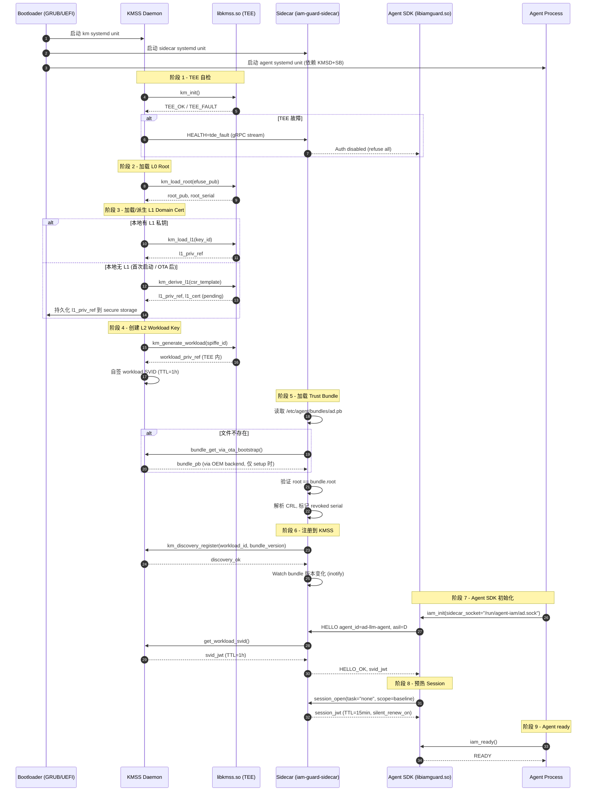

### §A.2 热启动（warm start，AG restart within 1h）

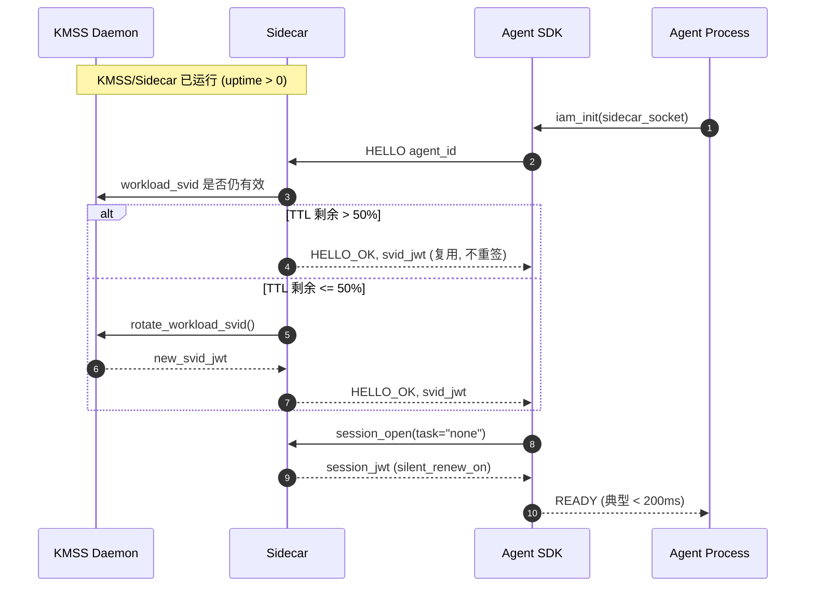

### §A.3 启动并发与依赖

```mermaid
gantt
    title 冷启动并行时间线 (典型 3 域 AD 域)
    dateFormat ss
    axisFormat %S
    section Kernel
    TEE init           :a1, 00, 800ms
    Bootloader->KMS    :a2, after a1, 100ms
    section KMSS Daemon
    km_init            :b1, after a2, 300ms
    load L0+L1         :b2, after b1, 200ms
    create L2          :b3, after b2, 100ms
    section Sidecar
    load bundle        :c1, after b3, 150ms
    register KMS       :c2, after c1, 50ms
    section Agent SDK
    HELLO              :d1, after c2, 100ms
    session_open       :d2, after d1, 50ms
    section Agent ready
    first Guard call   :e1, after d2, 200ms
```

**关键依赖：**

- KMSD 必须在 Sidecar 启动前 ready（Sidecar 需要 KMSS 派生 SVID）。
- Sidecar 必须在 Agent SDK ready 前 ready（SDK HELLO 调用 Sidecar）。
- AG 可以与 Sidecar/KMSD 并行启动，依赖 systemd `After=` 控制。
- 3 域彼此独立：AD 启动失败**不应阻塞** CD/VD。

### §A.4 启动失败处理

| 阶段 | 失败 | 现象 | 恢复 |
|---|---|---|---|
| 1 TEE 自检 | TEE 物理故障 | KMSD 进入 degraded | SOC 安全灯 + OTA 重连 |
| 2 加载 L0 | efuse 未烧录 | KMSD 启动失败 | OEM 工厂返修 |
| 3 派生 L1 | KMSS 内部错误 | 重试 3 次后失败 | 重新生成 CSR + OEM 签字 |
| 5 加载 Bundle | 文件损坏 | Sidecar HEALTH=bundle_invalid | OTA 重试 + 默认拒绝 |
| 6 KMS 注册 | KMSS 拒绝 | Sidecar crash-loop | 检查 SPIFFE ID 一致性 |
| 7 HELLO | Sidecar 未启动 | SDK retry 3 次后 fail | systemd 依赖不对 |
| 8 session_open | KMSS 限流 | session_open 503 | SDK 退避重试 |

---

## §B 模块内部状态机

### §B.1 Identity 模块状态机

`Identity` 负责解析和签发 SPIFFE ID 形态的 workload 身份。

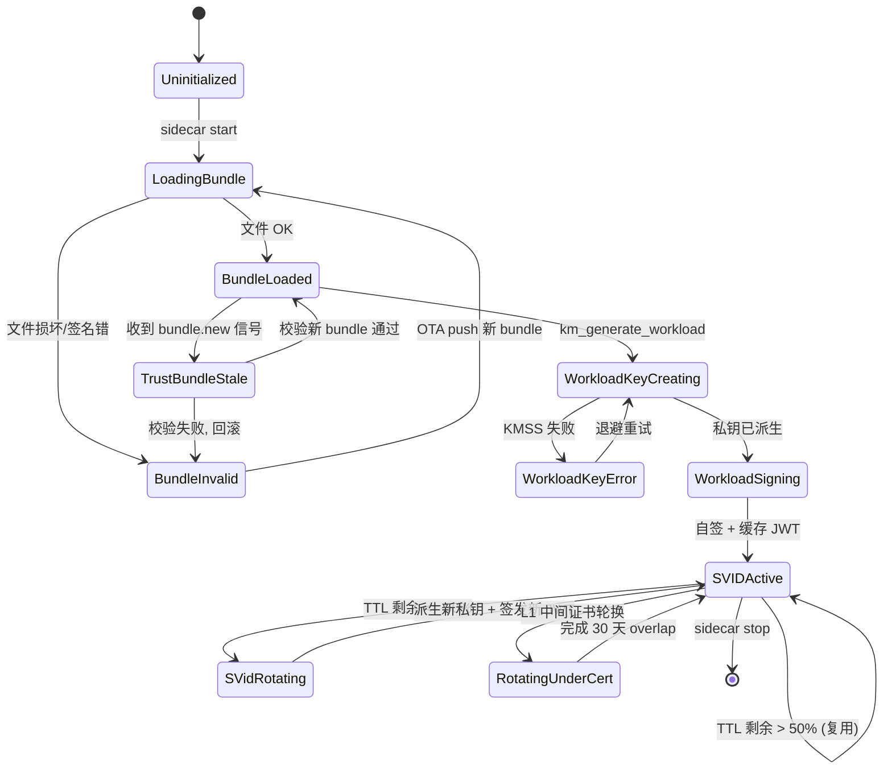

**核心不变量：**

- `SVIDActive` 是**唯一稳定态**，其他都是过渡态。
- `BundleLoaded` 必须始终比 `SVIDActive` 新，否则签发的 SVID 无法被对端验证。
- `RotatingUnderCert` 期间新旧 L1 都签发过 SVID，对端需支持两个 trust anchor。

### §B.2 Authentication 模块状态机

`Authentication` 负责 token 派生、刷新、撤销。

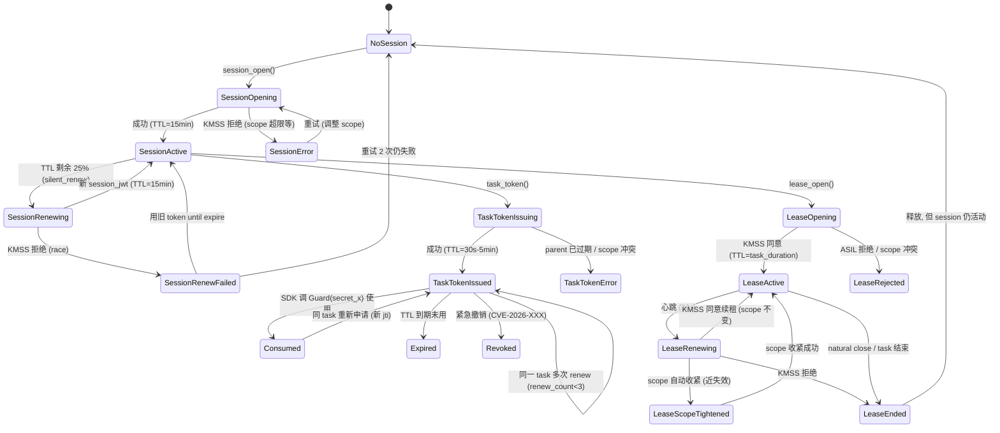

**核心不变量：**

- `SessionActive` 与 `TaskTokenIssued / LeaseActive` 是**正交**的：
  session 是"我能调用 Guard"，task_token/lease 是"我这次具体能做什么"。
- `TaskTokenIssued` 单次使用语义：Guard.Check 成功后 token 立即 burned。
- `LeaseScopeTightened` 是**不可逆**：scope 缩小后不能再次扩大。

### §B.3 Credential 模块状态机

`Credential` 负责 4 层密钥生命周期管理。

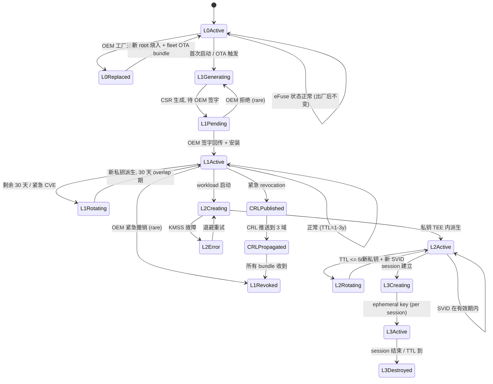

**核心不变量：**

- L0 只在工厂变更，整个 fleet 同步更新。
- L1 overlap 期**两个 L1 都信任**，不允许中间状态不接受验证。
- L2 私钥**永不离开 TEE**，External World 只看 handle。
- L3 完全 ephemeral，session 关闭即焚毁。

### §B.4 状态机通用语义

- **稳定态** vs **过渡态**：只有 `SVIDActive`、`SessionActive`、`LeaseActive`、`L0Active`、
  `L1Active`、`L2Active`、`L3Active` 是稳定态，可被外部观察为"长期存在"。
- **不可逆边**：所有 `Revoked / ScopeTightened / Destroyed` 边都不可逆（除非显式 OTA 重建）。
- **观测点**：每个稳定态都向 Sidecar 的 `/healthz` 与 `audit_log` 发送事件。

---

## §C 关键场景时序图

### §C.1 同域 Guard.Check（最快路径）

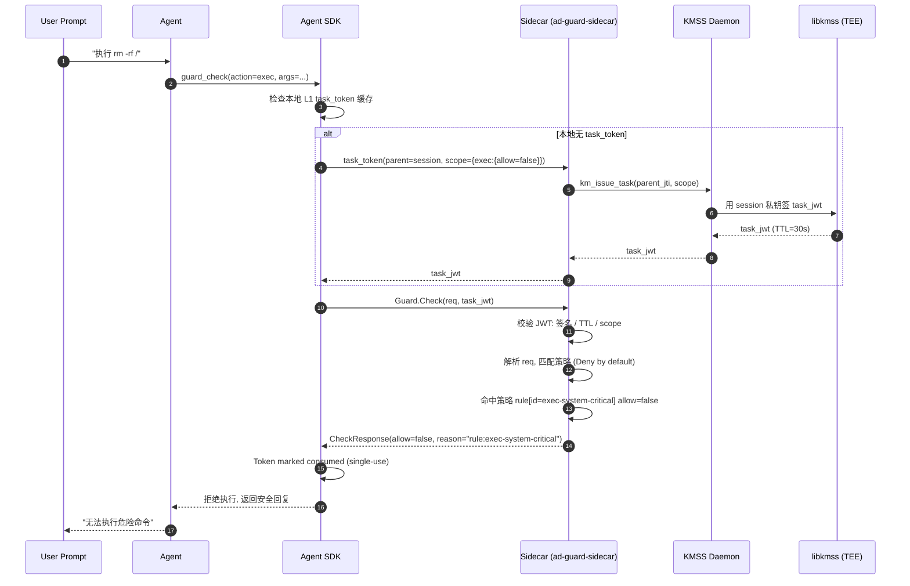

**典型延迟**：< 5ms（task_token 缓存命中时）。

### §C.2 跨域 delegation（含完整证书链）

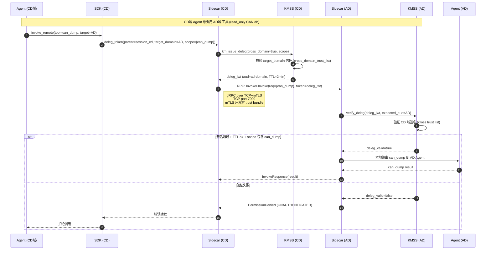

**关键点**：

- deleg_jwt 在 CD 域用 CD 的 workload 私钥签发，AD 域通过**跨域 trust list**验证签名。
- AD 域不需要 CD 的 bundle，反之亦然；只需要 OEM root + 已知 intermediates。
- 单次 deleg 是一次性凭证，不保留状态（如果需要持续调用，需申请 session 级跨域凭证）。

### §C.3 Lease scope 收紧（紧急）

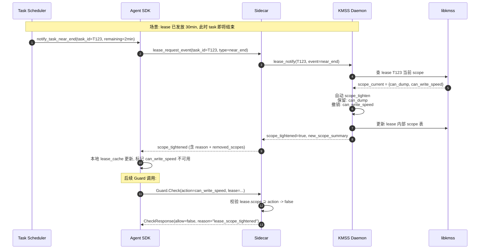

**关键点**：

- scope 收紧是**单向**：收紧后不能再次扩大，必须等 lease 自然结束重新申请。
- 收紧由 KMSS 主动发起（基于 task scheduler event），不是 SDK 主动。
- SDK 通过 lease_tightened 回调收到通知，可以主动放弃执行中的危险操作。

### §C.4 紧急 revocation 全网传播

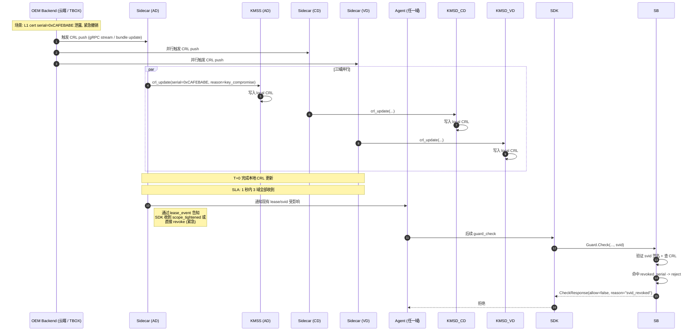

**关键点**：

- revocation 通过**两条路径**同时传播：`CRL delta` + `bundle 紧急更新`。
- 任一收到即可生效，因为 SVID 验证时**先看本地 CRL**再看签名。
- 已签发的 session/lease 立即失效（KMSS 收到 revocation token 时主动通知 SDK）。

### §C.5 OTA Trust Bundle 更新

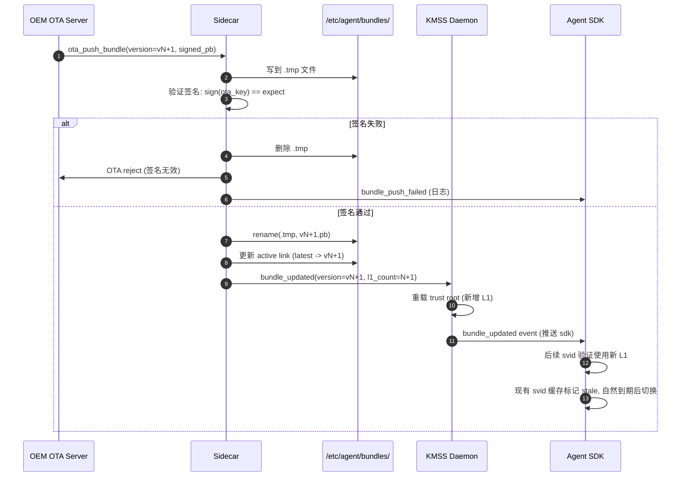

**关键点**：

- Bundle 文件**原子替换**（`rename` 系统调用保证），不会有半写入状态。
- 签名用 `ota_key`（独立于 L1 链），失效时也不影响 trust anchor。
- 新旧 L1 **共处 30 天** overlap，是 key rotation 的关键期。

### §C.6 KMSS daemon failover（demo 用 SoftHSM2）

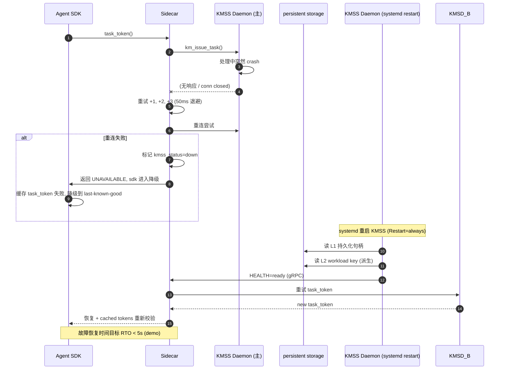

**关键点**：

- L1 中间证书私钥**必须持久化**（encrypted at rest，使用 TEE 内 sealed key 加密）。
- 重启后 load 即可，无需重新派生（避免 OEM 重新签字）。
- 短期 task_token **不可恢复**（stateful），但 session_jwt 可用，因为只签不存。

### §C.7 L1 Key Rotation Overlap 期间验签

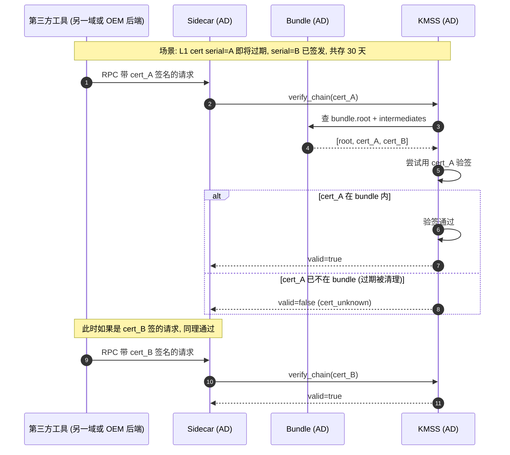

**关键点**：

- overlap 期**必须**两个 cert 都能验签，否则 rotation 期间会出现"部分请求不可用"窗口。
- Bundle 文件保留所有仍有效的 intermediates（每个带过期时间）。
- 第 31 天起，旧 cert 自动从 bundle 移除（无需手动操作）。

---

## §D 故障场景演练

### §D.1 KMSS 崩溃 + lease 中处理

**前置**：AD 域 Agent 持 lease L (scope={can_dump, can_write_speed}, TTL=10min)，已运行 6min。

**故障**：T+6min 时 KMSS daemon crash。

**预期流程**：

1. SDK 收到 Guard.Check 调用，调用 Sidecar。
2. Sidecar 检测 KMSS 连接超时（默认 500ms）。
3. Sidecar 重试 3 次（指数退避），仍失败。
4. Sidecar 返回 `UNAVAILABLE: kmss_down` 给 SDK。
5. SDK 缓存 lease 仍存在，**不立即撤销**，但标记 `kmss_unavailable=true`。
6. SDK 业务侧收到 UNAVAILABLE，进入降级模式：拒绝所有 mutating call，仅允许缓存可证明是只读的（例如 hash 不变的配置读取）。
7. KMSS systemd 重启完成（≤ 5s），Sidecar 重连成功。
8. Sidecar 主动通知 SDK：`kmss_recovered=true`。
9. SDK 重新校验 lease：通过 L1 签名验证仍有效（TTL 剩余 4min），继续使用。
10. audit_log 写入 `event=kmss_failover, lease=L, downtime_ms=2300`。

**反例（不应发生）**：

- SDK 不等待直接撤销 lease，导致任务提前失败。
- Sidecar 崩溃重启后丢失 KMS connection pool，重新建立耗时长。

### §D.2 跨域网络分区（CD-AD 中断 30s）

**前置**：CD 域 SDK 已成功获得 deleg_jwt 准备调用 AD。

**故障**：CAN 网段分区，CD 看不到 AD 30s。

**预期流程**：

1. CD SDK 调用 Sidecar AD 入口，TCP SYN 超时（> 2s）。
2. Sidecar CD 重试 2 次（gRPC 默认 retry policy），仍失败。
3. Sidecar 返回 `UNAVAILABLE: cross_domain_unreachable`。
4. SDK 进入退避：第一次重试 5s 后，第二次 10s 后。
5. 30s 后网络恢复。
6. 第 11 次重试成功调用 AD，deleg_jwt 仍有效（TTL=2min，过期前 30s 才过期）。
7. audit_log 记录 `event=cross_domain_partition, downtime_s=30`。

**反例**：

- 用**旧** deleg_jwt 持续重试，导致过期后报错（应轮换新 deleg_jwt）。
- 网络恢复后未刷新 token 缓存，重复使用已撤销的 deleg_jwt。

### §D.3 TEE 物理故障

**前置**：正常运行中 TEE 突然硬件故障（demo 极少，prod 罕见但关键）。

**预期流程**：

1. KMSS daemon 调用 `km_init()` 重试机制持续失败。
2. KMSS 进入 `degraded` 状态（所有 load/generate 操作返回 TEE_FAULT）。
3. Sidecar 通过 KMSS health stream 收到 `health=tde_fault`。
4. Sidecar:
   - 拒绝所有新 task_token 申请。
   - **已签发的 token 全部撤销**（因为无法保证 L0/L1 私钥未泄露）。
   - 发送紧急 audit_log: `event=tde_fault, action=disable_all_tokens`。
5. SOC 收到告警（车机+OEM 后端双通道）。
6. 整车进入 fail-safe 模式：所有 Agent 调用 LLM 被阻断，只允许预设的安全回复模板。
7. OTA 推送 TEE 修复（如果可行）或要求 4S 店维修。

**反例**：

- KMSS 装作正常但 L0 私钥失窃（TEE 不暴露此状态，防 side channel）。
- 没有 fail-safe，导致车机功能完全不可用（影响驾驶体验）。

### §D.4 Trust Bundle 文件损坏

**前置**：/etc/agent/bundles/ad.pb 正常加载。

**故障**：OTA 过程中文件半写入或下载损坏。

**预期流程**：

1. Sidecar 启动时/OTA 时对 bundle 验证签名。
2. 签名失败 → 不加载该 bundle，保留上一个有效 bundle。
3. 如果是首次启动（无 fallback），Sidecar 启动失败并 crash-loop。
4. systemd 触发 Restart=always，每次启动都是 startup_fail。
5. watchdog 在 5 次失败后触发系统降级（只显示安全灯，开机画面）。
6. OTA 后台重试：先尝试 OEM 仓库下载，如仍失败则 fallback 到出厂 bundle（只含 L0 root）。

**反例**：

- 加载损坏 bundle，导致后续 SVID 验证失败但车机仍运行（应立即拒绝加载）。
- OTA 重试无限循环，应有最大次数（5 次）后停止。

### §D.5 时钟漂移（Clock Skew）

**前置**：3 域时钟轻微漂移（最大 2s）。

**预期流程**：

1. Guard.Check 收到请求，时间戳在 token TTL 边界上。
2. KMSS 接受最大 ±30s skew（`token_leeway` 可配置）。
3. 例如 token TTL=30s 实际过期时间 30s+30s=60s（容忍）。
4. 如果时钟漂移 > 30s（异常），返回 `TOKEN_EXPIRED`。
5. SDK 通过 `peer_clock_get()` 定期同步（每 5min NTP 校时）。
6. RTC 硬件故障：通过 GPS 时间兜底（车机通常有 GPS 模块）。

**反例**：

- 不允许任何 skew，导致正常 token 被误拒。
- 允许太多 skew，导致撤销的 token 仍可用。

### §D.6 OTA Bundle 损坏 + 回滚

**前置**：OTA 推 vN+1 bundle，签名错误或内容损坏。

**预期流程**：

1. Sidecar 接收 OTA bundle → 写入 .tmp → 验签失败。
2. Sidecar 删除 .tmp，保留 vN bundle。
3. Sidecar 推送 `bundle_push_failed` 事件到 audit_log。
4. KMS 保持使用 vN bundle（不需重启）。
5. OTA 服务器收到失败 ACK，触发**自动重试**（不超过 3 次）。
6. 3 次失败后，OEM 进入人工排查模式，4S 升级处理。

**反例**：

- OTA 强制覆盖 bundle（vN+1 即使损坏也加载）。
- OTA 重试无限循环（应有 max_retries=3）。

---

## §E demo 部署架构

### §E.1 docker-compose 总览

```mermaid
graph TB
    subgraph CD[CD 域 (QM)]
        CD_AG[cd-agent<br/>port: grpc 7000]
        CD_SB[cd-sidecar<br/>port: 7001→7000]
        CD_KM[cd-kmss-daemon<br/>port: 7002→7001]
        CD_HSM[cd-softhsm2<br/>PKCS#11 socket]
    end

    subgraph AD[AD 域 (ASIL-D)]
        AD_AG[ad-agent<br/>port: grpc 7000]
        AD_SB[ad-sidecar<br/>port: 7001→7000]
        AD_KM[ad-kmss-daemon<br/>port: 7002→7001]
        AD_HSM[ad-softhsm2]
    end

    subgraph VD[VD 域 (ASIL-D)]
        VD_AG[vd-agent<br/>port: grpc 7000]
        VD_SB[vd-sidecar<br/>port: 7001→7000]
        VD_KM[vd-kmss-daemon<br/>port: 7002→7001]
        VD_HSM[vd-softhsm2]
    end

    subgraph OEM[OEM 模拟 (本地容器)]
        OEM_API[oem-stub<br/>:8080]
        OEM_OTA[oem-ota-server<br/>:8090]
        OEM_OBS[oem-observability<br/>:9090]
    end

    CD_SB <-->|TCP+mTLS<br/>:7000| AD_SB
    AD_SB <-->|TCP+mTLS<br/>:7000| VD_SB
    CD_SB <-->|TCP+mTLS<br/>:7000| VD_SB

    CD_KM <-->|UDS<br/>/var/run/kmss/cd.sock| CD_SB
    AD_KM <-->|UDS| AD_SB
    VD_KM <-->|UDS| VD_SB

    CD_KM <--> CD_HSM
    AD_KM <--> AD_HSM
    VD_KM <--> VD_HSM

    OEM_API -.->|首次设置| CD_KM
    OEM_API -.->|首次设置| AD_KM
    OEM_API -.->|首次设置| VD_KM

    OEM_OTA -.->|bundle push| CD_SB
    OEM_OTA -.->|bundle push| AD_SB
    OEM_OTA -.->|bundle push| VD_SB

    CD_AG --> CD_SB
    AD_AG --> AD_SB
    VD_AG --> VD_SB
```

### §E.2 docker-compose.yml 骨架

```yaml
# 关键 fragment, 完整版见 github.com/sphinx/llm-guard-iam-demo
version: "3.9"

networks:
  intra-ad:
    driver: bridge
    internal: true   # 仅允许 ad 域内通信
  intra-cd:
    driver: bridge
    internal: true
  intra-vd:
    driver: bridge
    internal: true
  inter-domain:    # 跨域, 模拟 CAN 网段
    driver: bridge
  oem-net:
    driver: bridge

volumes:
  ad_km_state:
  cd_km_state:
  vd_km_state:
  ad_bundle:
  cd_bundle:
  vd_bundle:

services:
  # AD 域 (ASIL-D)
  ad-softhsm2:
    image: softhsm2:latest
    volumes:
      - ad_km_state:/softhsm-state
    networks: [intra-ad]
    command: softhsm2-util --init-token --free --label ad-tok

  ad-kmss-daemon:
    image: llmguard/kmss:latest
    depends_on: [ad-softhsm2]
    volumes:
      - ad_km_state:/kmss-data
      - ad_bundle:/etc/agent/bundles:ro
    networks: [intra-ad, inter-domain]
    command: kmsd --domain ad --bind /var/run/kmss/ad.sock
    healthcheck:
      test: ["CMD", "kmsctl", "ping"]
      interval: 5s

  ad-sidecar:
    image: llmguard/iam-guard-sidecar:latest
    depends_on:
      ad-kmss-daemon:
        condition: service_healthy
    volumes:
      - ad_bundle:/etc/agent/bundles:ro
    networks: [intra-ad, inter-domain]
    command: sidecar --domain ad --kmss-uds /var/run/kmss/ad.sock --listen 0.0.0.0:7000
    healthcheck:
      test: ["CMD", "iam-ctl", "health"]
      interval: 5s

  ad-agent:
    image: llmguard/agent-sample:latest
    depends_on:
      ad-sidecar:
        condition: service_healthy
    networks: [intra-ad]
    command: agent --sidecar-uds /run/agent-iam/ad.sock --log-level debug
    environment:
      IAM_DOMAIN: ad
      IAM_AGENT_ID: ad-llm-agent

  # CD 和 VD 同构, 略...
  # oem-stub, oem-ota-server, oem-observability 用于初始化 + 监控
```

### §E.3 网络隔离矩阵

| Source → Dest | 协议 | 端口 | mTLS | ASIL 要求 |
|---|---|---|---|---|
| Agent → Sidecar | gRPC over UDS | `/run/agent-iam/*.sock` | n/a (UDS) | 同域 |
| Sidecar → KMSS | gRPC over UDS | `/var/run/kmss/*.sock` | n/a (UDS) | 同域 |
| Sidecar → Sidecar (跨域) | gRPC over TCP+mTLS | 7000 | 双向 | 双方 bundle |
| Sidecar → OEM OTA | HTTPS | 8090 | 单向 OEM cert | demo 用 |
| Sidecar → OEM Stub | HTTPS | 8080 | 双向 (初始化) | demo 用 |

### §E.4 状态持久化

```mermaid
graph LR
    subgraph Persistent
        A[ad_km_state/<br/>- L1 priv (sealed)<br/>- L2 workload ref<br/>- audit log]
        B[ad_bundle/<br/>- bundle.pb<br/>- crl.pb]
    end

    subgraph Ephemeral
        C[L2 workload priv<br/>in TEE]
        D[L3 session key<br/>per process]
    end

    A -.持久化.-> C
    B -.只读加载.-> C
    D -. 不持久化 .-> [*]
```

| 类型 | 位置 | 重启后 | demo 说明 |
|---|---|---|---|
| L0 root 公钥 | efuse (demo: bundle 内) | 保留 | 公钥 |
| L1 私钥 | KMSS 持久化目录 (encrypted) | 保留 | SoftHSM2 CKO_PRIVATE_KEY |
| L2 workload ref | KMSS 运行时 (TEE) | **丢失**，需重新派生 | 不持久化为安全设计 |
| L3 session key | 进程内 (TEE) | 丢失 | 必然 ephemeral |
| Trust Bundle | `/etc/agent/bundles/` | 保留 (volume mount) | OTA 可更新 |
| CRL | `/etc/agent/bundles/` | 保留 | 包含在 bundle |
| audit log | KMSS 日志目录 | 保留 | demo 用 stdout + file |

### §E.5 端口总览

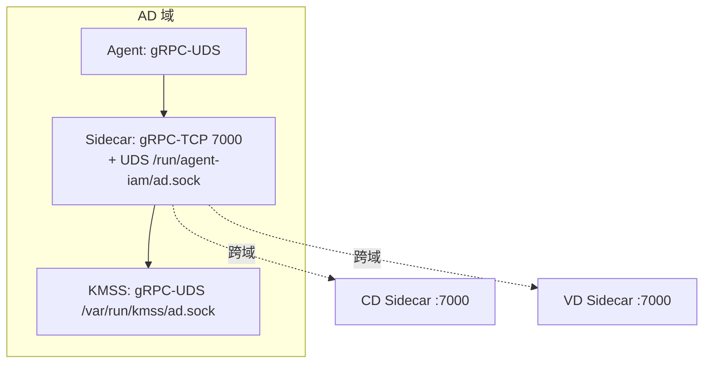

### §E.6 mock KMSS 行为说明

demo 中 SoftHSM2 模拟 TEE，**不是**真正的硬件 TEE。差异：

| 项 | 真 TEE | SoftHSM2 demo |
|---|---|---|
| 私钥内存隔离 | 硬件 | 进程隔离 (Token) |
| 防 side channel | 硬件 | 仅防 API 调用 |
| 防 physical attack | 有 | **无** |
| 持久化 | sealed storage | file-based encrypted |
| 性能 | ~10ms per sign | ~1ms per sign |

**警告**：SoftHSM2 仅适合**功能 demo**与**接口验证**，**不可**用于安全敏感场景。
生产必须用硬件 TEE（高通 SEE、ARM TrustZone 等）。

---

## §F 修订记录

| 版本 | 日期       | 变更                                                                                    |
|------|------------|-----------------------------------------------------------------------------------------|
| v0.1 | 2026-07-15 | 初稿：补齐启动序列 / 模块状态机 / 关键时序 / 故障演练 / demo 部署                       |
| v0.2 | 2026-07-16 | 启动序列独立章节（§A），补充并行时间线（§A.3）；模块状态机 3 个（§B.1-§B.3）           |
| v0.3 | 2026-07-16 | 关键场景 7 个时序图（§C.1-§C.7）；故障演练 6 个（§D.1-§D.6）；demo 部署（§E.1-§E.6）   |

---

**关联文档**：

- [layered_defense.md](./layered_defense.md) — 车端 LLM Agent 分层防御总体架构 (PR #77)
- [iam_auth_architecture.md](./iam_auth_architecture.md) — IAM 三大模块设计
