# 车端 LLM Agent 详细架构（流程 / 状态机 / 演练 / Demo）

> 本文聚焦“可执行流程”：启动序列、状态机、关键时序、故障演练与 docker-compose demo 拓扑。

## §A. 启动序列

### A.1 冷启动（Cold Start）

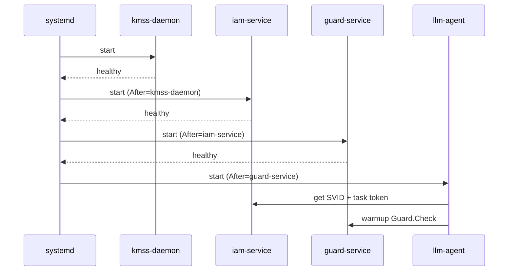

### A.2 热启动（Hot Restart）

- 复用上一次会话缓存（仅在 token 未过期且 CRL 版本未落后时）；
- 优先恢复 lease，再恢复工具连接；
- 若任一校验失败，自动降级回冷启动流程。

### A.3 并行时间线

| 时间片 | Identity | Auth | Credential |
| --- | --- | --- | --- |
| T0 | 采集设备证明 | 拉取 policy | 加载 trust bundle |
| T1 | 签发 SVID | 签发 task token | 校验 CRL |
| T2 | 心跳监控 | 建立 session | 预热 key handle |

### A.4 systemd 依赖

| 单元 | Depends/After |
| --- | --- |
| `kmss-daemon.service` | `network-online.target` |
| `iam.service` | `After=kmss-daemon.service` |
| `guard.service` | `After=iam.service` |
| `llm-agent.service` | `After=guard.service` |

### A.5 启动失败处理

| 失败点 | 行为 |
| --- | --- |
| KMSS 启动失败 | 不启动 IAM，整车进入受限模式 |
| IAM 启动失败 | Guard 拒绝所有写操作 |
| Guard 启动失败 | Agent 不进入对外服务态 |

## §B. 模块内部状态机

### B.1 Identity（SVID）

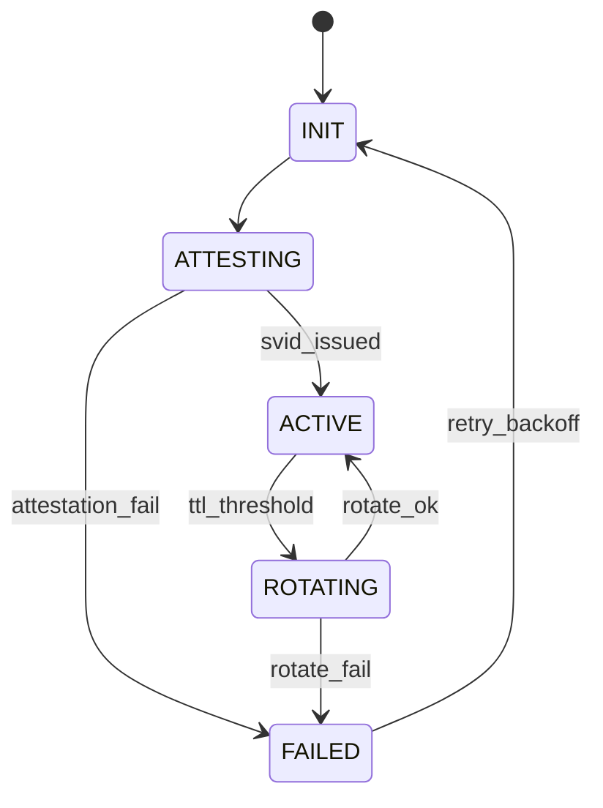

### B.2 Auth（Task/Session Token）

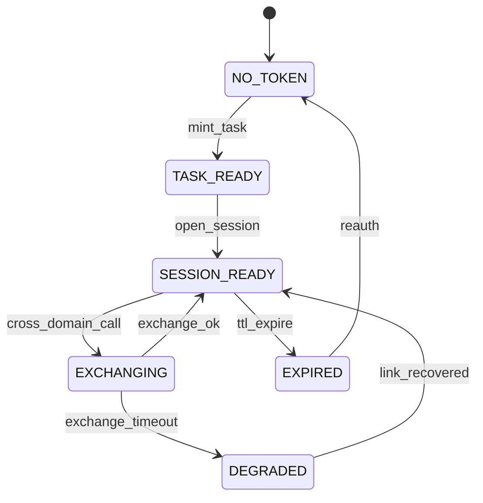

### B.3 Credential（Key Rotation）

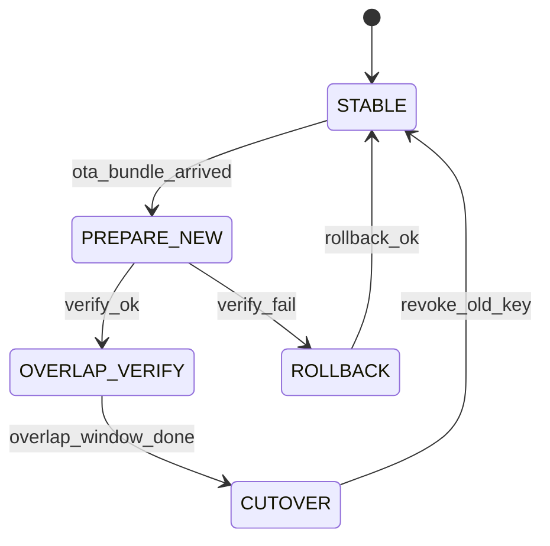

## §C. 七个关键场景时序图

### C.1 同域 Guard.Check

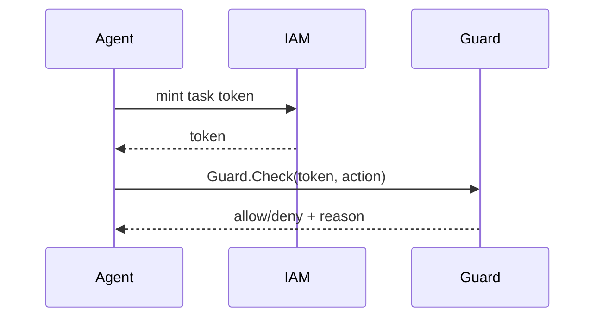

### C.2 跨域 delegation

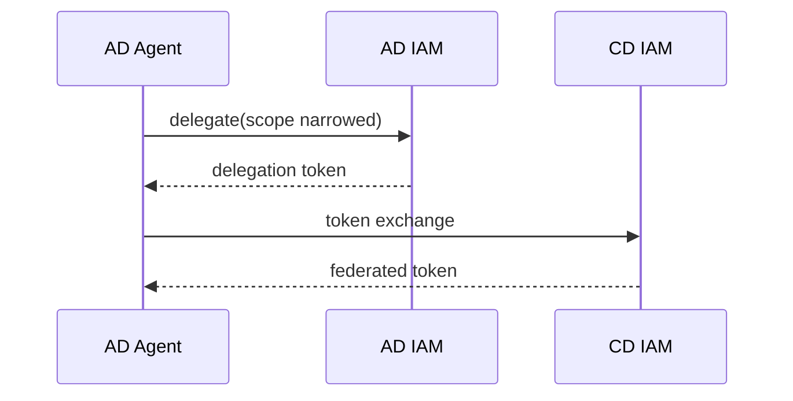

### C.3 Lease scope 收紧

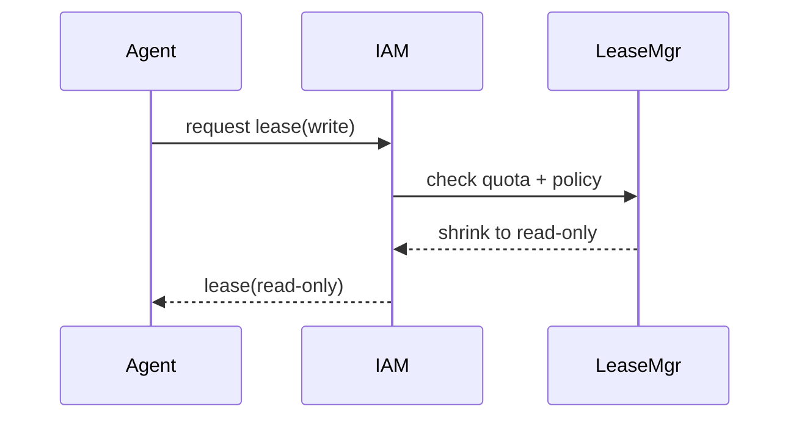

### C.4 紧急 revocation 全网传播

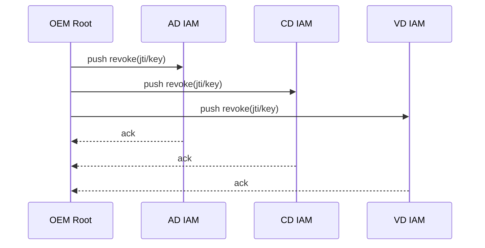

### C.5 OTA trust bundle 更新

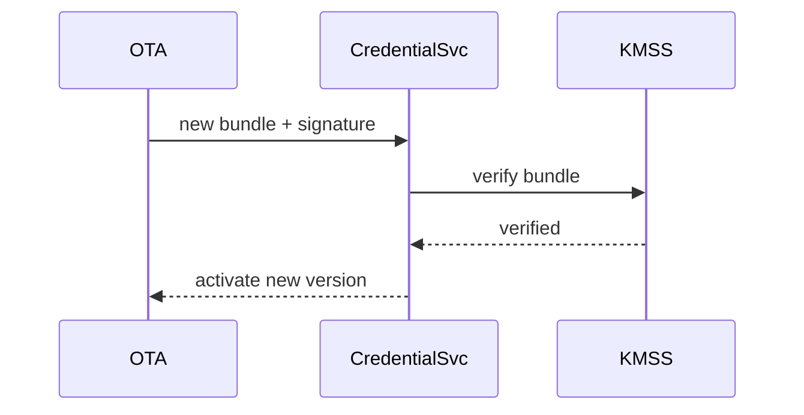

### C.6 KMSS daemon failover

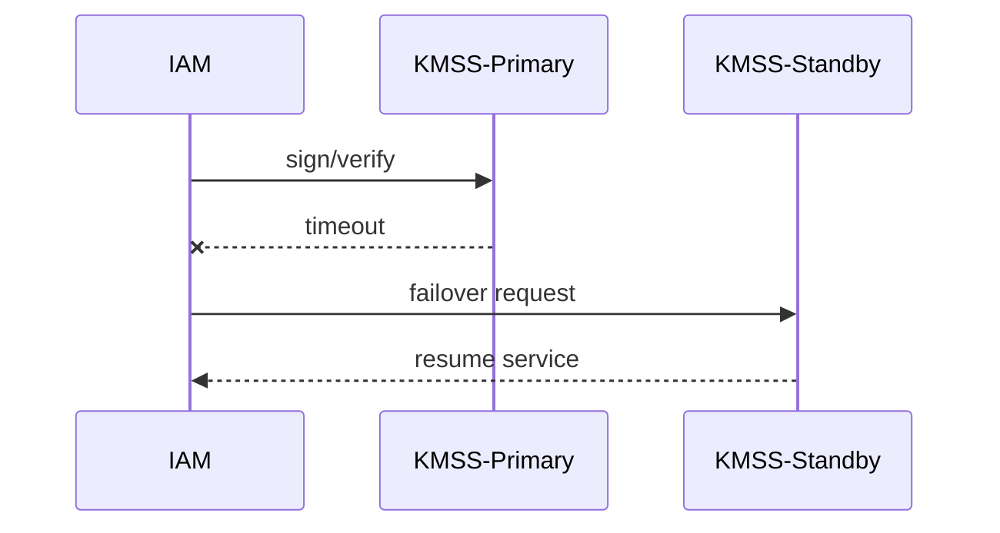

### C.7 L1 key overlap 验签

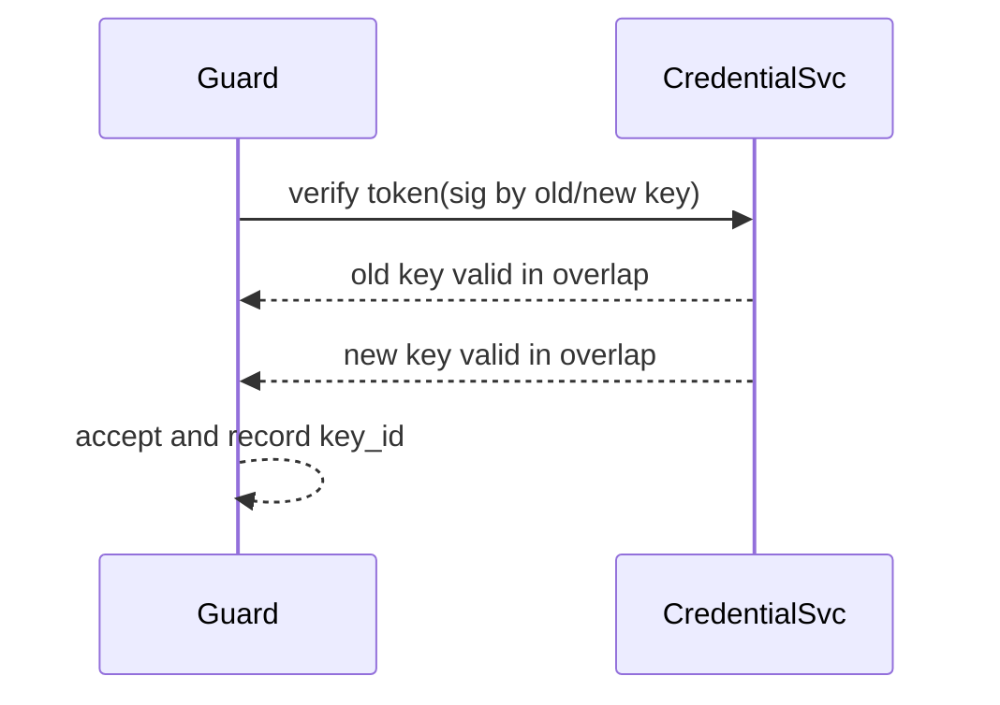

## §D. 六个故障场景演练

### D.1 KMSS 崩溃

- 注入方式：停止 `kmss-daemon`
- 预期：IAM 切换 standby；若失败则拒绝写操作
- 观测：`kmss_failover_total` 指标增长

### D.2 跨域网络分区

- 注入方式：阻断 AD↔CD 网络
- 预期：跨域调用失败，域内调用维持
- 恢复：网络恢复后自动 token exchange

### D.3 TEE 物理故障

- 注入方式：模拟 HSM slot 不可用
- 预期：进入 fail-safe（只读）
- 恢复：硬件恢复后重新 attestation

### D.4 Trust Bundle 损坏

- 注入方式：篡改 bundle hash
- 预期：拒绝激活并回滚旧版本
- 恢复：重新拉取并验签

### D.5 时钟漂移

- 注入方式：将系统时钟偏移 ±5min
- 预期：触发 token `nbf/exp` 异常告警
- 恢复：同步安全时钟并重新签发 token

### D.6 OTA 损坏回滚

- 注入方式：投递损坏 OTA 包
- 预期：校验失败自动回滚至 last-known-good
- 恢复：下发正确版本并二次验证

## §E. Demo 部署（docker-compose）

### E.1 拓扑概览

- 3 域：`ad-stack`、`cd-stack`、`vd-stack`
- 1 OEM 模拟：`oem-root`
- 每域组件：`iam`、`guard`、`credential`、`agent`

### E.2 网络隔离矩阵

| 来源/目标 | AD | CD | VD | OEM |
| --- | --- | --- | --- | --- |
| AD | ✅ | 仅 443 federation | ❌ | 443 |
| CD | 仅 443 federation | ✅ | 仅 443 federation | 443 |
| VD | ❌ | 仅 443 federation | ✅ | 443 |
| OEM | 443 | 443 | 443 | ✅ |

### E.3 状态持久化

- `iam-db`：token 撤销索引、session 元数据
- `cred-db`：bundle/CRL 版本状态
- 审计日志：append-only（按域分卷）

### E.4 端口总览

| 服务 | 端口 |
| --- | --- |
| IAM API | 8443 |
| Guard API | 9443 |
| Credential API | 10443 |
| OEM Root | 11443 |

### E.5 SoftHSM2 vs 真 TEE

| 维度 | SoftHSM2（Demo） | 硬件 TEE（生产） |
| --- | --- | --- |
| 目的 | 功能联调 | 量产安全 |
| 密钥保护 | 软件模拟 | 硬件隔离 |
| 攻击面 | 高 | 低 |
| 适用结论 | 仅验证流程 | 用于真实部署 |
