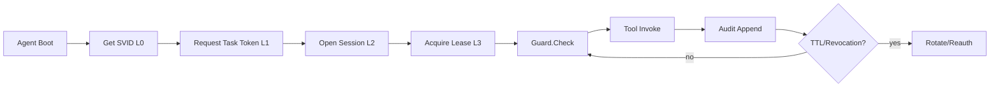
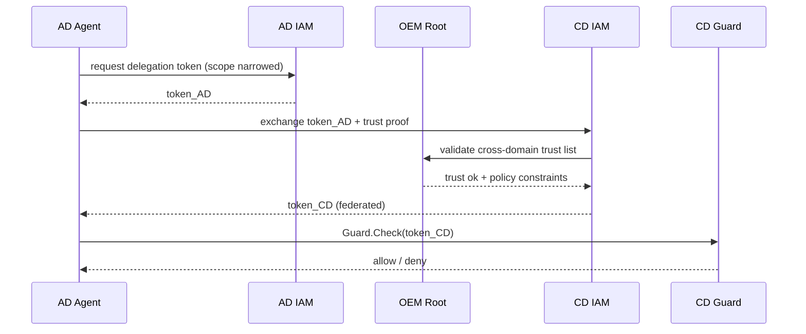
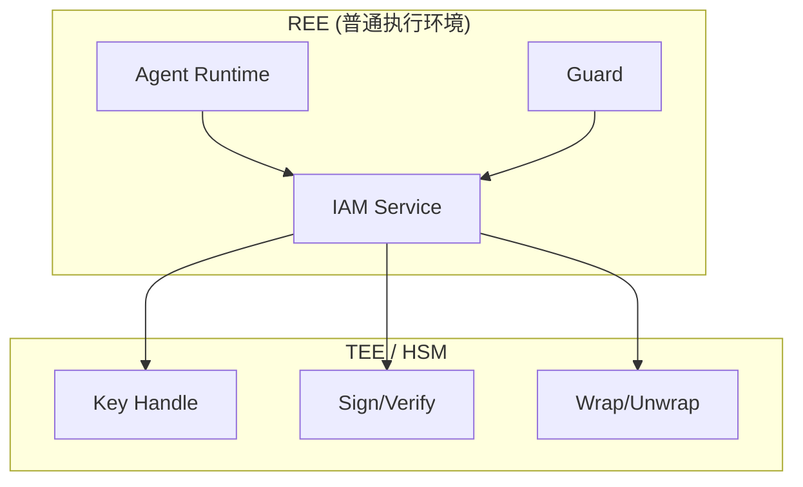
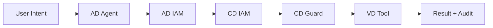

# 车端 LLM Agent IAM 认证架构（AD / CD / VD）

> 本文将 `layered_defense.md` 的分层理念落地为可实施的 IAM + Guard 架构，覆盖身份、认证、凭据、跨域信任和故障恢复。

## §1. 目标与范围

- 目标场景：车端三域 **AD / CD / VD** 的 LLM Agent 协同调用
- 核心目标：最小权限、短时凭据、可审计、可撤销、可跨域
- 非目标：业务功能编排与模型效果评估

## §2. 任务分级模型

| 级别 | 场景 | 风险 | 典型权限 |
| --- | --- | --- | --- |
| T0 | 只读查询 | 低 | `tool://vehicle.state.read` |
| T1 | 参数化控制 | 中 | `tool://climate.set` |
| T2 | 安全相关控制 | 高 | `tool://adas.mode.switch` |
| T3 | 密钥/策略变更 | 极高 | `tool://iam.bundle.rotate` |

## §3. 四层 TTL 设计（SVID / Task / Session / Lease）

| 层级 | 含义 | 推荐 TTL | 失效动作 |
| --- | --- | --- | --- |
| L0 SVID | Agent 进程身份证明 | 12h | 触发进程重认证 |
| L1 Task Token | 单任务授权 | 3~10min | 当前任务终止 |
| L2 Session Token | 会话授权 | 15~30min | 会话重建 |
| L3 Lease | 资源临时占用 | 10~120s | 自动回收资源 |

设计要点：

1. `TTL(L3) <= TTL(L2) <= TTL(L1) <= TTL(L0)`。
2. 任一层撤销，必须级联失效下层 token。
3. 所有 token 只允许单调缩权（scope 收紧，不放大）。

## §4. Claims 设计

| Claim | 含义 | 说明 |
| --- | --- | --- |
| `iss` | 签发者 | 域内 IAM |
| `sub` | 当前主体 | agent id |
| `act` | 真实操作者 | 用户/上游 agent |
| `aud` | 目标服务 | guard/tool uri |
| `scope` | 权限范围 | resource + action + constraints |
| `did` | domain id | `AD` / `CD` / `VD` |
| `jti` | 唯一标识 | 撤销与审计锚点 |
| `lease_id` | 租约标识 | L3 资源控制 |
| `chain` | 委托链 | 父子调用链 |
| `policy_ver` | 策略版本 | 回溯与回滚依据 |

## §5. KMSS lib API 对接

```c
// 仅示例：统一走 kmss lib 抽象层，禁止业务模块直接触碰私钥材料
int kmss_sign_jwt(const char* key_ref, const uint8_t* payload, size_t payload_len,
                  uint8_t* sig_out, size_t* sig_len);

int kmss_verify_jwt(const char* key_ref, const uint8_t* payload, size_t payload_len,
                    const uint8_t* sig, size_t sig_len);

int kmss_wrap_secret(const char* kek_ref, const uint8_t* in, size_t in_len,
                     uint8_t* out, size_t* out_len);

int kmss_unwrap_secret(const char* kek_ref, const uint8_t* in, size_t in_len,
                       uint8_t* out, size_t* out_len);
```

接口约束：

- `key_ref` 仅可引用 TEE/HSM 内密钥句柄；
- 所有 API 必须返回可审计错误码（如 `KMSS_E_KEY_REVOKED`）；
- 认证链路中不允许明文私钥出现在进程内存快照。

## §6. 生命周期主流程



## §7. Lease 语义

- Lease 绑定 `{subject, tool, resource, scope_hash}`；
- 支持 `renew`，但每次续租不可超过会话剩余 TTL；
- 守护进程周期扫描过期 lease 并执行资源回收；
- 同一资源支持“抢占策略”：高优先级任务可踢出低优先级 lease。

## §8. 跨域 Token 链（Delegation + Federation）



## §9. 故障矩阵

| 故障 | 检测点 | 处置 | 恢复条件 |
| --- | --- | --- | --- |
| IAM 不可达 | token 刷新失败 | 降级为只读最小策略 | IAM 心跳恢复 |
| CRL 延迟 | `jti` 未命中但版本落后 | 强制短 TTL + 高频拉取 | CRL 版本追平 |
| 域间链路断开 | federation 交换超时 | 仅保留域内能力 | 链路恢复 + 重新交换 |
| TEE 失效 | key op error | 切换备份 KMSS daemon | 健康检查通过 |

## §10. demo 技术决策

- 使用 **JWT RS256** 模拟 SVID 链路（简化 X.509-SVID 实施复杂度）；
- 使用 **SoftHSM2** 模拟 TEE 能力（仅用于功能演示）；
- 不实现 L4 Persistent Token，避免引入跨重启长期凭据；
- 三域各自信任域内 CA，通过 OEM root 维护 cross-domain trust list。

## §11. 落地清单

- [ ] 完成 AD/CD/VD 三域 IAM 服务部署
- [ ] 落地 claims 校验与 scope 收紧逻辑
- [ ] 接入 KMSS sign/verify/wrap/unwrap
- [ ] 建立 CRL push + pull 双通道
- [ ] 接入 Guard.Check 审计日志
- [ ] 完成 6 个故障演练脚本

## §12. 约束与不变量

1. 子 token 的 scope 必须是父 token 子集。
2. 任意跨域授权都必须带 `did` 与 `chain`。
3. 没有 lease 的写操作默认拒绝。
4. 撤销优先级高于缓存命中。

## §13. 参考标准

- OAuth 2.0 / RFC 6749
- JWT / RFC 7519
- Token Exchange / RFC 8693
- SPIFFE / SPIRE（概念参考）

## §14. 凭据管理（4 级密钥 / Bundle / CRL / Wrapped Secret）

### 14.1 四级密钥

| 层级 | 用途 | 轮换周期 | 存储位置 |
| --- | --- | --- | --- |
| K0 Root | OEM 根信任 | 年度/紧急 | 离线 HSM |
| K1 Domain CA | 域级签发 | 月/季度 | 域 HSM |
| K2 Service Key | IAM/Guard 签名 | 周 | TEE/HSM |
| K3 Ephemeral | 会话加密 | 分钟级 | 进程内短存活 |

### 14.2 Trust Bundle + OTA

- OTA 下发 `{bundle_version, cert_chain, revoke_list_hash}`；
- 生效规则：新 bundle 验签通过后原子切换；
- 回滚规则：新 bundle 健康检查失败自动回退到上一版本。

### 14.3 CRL + Push

- 常规：每 60s pull 增量 CRL；
- 紧急：OEM 触发 push 广播 revocation event；
- Guard 侧：收到 push 后立即本地封禁 `jti` / key id。

### 14.4 Wrapped Secret

- 原则：业务模块只拿到 wrapped blob，不拿明文密钥；
- 解封装仅在 KMSS 内进行；
- wrapped secret 需绑定 `domain_id + policy_ver + expire_at`。

### 14.5 故障恢复

- CRL 损坏：退回上一个可验证 CRL 快照；
- key overlap：允许 `old+new` 并行验签窗口（如 10min）；
- bundle 丢失：进入 fail-safe，只保留 T0/T1 只读能力。

## §15. 整体架构（三视图）

### 15.1 三域 × 三模块矩阵

| Domain | Identity | Auth | Credential |
| --- | --- | --- | --- |
| AD | SVID Issuer | Token Service | KMSS Adapter |
| CD | SVID Issuer | Guard Authorizer | KMSS Adapter |
| VD | Device Identity | Session Authorizer | KMSS Adapter |

### 15.2 TEE 分层视图



### 15.3 跨域 Federation 与端到端数据流



## §16. 模块细化（Identity / Auth / Credential）

### 16.1 Identity 模块

| I/O | 内容 |
| --- | --- |
| Input | `agent_id`, attestation evidence |
| Output | `SVID(L0)` |
| 关键 API | `issue_svid()`, `revoke_svid()` |
| 不变量 | 一个 `agent_id` 同时最多一个 active SVID |
| 失败模式 | 证明链失效、证书过期、nonce 重放 |

### 16.2 Auth 模块

| I/O | 内容 |
| --- | --- |
| Input | SVID / delegated token / policy |
| Output | task/session token, decision |
| 关键 API | `mint_task_token()`, `exchange_cross_domain()`, `guard_check()` |
| 不变量 | scope 单调收紧，不允许扩大授权 |
| 失败模式 | policy mismatch、时钟漂移、revocation race |

### 16.3 Credential 模块

| I/O | 内容 |
| --- | --- |
| Input | key policy, bundle, crl, wrapped secret |
| Output | key handles, verification result |
| 关键 API | `rotate_key()`, `verify_bundle()`, `push_crl()` |
| 不变量 | 明文密钥不出 TEE；所有轮换有版本号 |
| 失败模式 | key overlap 校验失败、bundle 损坏、HSM 不可用 |

## §17. 修订记录

| 版本 | 日期 | 变更 |
| --- | --- | --- |
| v0.1 | 2026-07-15 | 初版：补齐 IAM 架构、凭据生命周期、跨域链路与模块细化 |
