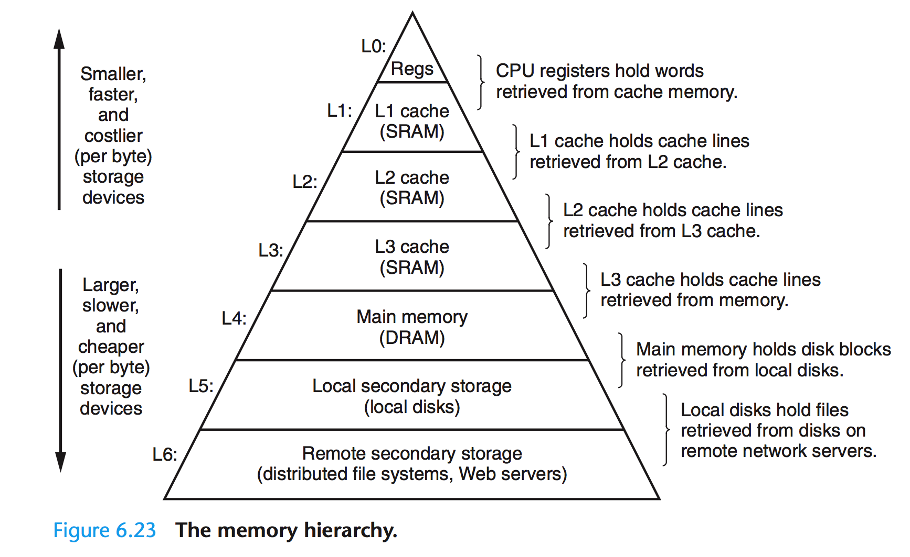
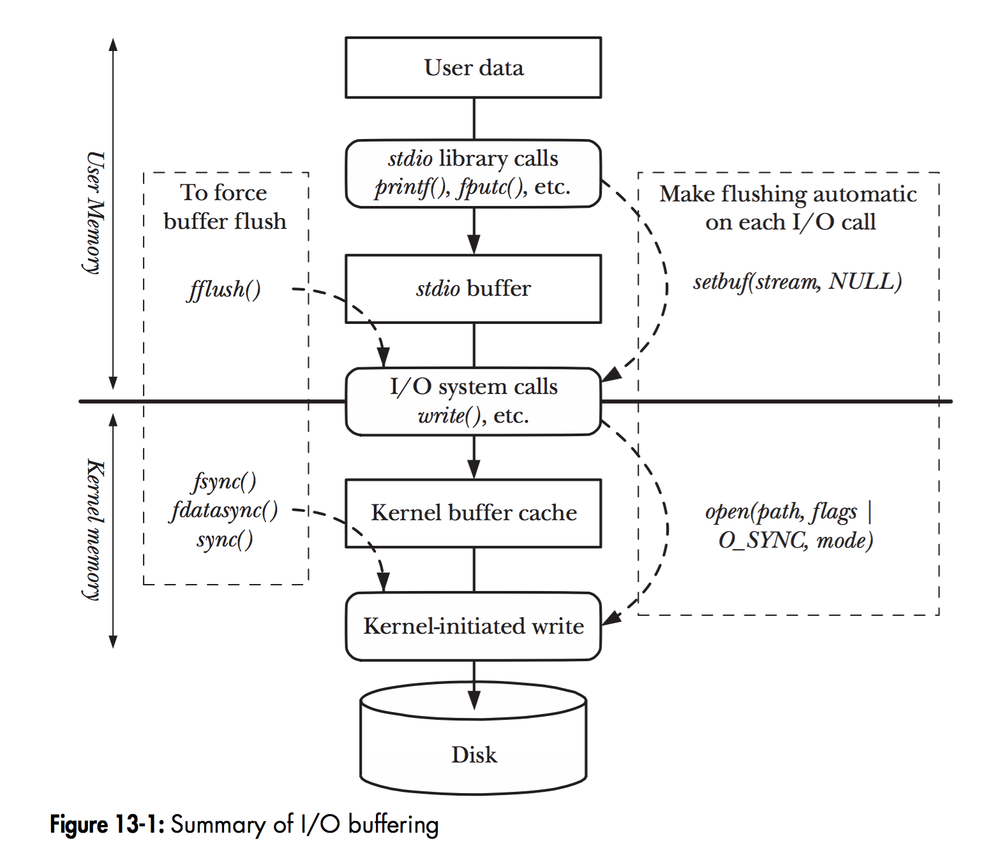
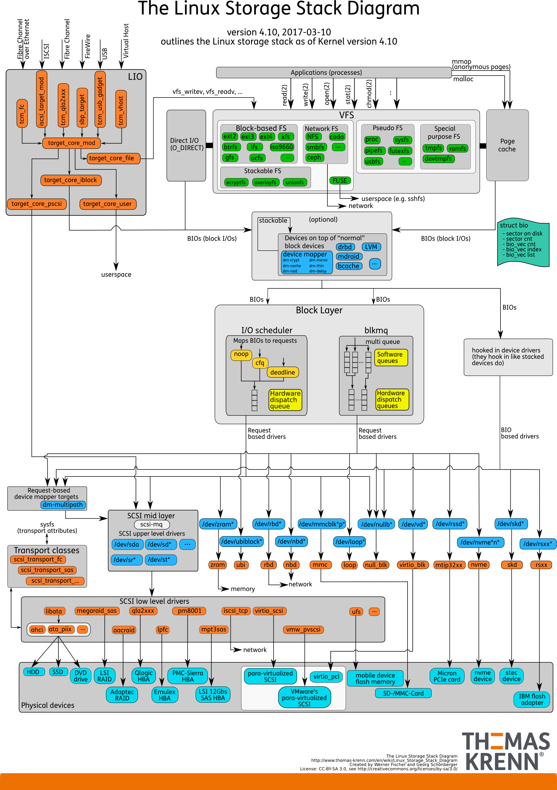

## 存储器金字塔结构

《Computer Systems: A Programmer's Perspective》 中的 Chapter 6 The Memory Hierarchy 详细介绍了计算机系统中的内存层次结构。



受限于存储介质的存取速率和成本，现代计算机的存储结构呈现为金字塔型。越往塔顶，存取效率越高、但成本也越高，所以容量也就越小。
得益于程序访问的局部性原理，这种节省成本的做法也能取得不俗的运行效率。从存储器的层次结构以及计算机对数据的处理方式来看，上层一般作为下层的Cache层来使用（广义上的Cache）。
比如寄存器缓存CPU Cache的数据，CPU Cache L1~L3层视具体实现彼此缓存或直接缓存内存的数据，而内存往往缓存来自本地磁盘的数据。

## Linux 中的I/O buffering

当程序调用各类文件操作函数后，用户数据（User Data）到达磁盘（Disk）的流程如图所示。
图中描述了Linux下文件操作函数的层级关系和内存缓存层的存在位置。
中间的黑色实线是用户态和内核态的分界线。

从上往下分析这张图，首先是C语言stdio库定义的相关文件操作函数，这些都是用户态实现的跨平台封装函数。
stdio中实现的文件操作函数有自己的stdio buffer，这是在用户态实现的缓存。此处使用缓存的原因很简单——系统调用总是昂贵的。
如果用户代码以较小的size不断的读或写文件的话，stdio库将多次的读或者写操作通过buffer进行聚合可以提高程序运行效率。stdio库同时也支持`fflush(3)`函数来主动的刷新buffer，主动的调用底层的系统调用立即更新buffer里的数据。
特别地，`setbuf(3)`函数可以对stdio库的用户态buffer进行设置，甚至取消buffer的使用。

系统调用的`read(2)`/`write(2)`和真实的磁盘读写之间也存在一层buffer，这里用术语Kernel buffer cache来指代这一层缓存。
在Linux下，文件的缓存习惯性的称之为Page Cache，而更低一级的设备的缓存称之为Buffer Cache。
这两个概念很容易混淆，这里简单的介绍下概念上的区别：
- **Page Cache**：用于缓存文件的内容，和文件系统比较相关。文件的内容需要映射到实际的物理磁盘，这种映射关系由文件系统来完成；
- **Buffer Cache**：用于缓存存储设备块（比如磁盘扇区）的数据，而不关心是否有文件系统的存在（文件系统的元数据缓存在Buffer Cache中）。



### Linux 内核IO栈全貌



从上图可以知道，从系统调用的接口再往下，Linux下的IO栈大致有三个层次：

- **文件系统层**：以 `write(2)` 为例，内核拷贝了`write(2)`参数指定的用户态数据到文件系统Cache中，并适时向下层同步
- **块层**：管理块设备的IO队列，对IO请求进行合并、排序
- **设备层**：通过DMA与内存直接交互，完成数据和具体设备之间的交互

Linux 中一些常见的 `buffered io`, `mmap`, `Direct IO` 在系统中的位置：

```
 +-----------------------------------------------+
 |  Application                                  |
 +-------+----------------+-----------------+----+
         |                |                 |     
Buffered |                |                 |     
IO       |                |  mmap           |     
         v                |                 |     
 +-------+---------+      |           Direct|     
 |                 |      |           IO    |     
 |File System      |      |                 |     
 +-------+---------+      |                 |     
         |                |                 |     
         v                |                 |     
 +-------+----------------+-----+           |     
 |  Page System                 |           |     
 +-------------+----------------+           |     
               |                            |     
               v                            |     
 +-------------+----------------------------+----+
 |          Block IO Layer                       |
 +-------------+----------------------------+----+
               |                            |     
               v                            v     
 +-------------+----------------------------+----+
 |        Device & Disk etc......                |
 +-----------------------------------------------+
```

### Buffered IO 读取文件的过程

传统的Buffered IO使用`read(2)`读取文件的过程：
假设要去读一个冷文件（Cache中不存在），`open(2)`打开文件后内核建立了一系列的数据结构，接下来调用`read(2)`，到达文件系统这一层，发现Page Cache中不存在该位置的磁盘映射，
然后创建相应的Page Cache并和相关的扇区关联。
然后请求继续到达块设备层，在IO队列里排队，接受一系列的调度后到达设备驱动层，此时一般使用DMA方式读取相应的磁盘扇区到Cache中，然后`read(2)`拷贝数据到用户提供的用户态buffer中去（`read(2)`的参数指定的）。

### 整个过程的数据拷贝次数

从磁盘到Page Cache算第一次的话，从Page Cache到用户态buffer就是第二次了。

- **mmap(2)做了什么？**  
`mmap(2)`直接把Page Cache映射到了用户态的地址空间里，所以`mmap(2)`的方式读文件是没有第二次拷贝过程的。

- **Direct IO做了什么？**  
这个机制更直接，让用户态和块IO层直接对接，直接放弃Page Cache，从磁盘直接和用户态拷贝数据。

  - **好处是什么？**写操作直接映射进程的buffer到磁盘扇区，以DMA的方式传输数据，减少了原本需要到Page Cache层的一次拷贝，提升了写的效率。对于读而言，第一次肯定也是快于传统的方式的，但是之后的读就不如传统方式了（当然也可以在用户态自己做Cache，有些商用数据库就是这么做的）。

除了传统的Buffered IO可以比较自由的用偏移+长度的方式读写文件之外，`mmap(2)`和Direct IO均有数据按页对齐的要求，Direct IO还限制读写必须是底层存储设备块大小的整数倍（甚至Linux 2.4还要求是文件系统逻辑块的整数倍）。
所以接口越来越底层，换来表面上的效率提升的背后，需要在应用程序这一层做更多的事情。

## Page Cache 的同步

一般意义上Cache的同步方式有两种，即Write Through（写穿）和Write back（写回）。
从名字上就能看出这两种方式都是从写操作的不同处理方式引出的概念（纯读的话就不存在Cache一致性了）。
对应到Linux的Page Cache上，所谓Write Through就是指`write(2)`操作将数据拷贝到Page Cache后立即和下层进行同步的写操作，完成下层的更新后才返回。
而Write back正好相反，指的是写完Page Cache就可以返回了。Page Cache到下层的更新操作是异步进行的。

Linux下Buffered IO默认使用的是Write back机制，即文件操作的写只写到Page Cache就返回，之后Page Cache到磁盘的更新操作是异步进行的。
Page Cache中被修改的内存页称之为脏页（Dirty Page），脏页在特定的时候被内核的writeback线程（在较新的内核中替代了之前的pdflush线程）写入磁盘，写入的时机和条件如下：

- 当空闲内存低于一个特定的阈值时，内核必须将脏页写回磁盘，以便释放内存。
- 当脏页在内存中驻留时间超过一个特定的阈值时，内核必须将超时的脏页写回磁盘。
- 用户进程调用`sync(2)`、`fsync(2)`、`fdatasync(2)`系统调用时，内核会执行相应的写回操作。

刷新策略由以下几个参数决定（数值单位均为1/100秒）：

```bash
# writeback每隔5秒执行一次
$ sysctl vm.dirty_writeback_centisecs
vm.dirty_writeback_centisecs = 500

# 内存中驻留30秒以上的脏数据将由writeback在下一次执行时写入磁盘
$ sysctl vm.dirty_expire_centisecs
vm.dirty_expire_centisecs = 3000

# 若脏页占总物理内存10％以上，则触发writeback把脏数据写回磁盘
$ sysctl vm.dirty_background_ratio
vm.dirty_background_ratio = 10

# 当脏页占总物理内存20%以上时，进程会被阻塞直到writeback完成
$ sysctl vm.dirty_ratio
vm.dirty_ratio = 20
```

## 文件操作与锁

当多个进程/线程对同一个文件发生写操作的时候会发生什么？如果写的是文件的同一个位置呢？
这个问题讨论起来有点复杂了。首先`write(2)`调用不是原子操作，不要被TLPI的中文版5.2章节的第一句话误导了（英文版也是有歧义的，作者在这里给出了勘误信息）。
当多个`write(2)`操作对一个文件的同一部分发起写操作的时候，情况实际上和多个线程访问共享的变量没有什么区别。按照不同的逻辑执行流，会有很多种可能的结果。
也许大多数情况下符合预期，但是本质上这样的代码是不可靠的。

特别的，文件操作中有两个操作是内核保证原子的。分别是`open(2)`调用的`O_CREAT`和`O_APPEND`这两个flag属性。
前者是文件不存在就创建，后者是每次写文件时把文件游标移动到文件最后追加写（NFS等文件系统不保证这个flag）。
有意思的问题来了，以`O_APPEND`方式打开的文件`write(2)`操作是不是原子的？文件游标的移动和调用写操作是原子的，但是写操作本身的数据写入过程不是原子的。

### 文件锁的类型

Linux下的文件锁有两种，分别是`flock(2)`的方式和`fcntl(2)`的方式，前者源于BSD，后者源于System V，各有限制和应用场景：

#### flock(2) - BSD风格文件锁
- **特点**：简单易用，锁定整个文件
- **锁的类型**：共享锁（LOCK_SH）和排它锁（LOCK_EX）
- **作用域**：只在本地文件系统有效，NFS等网络文件系统不支持
- **继承性**：子进程不继承父进程的锁

#### fcntl(2) - POSIX文件锁
- **特点**：功能更强大，可以锁定文件的特定区域
- **锁的类型**：读锁（F_RDLCK）和写锁（F_WRLCK）
- **作用域**：支持网络文件系统
- **继承性**：子进程继承父进程的锁
- **死锁检测**：内核提供基本的死锁检测

### 现代I/O技术补充

随着硬件发展，Linux内核也引入了一些新的I/O技术：

#### io_uring
- **特点**：异步I/O接口，减少系统调用开销
- **优势**：高性能，特别适合高并发场景
- **应用**：现代数据库和高性能服务器

#### 多队列块层 (Multi-Queue Block Layer)
- **特点**：利用多核CPU并行处理I/O请求
- **优势**：显著提升SSD等高速存储设备的性能

## 总结

Linux的I/O子系统是一个复杂而精妙的系统，通过多层缓存和异步机制来平衡性能和一致性。理解这些机制对于编写高性能应用程序至关重要：

1. **选择合适的I/O方式**：根据应用场景选择Buffered I/O、mmap或Direct I/O
2. **合理使用缓存**：理解Page Cache的工作机制，避免不必要的同步操作
3. **注意并发安全**：使用适当的文件锁机制保证数据一致性
4. **关注新技术**：如io_uring等新技术可以显著提升I/O性能

深入理解这些概念有助于开发者写出更高效、更可靠的系统级程序。
